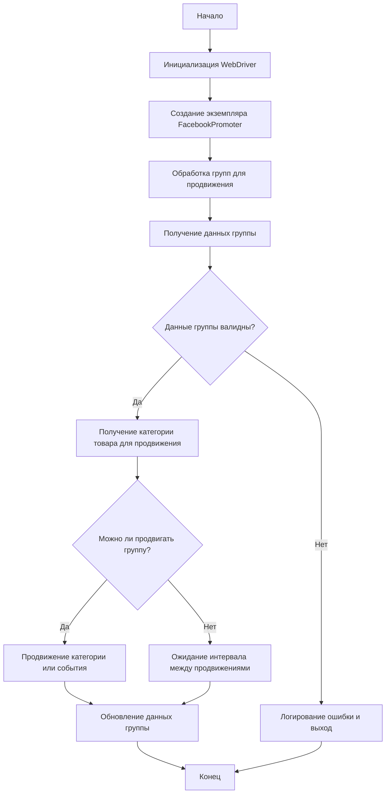

# Документация модуля Facebook Promoter

## Обзор

Модуль **Facebook Promoter** автоматизирует процесс продвижения товаров и событий AliExpress в группах Facebook. Модуль отвечает за публикацию рекламных материалов в Facebook, обеспечивая продвижение категорий и событий без дублирования. Он использует WebDriver для автоматизации работы браузера, что позволяет эффективно управлять продвижением.

## Подробнее

Этот модуль предназначен для автоматизации процесса продвижения товаров и событий AliExpress в группах Facebook. Он позволяет настраивать параметры продвижения, такие как язык, валюта и категории товаров, а также избегать повторной публикации одних и тех же рекламных материалов в одной и той же группе. Модуль использует WebDriver для управления браузером и выполнения действий по публикации рекламы.

## Оглавление

- [Классы](#Классы)
  - [`FacebookPromoter`](#FacebookPromoter-Class)
    - [`__init__`](#__init__)
    - [`promote`](#promote)
    - [`log_promotion_error`](#log_promotion_error)
    - [`update_group_promotion_data`](#update_group_promotion_data)
    - [`process_groups`](#process_groups)
    - [`get_category_item`](#get_category_item)
    - [`check_interval`](#check_interval)
    - [`validate_group`](#validate_group)
- [Схема работы](#Схема-работы)
- [Примеры использования](#Примеры-использования)

## Схема работы



## Классы

### `FacebookPromoter` Class

Этот класс управляет процессом продвижения товаров и событий AliExpress в группах Facebook.

**Принцип работы**:
Класс инициализируется с WebDriver, именем промоутера и путями к файлам с данными о группах. Он предоставляет методы для продвижения категорий и событий в указанных группах Facebook, избегая дублирования публикаций и обновляя данные о группах после каждой успешной публикации.

#### Методы

#### `__init__(self, d: Driver, promoter: str, group_file_paths: Optional[list[str | Path] | str | Path] = None, no_video: bool = False)`

Инициализирует промоутер Facebook с необходимыми конфигурациями.

**Параметры:**
- `d` (Driver): Экземпляр WebDriver для автоматизации.
- `promoter` (str): Имя промоутера (например, "aliexpress").
- `group_file_paths` (Optional[list[str | Path] | str | Path]): Пути к файлам с данными о группах.
- `no_video` (bool): Флаг для отключения видео в постах. По умолчанию `False`.

#### `promote(self, group: SimpleNamespace, item: SimpleNamespace, is_event: bool = False, language: str = None, currency: str = None) -> bool`

Продвигает категорию или событие в указанной группе Facebook.

**Параметры:**
- `group` (SimpleNamespace): Данные группы.
- `item` (SimpleNamespace): Категория или событие для продвижения.
- `is_event` (bool): Является ли продвигаемый элемент событием.
- `language` (str): Язык продвижения.
- `currency` (str): Валюта для продвижения.

**Возвращает:**
- `bool`: Указывает, было ли продвижение успешным.

#### `log_promotion_error(self, is_event: bool, item_name: str)`

Логирует ошибку при неудачном продвижении.

**Параметры:**
- `is_event` (bool): Является ли продвигаемый элемент событием.
- `item_name` (str): Имя элемента.

#### `update_group_promotion_data(self, group: SimpleNamespace, item_name: str, is_event: bool = False)`

Обновляет данные группы после продвижения, добавляя продвигаемый элемент в список продвинутых категорий или событий.

**Параметры:**
- `group` (SimpleNamespace): Данные группы.
- `item_name` (str): Имя продвигаемого элемента.
- `is_event` (bool): Является ли продвигаемый элемент событием.

#### `process_groups(self, campaign_name: str = None, events: list[SimpleNamespace] = None, is_event: bool = False, group_file_paths: list[str] = None, group_categories_to_adv: list[str] = ['sales'], language: str = None, currency: str = None)`

Обрабатывает группы для текущей кампании или продвижения события.

**Параметры:**
- `campaign_name` (str): Имя кампании.
- `events` (list[SimpleNamespace]): Список событий для продвижения.
- `is_event` (bool): Указывает, продвигать события или категории.
- `group_file_paths` (list[str]): Пути к файлам с данными о группах.
- `group_categories_to_adv` (list[str]): Категории для продвижения.
- `language` (str): Язык продвижения.
- `currency` (str): Валюта для продвижения.

#### `get_category_item(self, campaign_name: str, group: SimpleNamespace, language: str, currency: str) -> SimpleNamespace`

Получает категорию товара для продвижения на основе кампании и промоутера.

**Параметры:**
- `campaign_name` (str): Имя кампании.
- `group` (SimpleNamespace): Данные группы.
- `language` (str): Язык продвижения.
- `currency` (str): Валюта для продвижения.

**Возвращает:**
- `SimpleNamespace`: Категория товара для продвижения.

#### `check_interval(self, group: SimpleNamespace) -> bool`

Проверяет, достаточно ли времени прошло для повторного продвижения в этой группе.

**Параметры:**
- `group` (SimpleNamespace): Данные группы.

**Возвращает:**
- `bool`: Указывает, может ли группа быть продвинута снова.

#### `validate_group(self, group: SimpleNamespace) -> bool`

Проверяет данные группы, чтобы убедиться, что у нее есть необходимые атрибуты.

**Параметры:**
- `group` (SimpleNamespace): Данные группы.

**Возвращает:**
- `bool`: Указывает, являются ли данные группы валидными.

## Примеры использования

### Пример использования класса `FacebookPromoter`

```python
from src.endpoints.advertisement.facebook.promoter import FacebookPromoter
from src.webdriver.driver import Driver
from src.utils.jjson import j_loads_ns

# Создание инстанса драйвера (замените фактическим WebDriver)
d = Driver()

# Создание экземпляра FacebookPromoter
promoter = FacebookPromoter(
    d=d, 
    promoter="aliexpress", 
    group_file_paths=["path/to/group/file1.json", "path/to/group/file2.json"]
)

# Начало продвижения товаров или событий
promoter.process_groups(
    campaign_name="Campaign1",
    events=[], 
    group_categories_to_adv=["sales"],
    language="en",
    currency="USD"
)