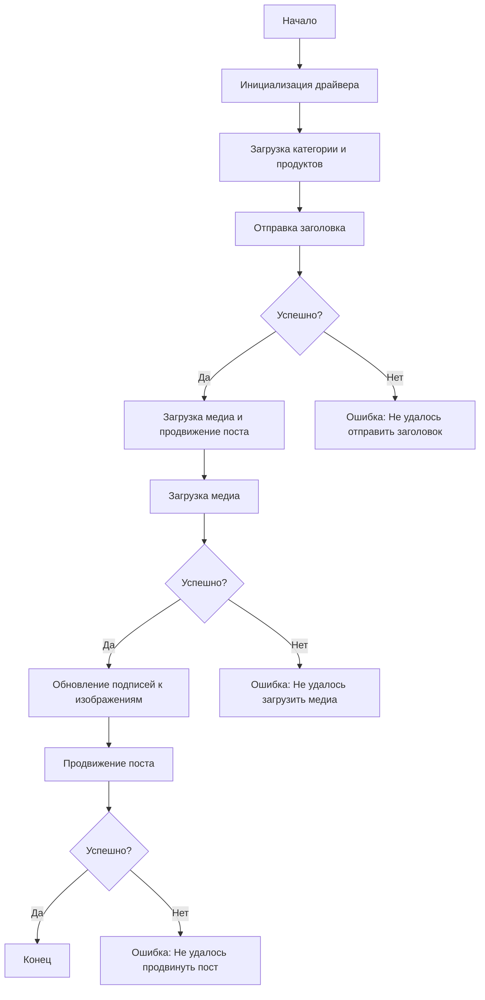

# src.endpoints.advertisement.facebook.post_message_async

## Обзор

Этот скрипт является частью директории `hypotez/src/endpoints/advertisement/facebook/scenarios` и предназначен для автоматизации процесса публикации сообщений в Facebook. Скрипт взаимодействует со страницей Facebook, используя локаторы для выполнения различных действий, таких как отправка сообщений, загрузка медиафайлов и обновление заголовков.

## Подробней

Сценарий асинхронной отправки сообщений в Facebook автоматизирует процесс публикации контента, включая текст и медиафайлы, на странице Facebook. Он использует библиотеку Selenium для взаимодействия с веб-интерфейсом Facebook, выполняя такие шаги, как ввод заголовка и описания, загрузка изображений и видео, а также обновление подписей к медиафайлам. Это позволяет автоматизировать рутинные задачи по продвижению контента и экономить время.

## Структура модуля



### Легенда

1.  **Начало**: Начало выполнения скрипта.
2.  **Инициализация драйвера**: Создание экземпляра класса `Driver`.
3.  **Загрузка категории и продуктов**: Загрузка данных о категории и продуктах.
4.  **Отправка заголовка**: Вызов функции `post_title` для отправки заголовка.
5.  **Успешно?**: Проверка успешности отправки заголовка.

    *   **Да**: Переход к загрузке медиа и продвижению поста.
    *   **Нет**: Вывод ошибки "Не удалось отправить заголовок".
6.  **Загрузка медиа и продвижение поста**: Вызов функции `promote_post`.
7.  **Загрузка медиа**: Вызов функции `upload_media` для загрузки медиафайлов.
8.  **Успешно?**: Проверка успешности загрузки медиа.

    *   **Да**: Переход к обновлению подписей к изображениям.
    *   **Нет**: Вывод ошибки "Не удалось загрузить медиа".
9.  **Обновление подписей к изображениям**: Вызов функции `update_images_captions` для обновления подписей.
10. **Продвижение поста**: Завершение процесса продвижения поста.
11. **Успешно?**: Проверка успешности продвижения поста.

    *   **Да**: Конец выполнения скрипта.
    *   **Нет**: Вывод ошибки "Не удалось продвинуть пост".

## Функции

### `post_title`

```python
def post_title(d: Driver, category: SimpleNamespace) -> bool:
    """
    Отправляет заголовок и описание кампании в поле сообщения Facebook.

    Args:
        d (Driver): Экземпляр `Driver`, используемый для взаимодействия с веб-страницей.
        category (SimpleNamespace): Категория, содержащая заголовок и описание для отправки.

    Returns:
        bool: `True`, если заголовок и описание были успешно отправлены, в противном случае `None`.
    """
```

**Назначение**: Отправляет заголовок и описание кампании в поле сообщения Facebook.

**Параметры**:

*   `d` (Driver): Экземпляр `Driver`, используемый для взаимодействия с веб-страницей.
*   `category` (SimpleNamespace): Категория, содержащая заголовок и описание для отправки.

**Возвращает**:

*   `bool`: `True`, если заголовок и описание были успешно отправлены, в противном случае `None`.

**Как работает функция**:

1.  Функция `post_title` принимает экземпляр класса `Driver` и `category` с данными заголовка и описания.
2.  Использует `driver.execute_locator` для поиска и заполнения полей заголовка и описания в Facebook.
3.  Возвращает `True` при успешной отправке заголовка и описания, в противном случае `None`.

```ascii
    Начало
     ↓
    Заполнение поля заголовка
     ↓
    Заполнение поля описания
     ↓
    Конец
```

**Примеры**:

```python
from src.webdriver.driver import Driver
from types import SimpleNamespace

# Инициализация драйвера
driver = Driver(...)

# Создание объекта SimpleNamespace для категории
category = SimpleNamespace(title="Заголовок кампании", description="Описание кампании")

# Отправка заголовка и описания
result = post_title(driver, category)
print(result) # Вывод: True или None
```

### `upload_media`

```python
def upload_media(d: Driver, products: List[SimpleNamespace], no_video: bool = False) -> bool:
    """
    Загружает медиафайлы в пост Facebook и обновляет их подписи.

    Args:
        d (Driver): Экземпляр `Driver`, используемый для взаимодействия с веб-страницей.
        products (List[SimpleNamespace]): Список продуктов, содержащих пути к медиафайлам.
        no_video (bool): Флаг, указывающий, следует ли пропускать загрузку видео.

    Returns:
        bool: `True`, если медиафайлы были успешно загружены, в противном случае `None`.
    """
```

**Назначение**: Загружает медиафайлы (изображения и видео) в пост Facebook и обновляет их подписи.

**Параметры**:

*   `d` (Driver): Экземпляр `Driver`, используемый для взаимодействия с веб-страницей.
*   `products` (List[SimpleNamespace]): Список продуктов, содержащих пути к медиафайлам.
*   `no_video` (bool): Флаг, указывающий, следует ли пропускать загрузку видео.

**Возвращает**:

*   `bool`: `True`, если медиафайлы были успешно загружены, в противном случае `None`.

**Как работает функция**:

1.  Функция `upload_media` принимает экземпляр класса `Driver`, список продуктов и флаг `no_video`.
2.  Перебирает продукты в списке и загружает медиафайлы (изображения и видео) в Facebook.
3.  Использует `driver.execute_locator` для загрузки файлов.
4.  Возвращает `True` при успешной загрузке медиафайлов, в противном случае `None`.

```ascii
    Начало
     ↓
    Перебор продуктов
     ↓
    Загрузка медиафайлов (изображения и видео)
     ↓
    Конец
```

**Примеры**:

```python
from src.webdriver.driver import Driver
from types import SimpleNamespace

# Инициализация драйвера
driver = Driver(...)

# Создание списка продуктов
products = [SimpleNamespace(local_image_path='path/to/image.jpg'), SimpleNamespace(local_video_path='path/to/video.mp4')]

# Загрузка медиафайлов
result = upload_media(driver, products)
print(result) # Вывод: True или None
```

### `update_images_captions`

```python
def update_images_captions(d: Driver, products: List[SimpleNamespace], textarea_list: List[WebElement]) -> None:
    """
    Асинхронно добавляет описания к загруженным медиафайлам.

    Args:
        d (Driver): Экземпляр `Driver`, используемый для взаимодействия с веб-страницей.
        products (List[SimpleNamespace]): Список продуктов с деталями для обновления.
        textarea_list (List[WebElement]): Список текстовых полей, куда добавляются подписи.
    """
```

**Назначение**: Асинхронно добавляет описания к загруженным медиафайлам.

**Параметры**:

*   `d` (Driver): Экземпляр `Driver`, используемый для взаимодействия с веб-страницей.
*   `products` (List[SimpleNamespace]): Список продуктов с деталями для обновления.
*   `textarea_list` (List[WebElement]): Список текстовых полей, куда добавляются подписи.

**Как работает функция**:

1.  Функция `update_images_captions` принимает экземпляр класса `Driver`, список продуктов и список текстовых полей.
2.  Асинхронно перебирает продукты и добавляет описания в соответствующие текстовые поля.
3.  Использует `driver.execute_locator` для обновления подписей.

```ascii
    Начало
     ↓
    Перебор продуктов
     ↓
    Добавление описаний в текстовые поля
     ↓
    Конец
```

**Примеры**:

```python
from src.webdriver.driver import Driver
from types import SimpleNamespace
from selenium.webdriver.remote.webelement import WebElement

# Инициализация драйвера
driver = Driver(...)

# Создание списка продуктов
products = [SimpleNamespace(description='Описание для изображения 1'), SimpleNamespace(description='Описание для изображения 2')]

# Создание списка текстовых полей (пример)
textarea_list = [WebElement(...), WebElement(...)]

# Обновление подписей к изображениям
update_images_captions(driver, products, textarea_list)
```

### `promote_post`

```python
def promote_post(d: Driver, category: SimpleNamespace, products: List[SimpleNamespace], no_video: bool = False) -> bool:
    """
    Управляет процессом продвижения поста с заголовком, описанием и медиафайлами.

    Args:
        d (Driver): Экземпляр `Driver`, используемый для взаимодействия с веб-страницей.
        category (SimpleNamespace): Детали категории, используемые для заголовка и описания поста.
        products (List[SimpleNamespace]): Список продуктов, содержащих медиа и детали для публикации.
        no_video (bool): Флаг, указывающий, следует ли пропускать загрузку видео.

    Returns:
        bool: `True`, если пост был успешно продвинут, в противном случае `None`.
    """
```

**Назначение**: Управляет процессом продвижения поста с заголовком, описанием и медиафайлами.

**Параметры**:

*   `d` (Driver): Экземпляр `Driver`, используемый для взаимодействия с веб-страницей.
*   `category` (SimpleNamespace): Детали категории, используемые для заголовка и описания поста.
*   `products` (List[SimpleNamespace]): Список продуктов, содержащих медиа и детали для публикации.
*   `no_video` (bool): Флаг, указывающий, следует ли пропускать загрузку видео.

**Возвращает**:

*   `bool`: `True`, если пост был успешно продвинут, в противном случае `None`.

**Как работает функция**:

1.  Функция `promote_post` принимает экземпляр класса `Driver`, категорию, список продуктов и флаг `no_video`.
2.  Вызывает функции `post_title` и `upload_media` для отправки заголовка и загрузки медиафайлов.
3.  Использует `driver.execute_locator` для управления процессом продвижения поста.
4.  Возвращает `True` при успешном продвижении поста, в противном случае `None`.

```ascii
    Начало
     ↓
    Отправка заголовка (post_title)
     ↓
    Загрузка медиафайлов (upload_media)
     ↓
    Управление процессом продвижения поста
     ↓
    Конец
```

**Примеры**:

```python
from src.webdriver.driver import Driver
from types import SimpleNamespace

# Инициализация драйвера
driver = Driver(...)

# Создание категории
category = SimpleNamespace(title='Заголовок', description='Описание')

# Создание списка продуктов
products = [SimpleNamespace(local_image_path='path/to/image.jpg', description='Описание изображения')]

# Продвижение поста
result = promote_post(driver, category, products)
print(result) # Вывод: True или None
```

## Использование

Чтобы использовать этот скрипт, выполните следующие шаги:

1.  **Инициализация драйвера**: Создайте экземпляр класса `Driver`.
2.  **Загрузка локаторов**: Загрузите локаторы из JSON-файла.
3.  **Вызов функций**: Используйте предоставленные функции для отправки заголовка, загрузки медиа и продвижения поста.

## Зависимости

*   `selenium`: Для автоматизации веб-интерфейса.
*   `asyncio`: Для асинхронных операций.
*   `pathlib`: Для обработки путей к файлам.
*   `types`: Для создания простых пространств имен.
*   `typing`: Для аннотаций типов.

## Обработка ошибок

Скрипт включает надежную обработку ошибок, чтобы гарантировать, что выполнение продолжается, даже если определенные элементы не найдены или есть проблемы с веб-страницей. Это особенно полезно для обработки динамических или нестабильных веб-страниц.

## Вклад

Вклад в этот скрипт приветствуется. Убедитесь, что любые изменения хорошо задокументированы и включают соответствующие тесты.

## Лицензия

Этот скрипт лицензирован в соответствии с лицензией MIT. См. файл `LICENSE` для получения более подробной информации.