# Модуль discord_bot_trainger

## Обзор

Модуль `discord_bot_trainger.py` предназначен для создания и управления Discord ботом, который может выполнять различные задачи, такие как:
- Подключение и отключение от голосовых каналов.
- Обучение модели на основе предоставленных данных.
- Тестирование модели с использованием тестовых данных.
- Архивирование файлов в указанной директории.
- Выбор набора данных для обучения модели.
- Отображение инструкций из внешнего файла.
- Корректировка предыдущих ответов бота.
- Отправка отзывов о ответах модели.
- Отправка файлов из указанного пути.
- Распознавание речи в аудиофайлах и воспроизведение текста в голосовом канале.

## Подробней

Этот модуль содержит реализацию Discord-бота, который взаимодействует с пользователями через текстовые и голосовые каналы. Бот использует библиотеку `discord.py` для интеграции с Discord API и выполняет задачи, связанные с машинным обучением, используя модуль `src.ai.openai.model.training.Model`. Бот может подключаться к голосовым каналам, распознавать речь из аудио сообщений, обучать модель на основе предоставленных данных и генерировать ответы на сообщения пользователей. Также реализована возможность корректировки ответов бота и отправки отзывов.
Код расположен в файле `/src/endpoints/bots/discord/discord_bot_trainger.py` и является частью проекта `hypotez`.

## Классы

### `commands.Bot`

**Описание**: Класс `commands.Bot` является основным классом для создания Discord-бота.

**Принцип работы**:
Бот создается с указанным префиксом команд и настроенными намерениями (intents), необходимыми для работы с сообщениями и голосовыми состояниями.

**Методы**:
- `__init__(command_prefix, intents)`: Конструктор класса, инициализирует бота с заданным префиксом команд и намерениями.

### `Model`

**Описание**: Класс `Model` используется для обучения и тестирования модели.

**Принцип работы**:
Этот класс предоставляет методы для обучения модели на основе текстовых данных, тестирования модели с использованием тестовых данных, архивирования файлов и выбора набора данных для обучения.

## Функции

### `on_ready`

```python
@bot.event
async def on_ready():
    """Called when the bot is ready."""
    ...
```

**Назначение**: Функция `on_ready` вызывается, когда бот успешно подключился к Discord и готов к работе.

**Параметры**:
- Отсутствуют.

**Возвращает**:
- Ничего.

**Как работает функция**:
1. Регистрирует информацию об успешном подключении бота в лог.

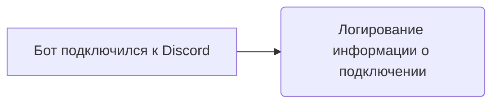

**Примеры**:
```python
# Пример использования функции on_ready
# Функция вызывается автоматически при подключении бота к Discord
```

### `hi`

```python
@bot.command(name='hi')
async def hi(ctx):
    """Welcome message."""
    ...
```

**Назначение**: Функция `hi` отправляет приветственное сообщение в канал, из которого была вызвана команда.

**Параметры**:
- `ctx` (commands.Context): Контекст команды, содержащий информацию о канале, авторе и сервере.

**Возвращает**:
- `True` (bool): Возвращает `True` после успешной отправки сообщения.

**Как работает функция**:
1. Логирует вызов команды `hi` с контекстом.
2. Отправляет приветственное сообщение "HI!" в канал, из которого была вызвана команда.
3. Возвращает `True`.

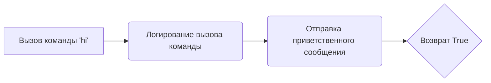

**Примеры**:
```python
# Пример использования команды hi
# !hi
```

### `join`

```python
@bot.command(name='join')
async def join(ctx):
    """Connect the bot to the voice channel."""
    ...
```

**Назначение**: Функция `join` подключает бота к голосовому каналу, в котором находится автор команды.

**Параметры**:
- `ctx` (commands.Context): Контекст команды, содержащий информацию о канале, авторе и сервере.

**Возвращает**:
- Ничего.

**Как работает функция**:
1. Проверяет, находится ли автор команды в голосовом канале.
2. Если автор находится в голосовом канале, подключает бота к этому каналу и отправляет сообщение об успешном подключении.
3. Если автор не находится в голосовом канале, отправляет сообщение об ошибке.
4. Логирует вызов команды `join` с контекстом.

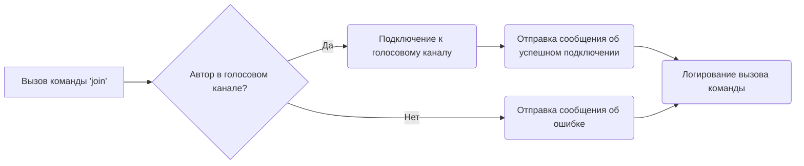

**Примеры**:
```python
# Пример использования команды join
# !join
```

### `leave`

```python
@bot.command(name='leave')
async def leave(ctx):
    """Disconnect the bot from the voice channel."""
    ...
```

**Назначение**: Функция `leave` отключает бота от текущего голосового канала.

**Параметры**:
- `ctx` (commands.Context): Контекст команды, содержащий информацию о канале, авторе и сервере.

**Возвращает**:
- Ничего.

**Как работает функция**:
1. Проверяет, подключен ли бот к голосовому каналу.
2. Если бот подключен к голосовому каналу, отключает бота от этого канала и отправляет сообщение об успешном отключении.
3. Если бот не подключен к голосовому каналу, отправляет сообщение об ошибке.
4. Логирует вызов команды `leave` с контекстом.

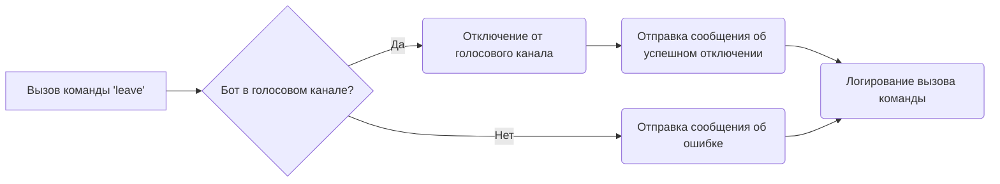

**Примеры**:
```python
# Пример использования команды leave
# !leave
```

### `train`

```python
@bot.command(name='train')
async def train(ctx, data: str = None, data_dir: str = None, positive: bool = True, attachment: discord.Attachment = None):
    """Train the model with the provided data."""
    ...
```

**Назначение**: Функция `train` обучает модель на основе предоставленных данных.

**Параметры**:
- `ctx` (commands.Context): Контекст команды, содержащий информацию о канале, авторе и сервере.
- `data` (str, optional): Текстовые данные для обучения модели. По умолчанию `None`.
- `data_dir` (str, optional): Путь к директории с данными для обучения модели. По умолчанию `None`.
- `positive` (bool, optional): Указывает, являются ли данные положительными или отрицательными. По умолчанию `True`.
- `attachment` (discord.Attachment, optional): Файл с данными для обучения модели. По умолчанию `None`.

**Возвращает**:
- Ничего.

**Как работает функция**:
1. Проверяет, был ли передан файл в качестве вложения.
2. Если файл был передан, сохраняет файл во временную директорию `/tmp/`.
3. Вызывает метод `model.train` для запуска обучения модели с переданными данными.
4. Если обучение успешно запущено, отправляет сообщение с идентификатором задачи (job_id) и сохраняет этот идентификатор.
5. Если запуск обучения не удался, отправляет сообщение об ошибке.
6. Логирует вызов команды `train` с контекстом.

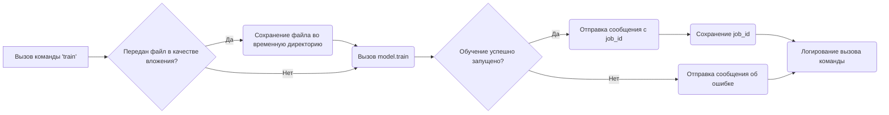

**Примеры**:
```python
# Пример использования команды train с текстовыми данными
# !train data="Some training data"

# Пример использования команды train с файлом
# !train attachment=file.txt
```

### `test`

```python
@bot.command(name='test')
async def test(ctx, test_data: str):
    """Test the model with the provided test data."""
    ...
```

**Назначение**: Функция `test` тестирует модель с использованием предоставленных тестовых данных в формате JSON.

**Параметры**:
- `ctx` (commands.Context): Контекст команды, содержащий информацию о канале, авторе и сервере.
- `test_data` (str): Тестовые данные в формате JSON.

**Возвращает**:
- Ничего.

**Как работает функция**:
1. Пытается загрузить тестовые данные из JSON-строки.
2. Вызывает метод `model.predict` для получения предсказаний модели на основе тестовых данных.
3. Если предсказания получены, отправляет сообщение с результатами предсказаний и обрабатывает возможные ошибки.
4. Если предсказания не получены, отправляет сообщение об ошибке.
5. Если тестовые данные имеют неверный формат JSON, отправляет сообщение об ошибке.
6. Логирует вызов команды `test` с контекстом.

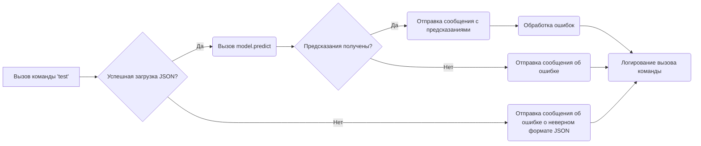

**Примеры**:
```python
# Пример использования команды test
# !test test_data='{"input": "some test data"}'
```

### `archive`

```python
@bot.command(name='archive')
async def archive(ctx, directory: str):
    """Archive files in the specified directory."""
    ...
```

**Назначение**: Функция `archive` архивирует файлы в указанной директории.

**Параметры**:
- `ctx` (commands.Context): Контекст команды, содержащий информацию о канале, авторе и сервере.
- `directory` (str): Путь к директории для архивирования файлов.

**Возвращает**:
- Ничего.

**Как работает функция**:
1. Пытается вызвать метод `model.archive_files` для архивирования файлов в указанной директории.
2. Если архивация прошла успешно, отправляет сообщение об успешном архивировании.
3. Если произошла ошибка во время архивирования, отправляет сообщение об ошибке.
4. Логирует вызов команды `archive` с контекстом.

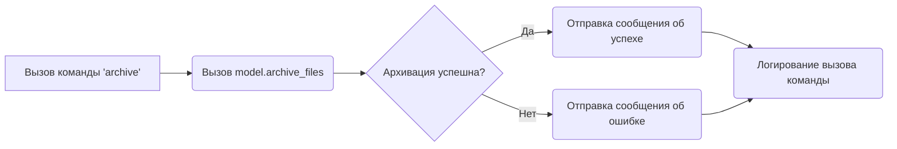

**Примеры**:
```python
# Пример использования команды archive
# !archive directory="/path/to/directory"
```

### `select_dataset`

```python
@bot.command(name='select_dataset')
async def select_dataset(ctx, path_to_dir_positive: str, positive: bool = True):
    """Select a dataset for training the model."""
    ...
```

**Назначение**: Функция `select_dataset` выбирает набор данных для обучения модели.

**Параметры**:
- `ctx` (commands.Context): Контекст команды, содержащий информацию о канале, авторе и сервере.
- `path_to_dir_positive` (str): Путь к директории с положительными данными для обучения.
- `positive` (bool, optional): Указывает, являются ли данные положительными или отрицательными. По умолчанию `True`.

**Возвращает**:
- Ничего.

**Как работает функция**:
1. Вызывает метод `model.select_dataset_and_archive` для выбора и архивирования набора данных.
2. Если выбор набора данных прошел успешно, отправляет сообщение с информацией о выбранном наборе данных.
3. Если выбор набора данных не удался, отправляет сообщение об ошибке.
4. Логирует вызов команды `select_dataset` с контекстом.

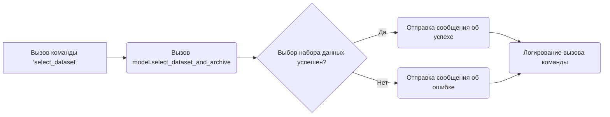

**Примеры**:
```python
# Пример использования команды select_dataset
# !select_dataset path_to_dir_positive="/path/to/positive/data"
```

### `instruction`

```python
@bot.command(name='instruction')
async def instruction(ctx):
    """Display the instruction message from an external file."""
    ...
```

**Назначение**: Функция `instruction` отображает инструкцию из внешнего файла `_docs/bot_instruction.md`.

**Параметры**:
- `ctx` (commands.Context): Контекст команды, содержащий информацию о канале, авторе и сервере.

**Возвращает**:
- Ничего.

**Как работает функция**:
1. Пытается прочитать содержимое файла `_docs/bot_instruction.md`.
2. Если файл существует, отправляет содержимое файла в канал.
3. Если файл не найден, отправляет сообщение об ошибке.
4. Если произошла ошибка во время чтения файла, отправляет сообщение об ошибке.
5. Логирует вызов команды `instruction` с контекстом.

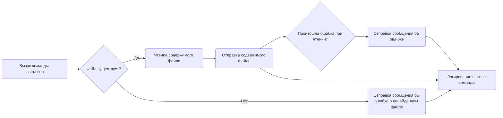

**Примеры**:
```python
# Пример использования команды instruction
# !instruction
```

### `correct`

```python
@bot.command(name='correct')
async def correct(ctx, message_id: int, *, correction: str):
    """Correct a previous response by providing the message ID and the correction."""
    ...
```

**Назначение**: Функция `correct` корректирует предыдущий ответ бота, сохраняя информацию о корректировке.

**Параметры**:
- `ctx` (commands.Context): Контекст команды, содержащий информацию о канале, авторе и сервере.
- `message_id` (int): Идентификатор сообщения, которое нужно скорректировать.
- `correction` (str): Текст корректировки.

**Возвращает**:
- Ничего.

**Как работает функция**:
1. Пытается получить сообщение по указанному `message_id`.
2. Если сообщение найдено, логирует информацию о корректировке, вызывает функцию `store_correction` для сохранения корректировки и отправляет сообщение об успешном получении корректировки.
3. Если сообщение не найдено, отправляет сообщение об ошибке.
4. Если произошла ошибка во время выполнения, отправляет сообщение об ошибке.
5. Логирует вызов команды `correct` с контекстом.

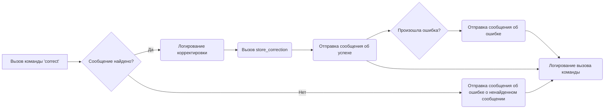

**Примеры**:
```python
# Пример использования команды correct
# !correct 1234567890 "This is the corrected message."
```

### `store_correction`

```python
def store_correction(original_text: str, correction: str):
    """Store the correction for future reference or retraining."""
    ...
```

**Назначение**: Функция `store_correction` сохраняет оригинальный текст и его корректировку в файл `corrections_log.txt`.

**Параметры**:
- `original_text` (str): Оригинальный текст сообщения.
- `correction` (str): Текст корректировки.

**Возвращает**:
- Ничего.

**Как работает функция**:
1. Открывает файл `corrections_log.txt` в режиме добавления.
2. Записывает в файл оригинальный текст и его корректировку.
3. Логирует вызов функции `store_correction`.

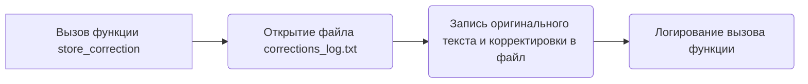

**Примеры**:
```python
# Пример использования функции store_correction
# store_correction("Original text", "Corrected text")
```

### `feedback`

```python
@bot.command(name='feedback')
async def feedback(ctx, *, feedback_text: str):
    """Submit feedback about the model's response."""
    ...
```

**Назначение**: Функция `feedback` собирает отзывы о ответах модели.

**Параметры**:
- `ctx` (commands.Context): Контекст команды, содержащий информацию о канале, авторе и сервере.
- `feedback_text` (str): Текст отзыва.

**Возвращает**:
- Ничего.

**Как работает функция**:
1. Вызывает функцию `store_correction` для сохранения отзыва.
2. Отправляет сообщение с благодарностью за отзыв.
3. Логирует вызов команды `feedback` с контекстом.

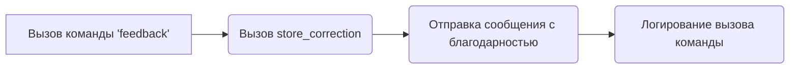

**Примеры**:
```python
# Пример использования команды feedback
# !feedback "This is some feedback about the model."
```

### `getfile`

```python
@bot.command(name='getfile')
async def getfile(ctx, file_path: str):
    """Attach a file from the given path."""
    ...
```

**Назначение**: Функция `getfile` отправляет файл из указанного пути в канал.

**Параметры**:
- `ctx` (commands.Context): Контекст команды, содержащий информацию о канале, авторе и сервере.
- `file_path` (str): Путь к файлу, который нужно отправить.

**Возвращает**:
- Ничего.

**Как работает функция**:
1. Проверяет, существует ли файл по указанному пути.
2. Если файл существует, отправляет файл в канал.
3. Если файл не найден, отправляет сообщение об ошибке.
4. Логирует вызов команды `getfile` с контекстом.

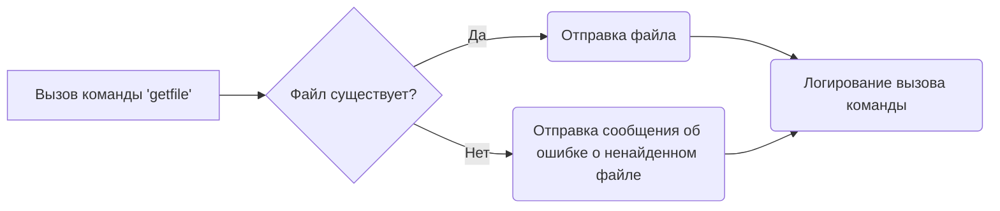

**Примеры**:
```python
# Пример использования команды getfile
# !getfile /path/to/file.txt
```

### `text_to_speech_and_play`

```python
async def text_to_speech_and_play(text, channel):
    """Convert text to speech and play it in a voice channel."""
    ...
```

**Назначение**: Функция `text_to_speech_and_play` преобразует текст в речь и воспроизводит его в голосовом канале.

**Параметры**:
- `text` (str): Текст для преобразования в речь.
- `channel` (discord.VoiceChannel): Голосовой канал, в котором нужно воспроизвести речь.

**Возвращает**:
- Ничего.

**Как работает функция**:
1. Преобразует текст в речь с использованием `gTTS` и сохраняет аудиофайл во временной директории.
2. Подключается к голосовому каналу, если бот еще не подключен.
3. Воспроизводит аудиофайл в голосовом канале.
4. Ждет окончания воспроизведения аудиофайла.
5. Отключается от голосового канала.

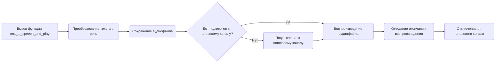

**Примеры**:
```python
# Пример использования функции text_to_speech_and_play
# await text_to_speech_and_play("Hello, world!", channel)
```

### `on_message`

```python
@bot.event
async def on_message(message):
    """Handle incoming messages and respond to voice commands."""
    ...
```

**Назначение**: Функция `on_message` обрабатывает входящие сообщения и отвечает на голосовые команды.

**Параметры**:
- `message` (discord.Message): Входящее сообщение.

**Возвращает**:
- Ничего.

**Как работает функция**:
1. Проверяет, является ли автор сообщения ботом. Если да, игнорирует сообщение.
2. Проверяет, начинается ли сообщение с префикса команды. Если да, обрабатывает команду.
3. Если сообщение содержит вложения, проверяет, является ли вложение аудиофайлом. Если да, распознает речь в аудиофайле и отправляет ответ.
4. Если сообщение не является командой и не содержит аудиовложений, отправляет ответ на сообщение.
5. Если автор сообщения находится в голосовом канале, воспроизводит ответ в голосовом канале.
6. Если автор сообщения не находится в голосовом канале, отправляет ответ в текстовый канал.

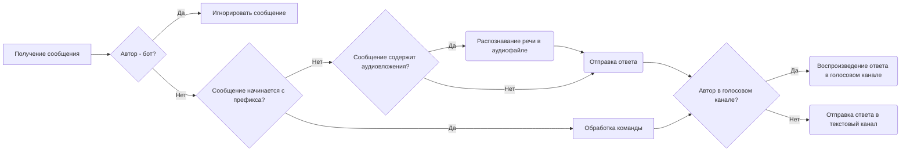

**Примеры**:
```python
# Функция вызывается автоматически при получении каждого сообщения в Discord