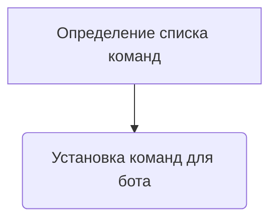
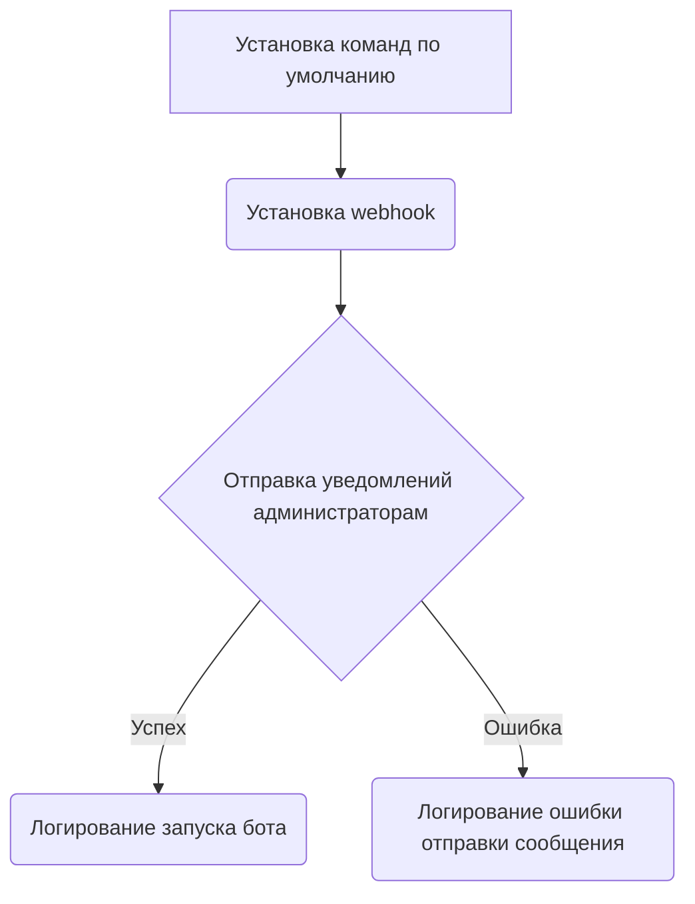
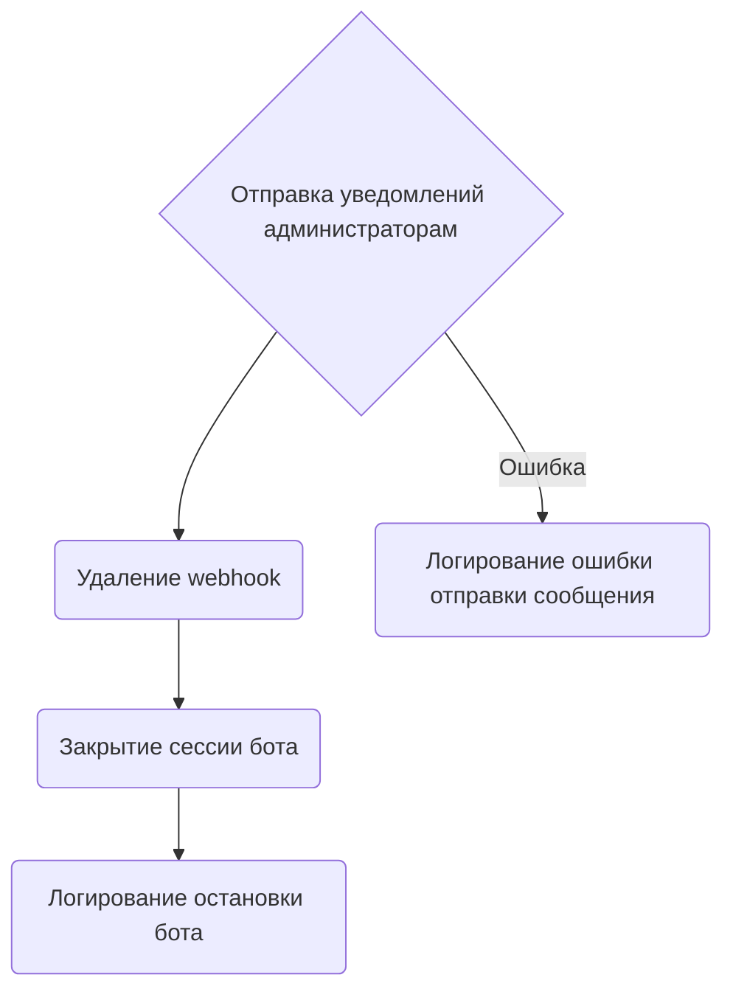
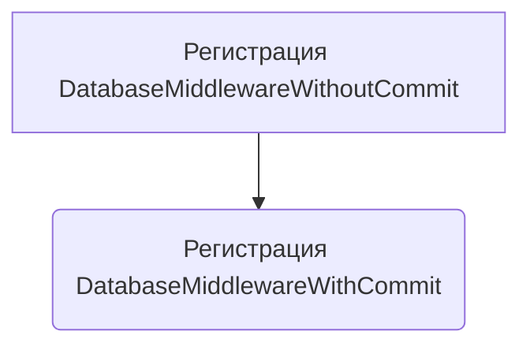
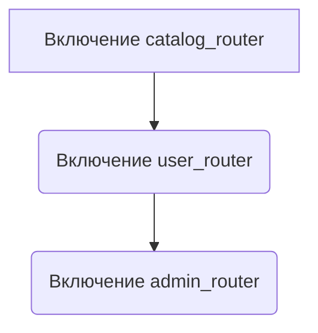
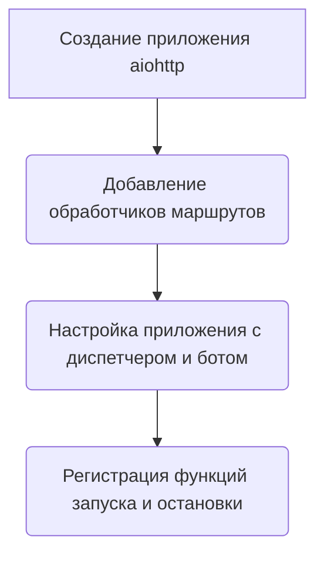
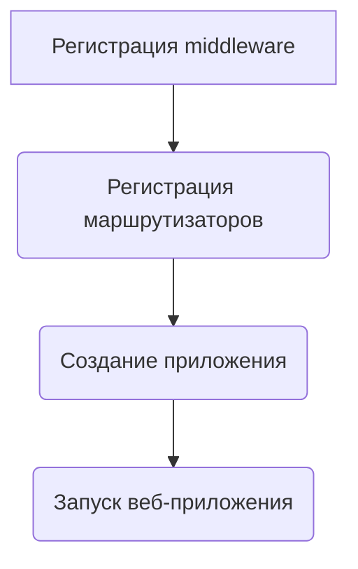

# Модуль запуска Telegram-бота для Digital Market
=================================================

Модуль содержит основные функции для запуска и управления Telegram-ботом, включая настройку webhook, регистрацию обработчиков и middleware, а также функции для запуска и остановки бота.

## Обзор

Данный модуль является точкой входа для Telegram-бота, предназначенного для использования в Digital Market. Он включает в себя настройку вебхуков, регистрацию обработчиков и middleware, а также функции для запуска и остановки бота.

## Подробней

Этот модуль выполняет следующие ключевые функции:

- Настраивает и запускает Telegram-бота с использованием библиотеки `aiogram`.
- Регистрирует обработчики для различных типов событий, таких как команды и сообщения.
- Устанавливает middleware для обработки запросов к базе данных.
- Определяет функции для запуска и остановки бота, включая отправку уведомлений администраторам.
- Создает веб-приложение `aiohttp` для обработки входящих запросов от Telegram.

## Функции

### `set_default_commands`

```python
async def set_default_commands():
    """
    Устанавливает команды по умолчанию для бота.
    """
```

**Назначение**: Устанавливает список команд, отображаемых пользователю в интерфейсе Telegram-бота.

**Как работает функция**:
1. Определяет список команд, которые будут установлены для бота (`/start`).
2. Использует метод `set_my_commands` объекта `bot` для установки команд, видимых всем пользователям (`BotCommandScopeDefault`).



**Примеры**:

```python
await set_default_commands()
```

### `on_startup`

```python
async def on_startup(app):
    """
    Выполняется при запуске приложения.
    """
```

**Назначение**: Выполняет действия при запуске приложения, такие как установка webhook, отправка уведомлений администраторам.

**Параметры**:
- `app`: Объект приложения `aiohttp`.

**Как работает функция**:
1. Устанавливает команды по умолчанию, вызывая `set_default_commands()`.
2. Устанавливает webhook для бота, используя URL, полученный из настроек (`settings.get_webhook_url`).
3. Отправляет уведомления администраторам о запуске бота. Если отправка сообщения не удалась, регистрирует ошибку в лог.
4. Логирует информацию об успешном запуске бота.



**Примеры**:

```python
async def on_startup(app):
    await set_default_commands()
    await bot.set_webhook(settings.get_webhook_url)
    for admin_id in admins:
        try:
            await bot.send_message(admin_id, 'Бот запущен 🥳.')
        except Exception as ex:
            logger.error(f"Не удалось отправить сообщение админу {admin_id}: {ex}", exc_info=True)
    logger.info("Бот успешно запущен.")
```

### `on_shutdown`

```python
async def on_shutdown(app):
    """
    Выполняется при остановке приложения.
    """
```

**Назначение**: Выполняет действия при остановке приложения, такие как отправка уведомлений администраторам, удаление webhook и закрытие сессии бота.

**Параметры**:
- `app`: Объект приложения `aiohttp`.

**Как работает функция**:
1. Отправляет уведомления администраторам об остановке бота.  Если отправка сообщения не удалась, регистрирует ошибку в лог.
2. Удаляет webhook бота, чтобы прекратить получение обновлений.
3. Закрывает сессию бота.
4. Логирует информацию об остановке бота.



**Примеры**:

```python
async def on_shutdown(app):
    for admin_id in admins:
        try:
            await bot.send_message(admin_id, 'Бот остановлен. Почему? 😔')
        except Exception as ex:
            logger.error(f"Не удалось отправить сообщение админу {admin_id}: {ex}", exc_info=True)
    await bot.delete_webhook(drop_pending_updates=True)
    await bot.session.close()
    logger.error("Бот остановлен!")
```

### `register_middlewares`

```python
def register_middlewares():
    """
    Регистрирует мидлвари для диспетчера.
    """
```

**Назначение**: Регистрирует middleware для обработки входящих обновлений в диспетчере.

**Как работает функция**:
1. Регистрирует `DatabaseMiddlewareWithoutCommit` для обработки каждого обновления без коммита изменений в базу данных.
2. Регистрирует `DatabaseMiddlewareWithCommit` для обработки каждого обновления с коммитом изменений в базу данных.



**Примеры**:

```python
def register_middlewares():
    dp.update.middleware.register(DatabaseMiddlewareWithoutCommit())
    dp.update.middleware.register(DatabaseMiddlewareWithCommit())
```

### `register_routers`

```python
def register_routers():
    """
    Регистрирует маршруты для диспетчера.
    """
```

**Назначение**: Регистрирует маршрутизаторы (routers) для обработки различных типов команд и сообщений.

**Как работает функция**:
1. Включает маршрутизатор `catalog_router` для обработки команд, связанных с каталогом товаров.
2. Включает маршрутизатор `user_router` для обработки команд, связанных с пользователем.
3. Включает маршрутизатор `admin_router` для обработки команд, связанных с административными функциями.



**Примеры**:

```python
def register_routers():
    dp.include_router(catalog_router)
    dp.include_router(user_router)
    dp.include_router(admin_router)
```

### `create_app`

```python
def create_app():
    """
    Создает и настраивает приложение aiohttp.
    """
```

**Назначение**: Создает и настраивает веб-приложение `aiohttp` для обработки входящих запросов от Telegram.

**Как работает функция**:
1. Создает экземпляр приложения `aiohttp`.
2. Добавляет обработчики для различных маршрутов:
   - `/{settings.BOT_TOKEN}`: Обработчик для webhook-запросов от Telegram (`handle_webhook`).
   - `/robokassa/result/`: Обработчик для результатов платежей Robokassa (`robokassa_result`).
   - `/robokassa/fail/`: Обработчик для неудачных платежей Robokassa (`robokassa_fail`).
   - `/`: Обработчик для главной страницы (`home_page`).
3. Настраивает приложение с диспетчером и ботом с использованием `setup_application`.
4. Регистрирует функции `on_startup` и `on_shutdown` для выполнения при запуске и остановке приложения соответственно.



**Примеры**:

```python
def create_app():
    app = web.Application()

    app.router.add_post(f"/{settings.BOT_TOKEN}", handle_webhook)
    app.router.add_post("/robokassa/result/", robokassa_result)
    app.router.add_get("/robokassa/fail/", robokassa_fail)
    app.router.add_get("/", home_page)

    setup_application(app, dp, bot=bot)

    app.on_startup.append(on_startup)
    app.on_shutdown.append(on_shutdown)

    return app
```

### `main`

```python
def main():
    """
    Главная функция для запуска приложения.
    """
```

**Назначение**: Главная функция, которая запускает приложение.

**Как работает функция**:
1. Регистрирует middleware с помощью `register_middlewares()`.
2. Регистрирует маршрутизаторы с помощью `register_routers()`.
3. Создает приложение с помощью `create_app()`.
4. Запускает веб-приложение с использованием `web.run_app()`, указывая хост и порт из настроек.



**Примеры**:

```python
def main():
    register_middlewares()
    register_routers()

    app = create_app()
    web.run_app(app, host=settings.SITE_HOST, port=settings.SITE_PORT)
```

## Запуск модуля

Для запуска модуля необходимо вызвать функцию `main()`:

```python
if __name__ == "__main__":
    main()
```