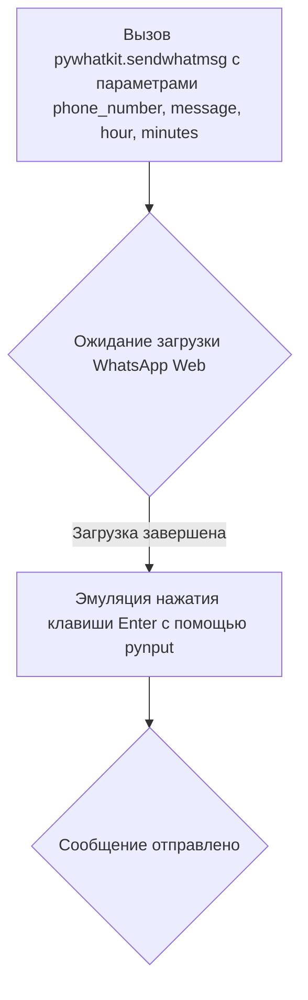

# Модуль для отправки сообщений в WhatsApp

## Обзор

Модуль предназначен для автоматической отправки сообщений в WhatsApp с использованием библиотек `pywhatkit`, `pyautogui` и `pynput`. Он позволяет отправлять заданное количество сообщений на указанный номер телефона в случайное время в заданном интервале.

## Подробнее

Этот модуль использует библиотеку `pywhatkit` для автоматизации отправки сообщений через WhatsApp Web. Дополнительно используются библиотеки `pyautogui` и `pynput` для эмуляции нажатия клавиши Enter после отправки сообщения. Модуль также содержит список предопределенных сообщений с эмодзи, из которых случайным образом выбирается сообщение для отправки.

## Функции

### `send_whatsapp_message`

```python
def send_whatsapp_message(phone_number: str, message: str, hour: int, minutes: int) -> None:
    """Отправляет сообщение в WhatsApp с использованием pywhatkit и pyautogui.

    Args:
        phone_number (str): Номер телефона получателя в формате с кодом страны.
        message (str): Текст сообщения для отправки.
        hour (int): Час отправки сообщения (0-23).
        minutes (int): Минута отправки сообщения (0-59).

    Raises:
        Exception: Если возникает ошибка при отправке сообщения.

    Как работает функция:
    1. Использует `pywhatkit.sendwhatmsg` для отправки сообщения в указанное время.
    2. Ожидает загрузки WhatsApp Web.
    3. Использует `pyautogui` и `pynput` для эмуляции нажатия клавиши Enter после отправки сообщения.

    Пример:
    >>> send_whatsapp_message('+79991234567', 'Привет!', 10, 30)
    """
```

**Как работает функция**:



**Примеры**:

```python
send_whatsapp_message('+79991234567', 'Привет!', 10, 30)
send_whatsapp_message('+79991234567', 'Как дела?', 15, 45)