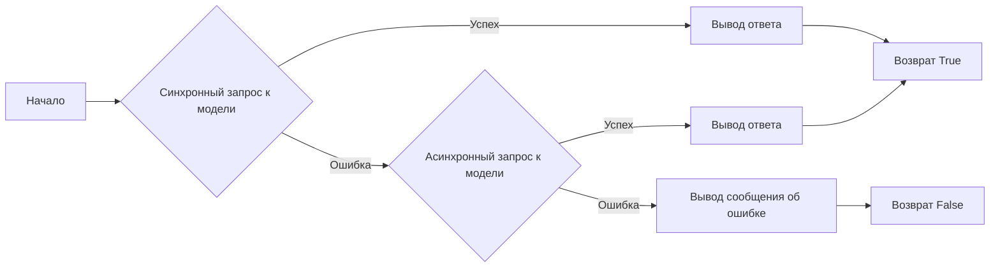
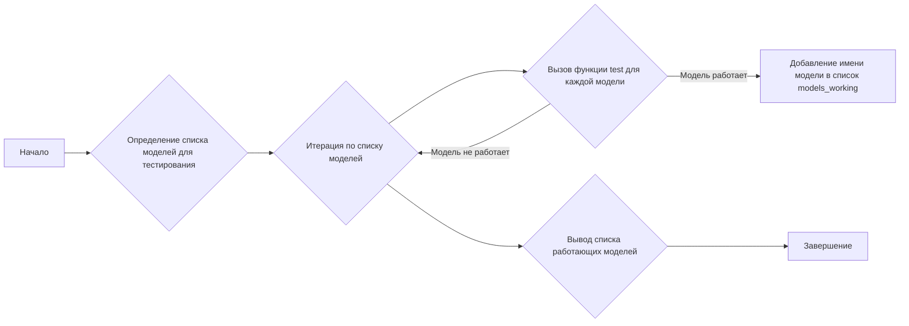

# Модуль тестирования моделей GPT4Free

## Обзор

Этот модуль предназначен для тестирования работоспособности различных моделей, предоставляемых библиотекой `g4f` (GPT4Free). Он включает асинхронные функции для проверки моделей GPT-3.5 и GPT-4, и выводит список работающих моделей.

## Подробней

Модуль выполняет следующие задачи:

1.  Импортирует необходимые библиотеки, включая `asyncio`, `pathlib` и `g4f`.
2.  Определяет асинхронную функцию `test` для проверки конкретной модели.
3.  Использует `g4f.ChatCompletion.create` или `g4f.ChatCompletion.create_async` для генерации текста на основе запроса.
4.  Выводит результаты тестов и список рабочих моделей.

## Функции

### `test`

```python
async def test(model: g4f.Model) -> bool:
    """
    Проверяет работоспособность указанной модели путем генерации текста на основе запроса.

    Args:
        model (g4f.Model): Модель для тестирования.

    Returns:
        bool: `True`, если модель работает, `False` в противном случае.
    """
```

**Назначение**: Проверка работоспособности указанной модели `g4f.Model`.

**Параметры**:

*   `model` (g4f.Model): Модель, которую необходимо протестировать.

**Возвращает**:

*   `bool`: Возвращает `True`, если модель работает корректно, иначе `False`.

**Как работает функция**:

1.  Функция `test` принимает объект модели `g4f.Model` в качестве аргумента.
2.  Пытается создать чат-запрос к модели с просьбой написать стихотворение о дереве.
3.  Обрабатывает ответ модели в потоковом режиме, выводя каждый полученный фрагмент текста.
4.  Если происходит ошибка при выполнении синхронного запроса, пытается выполнить асинхронный запрос к модели.
5.  В случае успеха возвращает `True`, иначе выводит сообщение об ошибке и возвращает `False`.



**Примеры**:

```python
import asyncio
import g4f

async def run_test():
    model = g4f.models.gpt_35_turbo  # Пример модели
    result = await test(model)
    print(f"Модель {model.name} работает: {result}")

asyncio.run(run_test())
```

### `start_test`

```python
async def start_test():
    """
    Запускает тесты для заданного списка моделей и выводит список работающих моделей.
    """
```

**Назначение**: Запуск тестов для списка моделей и вывод результатов.

**Как работает функция**:

1.  Определяет список моделей для тестирования (`models_to_test`).
2.  Итерируется по списку моделей и вызывает функцию `test` для каждой модели.
3.  Если модель проходит тест, добавляет её имя в список `models_working`.
4.  Выводит список работающих моделей.



**Примеры**:

```python
import asyncio

async def main():
    await start_test()

asyncio.run(main())