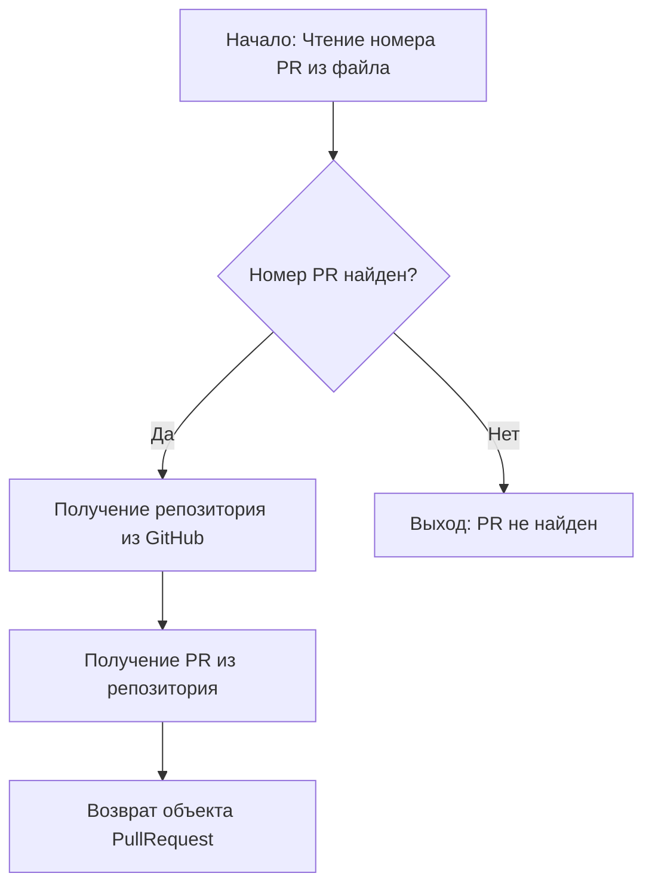
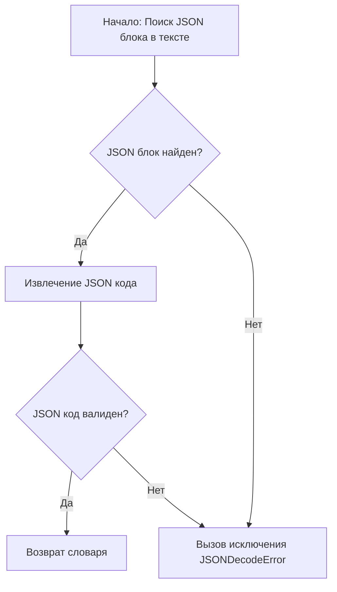
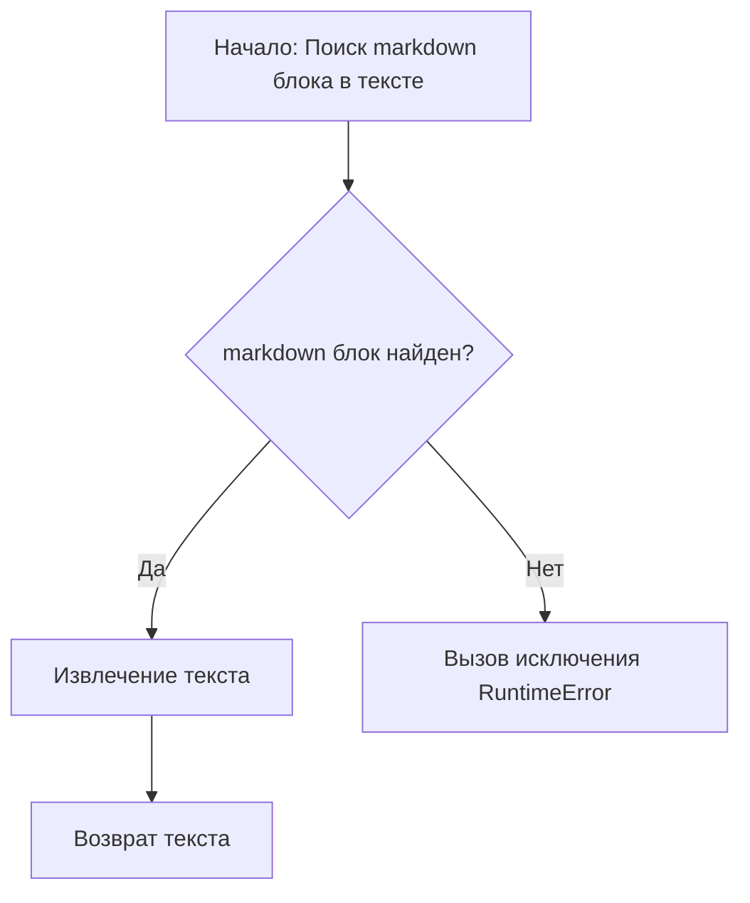
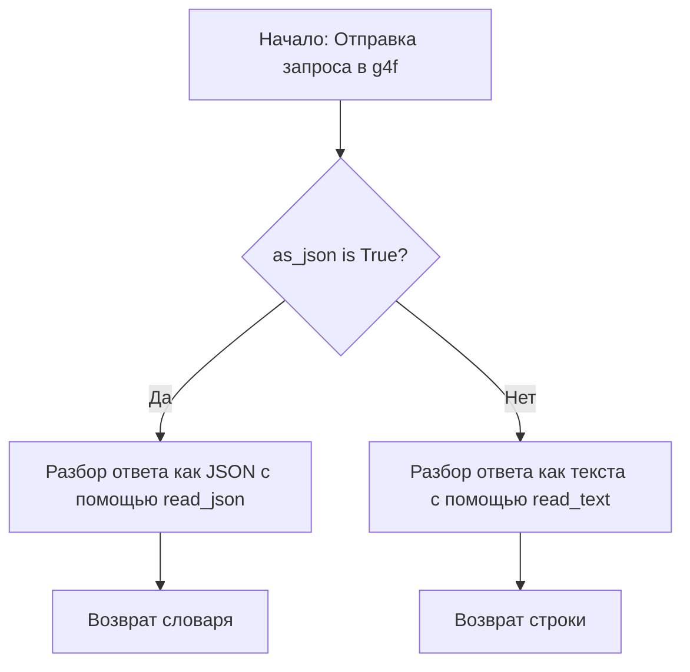
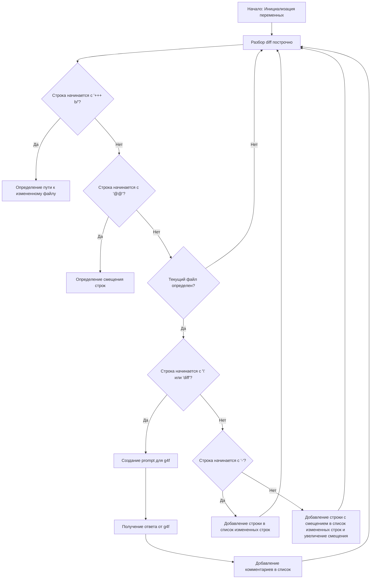
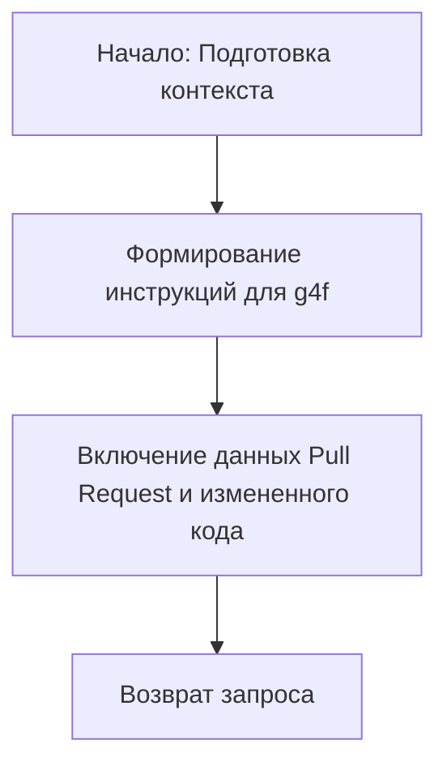
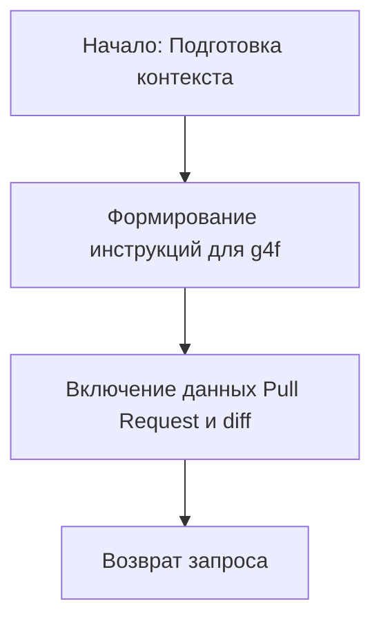

# Модуль для автоматического анализа Pull Request с использованием g4f
=============================================================

Модуль предназначен для автоматического анализа изменений в Pull Request на GitHub с использованием моделей g4f (GPT-4 for free). Он позволяет генерировать комментарии к изменениям кода и общий отзыв о Pull Request.

## Обзор

Этот модуль автоматизирует процесс проверки кода в Pull Request, используя возможности моделей g4f для анализа изменений и генерации предложений по улучшению. Он взаимодействует с GitHub API для получения информации о Pull Request, анализирует diff и создает комментарии и отзывы.

## Подробней

Модуль предназначен для упрощения и ускорения процесса code review. Он использует g4f для анализа изменений в коде и предоставления обратной связи в виде комментариев и общего обзора Pull Request. Это позволяет автоматизировать часть работы по code review и сосредоточиться на более сложных аспектах.

## Функции

### `get_pr_details`

```python
def get_pr_details(github: Github) -> PullRequest:
    """
    Извлекает детали Pull Request из GitHub.

    Args:
        github (Github): Объект Github для взаимодействия с GitHub API.

    Returns:
        PullRequest: Объект, представляющий Pull Request.
    """
```

**Назначение**: Извлечение информации о Pull Request из репозитория GitHub.

**Параметры**:
- `github` (Github): Объект GitHub для взаимодействия с API GitHub.

**Возвращает**:
- `PullRequest`: Объект, представляющий Pull Request.

**Как работает функция**:

1.  **Чтение номера PR**: Читает номер Pull Request из файла `./pr_number`.
2.  **Получение репозитория**: Использует объект `github` для получения репозитория GitHub.
3.  **Получение Pull Request**: Получает объект Pull Request из репозитория по номеру.



**Примеры**:

Предположим, что у вас есть объект `github` и файл `./pr_number` содержит номер PR.
```python
from github import Github
#Укажите ваш токен GitHub
GITHUB_TOKEN = "ghp_***********************************"
#Укажите ваш репозиторий
GITHUB_REPOSITORY = "user/repository"
github = Github(GITHUB_TOKEN)
#Предположим, что файл ./pr_number содержит "123"
pull = get_pr_details(github)
if pull:
    print(f"Pull Request title: {pull.title}")
else:
    print("Pull Request not found")
```

### `get_diff`

```python
def get_diff(diff_url: str) -> str:
    """
    Получает diff Pull Request по заданному URL.

    Args:
        diff_url (str): URL diff Pull Request.

    Returns:
        str: Diff Pull Request.
    """
```

**Назначение**: Получение содержимого diff файла по URL.

**Параметры**:
- `diff_url` (str): URL, по которому можно получить diff.

**Возвращает**:
- `str`: Diff Pull Request.

**Как работает функция**:

1.  **Выполнение GET запроса**: Выполняет GET запрос по указанному `diff_url`.
2.  **Проверка статуса ответа**: Проверяет, что статус ответа равен 200 (успех).
3.  **Возврат текста ответа**: Возвращает текстовое содержимое ответа, которое является diff.

```mermaid
graph TD
    A[Начало: Выполнение GET запроса по diff_url] --> B{Статус ответа 200?};
    B -- Да --> C[Возврат текста ответа (diff)];
    B -- Нет --> D[Вызов исключения];
```

**Примеры**:

Предположим, что у вас есть `diff_url`.
```python
diff_url = "https://github.com/user/repo/pull/123.diff"
diff = get_diff(diff_url)
print(f"Diff content: {diff[:100]}...")
```

### `read_json`

```python
def read_json(text: str) -> dict:
    """
    Извлекает JSON код из строки.

    Args:
        text (str): Строка, содержащая JSON код.

    Returns:
        dict: Словарь, полученный из JSON кода.
    """
```

**Назначение**: Извлечение JSON из текстового блока, заключенного в markdown-разметку.

**Параметры**:
- `text` (str): Строка, содержащая JSON код.

**Возвращает**:
- `dict`: Словарь, полученный из JSON кода.

**Как работает функция**:

1.  **Поиск JSON блока**: Ищет блок JSON кода, заключенный в ```json ... ``` или ``` ... ```.
2.  **Извлечение JSON кода**: Извлекает JSON код из найденного блока.
3.  **Разбор JSON**: Пытается разобрать извлеченный JSON код в словарь.



**Примеры**:

Предположим, что у вас есть строка с JSON кодом.
```python
text = "```json\n{\"key\": \"value\"}\n```"
data = read_json(text)
print(f"Parsed data: {data}")
```

### `read_text`

```python
def read_text(text: str) -> str:
    """
    Извлекает текст из markdown code block.

    Args:
        text (str): Строка, содержащая markdown code block.

    Returns:
        str: Извлеченный текст.
    """
```

**Назначение**: Извлечение текста из markdown блока кода.

**Параметры**:
- `text` (str): Строка, содержащая блок кода markdown.

**Возвращает**:
- `str`: Извлеченный текст.

**Как работает функция**:

1.  **Поиск markdown блока**: Ищет блок markdown кода, заключенный в ```markdown ... ``` или ``` ... ```.
2.  **Извлечение текста**: Извлекает текст из найденного блока.



**Примеры**:

Предположим, что у вас есть строка с markdown кодом.
```python
text = "```markdown\nHello, world!\n```"
extracted_text = read_text(text)
print(f"Extracted text: {extracted_text}")
```

### `get_ai_response`

```python
def get_ai_response(prompt: str, as_json: bool = True) -> Union[dict, str]:
    """
    Получает ответ от g4f API на основе prompt.

    Args:
        prompt (str): Prompt для отправки в g4f.
        as_json (bool): Нужно ли разбирать ответ как JSON.

    Returns:
        Union[dict, str]: Разобранный ответ от g4f, либо как словарь, либо как строка.
    """
```

**Назначение**: Получение ответа от API g4f на основе предоставленного запроса (prompt).

**Параметры**:
- `prompt` (str): Запрос, отправляемый в g4f.
- `as_json` (bool): Флаг, указывающий, следует ли разбирать ответ как JSON. По умолчанию `True`.

**Возвращает**:
- `dict | str`: Ответ от g4f, либо в виде словаря (если `as_json=True`), либо в виде строки.

**Как работает функция**:

1.  **Отправка запроса в g4f**: Отправляет запрос в g4f с использованием `g4f.ChatCompletion.create`.
2.  **Обработка ответа**: Если `as_json=True`, пытается разобрать ответ как JSON; иначе возвращает ответ как строку.



**Примеры**:

Предположим, что у вас есть `prompt`.
```python
prompt = "What is the capital of France?"
response = get_ai_response(prompt)
print(f"Response: {response}")
```

### `analyze_code`

```python
def analyze_code(pull: PullRequest, diff: str)-> list[dict]:
    """
    Анализирует изменения кода в pull request.

    Args:
        pull (PullRequest): Объект pull request.
        diff (str): Diff pull request.

    Returns:
        list[dict]: Список комментариев, сгенерированных анализом.
    """
```

**Назначение**: Анализ изменений в коде pull request и генерация комментариев.

**Параметры**:
- `pull` (PullRequest): Объект pull request.
- `diff` (str): Diff pull request.

**Возвращает**:
- `list[dict]`: Список комментариев, сгенерированных анализом.

**Как работает функция**:

1.  **Инициализация**: Инициализирует переменные для хранения комментариев, измененных строк, текущего пути к файлу и смещения строки.
2.  **Разбор diff**: Разбирает diff построчно.
3.  **Определение измененных файлов**: Определяет путь к измененному файлу на основе строк, начинающихся с `+++ b/`.
4.  **Определение смещения строк**: Определяет смещение строк на основе строк, начинающихся с `@@`.
5.  **Анализ измененных строк**: Анализирует измененные строки и создает prompt для g4f.
6.  **Получение ответа от g4f**: Получает ответ от g4f и добавляет комментарии в список.



**Примеры**:

Предположим, что у вас есть объект `pull` и `diff`.
```python
from github import Github
#Укажите ваш токен GitHub
GITHUB_TOKEN = "ghp_***********************************"
#Укажите ваш репозиторий
GITHUB_REPOSITORY = "user/repository"

github = Github(GITHUB_TOKEN)
repo = github.get_repo(GITHUB_REPOSITORY)
pull = repo.get_pull(1)
diff = get_diff(pull.diff_url)

comments = analyze_code(pull, diff)
print(f"Comments: {comments}")
```

### `create_analyze_prompt`

```python
def create_analyze_prompt(changed_lines: list[str], pull: PullRequest, file_path: str):
    """
    Создает prompt для g4f model.

    Args:
        changed_lines (list[str]): Строки кода, которые были изменены.
        pull (PullRequest): Объект pull request.
        file_path (str): Путь к файлу, который просматривается.

    Returns:
        str: Сгенерированный prompt.
    """
```

**Назначение**: Создание запроса (prompt) для модели g4f с инструкциями по анализу изменений кода в Pull Request.

**Параметры**:
- `changed_lines` (list[str]): Список измененных строк кода.
- `pull` (PullRequest): Объект Pull Request, содержащий информацию о запросе на включение изменений.
- `file_path` (str): Путь к файлу, который анализируется.

**Возвращает**:
- `str`: Сгенерированный запрос для модели g4f.

**Как работает функция**:

1.  **Подготовка контекста**: Функция получает информацию об измененных строках кода, объекте Pull Request и пути к файлу.
2.  **Формирование инструкций**: Формирует текстовый запрос, включающий инструкции для g4f по анализу кода, предоставлению комментариев только в случае необходимости улучшений, соблюдению формата JSON и использованию GitHub Markdown.
3.  **Включение данных**: Включает в запрос заголовок и описание Pull Request, а также измененные строки кода с их номерами.
4.  **Возврат запроса**: Возвращает сформированный запрос в виде строки.



**Примеры**:

Предположим, у вас есть список измененных строк, объект Pull Request и путь к файлу:
```python
changed_lines = ["1: +def foo():", "2: +    print('Hello, world!')"]
#Укажите ваш токен GitHub
GITHUB_TOKEN = "ghp_***********************************"
#Укажите ваш репозиторий
GITHUB_REPOSITORY = "user/repository"
github = Github(GITHUB_TOKEN)
repo = github.get_repo(GITHUB_REPOSITORY)
pull = repo.get_pull(1)
file_path = "example.py"
prompt = create_analyze_prompt(changed_lines, pull, file_path)
print(prompt)
```

### `create_review_prompt`

```python
def create_review_prompt(pull: PullRequest, diff: str):
    """
    Создает prompt для создания review comment.

    Args:
        pull (PullRequest): Объект pull request.
        diff (str): Diff pull request.

    Returns:
        str: Сгенерированный prompt для review.
    """
```

**Назначение**: Создает запрос (prompt) для g4f с целью генерации комментария к Pull Request.

**Параметры**:
- `pull` (PullRequest): Объект Pull Request, содержащий информацию о запросе на включение изменений.
- `diff` (str): Diff Pull Request, представляющий собой изменения в коде.

**Возвращает**:
- `str`: Сгенерированный запрос для модели g4f.

**Как работает функция**:

1.  **Подготовка контекста**: Функция получает информацию об объекте Pull Request и diff.
2.  **Формирование инструкций**: Формирует текстовый запрос, включающий инструкции для g4f по написанию комментария от имени g4f copilot, использованию GitHub Markdown, благодарности автору за вклад, а также включает заголовок, описание и diff Pull Request.
3.  **Возврат запроса**: Возвращает сформированный запрос в виде строки.



**Примеры**:

Предположим, у вас есть объект Pull Request и diff:
```python
#Укажите ваш токен GitHub
GITHUB_TOKEN = "ghp_***********************************"
#Укажите ваш репозиторий
GITHUB_REPOSITORY = "user/repository"
github = Github(GITHUB_TOKEN)
repo = github.get_repo(GITHUB_REPOSITORY)
pull = repo.get_pull(1)
diff = get_diff(pull.diff_url)
prompt = create_review_prompt(pull, diff)
print(prompt)
```

### `main`

```python
def main():
    """
    Основная функция для анализа pull request и создания review.
    """
```

**Назначение**: Главная функция, выполняющая анализ Pull Request и создание отзыва.

**Как работает функция**:

1.  **Получение деталей Pull Request**: Получает детали Pull Request из GitHub.
2.  **Генерация отзыва**: Генерирует отзыв с использованием g4f.
3.  **Анализ кода**: Анализирует код и генерирует комментарии.
4.  **Публикация отзыва**: Публикует отзыв и комментарии в Pull Request.

```mermaid
graph TD
    A[Начало: Получение деталей Pull Request] --> B[Генерация отзыва с использованием g4f];
    B --> C[Анализ кода и генерация комментариев];
    C --> D[Публикация отзыва и комментариев в Pull Request];