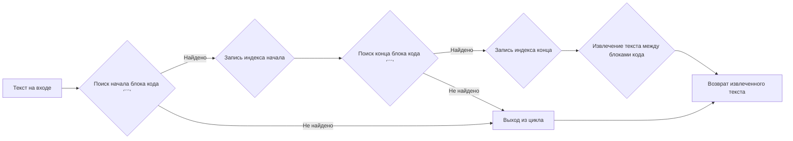
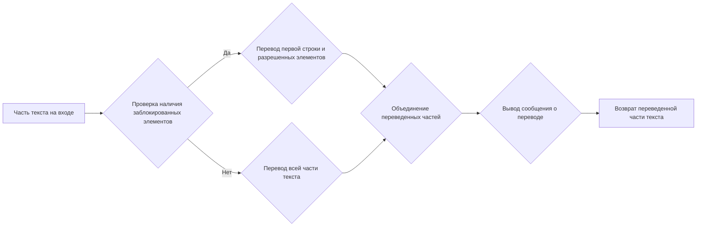
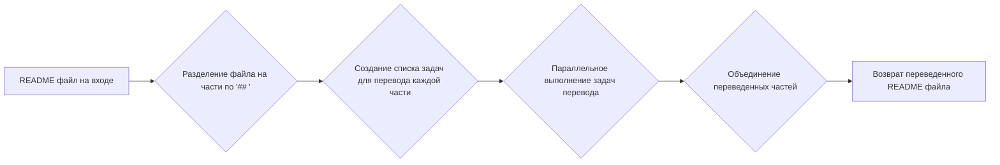

# Модуль для перевода README файлов

## Обзор

Модуль предназначен для автоматического перевода файлов `README.md` на другие языки с использованием AI-провайдера `g4f` (GPT4Free). Он разбивает исходный файл на части, переводит каждую часть, соблюдая определенные правила для сохранения форматирования и избежания перевода определенных блоков кода или текста.

## Подробней

Этот модуль автоматизирует процесс перевода документации, что позволяет быстро создавать многоязычные версии `README` файлов. Он использует асинхронные функции для параллельного перевода частей документа, что ускоряет процесс. Модуль настраивается для обработки специфических элементов Markdown, таких как блоки кода и определенные текстовые маркеры, для обеспечения корректности перевода. Расположение этого файла в проекте указывает на его роль в автоматизации задач, связанных с документацией и интернационализацией.

## Функции

### `read_text`

```python
def read_text(text: str) -> str:
    """
    Извлекает текст из Markdown документа, находящегося между блоками кода, обозначенными символами ```.

    Args:
        text (str): Исходный Markdown документ.

    Returns:
        str: Текст, расположенный между блоками кода.
    """
```

**Назначение**:
Функция `read_text` извлекает содержимое между блоками кода, которые определяются маркерами ``` в Markdown документе. Она используется для выделения текста, который нужно перевести, исключая при этом примеры кода.

**Как работает функция**:

1.  Функция принимает на вход строковый аргумент `text`, представляющий собой Markdown документ.
2.  Разбивает текст на строки, используя разделитель `\n`.
3.  Перебирает строки, чтобы найти начало и конец блоков кода (```).
4.  Если найдены начало и конец блока кода, функция возвращает текст между этими блоками.



**Примеры**:

```python
text = "Some text\n```\nCode example\n```\nMore text"
result = read_text(text)
print(result)  # Вывод: More text
```

### `translate`

```python
async def translate(text: str) -> str:
    """
    Асинхронно переводит текст с использованием AI-провайдера.

    Args:
        text (str): Текст для перевода.

    Returns:
        str: Переведенный текст.
    """
```

**Назначение**:
Функция `translate` асинхронно переводит заданный текст с использованием AI-провайдера `g4f`. Она добавляет текст в запрос на перевод и обрабатывает результат, сохраняя при этом маркеры, указывающие на определенные элементы форматирования, такие как заметки.

**Как работает функция**:

1.  Функция принимает на вход строковый аргумент `text`, который необходимо перевести.
2.  Формирует запрос (`prompt`) на основе входного текста и добавляет к нему префикс с инструкциями для перевода.
3.  Если в тексте содержится маркер "[!Note]", добавляет специальное указание `keep_note` для сохранения этого маркера.
4.  Использует `provider.create_async` для асинхронного выполнения запроса к AI-провайдеру.
5.  Извлекает переведенный текст с использованием функции `read_text`.
6.  Добавляет закрывающий маркер "```" в конце переведенного текста, если исходный текст заканчивался этим маркером, а переведенный — нет.

```mermaid
graph LR
A[Текст на входе] --> B{Формирование запроса на перевод};
B --> C{Проверка наличия маркера '[!Note]'};
C -- Да --> D{Добавление инструкции keep_note};
C -- Нет --> E{Пропуск добавления инструкции};
D --> F{Отправка запроса провайдеру g4f};
E --> F;
F --> G{Извлечение переведенного текста функцией read_text};
G --> H{Проверка наличия завершающего маркера '```'};
H -- Нет --> I{Добавление завершающего маркера '```'};
H -- Да --> J{Пропуск добавления маркера};
I --> K[Возврат переведенного текста];
J --> K;
```

**Примеры**:

```python
async def main():
    text = "This is a test text."
    result = await translate(text)
    print(result)  # Вывод: "Это тестовый текст." (предположительно)

asyncio.run(main())
```

### `translate_part`

```python
async def translate_part(part: str, i: int) -> str:
    """
    Асинхронно переводит часть текста, обрабатывая блокированный контент отдельно.

    Args:
        part (str): Часть текста для перевода.
        i (int): Индекс части.

    Returns:
        str: Переведенная часть текста.
    """
```

**Назначение**:
Функция `translate_part` асинхронно переводит часть текста, предварительно проверяя, не входит ли эта часть в список заблокированных для перевода блоков (`blocklist`). Если часть текста содержит заблокированные элементы, функция переводит только заголовки и разрешенные элементы (`allowlist`).

**Как работает функция**:

1.  Функция принимает на вход часть текста `part` и ее индекс `i`.
2.  Проверяет, содержит ли часть текста какие-либо элементы из списка `blocklist`.
3.  Если заблокированные элементы найдены, функция переводит только первую строку (заголовок) и элементы из списка `allowlist`.
4.  Если заблокированные элементы не найдены, функция переводит всю часть текста целиком.
5.  Выводит сообщение в консоль о том, что часть текста переведена.



**Примеры**:

```python
async def main():
    part = "## This is a test section\nSome content here."
    i = 1
    result = await translate_part(part, i)
    print(result)

asyncio.run(main())
```

### `translate_readme`

```python
async def translate_readme(readme: str) -> str:
    """
    Асинхронно переводит содержимое README файла, разделяя его на части.

    Args:
        readme (str): Содержимое README файла.

    Returns:
        str: Переведенное содержимое README файла.
    """
```

**Назначение**:
Функция `translate_readme` асинхронно переводит содержимое `README` файла, разделяя его на части по заголовкам второго уровня (`##`). Затем она использует функцию `translate_part` для перевода каждой части и объединяет переведенные части в один документ.

**Как работает функция**:

1.  Функция принимает на вход содержимое `README` файла в виде строки `readme`.
2.  Разделяет файл на части, используя разделитель `\n## `.
3.  Создает список асинхронных задач для перевода каждой части с использованием функции `translate_part`.
4.  Запускает все задачи параллельно с помощью `asyncio.gather`.
5.  Объединяет переведенные части в один документ с использованием разделителя `\n\n`.



**Примеры**:

```python
async def main():
    readme = "## Section 1\nContent of section 1.\n## Section 2\nContent of section 2."
    result = await translate_readme(readme)
    print(result)

asyncio.run(main())
```