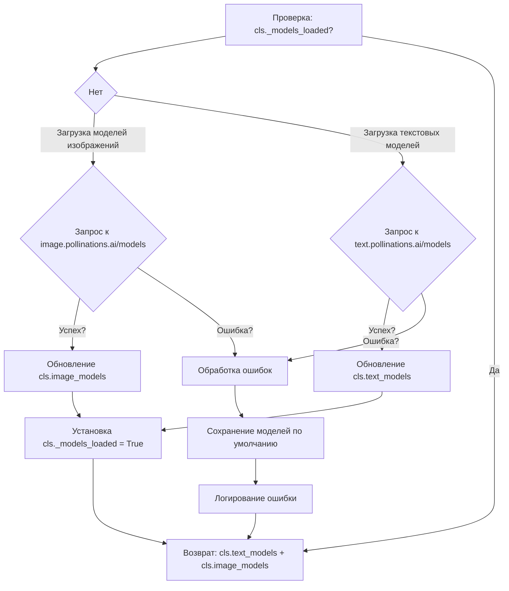
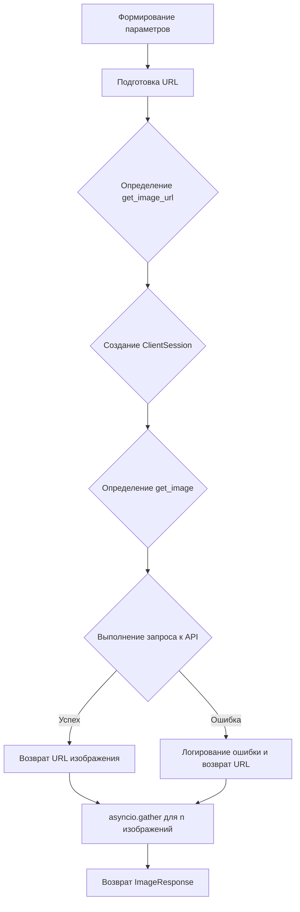
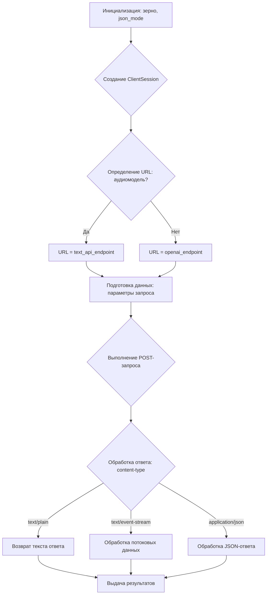

# Модуль `PollinationsAI`

## Обзор

Модуль `PollinationsAI` предоставляет асинхронный генератор для взаимодействия с API Pollinations AI, который позволяет генерировать как текст, так и изображения. Он поддерживает потоковую передачу данных и различные параметры для настройки процесса генерации.

## Подробней

Этот модуль предназначен для интеграции с сервисом Pollinations AI, предоставляя удобный интерфейс для генерации контента различных типов. Он включает в себя поддержку текстовых и графических моделей, а также возможность настройки параметров генерации, таких как температура, пропорции изображения и другие. Модуль автоматически обновляет список доступных моделей, что обеспечивает актуальность используемых ресурсов.

## Классы

### `PollinationsAI`

**Описание**: Класс `PollinationsAI` является основным классом, предоставляющим функциональность для взаимодействия с API Pollinations AI. Он наследует `AsyncGeneratorProvider` и `ProviderModelMixin` и предоставляет методы для генерации текста и изображений.

**Наследует**:
- `AsyncGeneratorProvider`: Обеспечивает асинхронную генерацию данных.
- `ProviderModelMixin`: Предоставляет функциональность для работы с моделями.

**Атрибуты**:
- `label` (str): Метка провайдера, `"Pollinations AI"`.
- `url` (str): URL провайдера, `"https://pollinations.ai"`.
- `working` (bool): Указывает, работает ли провайдер, `True`.
- `supports_system_message` (bool): Указывает, поддерживает ли провайдер системные сообщения, `True`.
- `supports_message_history` (bool): Указывает, поддерживает ли провайдер историю сообщений, `True`.
- `text_api_endpoint` (str): URL для текстового API, `"https://text.pollinations.ai"`.
- `openai_endpoint` (str): URL для OpenAI API, `"https://text.pollinations.ai/openai"`.
- `image_api_endpoint` (str): URL для image API, `"https://image.pollinations.ai/"`.
- `default_model` (str): Модель по умолчанию для текста, `"openai"`.
- `default_image_model` (str): Модель по умолчанию для изображений, `"flux"`.
- `default_vision_model` (str): Модель по умолчанию для vision, `"openai"`.
- `text_models` (list[str]): Список текстовых моделей, содержащий `default_model`.
- `image_models` (list[str]): Список моделей изображений, содержащий `default_image_model`.
- `extra_image_models` (list[str]): Список дополнительных моделей изображений.
- `vision_models` (list[str]): Список моделей vision.
- `extra_text_models` (list[str]): Список дополнительных текстовых моделей.
- `_models_loaded` (bool): Флаг, указывающий, загружены ли модели, `False`.
- `model_aliases` (dict[str, str]): Словарь псевдонимов моделей.

**Методы**:
- `get_models(**kwargs)`: Получает список доступных моделей.
- `create_async_generator(model: str, messages: Messages, stream: bool = True, proxy: str = None, cache: bool = False, prompt: str = None, aspect_ratio: str = "1:1", width: int = None, height: int = None, seed: Optional[int] = None, nologo: bool = True, private: bool = False, enhance: bool = False, safe: bool = False, n: int = 1, media: MediaListType = None, temperature: float = None, presence_penalty: float = None, top_p: float = None, frequency_penalty: float = None, response_format: Optional[dict] = None, extra_parameters: list[str] = ["tools", "parallel_tool_calls", "tool_choice", "reasoning_effort", "logit_bias", "voice", "modalities", "audio"], **kwargs)`: Создает асинхронный генератор для генерации текста или изображений.
- `_generate_image(model: str, prompt: str, proxy: str, aspect_ratio: str, width: int, height: int, seed: Optional[int], cache: bool, nologo: bool, private: bool, enhance: bool, safe: bool, n: int)`: Генерирует изображения на основе заданных параметров.
- `_generate_text(model: str, messages: Messages, media: MediaListType, proxy: str, temperature: float, presence_penalty: float, top_p: float, frequency_penalty: float, response_format: Optional[dict], seed: Optional[int], cache: bool, stream: bool, extra_parameters: list[str], **kwargs)`: Генерирует текст на основе заданных параметров.

## Функции

### `get_models`

```python
    @classmethod
    def get_models(cls, **kwargs):
        ...
```

**Назначение**: Метод `get_models` получает список доступных моделей из API Pollinations AI и обновляет атрибуты класса `text_models` и `image_models`.

**Параметры**:
- `cls`: Ссылка на класс.
- `**kwargs`: Дополнительные аргументы.

**Возвращает**:
- `list[str]`: Объединенный список текстовых и графических моделей.

**Как работает функция**:

1. **Проверка загрузки моделей**: Проверяет, были ли уже загружены модели (`cls._models_loaded`). Если модели еще не загружены, происходит попытка их загрузки.
2. **Загрузка моделей изображений**:
   - Отправляет GET-запрос к `https://image.pollinations.ai/models` для получения списка доступных моделей изображений.
   - Если запрос успешен, обновляет список моделей изображений (`new_image_models`).
   - Объединяет старые и новые модели изображений, удаляя дубликаты.
3. **Загрузка текстовых моделей**:
   - Отправляет GET-запрос к `https://text.pollinations.ai/models` для получения списка доступных текстовых моделей.
   - Извлекает имена моделей с типом "chat" и сохраняет их в `original_text_models`.
   - Извлекает имена аудиомоделей и список их голосов и сохраняет в `cls.audio_models`.
   - Объединяет старые и новые модели, удаляя дубликаты.
4. **Обработка исключений**: Если происходит ошибка при загрузке моделей, сохраняет модели по умолчанию и логирует ошибку.
5. **Установка флага загрузки**: Устанавливает флаг `cls._models_loaded` в `True`, чтобы избежать повторной загрузки моделей.



**Примеры**:

```python
# Пример вызова метода get_models
PollinationsAI.get_models()
```

### `create_async_generator`

```python
    @classmethod
    async def create_async_generator(
        cls,
        model: str,
        messages: Messages,
        stream: bool = True,
        proxy: str = None,
        cache: bool = False,
        # Image generation parameters
        prompt: str = None,
        aspect_ratio: str = "1:1",
        width: int = None,
        height: int = None,
        seed: Optional[int] = None,
        nologo: bool = True,
        private: bool = False,
        enhance: bool = False,
        safe: bool = False,
        n: int = 1,
        # Text generation parameters
        media: MediaListType = None,
        temperature: float = None,
        presence_penalty: float = None,
        top_p: float = None,
        frequency_penalty: float = None,
        response_format: Optional[dict] = None,
        extra_parameters: list[str] = ["tools", "parallel_tool_calls", "tool_choice", "reasoning_effort", "logit_bias", "voice", "modalities", "audio"],
        **kwargs
    ) -> AsyncResult:
        ...
```

**Назначение**: Метод `create_async_generator` создает асинхронный генератор для генерации текста или изображений на основе заданных параметров.

**Параметры**:
- `cls`: Ссылка на класс.
- `model` (str): Модель для генерации.
- `messages` (Messages): Сообщения для генерации.
- `stream` (bool): Включить потоковую передачу данных, по умолчанию `True`.
- `proxy` (str): Прокси-сервер для использования, по умолчанию `None`.
- `cache` (bool): Использовать кэш, по умолчанию `False`.
- `prompt` (str): Текст запроса для генерации изображений, по умолчанию `None`.
- `aspect_ratio` (str): Соотношение сторон изображения, по умолчанию `"1:1"`.
- `width` (int): Ширина изображения, по умолчанию `None`.
- `height` (int): Высота изображения, по умолчанию `None`.
- `seed` (Optional[int]): Зерно для генерации, по умолчанию `None`.
- `nologo` (bool): Удалить логотип, по умолчанию `True`.
- `private` (bool): Сделать генерацию приватной, по умолчанию `False`.
- `enhance` (bool): Улучшить изображение, по умолчанию `False`.
- `safe` (bool): Включить безопасный режим, по умолчанию `False`.
- `n` (int): Количество изображений для генерации, по умолчанию `1`.
- `media` (MediaListType): Список медиафайлов, по умолчанию `None`.
- `temperature` (float): Температура для генерации текста, по умолчанию `None`.
- `presence_penalty` (float): Штраф за присутствие, по умолчанию `None`.
- `top_p` (float): Top-p значение, по умолчанию `None`.
- `frequency_penalty` (float): Штраф за частоту, по умолчанию `None`.
- `response_format` (Optional[dict]): Формат ответа, по умолчанию `None`.
- `extra_parameters` (list[str]): Список дополнительных параметров, по умолчанию `["tools", "parallel_tool_calls", "tool_choice", "reasoning_effort", "logit_bias", "voice", "modalities", "audio"]`.
- `**kwargs`: Дополнительные аргументы.

**Возвращает**:
- `AsyncResult`: Асинхронный генератор для результатов.

**Как работает функция**:

1. **Загрузка моделей**: Вызывает метод `cls.get_models()` для загрузки списка доступных моделей.
2. **Определение модели**: Если модель не указана, проверяет наличие аудио в параметрах или медиафайлах и выбирает аудиомодель, если она доступна.
3. **Выбор типа генерации**:
   - Если модель находится в списке моделей изображений (`cls.image_models`), вызывает метод `cls._generate_image()` для генерации изображений.
   - В противном случае вызывает метод `cls._generate_text()` для генерации текста.
4. **Генерация контента**: Асинхронно перебирает результаты, возвращаемые соответствующим методом генерации, и передает их в вызывающий код.

```mermaid
graph TD
    A[Загрузка моделей: cls.get_models()] --> B{Определение модели};
    B -- Модель не указана --> C{Проверка аудио};
    C -- Аудио есть --> D[Выбор аудиомодели];
    D --> E{Модель в cls.image_models?};
    B -- Модель указана --> E;
    C -- Аудио нет --> E;
    E -- Да --> F[Генерация изображения: cls._generate_image()];
    E -- Нет --> G[Генерация текста: cls._generate_text()];
    F & G --> H[Асинхронный перебор результатов];
    H --> I[Выдача результатов];
```

**Примеры**:

```python
# Пример вызова для генерации изображения
async for chunk in PollinationsAI.create_async_generator(
    model="flux",
    messages=[{"role": "user", "content": "Generate a cat image"}],
    prompt="cat",
    aspect_ratio="16:9"
):
    print(chunk)

# Пример вызова для генерации текста
async for chunk in PollinationsAI.create_async_generator(
    model="openai",
    messages=[{"role": "user", "content": "Tell me a joke"}],
    stream=True
):
    print(chunk)
```

### `_generate_image`

```python
    @classmethod
    async def _generate_image(
        cls,
        model: str,
        prompt: str,
        proxy: str,
        aspect_ratio: str,
        width: int,
        height: int,
        seed: Optional[int],
        cache: bool,
        nologo: bool,
        private: bool,
        enhance: bool,
        safe: bool,
        n: int
    ) -> AsyncResult:
        ...
```

**Назначение**: Метод `_generate_image` генерирует изображения на основе заданных параметров, используя API Pollinations AI.

**Параметры**:
- `cls`: Ссылка на класс.
- `model` (str): Модель для генерации изображения.
- `prompt` (str): Текст запроса для генерации изображения.
- `proxy` (str): Прокси-сервер для использования, по умолчанию `None`.
- `aspect_ratio` (str): Соотношение сторон изображения.
- `width` (int): Ширина изображения.
- `height` (int): Высота изображения.
- `seed` (Optional[int]): Зерно для генерации.
- `cache` (bool): Использовать кэш.
- `nologo` (bool): Удалить логотип.
- `private` (bool): Сделать генерацию приватной.
- `enhance` (bool): Улучшить изображение.
- `safe` (bool): Включить безопасный режим.
- `n` (int): Количество изображений для генерации.

**Возвращает**:
- `AsyncResult`: Асинхронный генератор, возвращающий объекты `ImageResponse`.

**Как работает функция**:

1. **Формирование параметров**:
   - Использует функцию `use_aspect_ratio` для формирования параметров запроса на основе заданных значений и соотношения сторон.
   - Параметры включают ширину, высоту, модель, флаги `nologo`, `private`, `enhance` и `safe`.
2. **Подготовка URL**:
   - Формирует строку запроса (`query`) из параметров, кодируя значения с помощью `quote_plus`.
   - Усекает текст запроса (`prompt`) до допустимой длины.
   - Формирует полный URL для запроса к API, включая параметры и текст запроса.
3. **Генерация URL изображения**:
   - Определяет внутреннюю функцию `get_image_url`, которая генерирует URL для получения изображения с учетом зерна (`seed`) и кэширования.
   - Если кэширование не используется и зерно не указано, генерирует случайное зерно.
4. **Выполнение запроса**:
   - Использует `ClientSession` для выполнения асинхронных GET-запросов к API.
   - Определяет внутреннюю асинхронную функцию `get_image`, которая выполняет запрос и обрабатывает ответ.
   - В случае ошибки логирует её и возвращает URL.
   - В случае успеха возвращает URL изображения.
5. **Выдача результатов**:
   - Использует `asyncio.gather` для параллельного выполнения запросов на генерацию нескольких изображений.
   - Возвращает объект `ImageResponse`, содержащий список URL сгенерированных изображений и исходный текст запроса.



**Примеры**:

```python
# Пример вызова для генерации изображения
async for chunk in PollinationsAI._generate_image(
    model="flux",
    prompt="A cat in space",
    proxy=None,
    aspect_ratio="1:1",
    width=512,
    height=512,
    seed=12345,
    cache=False,
    nologo=True,
    private=False,
    enhance=False,
    safe=True,
    n=1
):
    print(chunk)
```

### `_generate_text`

```python
    @classmethod
    async def _generate_text(
        cls,
        model: str,
        messages: Messages,
        media: MediaListType,
        proxy: str,
        temperature: float,
        presence_penalty: float,
        top_p: float,
        frequency_penalty: float,
        response_format: Optional[dict],
        seed: Optional[int],
        cache: bool,
        stream: bool,
        extra_parameters: list[str],
        **kwargs
    ) -> AsyncResult:
       ...
```

**Назначение**: Метод `_generate_text` генерирует текст на основе заданных параметров, используя API Pollinations AI или OpenAI.

**Параметры**:
- `cls`: Ссылка на класс.
- `model` (str): Модель для генерации текста.
- `messages` (Messages): Список сообщений для генерации.
- `media` (MediaListType): Список медиафайлов.
- `proxy` (str): Прокси-сервер для использования.
- `temperature` (float): Температура для генерации текста.
- `presence_penalty` (float): Штраф за присутствие.
- `top_p` (float): Top-p значение.
- `frequency_penalty` (float): Штраф за частоту.
- `response_format` (Optional[dict]): Формат ответа.
- `seed` (Optional[int]): Зерно для генерации.
- `cache` (bool): Использовать кэш.
- `stream` (bool): Включить потоковую передачу данных.
- `extra_parameters` (list[str]): Список дополнительных параметров.
- `**kwargs`: Дополнительные аргументы.

**Возвращает**:
- `AsyncResult`: Асинхронный генератор, возвращающий результаты генерации текста.

**Как работает функция**:

1. **Инициализация**:
   - Генерирует случайное зерно (`seed`), если кэширование не используется и зерно не указано.
   - Определяет, включен ли режим JSON (`json_mode`) на основе формата ответа.
2. **Создание сессии**:
   - Создает асинхронную сессию с использованием `ClientSession` и заданных заголовков и прокси.
3. **Определение URL**:
   - Определяет URL для запроса в зависимости от модели:
     - Если модель является аудиомоделью (`cls.audio_models`), использует `cls.text_api_endpoint`.
     - В противном случае использует `cls.openai_endpoint`.
4. **Подготовка данных**:
   - Извлекает дополнительные параметры из `kwargs` на основе списка `extra_parameters`.
   - Формирует словарь `data` с параметрами запроса, включая сообщения, модель, температуру, штрафы, режим JSON, зерно и кэш.
5. **Выполнение запроса**:
   - Отправляет POST-запрос к определенному URL с данными в формате JSON.
   - Обрабатывает ответ в зависимости от типа контента:
     - Если тип контента `text/plain`, возвращает текст ответа.
     - Если тип контента `text/event-stream`, обрабатывает потоковые данные, извлекая содержимое, информацию об использовании и причину завершения.
     - В противном случае обрабатывает JSON-ответ, извлекая содержимое сообщения, вызовы инструментов, информацию об использовании и причину завершения.
6. **Выдача результатов**:
   - Возвращает результаты генерации текста в виде асинхронного генератора.



**Примеры**:

```python
# Пример вызова для генерации текста
async for chunk in PollinationsAI._generate_text(
    model="openai",
    messages=[{"role": "user", "content": "Tell me a joke"}],
    media=None,
    proxy=None,
    temperature=0.7,
    presence_penalty=0.0,
    top_p=1.0,
    frequency_penalty=0.0,
    response_format=None,
    seed=12345,
    cache=False,
    stream=True,
    extra_parameters=[]
):
    print(chunk)