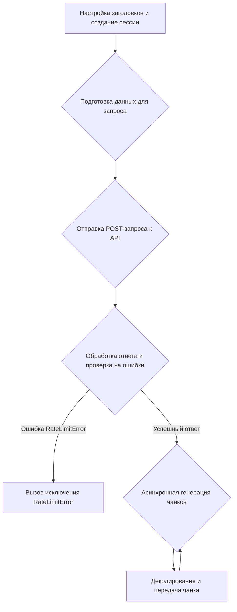

# Модуль `AIChatFree.py`

## Обзор

Модуль предоставляет асинхронный класс `AIChatFree`, который используется для взаимодействия с сервисом aichatfree.info.
Он позволяет генерировать текст на основе предоставленных сообщений, поддерживает потоковую передачу данных и историю сообщений.

## Подробней

Этот модуль предназначен для интеграции с сервисом [aichatfree.info](https://aichatfree.info).
Он использует асинхронные запросы для генерации текста на основе предоставленных сообщений.
Модуль поддерживает потоковую передачу данных, что позволяет получать результаты генерации по частям, а также историю сообщений, что позволяет учитывать предыдущие сообщения при генерации нового текста.
В коде реализована логика обработки ошибок, в частности, `RateLimitError`, которая возникает при превышении лимита запросов.

## Классы

### `AIChatFree`

**Описание**: Асинхронный класс, предоставляющий функциональность для взаимодействия с сервисом aichatfree.info.

**Наследует**:
- `AsyncGeneratorProvider`: Обеспечивает асинхронную генерацию данных.
- `ProviderModelMixin`: Предоставляет функциональность для работы с моделями.

**Атрибуты**:
- `url` (str): URL сервиса aichatfree.info.
- `working` (bool): Указывает, работает ли провайдер.
- `supports_stream` (bool): Указывает, поддерживает ли провайдер потоковую передачу данных.
- `supports_message_history` (bool): Указывает, поддерживает ли провайдер историю сообщений.
- `default_model` (str): Модель, используемая по умолчанию (`gemini-1.5-pro`).

**Методы**:

- `create_async_generator`
## Функции

### `create_async_generator`

```python
    @classmethod
    async def create_async_generator(
        cls,
        model: str,
        messages: Messages,
        proxy: str = None,
        connector: BaseConnector = None,
        **kwargs,
    ) -> AsyncResult:
        """Создает асинхронный генератор для взаимодействия с сервисом aichatfree.info.

        Args:
            model (str): Модель для генерации текста.
            messages (Messages): Список сообщений для передачи в сервис.
            proxy (str, optional): Прокси-сервер для использования. По умолчанию `None`.
            connector (BaseConnector, optional): Aiohttp коннектор. По умолчанию `None`.
            **kwargs: Дополнительные параметры.

        Returns:
            AsyncResult: Асинхронный генератор, возвращающий части сгенерированного текста.

        Raises:
            RateLimitError: Если достигнут лимит запросов.
            Exception: Если возникает ошибка при выполнении запроса.
        """
```

**Назначение**: Создает асинхронный генератор для взаимодействия с API aichatfree.info.

**Параметры**:
- `cls`: Ссылка на класс `AIChatFree`.
- `model` (str): Модель для генерации текста.
- `messages (Messages)`: Список сообщений, используемых для генерации. Каждое сообщение должно содержать роли (`role`) и содержание (`content`).
- `proxy (str, optional)`:  URL прокси-сервера, который будет использоваться для подключения. По умолчанию `None`.
- `connector (BaseConnector, optional)`: Объект коннектора aiohttp для управления базовыми соединениями. По умолчанию `None`.
- `**kwargs`: Дополнительные аргументы для расширения функциональности.

**Возвращает**:
- `AsyncResult`: Асинхронный генератор, который выдает части сгенерированного текста.

**Вызывает исключения**:
- `RateLimitError`: Вызывается, когда достигнут лимит запросов.
- `Exception`: Вызывается при других ошибках, возникших во время запроса.

**Как работает функция**:

1. **Настройка заголовков**:
   - Определяются заголовки HTTP-запроса, включая `User-Agent`, `Accept`, `Accept-Language`, `Accept-Encoding`, `Content-Type`, `Referer` и `Origin`.
   - Заголовки необходимы для эмуляции запроса от браузера и корректного взаимодействия с API.
2. **Создание сессии**:
   -  Инициализируется асинхронная сессия `ClientSession` с заданными заголовками и прокси (если указан).
   -  Использование `get_connector` позволяет повторно использовать соединение и управлять им.
3. **Подготовка данных**:
   -  Вычисляется текущий timestamp в миллисекундах.
   -  Формируется полезная нагрузка `data` для POST-запроса, включающая преобразованные сообщения, timestamp и сигнатуру.
   -  Сообщения преобразуются в формат, ожидаемый API, где роль "assistant" становится "model", а роль "user" остаётся "user".
   -  Каждое сообщение содержит текстовую часть.
   -  Генерируется цифровая подпись с использованием функции `generate_signature`.
4. **Отправка запроса и обработка ответа**:
   -  Выполняется POST-запрос к API (`f"{cls.url}/api/generate"`) с подготовленными данными в формате JSON.
   -  Обрабатывается возможная ошибка `RateLimitError` при получении HTTP-статуса 500 и наличии сообщения "Quota exceeded" в ответе.
   -  Вызывается `raise_for_status(response)` для проверки статуса ответа и вызова исключения в случае ошибки.
5. **Асинхронная генерация чанков**:
   -  Извлекается содержимое ответа в виде асинхронного итератора чанков.
   -  Каждый чанк декодируется в строку с обработкой ошибок кодировки и передаётся через `yield`.
   -  Генератор позволяет асинхронно обрабатывать большие объемы данных, не загружая их все в память сразу.



**Примеры**:

```python
# Пример использования create_async_generator
import asyncio
from src.endpoints.gpt4free.g4f.Provider.not_working.AIChatFree import AIChatFree

async def main():
    messages = [
        {"role": "user", "content": "Привет, как дела?"},
        {"role": "assistant", "content": "Привет! У меня все хорошо, спасибо, что спросили."}
    ]
    async for chunk in AIChatFree.create_async_generator(model="gemini-1.5-pro", messages=messages):
        print(chunk, end="")

if __name__ == "__main__":
    asyncio.run(main())
```

### `generate_signature`

```python
def generate_signature(time: int, text: str, secret: str = ""):
    """Генерирует подпись для запроса к API.

    Args:
        time (int): Timestamp в миллисекундах.
        text (str): Текст сообщения.
        secret (str, optional): Секретный ключ. По умолчанию "".

    Returns:
        str: SHA256 хеш, представляющий подпись.
    """
```

**Назначение**: Генерирует SHA256 хеш для подписи запроса.

**Параметры**:
- `time (int)`: Timestamp в миллисекундах.
- `text (str)`: Текст сообщения для подписи.
- `secret (str, optional)`: Секретный ключ, используемый при генерации подписи. По умолчанию "".

**Возвращает**:
- `str`: SHA256 хеш, который служит подписью.

**Как работает функция**:

1. **Формирование сообщения**:
   - Создается строка сообщения путем конкатенации `time`, `text` и `secret` через двоеточие.
2. **Кодирование сообщения**:
   -  Сообщение кодируется в байтовую строку с использованием кодировки UTF-8.
3. **Вычисление SHA256 хеша**:
   -  Вычисляется SHA256 хеш байтовой строки сообщения.
4. **Возврат хеша**:
   -  Хеш возвращается в виде шестнадцатеричной строки.

```mermaid
graph TD
    A[Формирование сообщения из time, text и secret] --> B[Кодирование сообщения в байты (UTF-8)];
    B --> C[Вычисление SHA256 хеша];
    C --> D[Возврат хеша в виде шестнадцатеричной строки];
```

**Примеры**:

```python
# Пример использования generate_signature
from src.endpoints.gpt4free.g4f.Provider.not_working.AIChatFree import generate_signature

time = 1678886400
text = "Привет, мир!"
signature = generate_signature(time, text)
print(signature)