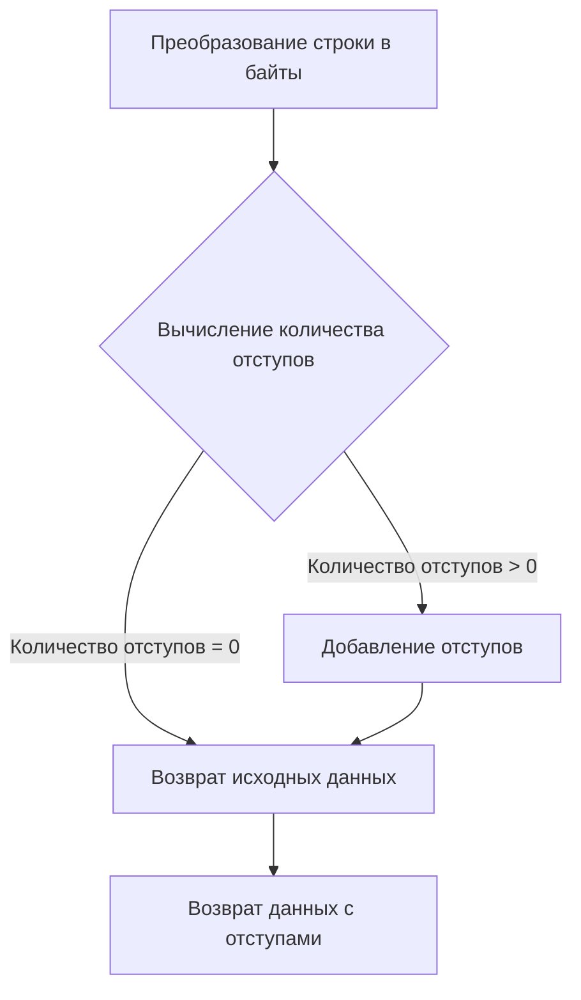
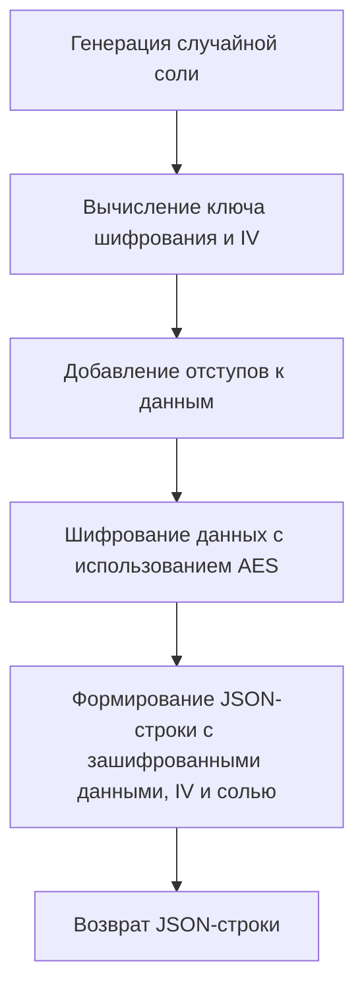

# Модуль для шифрования и дешифрования данных

## Обзор

Модуль `crypt.py` предоставляет функции для шифрования и дешифрования данных с использованием алгоритма AES (Advanced Encryption Standard). Он включает функции для добавления отступов (padding), шифрования, удаления отступов и дешифрования данных.
Модуль предназначен для обеспечения безопасности данных при их передаче или хранении.

## Подробнее

Этот модуль содержит функции для шифрования и дешифрования данных с использованием AES. Шифрование включает в себя генерацию соли, вычисление ключа и вектора инициализации (IV) на основе ключа и соли, а также добавление отступов к данным перед шифрованием. Дешифрование выполняет обратные операции, включая удаление отступов.
В проекте `hypotez` этот модуль может быть использован для защиты конфиденциальной информации, такой как API ключи или личные данные пользователей.

## Функции

### `pad`

```python
def pad(data: str) -> bytes:
    """
    Добавляет отступы к строке данных для соответствия требованиям блочного шифра AES.

    Args:
        data (str): Строка, к которой необходимо добавить отступы.

    Returns:
        bytes: Данные с добавленными отступами в виде байтовой строки.

    Как работает функция:
    1. Преобразует входную строку `data` в байты.
    2. Вычисляет необходимое количество байтов для дополнения, чтобы длина данных стала кратна 16 (размер блока AES).
    3. Добавляет байты дополнения, каждый из которых имеет значение, равное количеству байтов дополнения.

    Примеры:
        >>> pad("example")
        b'example\\t\\t\\t\\t\\t\\t\\t\\t\\t'
        >>> pad("example1234567")
        b'example1234567\\x01'
    """
```

**Как работает функция**:



### `encrypt`

```python
def encrypt(data: str, key: str) -> str:
    """
    Шифрует данные с использованием алгоритма AES.

    Args:
        data (str): Данные для шифрования.
        key (str): Ключ шифрования.

    Returns:
        str: JSON-строка, содержащая зашифрованные данные, вектор инициализации (IV) и соль.

    Raises:
        Exception: Если возникает ошибка во время шифрования.

    Как работает функция:
    1. Генерирует случайную соль.
    2. Вычисляет ключ шифрования и IV на основе предоставленного ключа и соли.
    3. Добавляет отступы к данным перед шифрованием.
    4. Шифрует данные с использованием AES в режиме CBC.
    5. Формирует JSON-строку, содержащую зашифрованные данные, IV и соль.
    """
```

**Как работает функция**:



### `unpad`

```python
def unpad(data: bytes) -> bytes:
    """
    Удаляет отступы из байтовой строки данных.

    Args:
        data (bytes): Данные с отступами.

    Returns:
        bytes: Данные без отступов.

    Как работает функция:
    1. Извлекает значение последнего байта, которое представляет количество байтов отступа.
    2. Удаляет байты отступа на основе извлеченного значения.

    Примеры:
        >>> unpad(b'example\\t\\t\\t\\t\\t\\t\\t\\t\\t')
        b'example'
        >>> unpad(b'example1234567\\x01')
        b'example1234567'
    """
```

**Как работает функция**:

```mermaid
graph TD
    A[Извлечение значения последнего байта (количество отступов)] --> B[Удаление байтов отступа];
    B --> C[Возврат данных без отступов];
```

### `decrypt`

```python
def decrypt(data: str, key: str) -> str:
    """
    Дешифрует данные, зашифрованные с использованием AES.

    Args:
        data (str): JSON-строка, содержащая зашифрованные данные, вектор инициализации (IV) и соль.
        key (str): Ключ шифрования.

    Returns:
        str: Дешифрованные данные.

    Raises:
        Exception: Если возникает ошибка во время дешифрования.

    Как работает функция:
    1. Извлекает зашифрованные данные, IV и соль из JSON-строки.
    2. Вычисляет ключ шифрования на основе предоставленного ключа и соли.
    3. Дешифрует данные с использованием AES в режиме CBC.
    4. Удаляет отступы из дешифрованных данных.
    5. Возвращает дешифрованные данные.
    """
```

**Как работает функция**:

```mermaid
graph TD
    A[Извлечение зашифрованных данных, IV и соли из JSON-строки] --> B[Вычисление ключа шифрования];
    B --> C[Дешифрование данных с использованием AES];
    C --> D[Удаление отступов из дешифрованных данных];
    D --> E[Возврат дешифрованных данных];