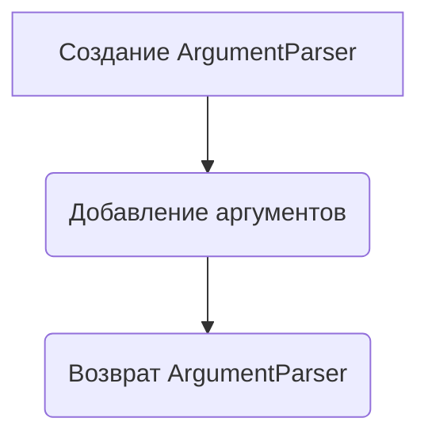
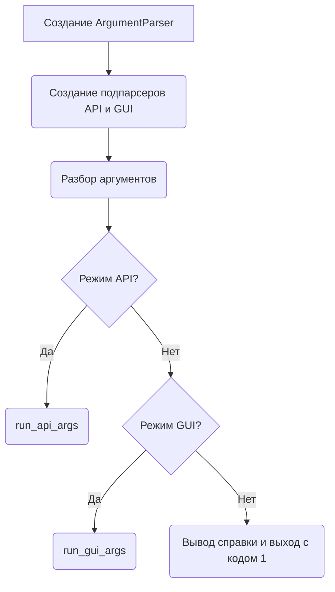
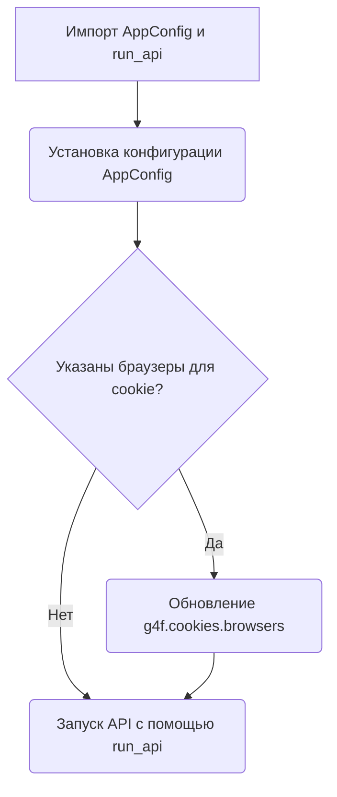

# Модуль для запуска gpt4free через CLI

## Обзор

Модуль `cli.py` предоставляет интерфейс командной строки (CLI) для запуска gpt4free в различных режимах, таких как API и GUI. Он использует библиотеку `argparse` для обработки аргументов командной строки и запуска соответствующих функций.

## Подробней

Этот модуль позволяет пользователям запускать API или графический интерфейс gpt4free с различными параметрами конфигурации. Он определяет аргументы командной строки для настройки поведения API, такие как привязка к определенному адресу, установка порта, включение режима отладки и т.д. Он также позволяет пользователям указывать параметры для GUI.

## Функции

### `get_api_parser`

```python
def get_api_parser() -> ArgumentParser:
    """
    Создает парсер аргументов командной строки для API.

    Args:
        Нет

    Returns:
        ArgumentParser: Парсер аргументов командной строки.

    Raises:
        Нет
    """
```

**Назначение**:
Функция `get_api_parser` создает и настраивает парсер аргументов командной строки для режима API. Этот парсер определяет, какие аргументы командной строки могут быть использованы для настройки API gpt4free.

**Как работает функция**:

1.  Создает экземпляр `ArgumentParser` с описанием "Run the API and GUI".
2.  Добавляет различные аргументы, такие как `--bind`, `--port`, `--debug`, `--gui`, `--model`, `--provider`, `--image-provider`, `--proxy`, `--workers`, `--disable-colors`, `--ignore-cookie-files`, `--g4f-api-key`, `--ignored-providers`, `--cookie-browsers`, `--reload`, `--ssl-keyfile`, `--ssl-certfile`, `--log-config`.
3.  Возвращает настроенный парсер аргументов.



**Примеры**:

```python
parser = get_api_parser()
args = parser.parse_args(['--port', '8080', '--debug'])
print(args.port)  # Вывод: 8080
print(args.debug) # Вывод: True
```

### `main`

```python
def main():
    """
    Главная функция для запуска gpt4free.

    Args:
        Нет

    Returns:
        None

    Raises:
        SystemExit: Если не указан режим запуска.
    """
```

**Назначение**:
Функция `main` является основной точкой входа для CLI gpt4free. Она отвечает за разбор аргументов командной строки и запуск соответствующего режима (API или GUI).

**Как работает функция**:

1.  Создает основной парсер аргументов с описанием "Run gpt4free".
2.  Создает подпарсеры для режимов "api" и "gui", используя `get_api_parser` и `gui_parser` соответственно.
3.  Разбирает аргументы командной строки с помощью `parser.parse_args()`.
4.  В зависимости от выбранного режима запускает `run_api_args` для API или `run_gui_args` для GUI.
5.  Если режим не указан, выводит справку и завершает программу с кодом ошибки 1.



**Примеры**:

```python
# Пример запуска API с указанием порта
# python cli.py api --port 8080
```

### `run_api_args`

```python
def run_api_args(args):
    """
    Запускает API с заданными аргументами.

    Args:
        args: Аргументы командной строки.

    Returns:
        None

    Raises:
        Нет
    """
```

**Назначение**:
Функция `run_api_args` принимает аргументы командной строки, относящиеся к API, и запускает API gpt4free с этими настройками.

**Как работает функция**:

1.  Импортирует `AppConfig` и `run_api` из модуля `g4f.api`.
2.  Устанавливает конфигурацию приложения с помощью `AppConfig.set_config`, передавая аргументы, такие как `ignore_cookie_files`, `ignored_providers`, `g4f_api_key`, `provider`, `image_provider`, `proxy`, `model`, `gui`, `demo`.
3.  Если указаны браузеры для получения cookie, обновляет список браузеров в `g4f.cookies.browsers`.
4.  Запускает API с помощью `run_api`, передавая аргументы, такие как `bind`, `port`, `debug`, `workers`, `use_colors`, `reload`, `ssl_keyfile`, `ssl_certfile`, `log_config`.



**Примеры**:

```python
# Пример запуска API с указанием порта и включением отладки
# python cli.py api --port 8080 --debug