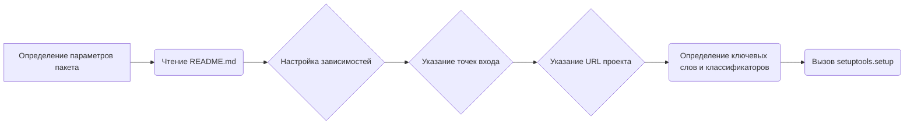

# Модуль установки g4f

## Обзор

Этот модуль отвечает за установку пакета `g4f`, который предоставляет различные коллекции мощных языковых моделей. Он использует `setuptools` для управления процессом установки, определения зависимостей и включения дополнительных компонентов.

## Подробнее

Модуль `setup.py` является стандартным файлом для пакетов Python, предназначенных для распространения. Он содержит метаданные о пакете, такие как имя, версия, автор, описание и зависимости. Этот файл использует `setuptools` для упрощения процесса установки и управления зависимостями.

Функциональность данного модуля заключается в следующем:

1.  Чтение файла `README.md` для получения длинного описания пакета.
2.  Определение необходимых и дополнительных зависимостей пакета.
3.  Настройка пакета с использованием `setuptools.setup`, включая метаданные, зависимости и точки входа.

## Функции

### `setup`

```python
setup(
    name='g4f',
    version=os.environ.get("G4F_VERSION"),
    author='Tekky',
    author_email='<support@g4f.ai>',
    description=DESCRIPTION,
    long_description_content_type='text/markdown',
    long_description=long_description,
    packages=find_packages(),
    package_data={
        'g4f': ['g4f/interference/*', 'g4f/gui/client/*', 'g4f/gui/server/*', 'g4f/Provider/npm/*', 'g4f/local/models/*']
    },
    include_package_data=True,
    install_requires=INSTALL_REQUIRE,
    extras_require=EXTRA_REQUIRE,
    entry_points={
        'console_scripts': ['g4f=g4f.cli:main'],
    },
    url='https://github.com/xtekky/gpt4free',  # Link to your GitHub repository
    project_urls={
        'Source Code': 'https://github.com/xtekky/gpt4free',  # GitHub link
        'Bug Tracker': 'https://github.com/xtekky/gpt4free/issues',  # Link to issue tracker
    },
    keywords=[
        'python',
        'chatbot',
        'reverse-engineering',
        'openai',
        'chatbots',
        'gpt',
        'language-model',
        'gpt-3',
        'gpt3',
        'openai-api',
        'gpt-4',
        'gpt4',
        'chatgpt',
        'chatgpt-api',
        'openai-chatgpt',
        'chatgpt-free',
        'chatgpt-4',
        'chatgpt4',
        'chatgpt4-api',
        'free',
        'free-gpt',
        'gpt4free',
        'g4f',
    ],
    classifiers=[
        'Development Status :: 2 - Pre-Alpha',
        'Intended Audience :: Developers',
        'Programming Language :: Python :: 3',
        'Operating System :: Unix',
        'Operating System :: MacOS :: MacOS X',
        'Operating System :: Microsoft :: Windows',
    ],
)
```

**Назначение**: Настраивает и запускает процесс установки пакета `g4f`.

**Параметры**:

-   `name` (str): Имя пакета (`g4f`).
-   `version` (str): Версия пакета, полученная из переменной окружения `G4F_VERSION`.
-   `author` (str): Автор пакета (`Tekky`).
-   `author_email` (str): Email автора пакета (`<support@g4f.ai>`).
-   `description` (str): Краткое описание пакета (DESCRIPTION).
-   `long_description_content_type` (str): Тип контента длинного описания (`text/markdown`).
-   `long_description` (str): Длинное описание пакета, прочитанное из файла `README.md`.
-   `packages` (list): Список пакетов, найденных с помощью `find_packages()`.
-   `package_data` (dict): Данные пакета, включаемые в установку.
-   `include_package_data` (bool): Флаг, указывающий, что нужно включать данные пакета.
-   `install_requires` (list): Список необходимых зависимостей.
-   `extras_require` (dict): Словарь дополнительных зависимостей, разделенных по категориям.
-   `entry_points` (dict): Точки входа для консольных скриптов.
-   `url` (str): URL репозитория GitHub.
-   `project_urls` (dict): Словарь URL-ов проекта, таких как репозиторий и трекер ошибок.
-   `keywords` (list): Список ключевых слов, связанных с пакетом.
-   `classifiers` (list): Список классификаторов, описывающих пакет.

**Возвращает**:
-   Ничего.

**Вызывает исключения**:
-   Не вызывает.

**Как работает функция**:

1.  Определяются основные параметры пакета, такие как имя, версия, автор и описание.
2.  Читается содержимое файла `README.md`, которое будет использовано в качестве длинного описания пакета.
3.  Настраиваются зависимости пакета, включая обязательные и дополнительные.
4.  Указываются точки входа для консольных скриптов, что позволяет запускать `g4f` из командной строки.
5.  Указываются URL-ы проекта, такие как репозиторий и трекер ошибок.
6.  Определяются ключевые слова и классификаторы, которые помогают пользователям находить пакет.



**Примеры**:

```python
# Пример вызова setup с минимальными параметрами
setup(
    name='g4f',
    version='1.0.0',
    packages=find_packages(),
)
```

```python
# Пример вызова setup с указанием зависимостей и точек входа
setup(
    name='g4f',
    version='1.0.0',
    packages=find_packages(),
    install_requires=['requests', 'aiohttp'],
    entry_points={
        'console_scripts': ['g4f=g4f.cli:main'],
    },
)