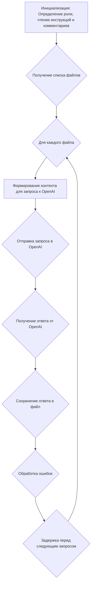
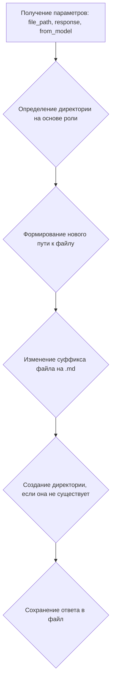

# Модуль для экспериментов с OpenAI

## Обзор

Модуль предназначен для экспериментов с моделью искусственного интеллекта OpenAI. Он обрабатывает исходный код или документацию, отправляет их в модель для анализа и получения ответов.

## Подробнее

Этот модуль является частью проекта `hypotez` и используется для взаимодействия с моделью OpenAI GPT-4 для выполнения задач, таких как создание документации. Он принимает исходный код или документацию, отправляет их в модель OpenAI для анализа, а затем сохраняет ответ модели в файл.

## Классы

В данном модуле классы отсутствуют

## Функции

### `main`

```python
def main() -> None:
    """ Main function to process files and interact with the model.

    This function reads a comment file, iterates over specified files in the source directory,
    and sends the file content to a model for analysis. It then processes the model\'s response.
    """
```

**Назначение**: Основная функция для обработки файлов и взаимодействия с моделью.

**Параметры**:
- Отсутствуют.

**Возвращает**:
- `None`

**Вызывает исключения**:
- `Exception`: Если происходит ошибка во время взаимодействия с моделью или сохранения ответа.

**Как работает функция**:

1.  **Инициализация**:
    *   Устанавливает глобальную переменную `role` (роль) в `doc_writer`, если она не была установлена ранее.
    *   Определяет имена файлов для комментариев и системных инструкций в зависимости от установленной роли.
        Например, для роли `doc_writer` используются файлы `doc_writer.md` и `create_documentation.md`.
    *   Читает содержимое файлов с комментариями и системными инструкциями, используя функцию `read_text_file`.
        Эти файлы содержат инструкции для модели о том, как обрабатывать входные данные.
    *   Инициализирует модель OpenAI с использованием прочитанных системных инструкций, имени модели и идентификатора ассистента.

2.  **Обработка файлов**:
    *   Итерируется по файлам в исходной директории, используя функцию `yield_files_content`.
        Эта функция возвращает путь к файлу и его содержимое.
    *   Для каждого файла формирует входной контент для модели, объединяя комментарий для модели, расположение файла и содержимое файла.

3.  **Взаимодействие с моделью и сохранение ответа**:
    *   Отправляет сформированный контент в модель OpenAI с использованием метода `ask`.
        Получает ответ от модели.
    *   Сохраняет ответ модели в файл с расширением `.md`, используя функцию `save_response`.
        Путь к файлу для сохранения формируется на основе роли и исходного пути файла.

4.  **Обработка ошибок и задержка**:
    *   В случае возникновения исключения во время взаимодействия с моделью или сохранения ответа, логирует ошибку с использованием `logger.error`.
    *   Делает паузу в 20 секунд, чтобы избежать ограничений по частоте запросов к API.



**Примеры**:

```python
main()
```

### `save_response`

```python
def save_response(file_path: Path, response: str, from_model: str) -> None:
    """ Save the model's response to a markdown file with updated path based on role.

    Args:
        file_path (Path): The original file path being processed.
        response (str): The response from the model to be saved.
    """
```

**Назначение**: Сохраняет ответ модели в файл Markdown с обновленным путем на основе роли.

**Параметры**:
-   `file_path` (`Path`): Исходный путь к обрабатываемому файлу.
-   `response` (`str`): Ответ от модели, который необходимо сохранить.
-   `from_model` (`str`): Указывает, от какой модели получен ответ (например, "openai").

**Возвращает**:
-   `None`

**Как работает функция**:

1.  **Определение директории на основе роли**:
    *   Определяет директорию для сохранения файла на основе текущей роли (`role`).
    *   Если роль не найдена в словаре `role_directories`, функция логирует ошибку и завершается.

2.  **Формирование нового пути к файлу**:
    *   Создает новый путь к файлу, заменяя часть пути `'src'` на соответствующую директорию роли.

3.  **Сохранение ответа**:
    *   Изменяет суффикс файла на `.md`.
    *   Создает директорию для сохранения файла, если она не существует.
    *   Сохраняет ответ модели в новый файл с использованием кодировки UTF-8.



**Примеры**:

```python
from pathlib import Path
file_path = Path('src/example.py')
response = '# Example response'
save_response(file_path, response, 'openai')
```

### `yield_files_content`

```python
def yield_files_content(
    src_path: Path, patterns: list[str]
) -> Iterator[tuple[Path, str]]:
    """ Yield file content based on patterns from the source directory, excluding certain patterns and directories.

    Args:
        src_path (Path): The base directory to search for files.
        patterns (list[str]): List of file patterns to include (e.g., [\'*.py\', \'*.txt\']).

    Yields:
        Iterator[tuple[Path, str]]: A tuple of file path and its content as a string.
    """
```

**Назначение**: Генерирует содержимое файлов на основе заданных шаблонов из исходного каталога, исключая определенные шаблоны и каталоги.

**Параметры**:
-   `src_path` (`Path`): Базовый каталог для поиска файлов.
-   `patterns` (`list[str]`): Список шаблонов файлов для включения (например, `['*.py', '*.txt']`).

**Возвращает**:
-   `Iterator[tuple[Path, str]]`: Итератор, возвращающий кортеж из пути к файлу и его содержимого в виде строки.

**Как работает функция**:

1.  **Определение исключаемых файлов и директорий**:
    *   Определяет регулярные выражения для исключаемых файлов и директорий.
        *   Исключаются файлы и директории, содержащие круглые скобки.
        *   Исключаются файлы или директории, начинающиеся с трех и более подчеркиваний.
    *   Определяет список служебных директорий, которые необходимо исключить (`.ipynb_checkpoints`, `_experiments`, `__pycache__`, `.git`, `.venv`).

2.  **Итерация по файлам**:
    *   Итерируется по файлам, соответствующим заданным шаблонам, используя метод `rglob` из библиотеки `pathlib`.
    *   Для каждого файла проверяет, находится ли он в исключаемой директории или соответствует ли исключаемому шаблону.
    *   Если файл не исключен, читает его содержимое и возвращает путь к файлу и его содержимое в виде кортежа.

```mermaid
graph TD
    A[Получение параметров: src_path, patterns] --> B{Определение исключаемых файлов и директорий};
    B --> C{Для каждого шаблона в patterns};
    C --> D{Для каждого файла, соответствующего шаблону};
    D --> E{Проверка на исключение (директории и шаблоны)};
    E -- Да --> C;
    E -- Нет --> F{Чтение содержимого файла};
    F --> G{Возврат пути к файлу и содержимого};
```

**Примеры**:

```python
from pathlib import Path
src_path = Path('.')
patterns = ['*.py', '*.md']
for file_path, content in yield_files_content(src_path, patterns):
    print(f'File: {file_path}')