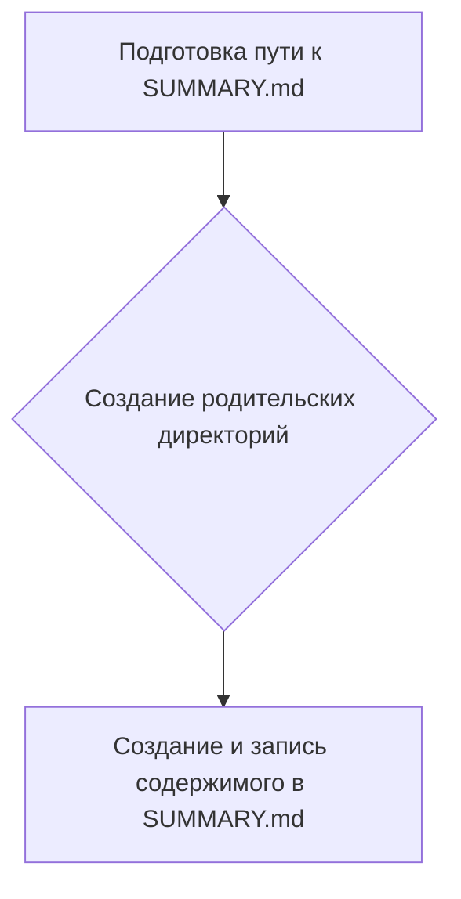
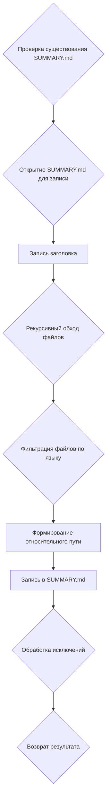

# Модуль для создания SUMMARY.md
==================================

Модуль `src.endpoints.hypo69.code_assistant.make_summary` предназначен для создания файла `SUMMARY.md`, который используется для компиляции документации с помощью `mdbook`.

## Обзор

Этот модуль предоставляет функциональность для автоматического создания файла `SUMMARY.md`, который содержит структуру документации на основе Markdown-файлов, расположенных в указанной директории. Он также поддерживает фильтрацию файлов по языку (русский или английский).

## Подробнее

Модуль анализирует структуру каталогов с исходными Markdown-файлами и генерирует файл `SUMMARY.md`, который содержит ссылки на эти файлы. Этот файл необходим для `mdbook`, чтобы правильно скомпилировать документацию.

## Функции

### `make_summary`

```python
def make_summary(docs_dir: Path, lang: str = 'en') -> None:
    """
    Создает файл SUMMARY.md, рекурсивно обходя папку.

    Args:
        docs_dir (Path): Путь к исходной директории 'src'.
        lang (str): Язык фильтрации файлов. Возможные значения: 'ru' или 'en'.
    """
    ...
```

**Назначение**: Создает файл `SUMMARY.md` в указанной директории, рекурсивно обходя все поддиректории.

**Параметры**:
- `docs_dir` (Path): Путь к исходной директории 'src', в которой расположены Markdown-файлы.
- `lang` (str, optional): Язык фильтрации файлов. Может принимать значения 'ru' (для русских файлов) или 'en' (для английских файлов). По умолчанию 'en'.

**Возвращает**:
- `None`: Функция ничего не возвращает.

**Как работает функция**:
1. Подготавливает путь к файлу `SUMMARY.md`, вызывая функцию `prepare_summary_path`.
2. Создает родительские директории для файла `SUMMARY.md`, если они не существуют.
3. Вызывает функцию `_make_summary` для фактического создания и записи содержимого в файл `SUMMARY.md`.



**Примеры**:

```python
from pathlib import Path

# Пример вызова функции make_summary
docs_dir = Path('./src')  # Укажите фактический путь к директории с документацией
make_summary(docs_dir, lang='ru')  # Создание summary на русском языке
make_summary(docs_dir, lang='en')  # Создание summary на английском языке
```

### `_make_summary`

```python
def _make_summary(src_dir: Path, summary_file: Path, lang: str = 'en') -> bool:
    """
    Рекурсивно обходит папку и создает файл SUMMARY.md с главами на основе .md файлов.

    Args:
        src_dir (Path): Путь к папке с исходниками .md.
        summary_file (Path): Путь для сохранения файла SUMMARY.md.
        lang (str): Язык фильтрации файлов. Возможные значения: 'ru' или 'en'.
    """
    ...
```

**Назначение**: Рекурсивно обходит указанную директорию и создает файл `SUMMARY.md`, содержащий ссылки на Markdown-файлы.

**Параметры**:
- `src_dir` (Path): Путь к папке с исходными Markdown-файлами.
- `summary_file` (Path): Путь к файлу `SUMMARY.md`, в который будет записано содержимое.
- `lang` (str, optional): Язык фильтрации файлов. Может принимать значения 'ru' или 'en'. По умолчанию 'en'.

**Возвращает**:
- `bool`: Возвращает `True` в случае успешного создания файла, `False` в случае ошибки.

**Как работает функция**:
1. Проверяет, существует ли файл `SUMMARY.md`, и если да, выводит сообщение о его перезаписи.
2. Открывает файл `SUMMARY.md` для записи в кодировке UTF-8.
3. Записывает заголовок `# Summary\n\n` в файл.
4. Рекурсивно обходит все Markdown-файлы в указанной директории.
5. Фильтрует файлы по языку, если указан параметр `lang`.
6. Формирует относительный путь к файлу и записывает его в файл `SUMMARY.md` в формате ссылки Markdown.
7. Возвращает `True` в случае успешного завершения или `False`, если произошла ошибка.



**Примеры**:

```python
from pathlib import Path

# Пример вызова функции _make_summary
src_dir = Path('./src')  # Укажите фактический путь к директории с документацией
summary_file = Path('./docs/SUMMARY.md')  # Укажите путь для сохранения SUMMARY.md
_make_summary(src_dir, summary_file, lang='ru')  # Создание summary на русском языке
_make_summary(src_dir, summary_file, lang='en')  # Создание summary на английском языке
```

### `prepare_summary_path`

```python
def prepare_summary_path(src_dir: Path, file_name: str = 'SUMMARY.md') -> Path:
    """
    Формирует путь к файлу, заменяя часть пути 'src' на 'docs' и добавляя имя файла.

    Args:
        src_dir (Path): Исходный путь с 'src'.
        file_name (str): Имя файла, который нужно создать. По умолчанию 'SUMMARY.md'.

    Returns:
        Path: Новый путь к файлу.
    """
    ...
```

**Назначение**: Формирует путь к файлу `SUMMARY.md`, заменяя часть пути 'src' на 'docs'.

**Параметры**:
- `src_dir` (Path): Исходный путь к директории 'src'.
- `file_name` (str, optional): Имя файла, который нужно создать. По умолчанию 'SUMMARY.md'.

**Возвращает**:
- `Path`: Новый путь к файлу `SUMMARY.md`.

**Как работает функция**:
1. Определяет новый путь к директории, заменяя 'src' на 'docs'.
2. Формирует полный путь к файлу `SUMMARY.md` в новой директории.
3. Возвращает новый путь.

```mermaid
graph TD
    A[Определение нового пути (замена 'src' на 'docs')] --> B[Формирование полного пути к SUMMARY.md]
    B --> C[Возврат нового пути]
```

**Примеры**:

```python
from pathlib import Path

# Пример вызова функции prepare_summary_path
src_dir = Path('./src')  # Укажите фактический путь к директории src
summary_file = prepare_summary_path(src_dir)
print(summary_file)  # Вывод: ./docs/SUMMARY.md