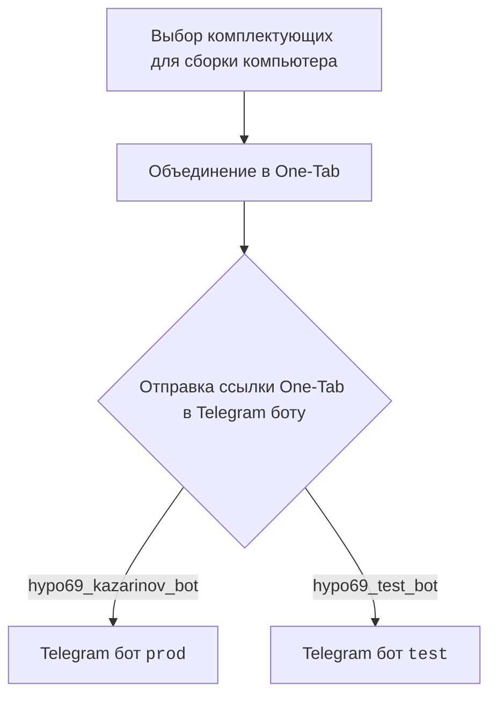
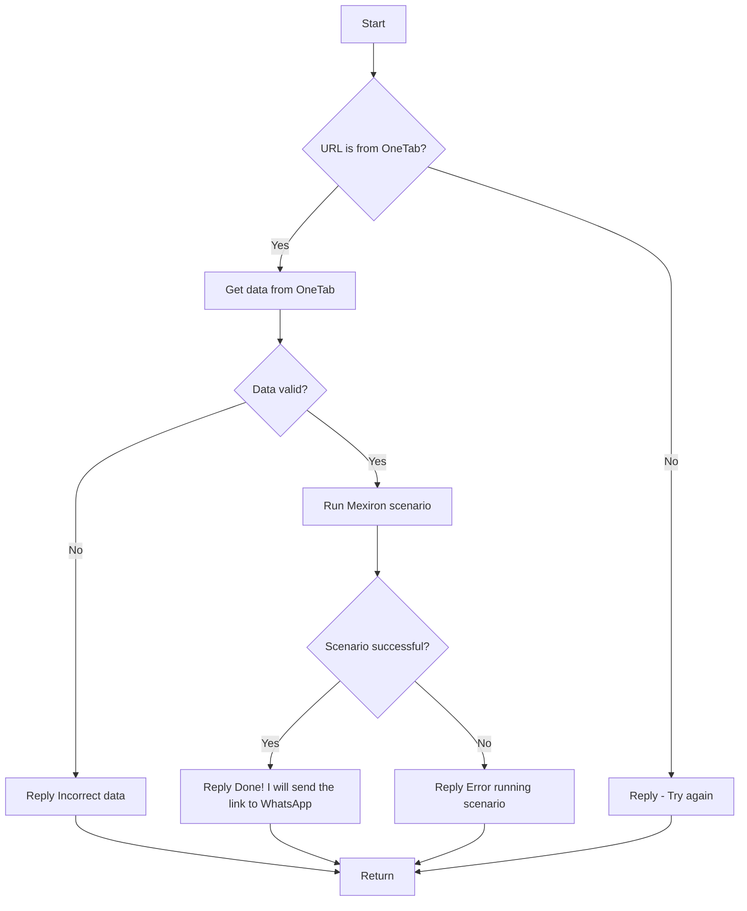

# Документация модуля src.endpoints.kazarinov

## Обзор

Документация содержит информацию о модуле `src.endpoints.kazarinov`, включая описание его функциональности, а также ссылки на другие ресурсы, связанные с проектом.

## Подробнее

Модуль, по всей видимости, связан с обработкой данных, полученных от Telegram-бота Kazarinov, и преобразованием их в формат, подходящий для дальнейшей обработки или отправки в WhatsApp. Включает в себя работу с URL от OneTab, проверку данных и запуск сценариев Mexiron.

## Схема работы

Представлены две схемы работы: клиентская и кодовая.

### Клиентская сторона (Kazarinov):

Схема описывает процесс выбора комплектующих для сборки компьютера, объединения их в One-Tab, и отправки ссылки на эту группу в Telegram-бот. Существуют два бота: `prod` и `test`.

### Кодовая сторона:

Схема описывает логику обработки URL, полученного от OneTab. Проверяется, является ли URL от OneTab, затем извлекаются данные, проверяется их валидность, запускается сценарий Mexiron и, в случае успеха, отправляется ссылка в WhatsApp. При возникновении ошибок отправляются соответствующие сообщения.

## Ссылки

*   [Kazarinov bot](https://github.com/hypo69/hypo/blob/master/src/endpoints/kazarinov/kazarinov_bot.md)
*   [Scenario Execution](https://github.com/hypo69/hypo/blob/master/src/endpoints/kazarinov/scenarios/README.MD)