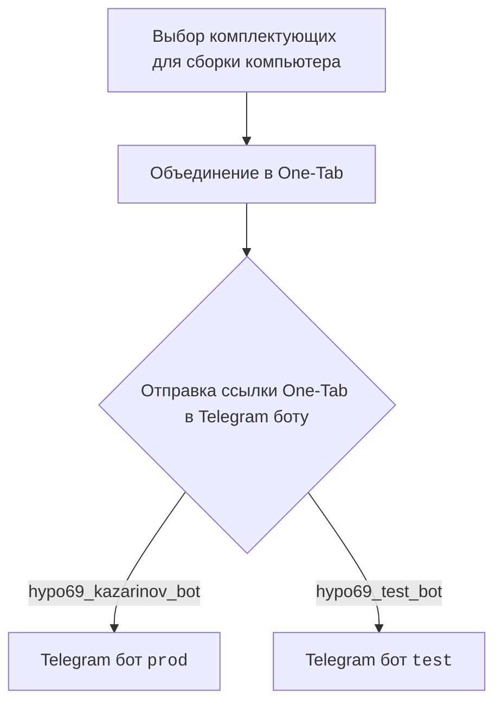
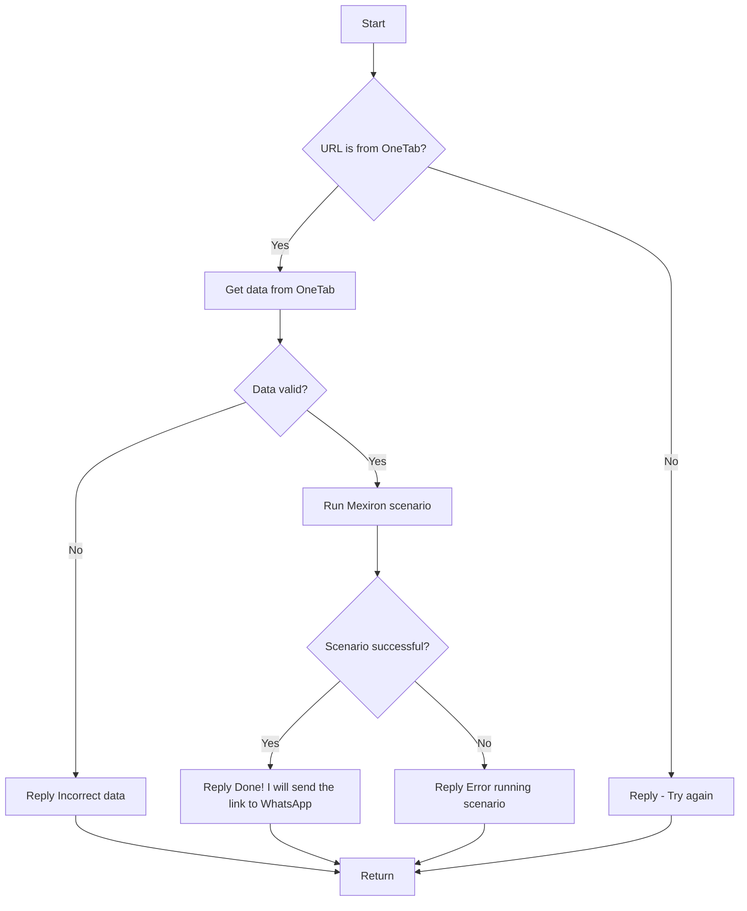

# Документация для модуля `src.endpoints.kazarinov`

## Обзор

Этот модуль предназначен для создания прайс-листа для проекта Казаринова. Он включает в себя взаимодействие с Telegram ботами (`KazarinovTelegramBot`, `BotHandler`) и сценарии обработки данных, полученных от пользователей.

## Подробней

Модуль предоставляет функциональность для обработки запросов пользователей, отправленных через Telegram ботов `prod` и `test`. Пользователь выбирает комплектующие для сборки компьютера, объединяет их в One-Tab, и отправляет ссылку боту. Бот, в свою очередь, обрабатывает данные из One-Tab, запускает сценарий `Mexiron` и отправляет результат в WhatsApp.

## Классы

В данном фрагменте кода классы не представлены. Описание касается общей структуры и логики работы модуля.

## Функции

В данном фрагменте кода функции не представлены. Описание касается общей структуры и логики работы модуля.

## Схема работы

### Клиентская сторона

### Код

- `kazarinov_bot.handle_message()` -> `kazarinov.scenarios.run_scenario()`:

## Далее

- [Казаринов бот](https://github.com/hypo69/hypo/blob/master/src/endpoints/kazarinov/kazarinov_bot.ru.md)
- [Исполнение сценария](https://github.com/hypo69/hypo/blob/master/src/endpoints/kazarinov/scenarios/readme.ru.md)