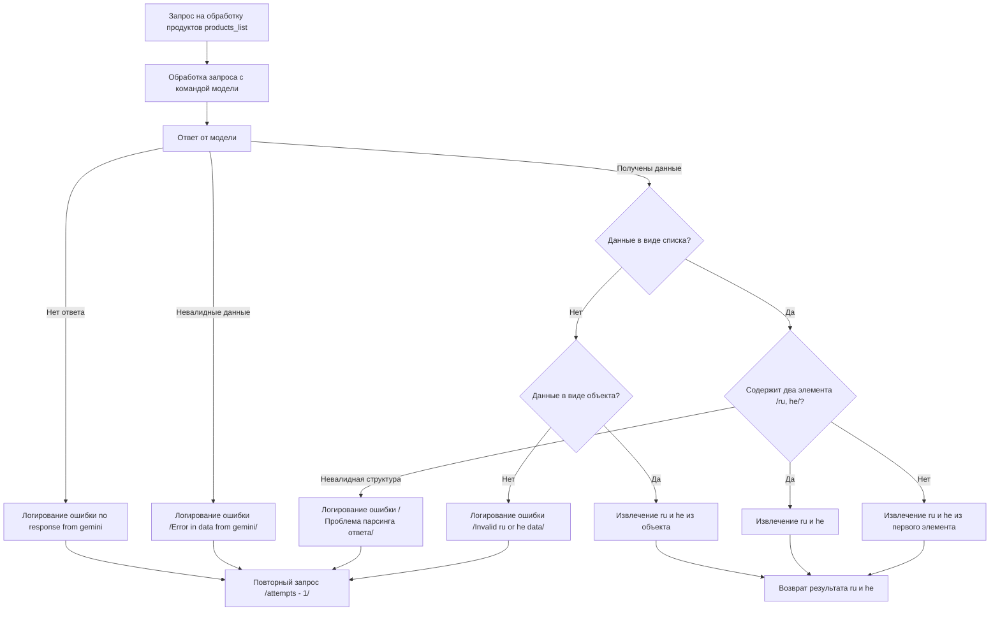

# Документация для разработчика

## Обзор

Этот Markdown-файл содержит описание блок-схемы, предназначенной для визуализации логики обработки продуктов `products_list` с использованием AI-модели, такой как Gemini. Блок-схема описывает процесс обработки запроса, получения ответа от модели, проверки данных на валидность и структуру, а также извлечение и возврат необходимых данных.

## Подробней

Данная блок-схема предоставляет визуальное представление процесса обработки запроса на основе AI-модели и последующей обработки полученных данных. Она включает проверку наличия ответа от модели, валидацию структуры данных и извлечение необходимой информации. Эта схема помогает понять, как происходит обработка входных данных, какие проверки выполняются, и какие ошибки могут возникнуть в процессе.
Она нужна для быстрого понимания логики работы нейронной сети. Позволяет упростить отладку и документирование.

## Блок-схема

### Описание блок-схемы

### Элементы блок-схемы:

#### A: Запрос на обработку продуктов `products_list`

**Назначение**: Инициация процесса обработки списка продуктов.

**Описание**: Начальный этап, где происходит запрос на обработку списка продуктов. Этот запрос может быть отправлен в AI-модель для дальнейшей обработки и анализа.

#### B: Обработка запроса с командой модели

**Назначение**: Передача запроса в AI-модель для обработки.

**Описание**: Запрос передается в AI-модель (например, Gemini) для выполнения необходимых операций. Это может включать анализ, классификацию или другие виды обработки данных.

#### C: Ответ от модели

**Назначение**: Получение ответа от AI-модели.

**Описание**: AI-модель возвращает результат обработки запроса. Этот ответ может быть в различных форматах, таких как список, объект или текстовое представление данных.

#### D: Логирование ошибки `no response from gemini`

**Назначение**: Регистрация ошибки в случае отсутствия ответа от AI-модели.

**Описание**: Если от AI-модели не получен ответ, регистрируется ошибка, указывающая на отсутствие ответа. Эта информация используется для отладки и повторных попыток.

#### E: Повторный запрос `/attempts - 1/`

**Назначение**: Повторная отправка запроса при возникновении ошибок.

**Описание**: В случае ошибки (например, отсутствие ответа или невалидные данные) выполняется повторный запрос с уменьшением счетчика попыток.

#### F: Логирование ошибки `/Error in data from gemini/`

**Назначение**: Регистрация ошибки при получении невалидных данных от AI-модели.

**Описание**: Если данные, полученные от AI-модели, не соответствуют ожидаемому формату или содержат ошибки, регистрируется соответствующая ошибка.

#### G: Данные в виде списка?

**Назначение**: Проверка формата данных, полученных от AI-модели.

**Описание**: Проверяется, представлен ли ответ от AI-модели в виде списка. В зависимости от результата проверки выбирается дальнейший путь обработки данных.

#### H: Содержит два элемента `/ru, he/?`

**Назначение**: Проверка структуры списка на наличие двух элементов (например, для русского и ивритского языков).

**Описание**: Если данные представлены в виде списка, проверяется, содержит ли он два элемента. Это важно для случаев, когда требуется обработка данных на двух языках.

#### I: Извлечение `ru` и `he`

**Назначение**: Извлечение данных для русского и ивритского языков из списка.

**Описание**: Если список содержит два элемента, извлекаются данные, соответствующие русскому и ивритскому языкам.

#### J: Извлечение `ru` и `he` из первого элемента

**Назначение**: Извлечение данных для русского и ивритского языков из первого элемента списка.

**Описание**: В случае, когда список не содержит двух элементов, предпринимается попытка извлечения данных для русского и ивритского языков из первого элемента списка.

#### K: Логирование ошибки `/Проблема парсинга ответа/`

**Назначение**: Регистрация ошибки при возникновении проблем с парсингом ответа от AI-модели.

**Описание**: Если структура ответа от AI-модели не соответствует ожидаемой, регистрируется ошибка, указывающая на проблему парсинга данных.

#### L: Данные в виде объекта?

**Назначение**: Проверка, представлены ли данные в виде объекта (например, словаря).

**Описание**: Проверяется, представлен ли ответ от AI-модели в виде объекта (например, словаря). В зависимости от результата проверки выбирается дальнейший путь обработки данных.

#### M: Извлечение `ru` и `he` из объекта

**Назначение**: Извлечение данных для русского и ивритского языков из объекта.

**Описание**: Если данные представлены в виде объекта, извлекаются данные, соответствующие русскому и ивритскому языкам.

#### N: Логирование ошибки `/Invalid ru or he data/`

**Назначение**: Регистрация ошибки при обнаружении невалидных данных для русского или ивритского языков.

**Описание**: Если данные для русского или ивритского языков невалидны или отсутствуют, регистрируется соответствующая ошибка.

#### O: Возврат результата `ru` и `he`

**Назначение**: Возврат извлеченных данных для русского и ивритского языков.

**Описание**: После успешного извлечения данных для русского и ивритского языков они возвращаются в качестве результата обработки.