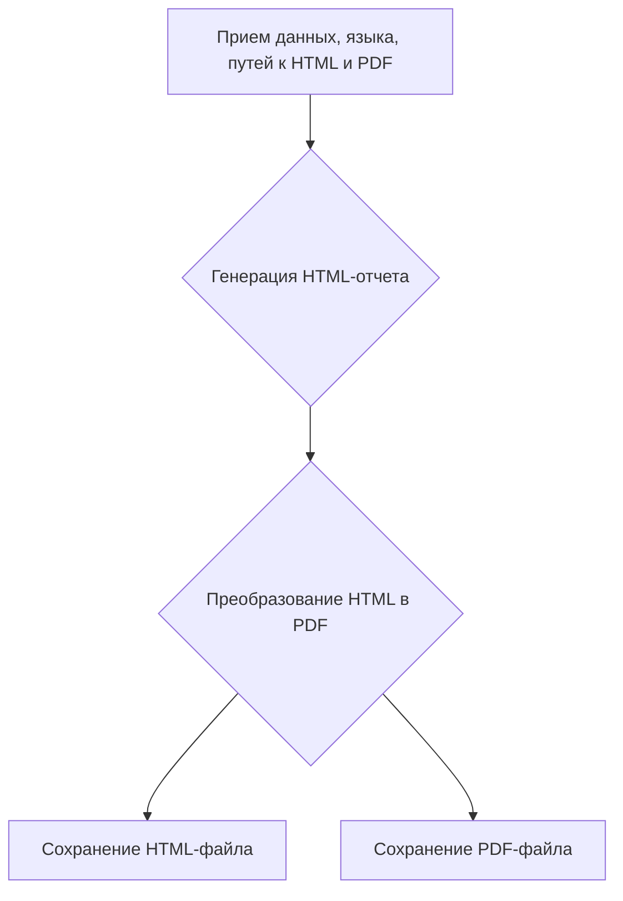

# Модуль для проверки генерации прайслиста

## Обзор

Модуль `create_report.py` предназначен для создания отчетов на основе данных, полученных от различных поставщиков. Он включает в себя функциональность извлечения, разбора и обработки данных о продуктах, подготовки данных, обработки с использованием искусственного интеллекта и интеграции с Facebook для публикации продуктов.

## Подробней

Данный модуль является частью экспериментов по генерации прайс-листов и отчетов. Он использует класс `ReportGenerator` для создания HTML и PDF отчетов на основе данных, полученных от модели. Модуль также определяет пути к файлам для сохранения сгенерированных отчетов.

## Переменные модуля

- `report_generator`: Экземпляр класса `ReportGenerator`, используемый для создания отчетов.
- `html_file_he`: Объект `Path`, представляющий путь к HTML-файлу для отчета на иврите.
- `pdf_file_he`: Объект `Path`, представляющий путь к PDF-файлу для отчета на иврите.
- `html_file_ru`: Объект `Path`, представляющий путь к HTML-файлу для отчета на русском языке.
- `pdf_file_ru`: Объект `Path`, представляющий путь к PDF-файлу для отчета на русском языке.

## Функции

В данном модуле не определены функции. Он использует экземпляр класса `ReportGenerator` для создания отчетов.

## Классы

### `ReportGenerator`

Класс `ReportGenerator` используется для создания отчетов в формате HTML и PDF на основе предоставленных данных.

**Методы**:

- `create_report(data: dict, lang: str, html_file: Path, pdf_file: Path)`: Создает отчет на основе данных, языка и путей к файлам HTML и PDF.
   ```python
    def create_report(data: dict, lang: str, html_file: Path, pdf_file: Path):
        """Создает отчет на основе данных, языка и путей к файлам HTML и PDF.

        Args:
            data (dict): Данные для отчета.
            lang (str): Язык отчета.
            html_file (Path): Путь к HTML-файлу.
            pdf_file (Path): Путь к PDF-файлу.

        Returns:
            None

        Raises:
            Exception: В случае ошибки при создании отчета.
        """
    ...
   ```

**Как работает функция `create_report`**:

1.  Функция принимает данные, язык отчета, путь к HTML-файлу и путь к PDF-файлу в качестве аргументов.
2.  Использует данные для генерации HTML-отчета.
3.  Преобразует HTML-отчет в PDF-файл.
4.  Сохраняет HTML и PDF файлы в указанные пути.



## Примеры

Пример использования модуля для создания отчетов на иврите и русском языках:

```python
from pathlib import Path
from src.endpoints.kazarinov.pricelist_generator import ReportGenerator
from src.endpoints.kazarinov.scenarios._experiments.ask_model import response_he_dict, response_ru_dict, test_directory

report_generator = ReportGenerator()
html_file_he: Path = test_directory / 'he.html'
pdf_file_he: Path = test_directory / 'he.pdf'
html_file_ru: Path = test_directory / 'ru.html'
pdf_file_ru: Path = test_directory / 'ru.pdf'

report_generator.create_report(response_he_dict['he'], 'he', html_file_he, pdf_file_he)
report_generator.create_report(response_ru_dict['ru'], 'ru', html_file_ru, pdf_file_ru)