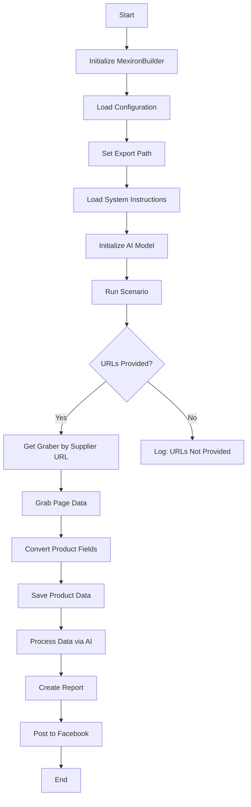

# Модуль `scenario`

## Обзор

Этот скрипт является частью директории `hypotez/src/endpoints/kazarinov/scenarios` и предназначен для автоматизации процесса создания "мехирона" для Сергея Казаринова. Скрипт извлекает, анализирует и обрабатывает данные о продуктах от различных поставщиков, подготавливает данные, обрабатывает их с помощью ИИ и интегрируется с Facebook для публикации продуктов.

## Подробней

Скрипт автоматизирует процесс создания "мехирона", начиная с извлечения данных о продуктах от различных поставщиков и заканчивая их публикацией на Facebook. Он использует Google Generative AI для обработки данных и генерирует отчеты в форматах HTML и PDF. Скрипт разработан для упрощения и ускорения процесса подготовки и публикации данных о продуктах, а также для обеспечения гибкости и адаптивности при работе с различными источниками данных и платформами.

## Основные возможности

1.  **Извлечение и анализ данных**: Извлекает и анализирует данные о продуктах от различных поставщиков.
2.  **Обработка данных ИИ**: Обрабатывает извлеченные данные с использованием модели Google Generative AI.
3.  **Хранение данных**: Сохраняет обработанные данные в файлы.
4.  **Генерация отчетов**: Генерирует HTML и PDF отчеты на основе обработанных данных.
5.  **Публикация в Facebook**: Публикует обработанные данные в Facebook.

## Блок-схема модуля



### Легенда

1.  **Start**: Начало выполнения скрипта.
2.  **InitMexironBuilder**: Инициализация класса `MexironBuilder`.
3.  **LoadConfig**: Загрузка конфигурации из JSON файла.
4.  **SetExportPath**: Установка пути для экспорта данных.
5.  **LoadSystemInstruction**: Загрузка системных инструкций для AI модели.
6.  **InitModel**: Инициализация модели Google Generative AI.
7.  **RunScenario**: Выполнение основного сценария.
8.  **CheckURLs**: Проверка, предоставлены ли URL для анализа.
9.  **GetGraber**: Получение соответствующего грабера для URL поставщика.
10. **GrabPage**: Извлечение данных страницы с использованием грабера.
11. **ConvertFields**: Преобразование полей продукта в словарь.
12. **SaveData**: Сохранение данных продукта в файл.
13. **ProcessAI**: Обработка данных продукта через AI модель.
14. **CreateReport**: Создание HTML и PDF отчетов из обработанных данных.
15. **PostFacebook**: Публикация обработанных данных в Facebook.
16. **End**: Конец выполнения скрипта.

## Классы

### `MexironBuilder`

**Описание**: Класс `MexironBuilder` предназначен для автоматизации процесса создания "мехирона", включая извлечение, обработку и публикацию данных о продуктах.

**Принцип работы**:
Класс инициализируется с драйвером Selenium и опциональным именем для процесса "мехирон". Он загружает конфигурацию, устанавливает пути экспорта, инициализирует AI модель и выполняет сценарий обработки данных. Основные этапы включают извлечение данных с веб-страниц, их преобразование, обработку с использованием AI, сохранение и генерацию отчетов.

**Аттрибуты**:

*   `driver`: Экземпляр Selenium WebDriver.
*   `export_path` (str): Путь для экспорта данных.
*   `mexiron_name` (Optional[str]): Пользовательское имя для процесса "мехирон".
*   `price` (str): Цена для обработки.
*   `timestamp` (str): Временная метка для процесса.
*   `products_list` (List[dict]): Список обработанных данных о продуктах.
*   `model`: Модель Google Generative AI.
*   `config` (dict): Конфигурация, загруженная из JSON.

**Методы**:

*   `__init__(self, driver: Driver, mexiron_name: Optional[str] = None)`
    *   **Назначение**: Инициализирует класс `MexironBuilder` необходимыми компонентами.
    *   **Параметры**:
        *   `driver` (Driver): Экземпляр Selenium WebDriver.
        *   `mexiron_name` (Optional[str], optional): Пользовательское имя для процесса "мехирон". По умолчанию `None`.
*   `run_scenario(self, system_instruction: Optional[str] = None, price: Optional[str] = None, mexiron_name: Optional[str] = None, urls: Optional[str | List[str]] = None, bot = None) -> bool`
    *   **Назначение**: Выполняет сценарий: анализирует продукты, обрабатывает их через AI и сохраняет данные.
    *   **Параметры**:
        *   `system_instruction` (Optional[str], optional): Системные инструкции для AI модели. По умолчанию `None`.
        *   `price` (Optional[str], optional): Цена для обработки. По умолчанию `None`.
        *   `mexiron_name` (Optional[str], optional): Пользовательское имя для "мехирона". По умолчанию `None`.
        *   `urls` (Optional[str | List[str]], optional): URL-адреса страниц продуктов. По умолчанию `None`.
        *   `bot`:  Бот для взаимодействия.
    *   **Возвращает**:
        *   `bool`: `True`, если сценарий выполнен успешно, иначе `False`.
    *   **Как работает функция**:

        1.  **Проверка источника URL (IsOneTab)**: Определяется, является ли URL-адрес OneTab.

        2.  **Извлечение данных из OneTab (GetDataFromOneTab)**: Если URL-адрес OneTab, извлекаются данные. В противном случае возвращается сообщение "Попробуйте еще раз".

        3.  **Проверка валидности данных (IsDataValid)**: Проверяется, являются ли данные валидными.

        4.  **Запуск сценария Mexiron (RunMexironScenario)**: Если данные валидны, запускается основной сценарий Mexiron.

        5.  **Поиск грабера (IsGraberFound)**: Проверяется, найден ли грабер для URL.

        6.  **Запуск парсинга (StartParsing)**: Если грабер найден, начинается парсинг страницы.

        7.  **Преобразование полей продукта (ConvertProductFields)**: После успешного парсинга поля продукта преобразуются в нужный формат.

        8.  **Сохранение данных продукта (SaveProductData)**: Данные продукта сохраняются.

        9.  **AI-обработка (ProcessAIHe, ProcessAIRu)**: Данные обрабатываются с помощью AI для языков `he` (иврит) и `ru` (русский).

        10. **Сохранение в JSON (SaveHeJSON, SaveRuJSON)**: Результаты обработки сохраняются в JSON-формате для каждого языка.

        11. **Генерация отчетов (GenerateReports)**: Генерируются HTML и PDF отчеты для каждого языка.

        12. **Отправка PDF через Telegram (SendPDF)**: PDF-файлы отправляются через Telegram.

        13. **Завершение (ReturnTrue)**: Сценарий завершается возвратом `True`.

    *   **Блок-схема**:

        ```mermaid
        flowchart TD
        Start[Start] --> IsOneTab{URL is from OneTab?}
        IsOneTab -->|Yes| GetDataFromOneTab[Get data from OneTab]
        IsOneTab -->|No| ReplyTryAgain[Reply - Try again]
        GetDataFromOneTab --> IsDataValid{Data valid?}
        IsDataValid -->|No| ReplyIncorrectData[Reply Incorrect data]
        IsDataValid -->|Yes| RunMexironScenario[Run Mexiron scenario]
        RunMexironScenario --> IsGraberFound{Graber found?}
        IsGraberFound -->|Yes| StartParsing[Start parsing: <code>url</code>]
        IsGraberFound -->|No| LogNoGraber[Log: No graber for <code>url</code>]
        StartParsing --> IsParsingSuccessful{Parsing successful?}
        IsParsingSuccessful -->|Yes| ConvertProductFields[Convert product fields]
        IsParsingSuccessful -->|No| LogParsingFailed[Log: Failed to parse product fields]
        ConvertProductFields --> IsConversionSuccessful{Conversion successful?}
        IsConversionSuccessful -->|Yes| SaveProductData[Save product data]
        IsConversionSuccessful -->|No| LogConversionFailed[Log: Failed to convert product fields]
        SaveProductData --> IsDataSaved{Data saved?}
        IsDataSaved -->|Yes| AppendToProductsList[Append to products_list]
        IsDataSaved -->|No| LogDataNotSaved[Log: Data not saved]
        AppendToProductsList --> ProcessAIHe[AI processing lang = he]
        ProcessAIHe --> ProcessAIRu[AI processing lang = ru]
        ProcessAIRu --> SaveHeJSON{Save JSON for he?]
        SaveHeJSON -->|Yes| SaveRuJSON[Save JSON for ru]
        SaveHeJSON -->|No| LogHeJSONError[Log: Error saving he JSON]
        SaveRuJSON --> IsRuJSONSaved{Save JSON for ru?}
        IsRuJSONSaved -->|Yes| GenerateReports[Generate reports]
        IsRuJSONSaved -->|No| LogRuJSONError[Log: Error saving ru JSON]
        GenerateReports --> IsReportGenerationSuccessful{Report generation successful?}
        IsReportGenerationSuccessful -->|Yes| SendPDF[Send PDF via Telegram]
        IsReportGenerationSuccessful -->|No| LogPDFError[Log: Error creating PDF]
        SendPDF --> ReturnTrue[Return True]
        LogPDFError --> ReturnTrue[Return True]
        ReplyIncorrectData --> ReturnTrue[Return True]
        ReplyTryAgain --> ReturnTrue[Return True]
        LogNoGraber --> ReturnTrue[Return True]
        LogParsingFailed --> ReturnTrue[Return True]
        LogConversionFailed --> ReturnTrue[Return True]
        LogDataNotSaved --> ReturnTrue[Return True]
        LogHeJSONError --> ReturnTrue[Return True]
        LogRuJSONError --> ReturnTrue[Return True]
        ```

        **Условные обозначения**:

        1.  **Start**: Начало выполнения сценария.
        2.  **URL Source Check (IsOneTab)**:
            *   Если URL из OneTab, данные извлекаются оттуда.
            *   Если нет, пользователю отправляется сообщение "Попробуйте снова".
        3.  **Data Validity Check (IsDataValid)**:
            *   Если данные невалидны, пользователю отправляется сообщение "Некорректные данные".
            *   Если данные валидны, запускается сценарий Mexiron.
        4.  **Grabber Search (IsGraberFound)**:
            *   Если граббер найден, начинается парсинг страницы.
            *   Если граббер не найден, генерируется сообщение в логе, что для данного URL нет граббера.
        5.  **Page Parsing (StartParsing)**:
            *   Если парсинг успешен, данные конвертируются в нужный формат.
            *   Если парсинг не удался, регистрируется ошибка.
        6.  **Data Conversion (ConvertProductFields)**:
            *   Если конвертация успешна, данные сохраняются.
            *   Если конвертация не удалась, регистрируется ошибка.
        7.  **Data Saving (SaveProductData)**:
            *   Если данные сохранены, они добавляются в список продуктов.
            *   Если данные не сохранены, регистрируется ошибка.
        8.  **AI Processing (ProcessAIHe, ProcessAIRu)**:
            *   Данные обрабатываются с использованием AI для языков `he` (иврит) и `ru` (русский).
        9.  **JSON Saving (SaveHeJSON, SaveRuJSON)**:
            *   Результаты обработки сохраняются в JSON-формате для каждого языка.
            *   Если сохранение не удалось, регистрируется ошибка.
        10. **Report Generation (GenerateReports)**:
            *   Создаются HTML и PDF отчеты для каждого языка.
            *   Если генерация отчетов не удалась, регистрируется ошибка.
        11. **PDF Sending via Telegram (SendPDF)**:
            *   PDF-файлы отправляются через Telegram.
            *   Если отправка не удалась, регистрируется ошибка.
        12. **Completion (ReturnTrue)**:
            *   Сценарий завершается возвратом `True`.
    *   **Регистрация ошибок**: На каждом этапе, где могут возникнуть ошибки, включены узлы для регистрации ошибок (например, `LogNoGraber`, `LogParsingFailed`, `LogHeJSONError` и т. д.).
*   `get_graber_by_supplier_url(self, url: str)`
    *   **Назначение**: Возвращает соответствующий грабер для заданного URL-адреса поставщика.
    *   **Параметры**:
        *   `url` (str): URL-адрес страницы поставщика.
    *   **Возвращает**:
        *   Graber: Экземпляр грабера, если найден, иначе `None`.
*   `convert_product_fields(self, f: ProductFields) -> dict`
    *   **Назначение**: Преобразует поля продукта в словарь.
    *   **Параметры**:
        *   `f` (ProductFields): Объект, содержащий проанализированные данные продукта.
    *   **Возвращает**:
        *   `dict`: Отформатированный словарь данных продукта.
*   `save_product_data(self, product_data: dict)`
    *   **Назначение**: Сохраняет данные продукта в файл.
    *   **Параметры**:
        *   `product_data` (dict): Отформатированные данные продукта.
*   `process_ai(self, products_list: List[str], lang: str, attempts: int = 3) -> tuple | bool`
    *   **Назначение**: Обрабатывает список продуктов через AI-модель.
    *   **Параметры**:
        *   `products_list` (List[str]): Список словарей данных продукта в виде строк.
        *   `lang` (str): Язык обработки (`ru` или `he`).
        *   `attempts` (int, optional): Количество попыток повтора в случае неудачи. По умолчанию `3`.
    *   **Возвращает**:
        *   `tuple | bool`: Обработанный ответ в форматах `ru` и `he`.
*   `post_facebook(self, mexiron: SimpleNamespace) -> bool`
    *   **Назначение**: Выполняет сценарий публикации в Facebook.
    *   **Параметры**:
        *   `mexiron` (SimpleNamespace): Обработанные данные для публикации.
    *   **Возвращает**:
        *   `bool`: `True`, если публикация прошла успешно, иначе `False`.
*   `create_report(self, data: dict, html_file: Path, pdf_file: Path)`
    *   **Назначение**: Генерирует отчеты HTML и PDF на основе обработанных данных.
    *   **Параметры**:
        *   `data` (dict): Обработанные данные.
        *   `html_file` (Path): Путь для сохранения HTML-отчета.
        *   `pdf_file` (Path): Путь для сохранения PDF-отчета.

### Примеры

Для использования этого скрипта выполните следующие шаги:

1.  **Инициализация драйвера**: Создайте экземпляр класса `Driver`.
2.  **Инициализация MexironBuilder**: Создайте экземпляр класса `MexironBuilder` с драйвером.
3.  **Запуск сценария**: Вызовите метод `run_scenario` с необходимыми параметрами.

```python
from src.webdriver.driver import Driver
from src.endpoints.kazarinov.scenarios.scenario_pricelist import MexironBuilder

# Инициализация драйвера
driver = Driver(...)

# Инициализация MexironBuilder
mexiron_builder = MexironBuilder(driver)

# Запуск сценария
urls = ['https://example.com/product1', 'https://example.com/product2']
mexiron_builder.run_scenario(urls=urls)
```

### Зависимости

*   `selenium`: Для автоматизации веб-страниц.
*   `asyncio`: Для асинхронных операций.
*   `pathlib`: Для обработки путей к файлам.
*   `types`: Для создания простых пространств имен.
*   `typing`: Для аннотаций типов.
*   `src.ai.gemini`: Для обработки данных с помощью AI.
*   `src.suppliers.*.graber`: Для извлечения данных от различных поставщиков.
*   `src.endpoints.advertisement.facebook.scenarios`: Для публикации в Facebook.

### Обработка ошибок

Скрипт включает надежную обработку ошибок для обеспечения непрерывного выполнения, даже если некоторые элементы не найдены или есть проблемы с веб-страницей. Это особенно полезно для обработки динамических или нестабильных веб-страниц.

### Вклад

Вклад в этот скрипт приветствуется. Пожалуйста, убедитесь, что любые изменения хорошо документированы и включают соответствующие тесты.

### Лицензия

Этот скрипт распространяется под лицензией MIT. Подробности см. в файле `LICENSE`.