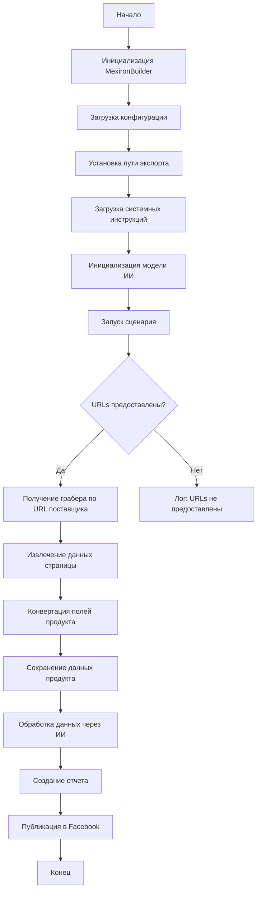
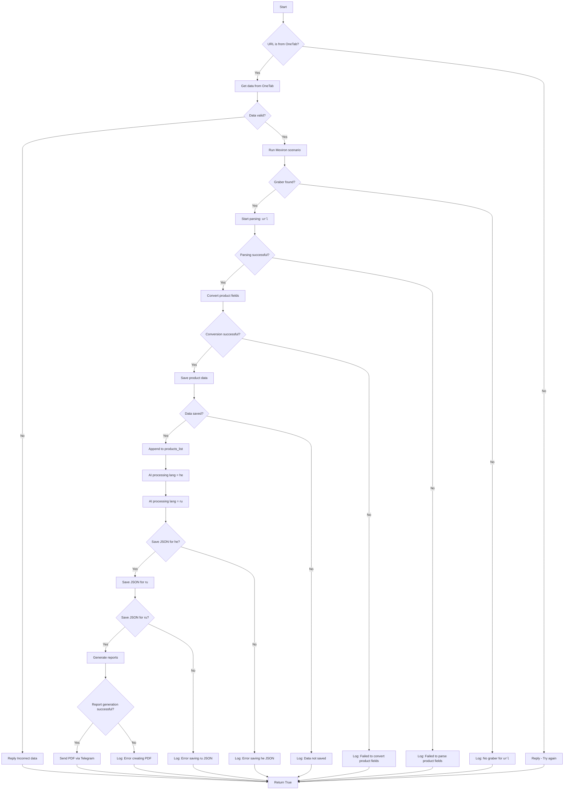

# Сценарий создания мехирона для Сергея Казаринова

## Обзор

Этот скрипт является частью директории `hypotez/src/endpoints/kazarinov/scenarios` и предназначен для автоматизации процесса создания "мехирона" для Сергея Казаринова. Скрипт извлекает, парсит и обрабатывает данные о продуктах от различных поставщиков, подготавливает данные, обрабатывает их через ИИ и интегрирует с Facebook для публикации продуктов.

## Подробней

Этот скрипт автоматизирует процесс создания "мехирона" для Сергея Казаринова. Он выполняет следующие основные шаги: извлечение данных о продуктах от различных поставщиков, их обработку с использованием моделей искусственного интеллекта, сохранение обработанных данных и генерацию отчетов, а также публикацию этих данных в Facebook.

## Основные возможности

1.  **Извлечение и парсинг данных**: Извлекает и парсит данные о продуктах от различных поставщиков.
2.  **Обработка данных через ИИ**: Обрабатывает извлеченные данные через модель Google Generative AI.
3.  **Хранение данных**: Сохраняет обработанные данные в файлы.
4.  **Генерация отчетов**: Генерирует HTML и PDF отчеты из обработанных данных.
5.  **Публикация в Facebook**: Публикует обработанные данные в Facebook.

## Блок-схема модуля



## Легенда

1.  **Start**: Начало выполнения скрипта.
2.  **InitMexironBuilder**: Инициализация класса `MexironBuilder`.
3.  **LoadConfig**: Загрузка конфигурации из JSON файла.
4.  **SetExportPath**: Установка пути для экспорта данных.
5.  **LoadSystemInstruction**: Загрузка системных инструкций для модели ИИ.
6.  **InitModel**: Инициализация модели Google Generative AI.
7.  **RunScenario**: Выполнение основного сценария.
8.  **CheckURLs**: Проверка, предоставлены ли URLs для парсинга.
9.  **GetGraber**: Получение соответствующего грабера для URL поставщика.
10. **GrabPage**: Извлечение данных страницы с помощью грабера.
11. **ConvertFields**: Конвертация полей продукта в словарь.
12. **SaveData**: Сохранение данных продукта в файл.
13. **ProcessAI**: Обработка данных продукта через модель ИИ.
14. **CreateReport**: Создание HTML и PDF отчетов из обработанных данных.
15. **PostFacebook**: Публикация обработанных данных в Facebook.
16. **End**: Конец выполнения скрипта.

-----------------------

## Классы

### `MexironBuilder`

**Описание**:
Класс `MexironBuilder` предназначен для автоматизации процесса создания "мехирона". Он включает в себя методы для загрузки конфигурации, инициализации модели ИИ, выполнения основного сценария, получения грабера для URL поставщика, конвертации полей продукта, сохранения данных о продукте, обработки данных через ИИ, публикации в Facebook и создания отчетов.

**Принцип работы**:

1.  Класс инициализируется с экземпляром Selenium WebDriver и пользовательским именем для процесса мехирона.
2.  Загружается конфигурация из JSON файла, которая содержит различные параметры и настройки.
3.  Выполняется основной сценарий, который включает в себя парсинг продуктов, их обработку через ИИ и сохранение данных.
4.  Для каждого URL поставщика получается соответствующий грабер, который используется для извлечения данных со страницы.
5.  Поля продукта конвертируются в словарь, который содержит форматированные данные о продукте.
6.  Данные о продукте сохраняются в файл.
7.  Список продуктов обрабатывается через модель ИИ для получения обработанных данных в форматах `ru` и `he`.
8.  Создаются HTML и PDF отчеты из обработанных данных.
9.  Данные публикуются в Facebook.

**Аттрибуты**:

*   `driver`: Экземпляр Selenium WebDriver.
*   `export_path`: Путь для экспорта данных.
*   `mexiron_name`: Пользовательское имя для процесса мехирона.
*   `price`: Цена для обработки.
*   `timestamp`: Метка времени для процесса.
*   `products_list`: Список обработанных данных о продуктах.
*   `model`: Модель Google Generative AI.
*   `config`: Конфигурация, загруженная из JSON.

**Методы**:

*   `__init__(self, driver: Driver, mexiron_name: Optional[str] = None)`
*   `run_scenario(self, system_instruction: Optional[str] = None, price: Optional[str] = None, mexiron_name: Optional[str] = None, urls: Optional[str | List[str]] = None, bot = None) -> bool`
*   `get_graber_by_supplier_url(self, url: str)`
*   `convert_product_fields(self, f: ProductFields) -> dict`
*   `save_product_data(self, product_data: dict)`
*   `process_ai(self, products_list: List[str], lang: str, attempts: int = 3) -> tuple | bool`
*   `post_facebook(self, mexiron: SimpleNamespace) -> bool`
*   `create_report(self, data: dict, html_file: Path, pdf_file: Path)`

### `__init__(self, driver: Driver, mexiron_name: Optional[str] = None)`

**Назначение**:
Инициализирует класс `MexironBuilder` с необходимыми компонентами.

**Параметры**:

*   `driver` (Driver): Экземпляр Selenium WebDriver.
*   `mexiron_name` (Optional[str], optional): Пользовательское имя для процесса мехирона.

### `run_scenario(self, system_instruction: Optional[str] = None, price: Optional[str] = None, mexiron_name: Optional[str] = None, urls: Optional[str | List[str]] = None, bot = None) -> bool`

**Назначение**:
Выполняет сценарий: парсит продукты, обрабатывает их через ИИ и сохраняет данные.

**Параметры**:

*   `system_instruction` (Optional[str], optional): Системные инструкции для модели ИИ.
*   `price` (Optional[str], optional): Цена для обработки.
*   `mexiron_name` (Optional[str], optional): Пользовательское имя мехирона.
*   `urls` (Optional[str | List[str]], optional): URLs страниц продуктов.
*   `bot` (optional): Экземпляр бота.

**Возвращает**:

*   `bool`: `True`, если сценарий выполнен успешно, иначе `False`.

**Блок-схема**:



**Легенда**:

1.  **Начало (Start)**: Сценарий начинает выполнение.
2.  **Проверка источника URL (IsOneTab)**:
    *   Если URL из OneTab, данные извлекаются из OneTab.
    *   Если URL не из OneTab, пользователю отправляется сообщение "Try again".
3.  **Проверка валидности данных (IsDataValid)**:
    *   Если данные не валидны, пользователю отправляется сообщение "Incorrect data".
    *   Если данные валидны, запускается сценарий Mexiron.
4.  **Поиск грабера (IsGraberFound)**:
    *   Если грабер найден, начинается парсинг страницы.
    *   Если грабер не найден, логируется сообщение о том, что грабер отсутствует для данного URL.
5.  **Парсинг страницы (StartParsing)**:
    *   Если парсинг успешен, данные преобразуются в нужный формат.
    *   Если парсинг не удался, логируется ошибка.
6.  **Преобразование данных (ConvertProductFields)**:
    *   Если преобразование успешно, данные сохраняются.
    *   Если преобразование не удалось, логируется ошибка.
7.  **Сохранение данных (SaveProductData)**:
    *   Если данные сохранены, они добавляются в список продуктов.
    *   Если данные не сохранены, логируется ошибка.
8.  **Обработка через AI (ProcessAIHe, ProcessAIRu)**:
    *   Данные обрабатываются AI для языков `he` (иврит) и `ru` (русский).
9.  **Сохранение JSON (SaveHeJSON, SaveRuJSON)**:
    *   Результаты обработки сохраняются в формате JSON для каждого языка.
    *   Если сохранение не удалось, логируется ошибка.
10. **Генерация отчетов (GenerateReports)**:
    *   Создаются HTML и PDF отчеты для каждого языка.
    *   Если создание отчета не удалось, логируется ошибка.
11. **Отправка PDF через Telegram (SendPDF)**:
    *   PDF-файлы отправляются через Telegram.
    *   Если отправка не удалась, логируется ошибка.
12. **Завершение (ReturnTrue)**:
    *   Сценарий завершается, возвращая `True`.

**Как работает функция**:

1.  Функция `run_scenario` выполняет основной сценарий, который включает в себя парсинг продуктов, их обработку через ИИ и сохранение данных.
2.  Сначала проверяется, предоставлены ли URLs для парсинга. Если URLs не предоставлены, функция возвращает `False`.
3.  Если URL принадлежит OneTab, данные извлекаются из OneTab. Если данные не валидны, возвращается `False`.
4.  Для каждого URL определяется соответствующий грабер, который используется для извлечения данных со страницы. Если грабер не найден, логируется ошибка и возвращается `False`.
5.  Извлеченные данные преобразуются в нужный формат и сохраняются. Если возникают ошибки на каком-либо этапе, логируются соответствующие ошибки.
6.  После успешного извлечения и сохранения данных, они обрабатываются с использованием моделей искусственного интеллекта для языков `he` (иврит) и `ru` (русский).
7.  Результаты обработки сохраняются в формате JSON для каждого языка. Если сохранение не удалось, логируется ошибка.
8.  На основе обработанных данных создаются HTML и PDF отчеты. Если создание отчета не удалось, логируется ошибка.
9.  PDF-файлы отправляются через Telegram. Если отправка не удалась, логируется ошибка.

**Внутренние функции**: Внутри данной функции нет внутренних функций.

**Логи ошибок**:

*   На каждом этапе, где возможны ошибки, добавлены узлы для логирования ошибок (например, `LogNoGraber`, `LogParsingFailed`, `LogHeJSONError` и т.д.).

**Примеры**:

```python
from src.webdriver.driver import Driver
from src.endpoints.kazarinov.scenarios.scenario_pricelist import MexironBuilder

# Инициализация Driver
driver = Driver(...)

# Инициализация MexironBuilder
mexiron_builder = MexironBuilder(driver)

# Запуск сценария
urls = ['https://example.com/product1', 'https://example.com/product2']
mexiron_builder.run_scenario(urls=urls)
```

### `get_graber_by_supplier_url(self, url: str)`

**Назначение**:
Возвращает соответствующий грабер для данного URL поставщика.

**Параметры**:

*   `url` (str): URL страницы поставщика.

**Возвращает**:

*   Экземпляр грабера, если найден, иначе `None`.

**Как работает функция**:

1.  Функция `get_graber_by_supplier_url` принимает URL страницы поставщика в качестве параметра.
2.  Функция определяет, какой грабер соответствует данному URL.
3.  Если грабер найден, функция возвращает экземпляр этого грабера.
4.  Если грабер не найден, функция возвращает `None`.

**Внутренние функции**: Внутри данной функции нет внутренних функций.

**Примеры**:

```python
mexiron_builder = MexironBuilder(driver)
url = 'https://example.com/product1'
graber = mexiron_builder.get_graber_by_supplier_url(url)
if graber:
    print(f'Graber found for URL: {url}')
else:
    print(f'No graber found for URL: {url}')
```

### `convert_product_fields(self, f: ProductFields) -> dict`

**Назначение**:
Конвертирует поля продукта в словарь.

**Параметры**:

*   `f` (ProductFields): Объект, содержащий парсированные данные о продукте.

**Возвращает**:

*   `dict`: Форматированный словарь данных о продукте.

**Как работает функция**:

1.  Функция `convert_product_fields` принимает объект `ProductFields`, содержащий парсированные данные о продукте.
2.  Функция преобразует поля продукта из объекта `ProductFields` в словарь.
3.  Функция возвращает форматированный словарь данных о продукте.

**Внутренние функции**: Внутри данной функции нет внутренних функций.

**Примеры**:

```python
from types import SimpleNamespace

mexiron_builder = MexironBuilder(driver)
product_fields = SimpleNamespace(name='Product Name', price='100', description='Product Description')
product_data = mexiron_builder.convert_product_fields(product_fields)
print(product_data)
```

### `save_product_data(self, product_data: dict)`

**Назначение**:
Сохраняет данные о продукте в файл.

**Параметры**:

*   `product_data` (dict): Форматированные данные о продукте.

**Как работает функция**:

1.  Функция `save_product_data` принимает словарь `product_data`, содержащий форматированные данные о продукте.
2.  Функция сохраняет данные о продукте в файл.
3.  Путь к файлу определяется на основе параметров конфигурации и временной метки.

**Внутренние функции**: Внутри данной функции нет внутренних функций.

**Примеры**:

```python
mexiron_builder = MexironBuilder(driver)
product_data = {'name': 'Product Name', 'price': '100', 'description': 'Product Description'}
mexiron_builder.save_product_data(product_data)
```

### `process_ai(self, products_list: List[str], lang: str, attempts: int = 3) -> tuple | bool`

**Назначение**:
Обрабатывает список продуктов через модель ИИ.

**Параметры**:

*   `products_list` (List[str]): Список словарей данных о продуктах в виде строки.
*   `lang` (str): Язык, на котором нужно обработать данные.
*   `attempts` (int, optional): Количество попыток повторного запроса в случае неудачи. По умолчанию `3`.

**Возвращает**:

*   `tuple | bool`: Обработанный ответ в форматах `ru` и `he`.

**Как работает функция**:

1.  Функция `process_ai` принимает список словарей данных о продуктах в виде строки, язык обработки и количество попыток повторного запроса в случае неудачи.
2.  Функция обращается к модели ИИ для обработки списка продуктов на указанном языке.
3.  В случае неудачи функция повторяет запрос указанное количество раз.
4.  Функция возвращает обработанный ответ в форматах `ru` и `he`.

**Внутренние функции**: Внутри данной функции нет внутренних функций.

**Примеры**:

```python
mexiron_builder = MexironBuilder(driver)
products_list = ["{'name': 'Product Name', 'price': '100', 'description': 'Product Description'}"]
lang = 'ru'
result = mexiron_builder.process_ai(products_list, lang)
print(result)
```

### `post_facebook(self, mexiron: SimpleNamespace) -> bool`

**Назначение**:
Выполняет сценарий публикации в Facebook.

**Параметры**:

*   `mexiron` (SimpleNamespace): Обработанные данные для публикации.

**Возвращает**:

*   `bool`: `True`, если публикация успешна, иначе `False`.

**Как работает функция**:

1.  Функция `post_facebook` принимает объект `SimpleNamespace`, содержащий обработанные данные для публикации.
2.  Функция выполняет сценарий публикации данных в Facebook.
3.  Функция возвращает `True`, если публикация успешна, иначе `False`.

**Внутренние функции**: Внутри данной функции нет внутренних функций.

**Примеры**:

```python
from types import SimpleNamespace

mexiron_builder = MexironBuilder(driver)
mexiron_data = SimpleNamespace(name='Product Name', price='100', description='Product Description')
result = mexiron_builder.post_facebook(mexiron_data)
print(result)
```

### `create_report(self, data: dict, html_file: Path, pdf_file: Path)`

**Назначение**:
Генерирует HTML и PDF отчеты из обработанных данных.

**Параметры**:

*   `data` (dict): Обработанные данные.
*   `html_file` (Path): Путь для сохранения HTML отчета.
*   `pdf_file` (Path): Путь для сохранения PDF отчета.

**Как работает функция**:

1.  Функция `create_report` принимает обработанные данные, путь для сохранения HTML отчета и путь для сохранения PDF отчета.
2.  Функция генерирует HTML и PDF отчеты на основе обработанных данных.
3.  Функция сохраняет HTML отчет в указанный файл.
4.  Функция сохраняет PDF отчет в указанный файл.

**Внутренние функции**: Внутри данной функции нет внутренних функций.

**Примеры**:

```python
from pathlib import Path

mexiron_builder = MexironBuilder(driver)
data = {'name': 'Product Name', 'price': '100', 'description': 'Product Description'}
html_file = Path('report.html')
pdf_file = Path('report.pdf')
mexiron_builder.create_report(data, html_file, pdf_file)
```

## Использование

Для использования этого скрипта выполните следующие шаги:

1.  **Инициализация Driver**: Создайте экземпляр класса `Driver`.
2.  **Инициализация MexironBuilder**: Создайте экземпляр класса `MexironBuilder` с драйвером.
3.  **Запуск сценария**: Вызовите метод `run_scenario` с необходимыми параметрами.

### Пример

```python
from src.webdriver.driver import Driver
from src.endpoints.kazarinov.scenarios.scenario_pricelist import MexironBuilder

# Инициализация Driver
driver = Driver(...)

# Инициализация MexironBuilder
mexiron_builder = MexironBuilder(driver)

# Запуск сценария
urls = ['https://example.com/product1', 'https://example.com/product2']
mexiron_builder.run_scenario(urls=urls)
```

## Зависимости

*   `selenium`: Для веб-автоматизации.
*   `asyncio`: Для асинхронных операций.
*   `pathlib`: Для обработки путей к файлам.
*   `types`: Для создания простых пространств имен.
*   `typing`: Для аннотаций типов.
*   `src.ai.gemini`: Для обработки данных через ИИ.
*   `src.suppliers.*.graber`: Для извлечения данных от различных поставщиков.
*   `src.endpoints.advertisement.facebook.scenarios`: Для публикации в Facebook.

## Обработка ошибок

Скрипт включает надежную обработку ошибок, чтобы обеспечить продолжение выполнения даже в случае, если некоторые элементы не найдены или если возникли проблемы с веб-страницей. Это особенно полезно для обработки динамических или нестабильных веб-страниц.

## Вклад

Вклад в этот скрипт приветствуется. Пожалуйста, убедитесь, что любые изменения хорошо документированы и включают соответствующие тесты.

## Лицензия

Этот скрипт лицензирован под MIT License. Подробности смотрите в файле `LICENSE`.