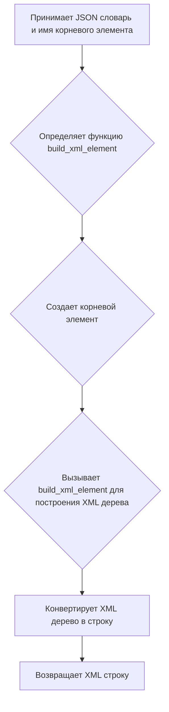
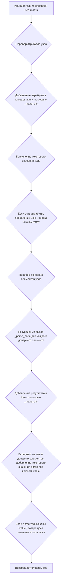
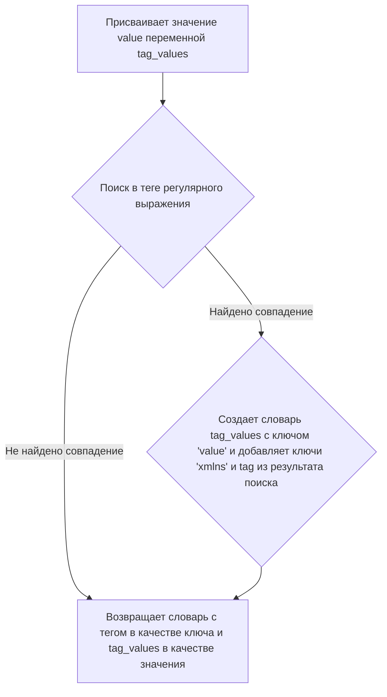
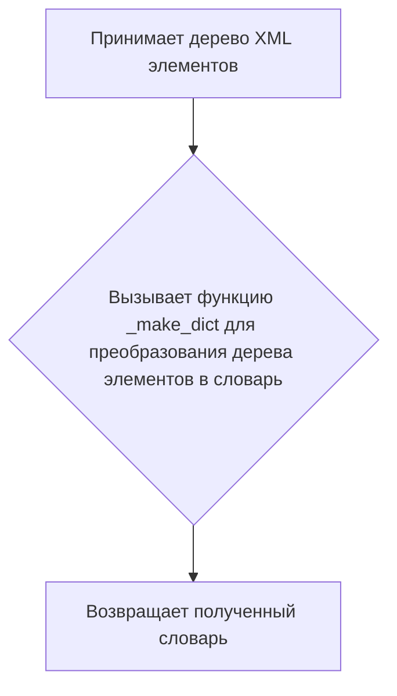

# Модуль `xml_json_convertor`

## Обзор

Модуль предоставляет утилиты для конвертации XML данных в словари и наоборот. Он включает функции для парсинга XML строк и конвертации XML деревьев элементов в представления словарей. Модуль используется для взаимодействия с API PrestaShop, который использует XML формат для обмена данными.

## Подробней

Модуль содержит функции для конвертации JSON в XML и XML в JSON. Это полезно при работе с API PrestaShop, который использует XML для обмена данными.
Функции `dict2xml` и `presta_fields_to_xml` используются для конвертации JSON данных в XML формат, который требуется для отправки данных в PrestaShop.
Функции `xml2dict` и `ET2dict` используются для конвертации XML данных, полученных от PrestaShop, в JSON формат для дальнейшей обработки.

## Функции

### `dict2xml`

```python
def dict2xml(json_obj: dict, root_name: str = "product") -> str:
    """Конвертирует JSON словарь в XML строку.

    Args:
        json_obj (dict): JSON словарь для конвертации.
        root_name (str, optional): Имя корневого элемента. По умолчанию "product".

    Returns:
        str: XML строковое представление JSON.
    """
```

**Назначение**: Конвертирует JSON словарь в XML строку.

**Параметры**:
- `json_obj` (dict): JSON словарь, который необходимо преобразовать в XML.
- `root_name` (str, optional): Имя корневого элемента XML. По умолчанию "product".

**Возвращает**:
- `str`: XML строковое представление JSON-объекта.

**Как работает функция**:

1.  Функция принимает JSON словарь и имя корневого элемента.
2.  Определяется внутренняя функция `build_xml_element`, которая рекурсивно строит XML элементы из JSON данных.
3.  Создается корневой элемент с заданным именем.
4.  Вызывается функция `build_xml_element` для построения XML дерева.
5.  XML дерево конвертируется в строку и возвращается.



**Примеры**:

```python
json_data = {"product": {"name": "Test Product", "price": "10.00"}}
xml_output = dict2xml(json_data)
print(xml_output)
# Expected output: 
# 
#   <product><name>Test Product</name><price>10.00</price></product>
# 
```

#### `build_xml_element` (внутренняя функция `dict2xml`)

```python
def build_xml_element(parent, data):
    """Рекурсивно строит XML элементы из JSON данных."""
```

**Назначение**: Рекурсивно строит XML элементы из JSON данных.

**Параметры**:
- `parent`: Родительский XML элемент.
- `data`: JSON данные для преобразования в XML.

**Как работает функция**:

1. Проверяет тип данных `data`.
2. Если `data` является словарем, то перебирает элементы словаря.
   - Если ключ начинается с `@`, то это атрибут элемента, который устанавливается с помощью `parent.set(key[1:], value)`.
   - Если ключ равен `#text`, то это текстовое значение элемента, которое устанавливается с помощью `parent.text = value`.
   - Иначе создается дочерний элемент с именем ключа и рекурсивно вызывается `build_xml_element` для этого элемента.
3. Если `data` является списком, то перебирает элементы списка и рекурсивно вызывает `build_xml_element` для каждого элемента.
4. Иначе устанавливает текстовое значение родительского элемента равным строковому представлению `data`.

```mermaid
graph TD
A[Проверяет тип данных data] --> B{Является ли data словарем?}
B -- Да --> C{Перебирает элементы словаря}
C --> D{Ключ начинается с "@"?}
D -- Да --> E[Устанавливает атрибут элемента]
D -- Нет --> F{Ключ равен "#text"?}
F -- Да --> G[Устанавливает текстовое значение элемента]
F -- Нет --> H[Создает дочерний элемент и рекурсивно вызывает build_xml_element]
B -- Нет --> I{Является ли data списком?}
I -- Да --> J{Перебирает элементы списка и рекурсивно вызывает build_xml_element}
I -- Нет --> K[Устанавливает текстовое значение родительского элемента]
```

### `_parse_node`

```python
def _parse_node(node: ET.Element) -> dict | str:
    """Parse an XML node into a dictionary.

    Args:
        node (ET.Element): The XML element to parse.

    Returns:
        dict | str: A dictionary representation of the XML node, or a string if the node has no attributes or children.
    """
```

**Назначение**: Преобразует XML узел в словарь.

**Параметры**:
- `node` (ET.Element): XML элемент для преобразования.

**Возвращает**:
- `dict | str`: Словарь, представляющий XML узел, или строка, если узел не имеет атрибутов или дочерних элементов.

**Как работает функция**:

1.  Инициализирует пустой словарь `tree` для хранения результата.
2.  Инициализирует пустой словарь `attrs` для хранения атрибутов узла.
3.  Перебирает атрибуты узла и добавляет их в словарь `attrs` с помощью функции `_make_dict`.
4.  Извлекает текстовое значение узла и удаляет пробелы с начала и конца строки.
5.  Если есть атрибуты, добавляет их в словарь `tree` под ключом `'attrs'`.
6.  Перебирает дочерние элементы узла.
    - Для каждого дочернего элемента рекурсивно вызывает функцию `_parse_node` и добавляет результат в словарь `tree` с помощью функции `_make_dict`.
7.  Если узел не имеет дочерних элементов, добавляет текстовое значение узла в словарь `tree` под ключом `'value'`.
8.  Если в словаре `tree` только один ключ `'value'`, возвращает значение этого ключа.
9.  Возвращает словарь `tree`.



### `_make_dict`

```python
def _make_dict(tag: str, value: any) -> dict:
    """Generate a new dictionary with tag and value.

    Args:
        tag (str): The tag name of the XML element.
        value (any): The value associated with the tag.

    Returns:
        dict: A dictionary with the tag name as the key and the value as the dictionary value.
    """
```

**Назначение**: Создает новый словарь с тегом и значением.

**Параметры**:
- `tag` (str): Имя тега XML элемента.
- `value` (any): Значение, связанное с тегом.

**Возвращает**:
- `dict`: Словарь с именем тега в качестве ключа и значением в качестве значения словаря.

**Как работает функция**:

1.  Присваивает значение `value` переменной `tag_values`.
2.  Ищет в теге регулярное выражение `r"\\{(.*)\\}(.*)"`.
3.  Если находит совпадение, то создает словарь `tag_values` с ключом `'value'` и значением `value`, а также добавляет ключи `'xmlns'` и `tag` из результата поиска.
4.  Возвращает словарь с тегом в качестве ключа и `tag_values` в качестве значения.



**Примеры**:

```python
tag = "name"
value = "Test Product"
result = _make_dict(tag, value)
print(result)
# Expected output: {'name': 'Test Product'}
```

### `xml2dict`

```python
def xml2dict(xml: str) -> dict:
    """Parse XML string into a dictionary.

    Args:
        xml (str): The XML string to parse.

    Returns:
        dict: The dictionary representation of the XML.
    """
```

**Назначение**: Преобразует XML строку в словарь.

**Параметры**:
- `xml` (str): XML строка для преобразования.

**Возвращает**:
- `dict`: Словарь, представляющий XML.

**Как работает функция**:

1.  Преобразует XML строку в дерево элементов с помощью `ET.fromstring(xml)`.
2.  Вызывает функцию `ET2dict` для преобразования дерева элементов в словарь.
3.  Возвращает полученный словарь.

```mermaid
graph TD
A[Принимает XML строку] --> B{Преобразует XML строку в дерево элементов с помощью ET.fromstring(xml)}
B --> C{Вызывает функцию ET2dict для преобразования дерева элементов в словарь}
C --> D[Возвращает полученный словарь]
```

**Примеры**:

```python
xml_string = "<product><name>Test Product</name><price>10.00</price></product>"
dict_output = xml2dict(xml_string)
print(dict_output)
# Expected output: {'product': {'name': 'Test Product', 'price': '10.00'}}
```

### `ET2dict`

```python
def ET2dict(element_tree: ET.Element) -> dict:
    """Convert an XML element tree into a dictionary.

    Args:
        element_tree (ET.Element): The XML element tree.

    Returns:
        dict: The dictionary representation of the XML element tree.
    """
```

**Назначение**: Преобразует дерево XML элементов в словарь.

**Параметры**:
- `element_tree` (ET.Element): Дерево XML элементов.

**Возвращает**:
- `dict`: Словарь, представляющий дерево XML элементов.

**Как работает функция**:

1.  Вызывает функцию `_make_dict` для преобразования дерева элементов в словарь.
2.  Возвращает полученный словарь.



**Примеры**:

```python
import xml.etree.ElementTree as ET
xml_string = "<product><name>Test Product</name><price>10.00</price></product>"
element_tree = ET.fromstring(xml_string)
dict_output = ET2dict(element_tree)
print(dict_output)
# Expected output: {'product': {'name': 'Test Product', 'price': '10.00'}}
```

### `presta_fields_to_xml`

```python
def presta_fields_to_xml(presta_fields_dict: dict) -> str:
    """! Converts a JSON dictionary to an XML string with a fixed root name 'prestashop'.

    Args:
        presta_fields_dict (dict): JSON dictionary containing the data (without 'prestashop' key).

    Returns:
        str: XML string representation of the JSON.
    """
```

**Назначение**: Конвертирует JSON словарь в XML строку с фиксированным корневым элементом "prestashop".

**Параметры**:
- `presta_fields_dict` (dict): JSON словарь, содержащий данные (без ключа "prestashop").

**Возвращает**:
- `str`: XML строковое представление JSON.

**Как работает функция**:

1.  Определяет внутреннюю функцию `build_xml_element`, которая рекурсивно строит XML элементы из JSON данных.
2.  Если входной словарь `presta_fields_dict` пуст, возвращает пустую строку.
3.  Получает первый ключ из словаря `presta_fields_dict` (например, 'product', 'category' и т. д.).
4.  Создает корневой элемент "prestashop".
5.  Создает динамический элемент, используя первый ключ из словаря `presta_fields_dict` в качестве имени элемента, и добавляет его в корневой элемент.
6.  Вызывает функцию `build_xml_element` для построения XML дерева.
7.  Конвертирует XML дерево в строку и возвращает.

```mermaid
graph TD
A[Принимает JSON словарь] --> B{Определяет функцию build_xml_element}
B --> C{Если словарь пуст, возвращает пустую строку}
C --> D{Получает первый ключ из словаря}
D --> E{Создает корневой элемент "prestashop"}
E --> F{Создает динамический элемент с именем ключа и добавляет его в корневой элемент}
F --> G{Вызывает функцию build_xml_element для построения XML дерева}
G --> H[Конвертирует XML дерево в строку и возвращает]
```

**Примеры**:

```python
json_data = {
    "product": {
        "name": "Test Product",
        "price": "10.00"
    }
}
xml_output = presta_fields_to_xml(json_data)
print(xml_output)
# Expected output: 
#  <prestashop><product><name>Test Product</name><price>10.00</price></product></prestashop>
```

#### `build_xml_element` (внутренняя функция `presta_fields_to_xml`)

```python
def build_xml_element(parent, data):
    """Рекурсивно строит XML элементы из JSON данных."""
```

**Назначение**: Рекурсивно строит XML элементы из JSON данных.

**Параметры**:
- `parent`: Родительский XML элемент.
- `data`: JSON данные для преобразования в XML.

**Как работает функция**:

1. Проверяет тип данных `data`.
2. Если `data` является словарем, то перебирает элементы словаря.
   - Если ключ начинается с `@`, то это атрибут элемента, который устанавливается с помощью `parent.set(key[1:], value)`.
   - Если ключ равен `#text`, то это текстовое значение элемента, которое устанавливается с помощью `parent.text = value`.
   - Иначе создается дочерний элемент с именем ключа и рекурсивно вызывается `build_xml_element` для этого элемента.
3. Если `data` является списком, то перебирает элементы списка и рекурсивно вызывает `build_xml_element` для каждого элемента.
4. Иначе устанавливает текстовое значение родительского элемента равным строковому представлению `data`.

```mermaid
graph TD
A[Проверяет тип данных data] --> B{Является ли data словарем?}
B -- Да --> C{Перебирает элементы словаря}
C --> D{Ключ начинается с "@"?}
D -- Да --> E[Устанавливает атрибут элемента]
D -- Нет --> F{Ключ равен "#text"?}
F -- Да --> G[Устанавливает текстовое значение элемента]
F -- Нет --> H[Создает дочерний элемент и рекурсивно вызывает build_xml_element]
B -- Нет --> I{Является ли data списком?}
I -- Да --> J{Перебирает элементы списка и рекурсивно вызывает build_xml_element}
I -- Нет --> K[Устанавливает текстовое значение родительского элемента]