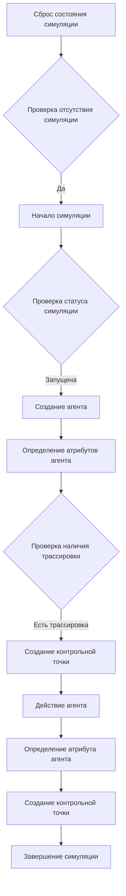
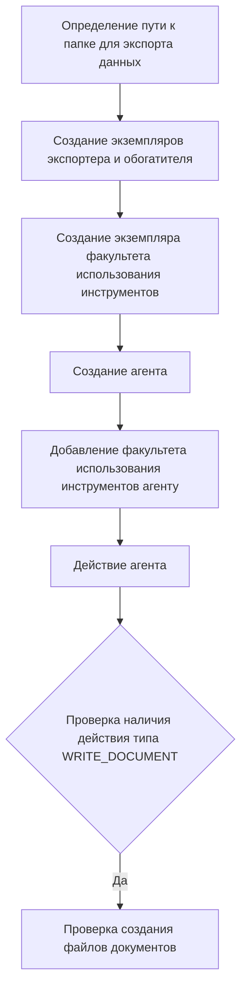

# Модуль тестирования базовых сценариев `test_basic_scenarios.py`

## Обзор

Этот модуль содержит тесты для проверки основных сценариев использования и функциональности библиотеки `tinytroupe`. Он включает тесты для инициализации и завершения симуляций, определения атрибутов агентов и использования инструментов.

## Подробнее

Модуль предназначен для проверки правильности работы основных компонентов библиотеки `tinytroupe`, таких как агенты, окружение, фабрика агентов, извлечение результатов, обогащение данных, экспорт артефактов и использование инструментов. Он также проверяет корректность запуска и остановки симуляций, а также сохранения данных в файлы.

## Функции

### `test_basic_scenario_1`

```python
def test_basic_scenario_1():
    """
    Тестирует базовый сценарий симуляции с одним агентом.

    Args:
        None

    Returns:
        None

    Raises:
        AssertionError: Если состояние симуляции не соответствует ожидаемому.

    Example:
        >>> test_basic_scenario_1()
    """
```

**Как работает функция**:

1.  **Сброс состояния симуляции**:
    *   Функция `control.reset()` сбрасывает все текущие симуляции в `None`
2.  **Начало симуляции**:
    *   Функция `control.begin()` запускает симуляцию
3.  **Создание агента**:
    *   Вызывается функция `create_oscar_the_architect()` для создания агента
4.  **Определение атрибутов агента**:
    *   Вызывается функция `agent.define()` для определения атрибутов агента
5.  **Проверка наличия трассировки**:
    *   Делаются проверки на то, что записи трассировок не равны `None`
6.  **Создание контрольной точки**:
    *   Вызывается функция `control.checkpoint()` для создания контрольной точки
7.  **Действие агента**:
    *   Вызывается функция `agent.listen_and_act()` для выполнения действия агентом
8.  **Определение атрибута агента**:
    *   Вызывается функция `agent.define()` для определения атрибута агента
9.  **Создание контрольной точки**:
    *   Вызывается функция `control.checkpoint()` для создания контрольной точки
10. **Завершение симуляции**:
    *   Вызывается функция `control.end()` для завершения симуляции



**Примеры**:

```python
test_basic_scenario_1()
```

### `test_tool_usage_1`

```python
def test_tool_usage_1():
    """
    Тестирует использование инструментов агентом в симуляции.

    Args:
        None

    Returns:
        None

    Raises:
        AssertionError: Если действие агента не соответствует ожидаемому.

    Example:
        >>> test_tool_usage_1()
    """
```

**Как работает функция**:

1.  **Определение пути к папке для экспорта данных**:
    *   Функция `f"{EXPORT_BASE_FOLDER}/test_tool_usage_1"` определяет путь к папке для экспорта данных
2.  **Создание экземпляров экспортера и обогатителя**:
    *   Вызываются классы `ArtifactExporter(base_output_folder=data_export_folder)` и `TinyEnricher()` для создания экземпляров
3.  **Создание экземпляра факультета использования инструментов**:
    *   Вызывается класс `TinyToolUse(tools=[TinyWordProcessor(exporter=exporter, enricher=enricher)])` для создания экземпляра
4.  **Создание агента**:
    *   Вызывается функция `create_lisa_the_data_scientist()` для создания агента
5.  **Добавление факультета использования инструментов агенту**:
    *   Вызывается функция `lisa.add_mental_faculties([tooluse_faculty])` для добавления факультета
6.  **Действие агента**:
    *   Вызывается функция `lisa.listen_and_act()` для выполнения действия агентом
7.  **Проверка наличия действия типа WRITE_DOCUMENT**:
    *   Вызывается функция `contains_action_type(actions, "WRITE_DOCUMENT")` для проверки наличия действия в списке действий
8.  **Проверка создания файлов документов**:
    *   Вызывается функция `os.path.exists()` для проверки наличия файлов документов



**Примеры**:

```python
test_tool_usage_1()