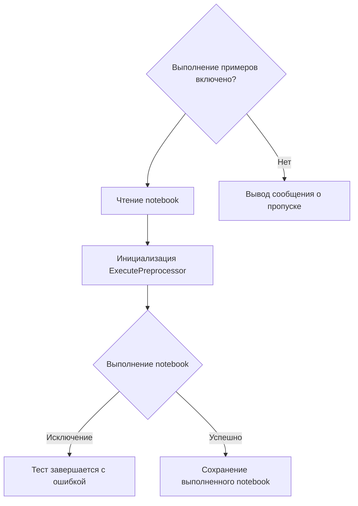

# Документация для `test_jupyter_examples.py`

## Обзор

Файл `test_jupyter_examples.py` предназначен для автоматического тестирования Jupyter Notebook-ов, расположенных в директории `examples`. Он использует `pytest` для запуска notebook-ов и проверки отсутствия ошибок при их выполнении. Модуль позволяет убедиться, что примеры использования библиотеки `hypotez` корректно работают и не содержат ошибок.

## Подробней

Этот файл важен для обеспечения качества и надежности примеров использования библиотеки. Он гарантирует, что пользователи смогут запускать примеры кода без проблем и получать ожидаемые результаты. Тесты проверяют, что все notebook-и выполняются без исключений, что особенно важно при внесении изменений в кодовую базу библиотеки.

## Функции

### `get_notebooks`

```python
def get_notebooks(folder: str) -> list[str]:
    """Retrieve all Jupyter notebook files from the specified folder."""
    ...
```

**Назначение**: Функция `get_notebooks` извлекает пути ко всем файлам Jupyter Notebook из указанной папки, исключая файлы, которые уже были выполнены или являются локальными копиями.

**Параметры**:
- `folder` (str): Путь к папке, в которой находятся Jupyter Notebook-и.

**Возвращает**:
- `list[str]`: Список путей ко всем Jupyter Notebook-ам в указанной папке.

**Как работает функция**:

1.  Функция получает список всех файлов в указанной папке.
2.  Она фильтрует список, оставляя только файлы с расширением ".ipynb", которые не содержат ".executed." или ".local." в своем имени.
3.  Возвращает список полных путей к отфильтрованным файлам.

```mermaid
graph TD
    A[Получение списка файлов в папке] --> B{Фильтрация файлов по расширению и имени}
    B -- ".ipynb" и отсутствие ".executed." и ".local." --> C[Список путей к Jupyter Notebook-ам]
```

**Примеры**:

```python
notebooks = get_notebooks("/path/to/notebooks")
print(notebooks)
# Output: ['/path/to/notebooks/example.ipynb', '/path/to/notebooks/another_example.ipynb']
```

### `test_notebook_execution`

```python
@pytest.mark.parametrize("notebook_path", get_notebooks(NOTEBOOK_FOLDER))
def test_notebook_execution(notebook_path: str):
    """Execute a Jupyter notebook and assert that no exceptions occur."""
    ...
```

**Назначение**: Функция `test_notebook_execution` выполняет Jupyter Notebook и проверяет, что при выполнении не возникает исключений. Если исключение возникает, тест завершается с ошибкой.

**Параметры**:
- `notebook_path` (str): Путь к Jupyter Notebook, который нужно выполнить.

**Как работает функция**:

1.  Функция проверяет, включено ли выполнение примеров в конфигурации.
2.  Если выполнение примеров включено, функция открывает указанный notebook.
3.  Инициализирует `ExecutePreprocessor` с заданным таймаутом и именем ядра.
4.  Запускает выполнение notebook, перехватывая любые исключения.
5.  В случае возникновения исключения, тест завершается с ошибкой, содержащей информацию об исключении.
6.  После выполнения (или возникновения исключения) сохраняет копию выполненного notebook с добавлением ".executed.local." в имя файла.
7.  Если выполнение примеров отключено, функция просто выводит сообщение о пропуске выполнения notebook.



**Примеры**:

```python
test_notebook_execution("/path/to/notebook/example.ipynb")