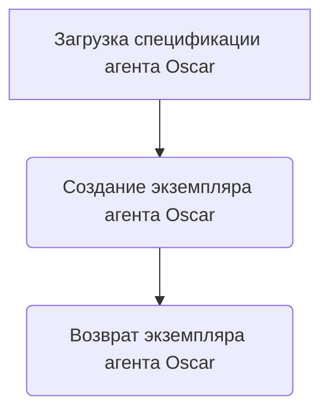
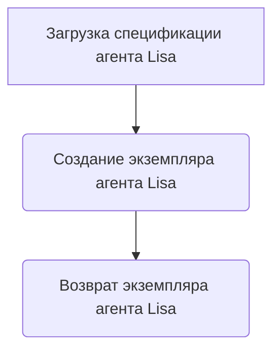
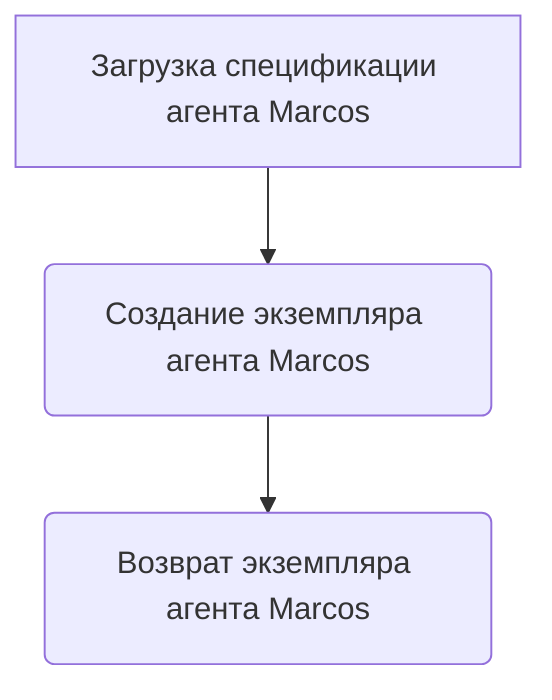
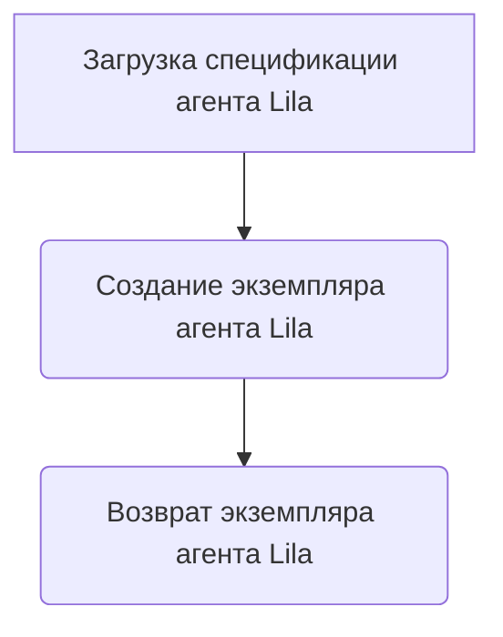

# Модуль examples.agents.py

## Обзор

Модуль содержит примеры создания и загрузки агентов для библиотеки `tinytroupe`. Агенты представляют собой экземпляры класса `TinyPerson`, которые могут быть созданы программно или загружены из файлов спецификаций.

## Подробнее

Этот модуль предоставляет несколько примеров создания агентов с использованием различных подходов. Агенты могут быть созданы полностью программно, определяя все их атрибуты и характеристики, или загружены из файлов спецификаций, что позволяет более декларативно определять агентов. Модуль демонстрирует создание агентов различных профессий и с различными характеристиками, чтобы показать гибкость библиотеки `tinytroupe`.

## Функции

### `create_oscar_the_architect`

```python
def create_oscar_the_architect():
    """
    Загружает спецификацию агента "Oscar" из файла и возвращает экземпляр класса `TinyPerson`.

    Returns:
        TinyPerson: Экземпляр класса `TinyPerson`, представляющий архитектора Оскара.
    """
    ...
```

**Как работает функция**:
1.  Функция вызывает `load_example_agent_specification("Oscar")` для загрузки спецификации агента Oscar из файла.
2.  Затем она вызывает `TinyPerson.load_specification` с загруженной спецификацией для создания и возврата экземпляра агента Oscar.



**Примеры**:

```python
oscar = create_oscar_the_architect()
print(oscar.name)  # Вывод: Oscar
```

### `create_oscar_the_architect_2`

```python
def create_oscar_the_architect_2():
    """
    Создает агента "Oscar" программно, определяя его атрибуты и характеристики.

    Returns:
        TinyPerson: Экземпляр класса `TinyPerson`, представляющий архитектора Оскара.
    """
    ...
```

**Как работает функция**:

1.  Создается экземпляр класса `TinyPerson` с именем "Oscar".
2.  Определяются различные атрибуты и характеристики Оскара, такие как возраст, национальность, поведение, профессия, личность, предпочтения, навыки и отношения.
3.  Все эти атрибуты определяются с использованием метода `define` класса `TinyPerson`.
4.  В завершение функция возвращает созданного агента Оскара.

```mermaid
graph TD
    A[Создание экземпляра TinyPerson с именем "Oscar"] --> B{Определение атрибутов и характеристик Оскара};
    B --> C(Возврат экземпляра агента Oscar);
```

**Примеры**:

```python
oscar = create_oscar_the_architect_2()
print(oscar.name)  # Вывод: Oscar
print(oscar.age)   # Вывод: 30
```

### `create_lisa_the_data_scientist`

```python
def create_lisa_the_data_scientist():
    """
    Загружает спецификацию агента "Lisa" из файла и возвращает экземпляр класса `TinyPerson`.

    Returns:
        TinyPerson: Экземпляр класса `TinyPerson`, представляющий специалиста по данным Лизу.
    """
    ...
```

**Как работает функция**:

1.  Функция вызывает `load_example_agent_specification("Lisa")` для загрузки спецификации агента Lisa из файла.
2.  Затем она вызывает `TinyPerson.load_specification` с загруженной спецификацией для создания и возврата экземпляра агента Lisa.



**Примеры**:

```python
lisa = create_lisa_the_data_scientist()
print(lisa.name)  # Вывод: Lisa
```

### `create_lisa_the_data_scientist_2`

```python
def create_lisa_the_data_scientist_2():
    """
    Создает агента "Lisa" программно, определяя ее атрибуты и характеристики.

    Returns:
        TinyPerson: Экземпляр класса `TinyPerson`, представляющий специалиста по данным Лизу.
    """
    ...
```

**Как работает функция**:

1.  Создается экземпляр класса `TinyPerson` с именем "Lisa".
2.  Определяются различные атрибуты и характеристики Лизы, такие как возраст, национальность, поведение, профессия, личность, предпочтения, навыки и отношения.
3.  Все эти атрибуты определяются с использованием метода `define` класса `TinyPerson`.
4.  В завершение функция возвращает созданного агента Лизу.

```mermaid
graph TD
    A[Создание экземпляра TinyPerson с именем "Lisa"] --> B{Определение атрибутов и характеристик Лизы};
    B --> C(Возврат экземпляра агента Lisa);
```

**Примеры**:

```python
lisa = create_lisa_the_data_scientist_2()
print(lisa.name)  # Вывод: Lisa
print(lisa.age)   # Вывод: 28
```

### `create_marcos_the_physician`

```python
def create_marcos_the_physician():
    """
    Загружает спецификацию агента "Marcos" из файла и возвращает экземпляр класса `TinyPerson`.

    Returns:
        TinyPerson: Экземпляр класса `TinyPerson`, представляющий врача Маркоса.
    """
    ...
```

**Как работает функция**:

1.  Функция вызывает `load_example_agent_specification("Marcos")` для загрузки спецификации агента Marcos из файла.
2.  Затем она вызывает `TinyPerson.load_specification` с загруженной спецификацией для создания и возврата экземпляра агента Marcos.



**Примеры**:

```python
marcos = create_marcos_the_physician()
print(marcos.name)  # Вывод: Marcos
```

### `create_marcos_the_physician_2`

```python
def create_marcos_the_physician_2():
    """
    Создает агента "Marcos" программно, определяя его атрибуты и характеристики.

    Returns:
        TinyPerson: Экземпляр класса `TinyPerson`, представляющий врача Маркоса.
    """
    ...
```

**Как работает функция**:

1.  Создается экземпляр класса `TinyPerson` с именем "Marcos".
2.  Определяются различные атрибуты и характеристики Маркоса, такие как возраст, национальность, поведение, профессия, личность, предпочтения, навыки и отношения.
3.  Все эти атрибуты определяются с использованием метода `define` класса `TinyPerson`.
4.  В завершение функция возвращает созданного агента Маркоса.

```mermaid
graph TD
    A[Создание экземпляра TinyPerson с именем "Marcos"] --> B{Определение атрибутов и характеристик Маркоса};
    B --> C(Возврат экземпляра агента Marcos);
```

**Примеры**:

```python
marcos = create_marcos_the_physician_2()
print(marcos.name)  # Вывод: Marcos
print(marcos.age)   # Вывод: 35
```

### `create_lila_the_linguist`

```python
def create_lila_the_linguist():
    """
    Загружает спецификацию агента "Lila" из файла и возвращает экземпляр класса `TinyPerson`.

    Returns:
        TinyPerson: Экземпляр класса `TinyPerson`, представляющий лингвиста Лилу.
    """
    ...
```

**Как работает функция**:

1.  Функция вызывает `load_example_agent_specification("Lila")` для загрузки спецификации агента Lila из файла.
2.  Затем она вызывает `TinyPerson.load_specification` с загруженной спецификацией для создания и возврата экземпляра агента Lila.



**Примеры**:

```python
lila = create_lila_the_linguist()
print(lila.name)  # Вывод: Lila
```

### `create_lila_the_linguist_2`

```python
def create_lila_the_linguist_2():
    """
    Создает агента "Lila" программно, определяя ее атрибуты и характеристики.

    Returns:
        TinyPerson: Экземпляр класса `TinyPerson`, представляющий лингвиста Лилу.
    """
    ...
```

**Как работает функция**:

1.  Создается экземпляр класса `TinyPerson` с именем "Lila".
2.  Определяются различные атрибуты и характеристики Лилы, такие как возраст, национальность, поведение, профессия, личность, предпочтения, навыки и отношения.
3.  Все эти атрибуты определяются с использованием метода `define` класса `TinyPerson`.
4.  В завершение функция возвращает созданного агента Лилу.

```mermaid
graph TD
    A[Создание экземпляра TinyPerson с именем "Lila"] --> B{Определение атрибутов и характеристик Лилы};
    B --> C(Возврат экземпляра агента Lila);
```

**Примеры**:

```python
lila = create_lila_the_linguist_2()
print(lila.name)  # Вывод: Lila
print(lila.age)   # Вывод: 28
```