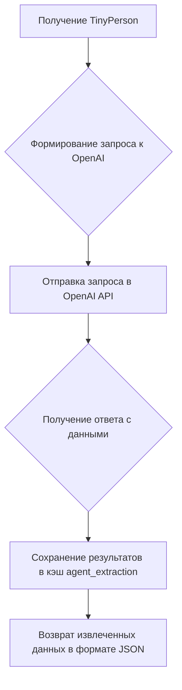
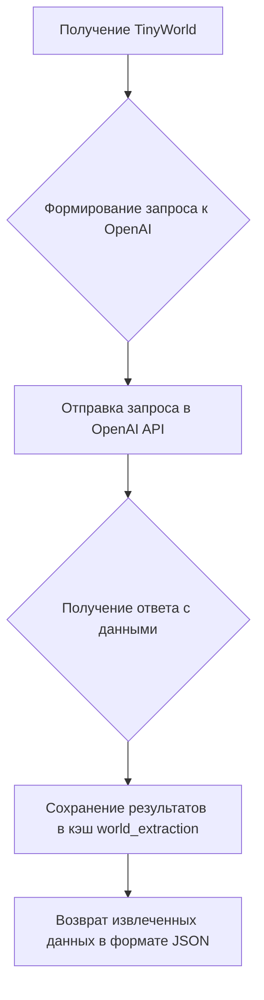
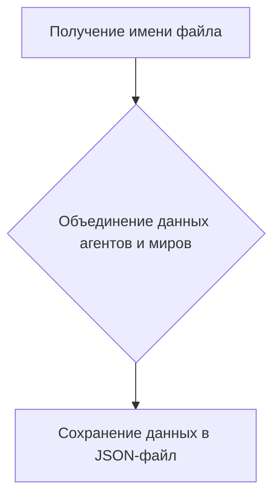
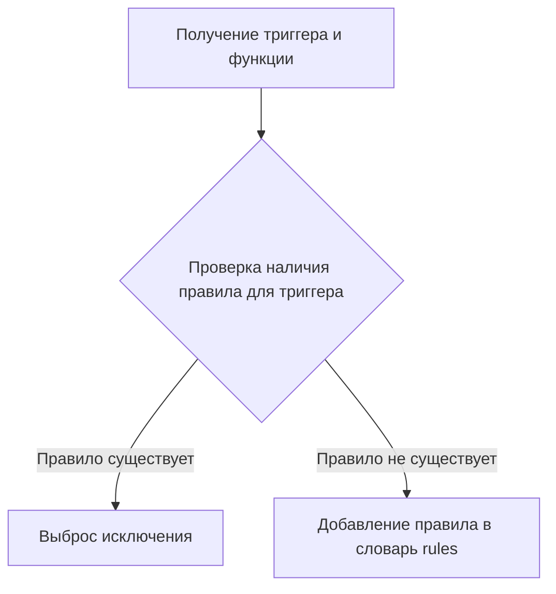
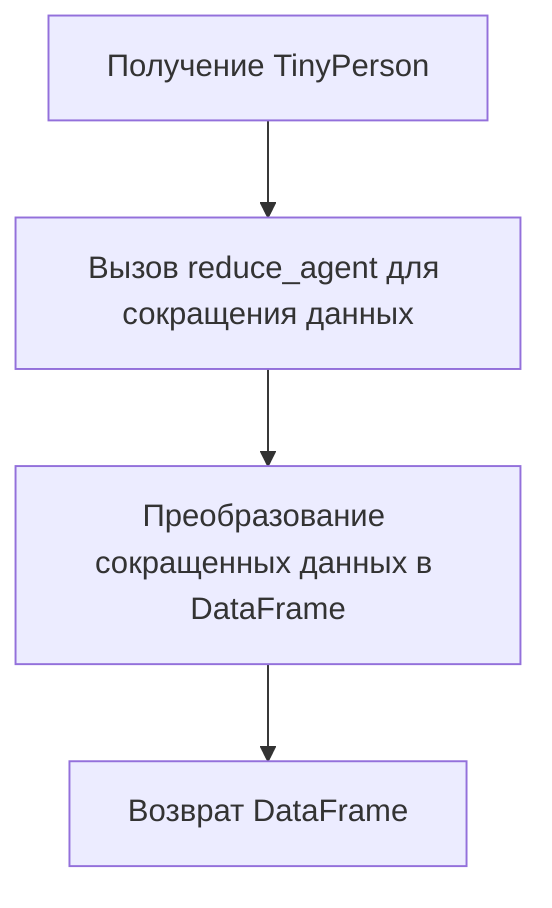
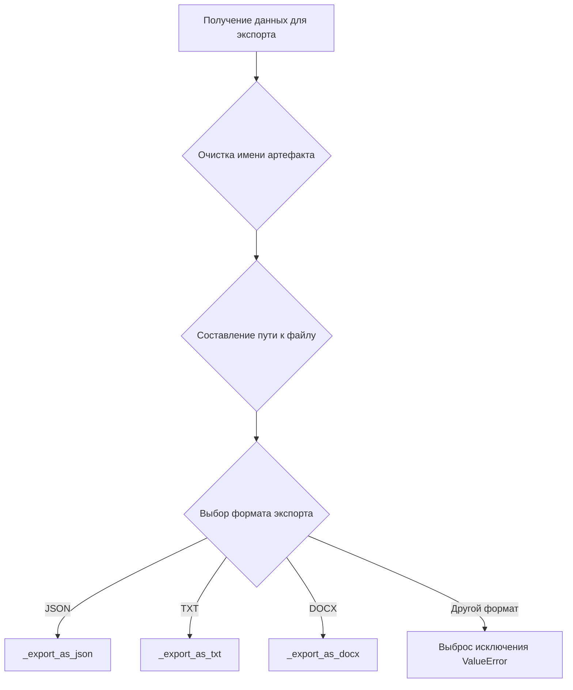
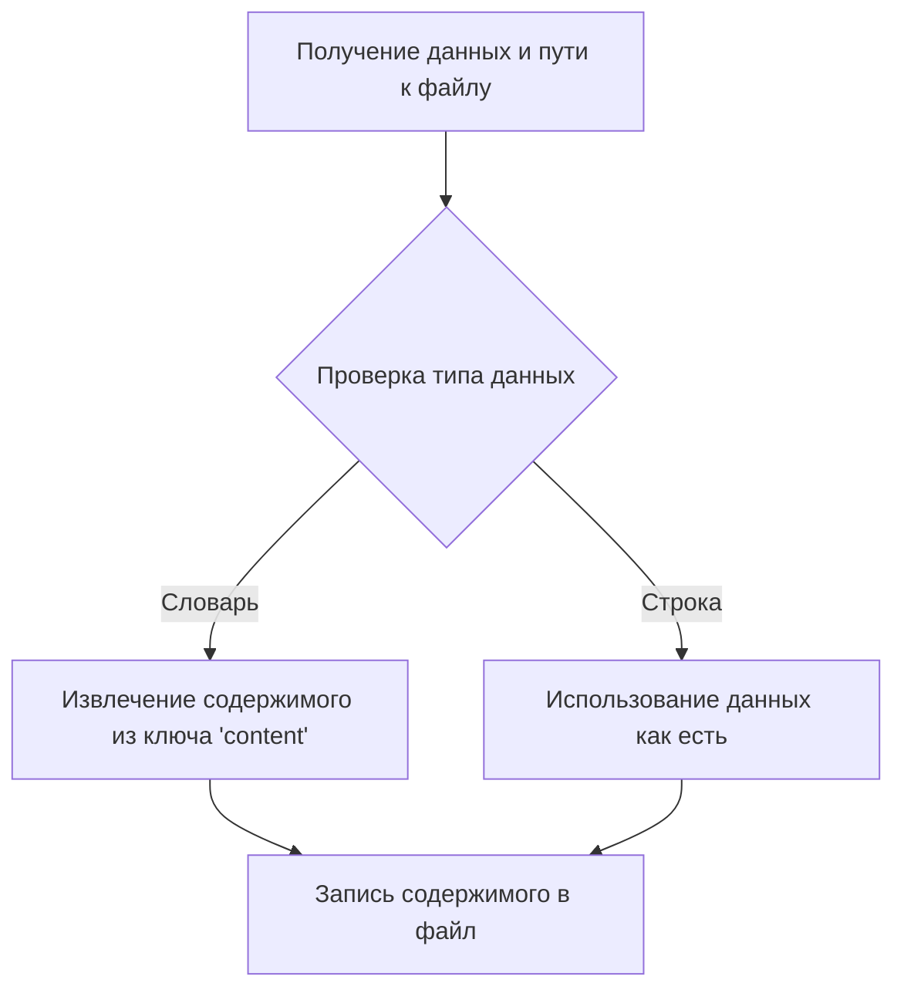
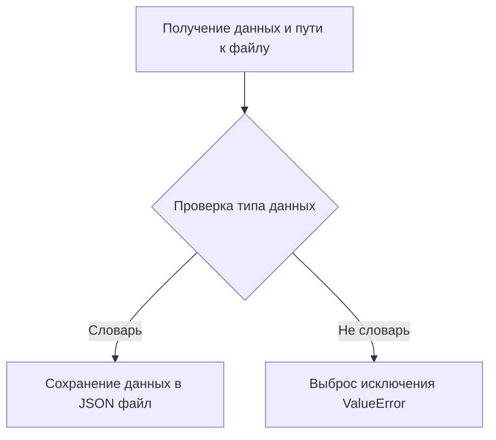
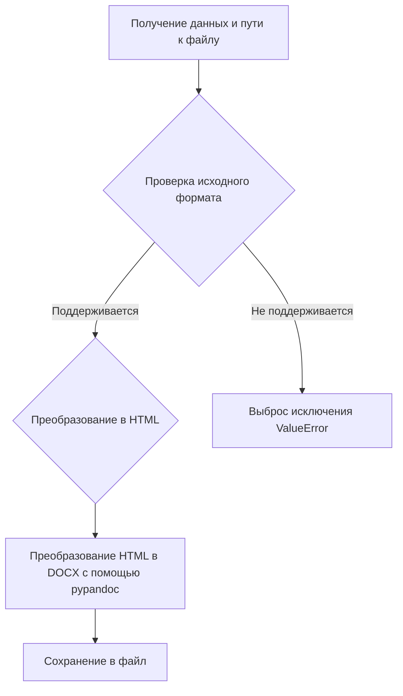
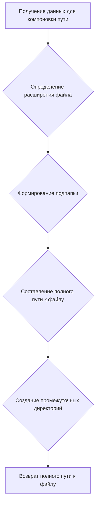

# Модуль для извлечения данных из симуляций TinyTroupe
=========================================================

Модуль содержит классы и функции для извлечения, сокращения и экспорта данных из элементов TinyTroupe, таких как агенты и миры. Он предоставляет механизмы для структурирования данных, полученных в результате симуляций, и преобразования их в удобные для анализа форматы.

## Обзор

Этот модуль предоставляет инструменты для извлечения данных из симуляций, проводимых в TinyTroupe. Он позволяет извлекать ключевые моменты из истории взаимодействий агентов, генерировать синтетические данные для обучения моделей машинного обучения и преобразовывать данные в машиночитаемые форматы, такие как JSON или CSV.

## Подробнее

Модуль включает классы `ResultsExtractor`, `ResultsReducer` и `ArtifactExporter`, которые обеспечивают различные уровни обработки данных. `ResultsExtractor` извлекает данные из агентов и миров, `ResultsReducer` сокращает объем данных, а `ArtifactExporter` экспортирует артефакты в различные форматы файлов. Также представлен класс `Normalizer` для нормализации текстовых элементов.

## Классы

### `ResultsExtractor`

**Описание**: Класс предназначен для извлечения результатов из экземпляров `TinyPerson` (агентов) и `TinyWorld` (миров).

**Принцип работы**: Использует шаблоны запросов (prompt templates) и OpenAI API для извлечения информации из истории взаимодействий агентов и состояний мира. Результаты извлечения кэшируются для дальнейшего использования.

**Методы**:

- `__init__()`: Инициализирует экземпляр класса, загружает шаблон запроса и создает кэш для результатов извлечения.
- `extract_results_from_agent(tinyperson: TinyPerson, extraction_objective: str = "The main points present in the agent's interactions history.", situation: str = "", fields: list = None, fields_hints: dict = None, verbose: bool = False) -> dict | None`: Извлекает результаты из экземпляра `TinyPerson`.
- `extract_results_from_world(tinyworld: TinyWorld, extraction_objective: str = "The main points that can be derived from the agents conversations and actions.", situation: str = "", fields: list = None, fields_hints: dict = None, verbose: bool = False) -> dict | None`: Извлекает результаты из экземпляра `TinyWorld`.
- `save_as_json(filename: str, verbose: bool = False)`: Сохраняет последние результаты извлечения в формате JSON.

### `ResultsReducer`

**Описание**: Класс предназначен для сокращения объема данных, извлеченных из агентов, на основе заданных правил.

**Принцип работы**: Применяет набор правил к истории взаимодействий агента для извлечения наиболее релевантной информации. Правила определяются пользователем и могут быть добавлены динамически.

**Методы**:

- `__init__()`: Инициализирует экземпляр класса, создает хранилище для правил сокращения.
- `add_reduction_rule(trigger: str, func: callable)`: Добавляет правило сокращения для определенного типа события.
- `reduce_agent(agent: TinyPerson) -> list`: Сокращает данные агента на основе заданных правил.
- `reduce_agent_to_dataframe(agent: TinyPerson, column_names: list = None) -> pd.DataFrame`: Преобразует сокращенные данные агента в формат DataFrame.

### `ArtifactExporter(JsonSerializableRegistry)`

**Описание**: Класс предназначен для экспорта артефактов из элементов TinyTroupe в различные форматы файлов.
**Наследует**: `JsonSerializableRegistry`

**Принцип работы**: Позволяет сохранять данные (например, JSON, текст, документы) в файлы, используя заданные имя артефакта, тип контента и формат. Поддерживает преобразование в различные форматы, включая DOCX.

**Методы**:

- `__init__(base_output_folder: str) -> None`: Инициализирует экземпляр класса, устанавливает базовую директорию для вывода файлов.
- `export(artifact_name: str, artifact_data: Union[dict, str], content_type: str, content_format: str = None, target_format: str = "txt", verbose: bool = False)`: Экспортирует данные артефакта в файл.
- `_export_as_txt(artifact_file_path: str, artifact_data: Union[dict, str], content_type: str, verbose: bool = False)`: Экспортирует данные артефакта в текстовый файл.
- `_export_as_json(artifact_file_path: str, artifact_data: Union[dict, str], content_type: str, verbose: bool = False)`: Экспортирует данные артефакта в JSON файл.
- `_export_as_docx(artifact_file_path: str, artifact_data: Union[dict, str], content_original_format: str, verbose: bool = False)`: Экспортирует данные артефакта в DOCX файл.
- `_compose_filepath(artifact_data: Union[dict, str], artifact_name: str, content_type: str, target_format: str = None, verbose: bool = False)`: Компонует путь к файлу для экспортируемого артефакта.

### `Normalizer`

**Описание**: Класс предназначен для нормализации текстовых элементов, таких как пассажи, концепции и другие текстовые данные.

**Принцип работы**: Использует OpenAI API для объединения нескольких элементов в один нормализованный элемент. Результаты нормализации кэшируются для повышения производительности.

**Методы**:

- `__init__(elements: List[str], n: int, verbose: bool = False)`: Инициализирует экземпляр класса, устанавливает элементы для нормализации и количество нормализованных элементов для вывода.
- `normalize(element_or_elements: Union[str, List[str]]) -> Union[str, List[str]]`: Нормализует указанный элемент или элементы.

## Функции

### `extract_results_from_agent`

```python
def extract_results_from_agent(
    tinyperson: TinyPerson,
    extraction_objective: str = "The main points present in the agent's interactions history.",
    situation: str = "",
    fields: list = None,
    fields_hints: dict = None,
    verbose: bool = False,
) -> dict | None:
    """
    Извлекает результаты из экземпляра `TinyPerson`.

    Args:
        tinyperson (TinyPerson): Экземпляр `TinyPerson`, из которого нужно извлечь результаты.
        extraction_objective (str, optional): Цель извлечения. По умолчанию "The main points present in the agent's interactions history.".
        situation (str, optional): Контекст ситуации. По умолчанию "".
        fields (list, optional): Список полей для извлечения. Если `None`, извлекатель сам решает, какие имена использовать. По умолчанию `None`.
        fields_hints (dict, optional): Словарь с подсказками для полей. По умолчанию `None`.
        verbose (bool, optional): Флаг, указывающий, нужно ли выводить отладочные сообщения. По умолчанию `False`.

    Returns:
        dict | None: Словарь с извлеченными результатами или `None`, если извлечение не удалось.

    Raises:
        Нет явных исключений.

    Example:
        >>> from tinytroupe.agent import TinyPerson
        >>> agent = TinyPerson(name='Alice')
        >>> extractor = ResultsExtractor()
        >>> results = extractor.extract_results_from_agent(agent, extraction_objective='Summarize interactions')
        >>> if results:
        ...     print(results)
        ... else:
        ...     print('No results extracted')
    """
    ...
```

**Назначение**: Извлечение результатов из истории взаимодействий агента `TinyPerson`.

**Параметры**:
- `tinyperson` (TinyPerson): Агент, из которого извлекаются данные.
- `extraction_objective` (str): Цель извлечения данных (например, "основные моменты из истории взаимодействий").
- `situation` (str): Описание ситуации, контекст для извлечения данных.
- `fields` (list): Список полей, которые необходимо извлечь. Если не указан, используются значения по умолчанию.
- `fields_hints` (dict): Дополнительные указания для извлечения полей.
- `verbose` (bool): Флаг для вывода отладочной информации.

**Возвращает**:
- `dict | None`: Словарь с извлеченными данными в формате JSON или `None` в случае ошибки.

**Как работает функция**:
1.  Функция `extract_results_from_agent` получает экземпляр `TinyPerson`, из которого необходимо извлечь данные.
2.  Формируется запрос к OpenAI API с учетом цели извлечения, контекста ситуации и истории взаимодействий агента.
3.  Запрос отправляется в OpenAI API, и получается ответ с извлеченными данными.
4.  Результаты извлечения сохраняются в кэш `self.agent_extraction`.
5.  Функция возвращает извлеченные данные в формате JSON.



**Примеры**:

```python
from tinytroupe.agent import TinyPerson
from src.endpoints.tiny_troupe.tinytroupe.extraction import ResultsExtractor

agent = TinyPerson(name='Alice')
extractor = ResultsExtractor()
results = extractor.extract_results_from_agent(agent, extraction_objective='Summarize interactions')

if results:
    print(results)
else:
    print('No results extracted')
```

### `extract_results_from_world`

```python
def extract_results_from_world(
    tinyworld: TinyWorld,
    extraction_objective: str = "The main points that can be derived from the agents conversations and actions.",
    situation: str = "",
    fields: list = None,
    fields_hints: dict = None,
    verbose: bool = False,
) -> dict | None:
    """
    Извлекает результаты из экземпляра `TinyWorld`.

    Args:
        tinyworld (TinyWorld): Экземпляр `TinyWorld`, из которого нужно извлечь результаты.
        extraction_objective (str, optional): Цель извлечения. По умолчанию "The main points that can be derived from the agents conversations and actions.".
        situation (str, optional): Контекст ситуации. По умолчанию "".
        fields (list, optional): Список полей для извлечения. Если `None`, извлекатель сам решает, какие имена использовать. По умолчанию `None`.
        fields_hints (dict, optional): Словарь с подсказками для полей. По умолчанию `None`.
        verbose (bool, optional): Флаг, указывающий, нужно ли выводить отладочные сообщения. По умолчанию `False`.

    Returns:
        dict | None: Словарь с извлеченными результатами или `None`, если извлечение не удалось.

    Raises:
        Нет явных исключений.
    """
    ...
```

**Назначение**: Извлечение результатов из истории взаимодействий агентов в мире `TinyWorld`.

**Параметры**:
- `tinyworld` (TinyWorld): Мир, из которого извлекаются данные.
- `extraction_objective` (str): Цель извлечения данных (например, "основные моменты из разговоров и действий агентов").
- `situation` (str): Описание ситуации, контекст для извлечения данных.
- `fields` (list): Список полей, которые необходимо извлечь. Если не указан, используются значения по умолчанию.
- `fields_hints` (dict): Дополнительные указания для извлечения полей.
- `verbose` (bool): Флаг для вывода отладочной информации.

**Возвращает**:
- `dict | None`: Словарь с извлеченными данными в формате JSON или `None` в случае ошибки.

**Как работает функция**:
1.  Функция `extract_results_from_world` получает экземпляр `TinyWorld`, из которого необходимо извлечь данные.
2.  Формируется запрос к OpenAI API с учетом цели извлечения, контекста ситуации и истории взаимодействий агентов в мире.
3.  Запрос отправляется в OpenAI API, и получается ответ с извлеченными данными.
4.  Результаты извлечения сохраняются в кэш `self.world_extraction`.
5.  Функция возвращает извлеченные данные в формате JSON.



**Примеры**:

```python
from tinytroupe.environment import TinyWorld
from src.endpoints.tiny_troupe.tinytroupe.extraction import ResultsExtractor

world = TinyWorld(name='MyWorld')
extractor = ResultsExtractor()
results = extractor.extract_results_from_world(world, extraction_objective='Summarize world events')

if results:
    print(results)
else:
    print('No results extracted')
```

### `save_as_json`

```python
def save_as_json(filename: str, verbose: bool = False):
    """
    Сохраняет последние результаты извлечения в формате JSON.

    Args:
        filename (str): Имя файла для сохранения JSON.
        verbose (bool, optional): Флаг, указывающий, нужно ли выводить отладочные сообщения. По умолчанию `False`.

    Raises:
        Нет явных исключений.
    """
    ...
```

**Назначение**: Сохранение извлеченных данных агентов и миров в JSON-файл.

**Параметры**:
- `filename` (str): Имя файла, в который будут сохранены данные.
- `verbose` (bool): Флаг для вывода отладочной информации.

**Как работает функция**:
1.  Функция `save_as_json` получает имя файла для сохранения данных.
2.  Извлеченные данные агентов и миров (из `self.agent_extraction` и `self.world_extraction`) объединяются в словарь.
3.  Словарь сохраняется в JSON-файл с указанным именем.



**Примеры**:

```python
from src.endpoints.tiny_troupe.tinytroupe.extraction import ResultsExtractor

extractor = ResultsExtractor()
extractor.save_as_json('extraction_results.json', verbose=True)
```

### `add_reduction_rule`

```python
def add_reduction_rule(self, trigger: str, func: callable):
    """
    Добавляет правило сокращения для определенного триггера.

    Args:
        trigger (str): Триггер, для которого добавляется правило.
        func (callable): Функция, выполняющая сокращение данных.

    Raises:
        Exception: Если правило для указанного триггера уже существует.
    """
    ...
```

**Назначение**: Добавление правила сокращения данных.

**Параметры**:
- `trigger` (str): Тип триггера (события), для которого применяется правило.
- `func` (callable): Функция, которая будет вызвана при срабатывании триггера для сокращения данных.

**Как работает функция**:
1.  Функция `add_reduction_rule` получает тип триггера и функцию для сокращения данных.
2.  Проверяется, существует ли уже правило для указанного триггера.
3.  Если правило не существует, оно добавляется в словарь `self.rules`.



**Примеры**:

```python
from src.endpoints.tiny_troupe.tinytroupe.extraction import ResultsReducer

def my_reduction_rule(focus_agent, source_agent, target_agent, kind, event, content, timestamp):
    return {'event': event, 'content': content}

reducer = ResultsReducer()
reducer.add_reduction_rule('stimulus_type', my_reduction_rule)
```

### `reduce_agent`

```python
def reduce_agent(self, agent: TinyPerson) -> list:
    """
    Сокращает данные агента на основе заданных правил.

    Args:
        agent (TinyPerson): Агент, данные которого необходимо сократить.

    Returns:
        list: Список сокращенных данных.
    """
    ...
```

**Назначение**: Сокращение данных агента `TinyPerson` на основе заданных правил.

**Параметры**:
- `agent` (TinyPerson): Агент, данные которого необходимо сократить.

**Возвращает**:
- `list`: Список сокращенных данных.

**Как работает функция**:
1.  Функция `reduce_agent` получает экземпляр `TinyPerson`, данные которого необходимо сократить.
2.  Проходится по всем сообщениям в эпизодической памяти агента.
3.  Для каждого сообщения определяется тип события (стимул или действие).
4.  Если для данного типа события существует правило сокращения, оно применяется к данным события.
5.  Сокращенные данные добавляются в список `reduction`.
6.  Функция возвращает список сокращенных данных.

```mermaid
graph TD
    A[Получение TinyPerson] --> B{Проход по сообщениям в эпизодической памяти};
    B --> C{Определение типа события (стимул/действие)};
    C --> D{Проверка наличия правила сокращения для типа события};
    D -- Правило существует --> E[Применение правила к данным события];
    D -- Правило не существует --> B;
    E --> F[Добавление сокращенных данных в список reduction];
    F --> B;
    B --> G[Возврат списка сокращенных данных];
```

**Примеры**:

```python
from tinytroupe.agent import TinyPerson
from src.endpoints.tiny_troupe.tinytroupe.extraction import ResultsReducer

def my_reduction_rule(focus_agent, source_agent, target_agent, kind, event, content, timestamp):
    return {'event': event, 'content': content}

reducer = ResultsReducer()
reducer.add_reduction_rule('stimulus_type', my_reduction_rule)

agent = TinyPerson(name='Alice')
reduction = reducer.reduce_agent(agent)

print(reduction)
```

### `reduce_agent_to_dataframe`

```python
def reduce_agent_to_dataframe(self, agent: TinyPerson, column_names: list = None) -> pd.DataFrame:
    """
    Преобразует сокращенные данные агента в формат DataFrame.

    Args:
        agent (TinyPerson): Агент, данные которого необходимо преобразовать.
        column_names (list, optional): Список имен столбцов для DataFrame. По умолчанию `None`.

    Returns:
        pd.DataFrame: DataFrame с сокращенными данными агента.
    """
    ...
```

**Назначение**: Преобразование сокращенных данных агента в DataFrame.

**Параметры**:
- `agent` (TinyPerson): Агент, данные которого преобразуются.
- `column_names` (list): Список имен столбцов для DataFrame.

**Возвращает**:
- `pd.DataFrame`: DataFrame с сокращенными данными агента.

**Как работает функция**:
1.  Функция `reduce_agent_to_dataframe` получает экземпляр `TinyPerson`, данные которого необходимо преобразовать в DataFrame.
2.  Вызывается функция `reduce_agent` для сокращения данных агента.
3.  Сокращенные данные преобразуются в DataFrame с использованием библиотеки pandas.
4.  Функция возвращает DataFrame с сокращенными данными агента.



**Примеры**:

```python
import pandas as pd
from tinytroupe.agent import TinyPerson
from src.endpoints.tiny_troupe.tinytroupe.extraction import ResultsReducer

def my_reduction_rule(focus_agent, source_agent, target_agent, kind, event, content, timestamp):
    return {'event': event, 'content': content}

reducer = ResultsReducer()
reducer.add_reduction_rule('stimulus_type', my_reduction_rule)

agent = TinyPerson(name='Alice')
df = reducer.reduce_agent_to_dataframe(agent, column_names=['event', 'content'])

print(df)
```

### `export`

```python
def export(self, artifact_name: str, artifact_data: Union[dict, str], content_type: str, content_format: str = None, target_format: str = "txt", verbose: bool = False):
    """
    Экспортирует указанные данные артефакта в файл.

    Args:
        artifact_name (str): Имя артефакта.
        artifact_data (Union[dict, str]): Данные для экспорта. Если дан словарь, он будет сохранен как JSON.
            Если дана строка, она будет сохранена как есть.
        content_type (str): Тип контента внутри артефакта.
        content_format (str, optional): Формат контента внутри артефакта (например, md, csv и т.д.). По умолчанию `None`.
        target_format (str): Формат для экспорта артефакта (например, json, txt, docx и т.д.).
        verbose (bool, optional): Нужно ли печатать отладочные сообщения. По умолчанию `False`.

    Raises:
        ValueError: Если `artifact_data` не является строкой или словарем.
        ValueError: Если `target_format` не поддерживается.
    """
    ...
```

**Назначение**: Экспорт артефакта (данных) в файл определенного формата.

**Параметры**:
- `artifact_name` (str): Имя артефакта (используется для формирования имени файла).
- `artifact_data` (Union[dict, str]): Данные для экспорта. Могут быть словарем (JSON) или строкой.
- `content_type` (str): Тип контента (используется для создания подпапки).
- `content_format` (str, optional): Формат содержимого артефакта (например, "md", "csv"). По умолчанию `None`.
- `target_format` (str): Целевой формат файла (например, "json", "txt", "docx"). По умолчанию "txt".
- `verbose` (bool): Флаг для вывода отладочной информации.

**Как работает функция**:

1. Функция `export` получает данные артефакта, имя, тип контента и целевой формат.
2. Проверяет и очищает имя артефакта от недопустимых символов.
3. Составляет путь к файлу, используя базовую папку, подпапку (тип контента) и имя файла с расширением.
4. В зависимости от `target_format` вызывает соответствующую функцию для экспорта:
    - `_export_as_json` для JSON.
    - `_export_as_txt` для TXT.
    - `_export_as_docx` для DOCX.



**Примеры**:

```python
from src.endpoints.tiny_troupe.tinytroupe.extraction import ArtifactExporter

exporter = ArtifactExporter(base_output_folder='output')
data = {'key': 'value'}
exporter.export(artifact_name='my_data', artifact_data=data, content_type='json_data', target_format='json')

```

### `_export_as_txt`

```python
def _export_as_txt(self, artifact_file_path: str, artifact_data: Union[dict, str], content_type: str, verbose: bool = False):
    """
    Экспортирует указанные данные артефакта в текстовый файл.
    """
    ...
```

**Назначение**: Экспорт данных в текстовый файл.

**Параметры**:
- `artifact_file_path` (str): Путь к файлу, в который будут сохранены данные.
- `artifact_data` (Union[dict, str]): Данные для экспорта.
- `content_type` (str): Тип контента.
- `verbose` (bool): Флаг для вывода отладочной информации.

**Как работает функция**:
1.  Функция `_export_as_txt` получает путь к файлу, данные для экспорта и тип контента.
2.  Открывает файл в режиме записи с кодировкой UTF-8.
3.  Если данные представлены в виде словаря, извлекает содержимое из ключа 'content'.
4.  Записывает содержимое в файл.



**Примеры**:

```python
from src.endpoints.tiny_troupe.tinytroupe.extraction import ArtifactExporter

exporter = ArtifactExporter(base_output_folder='output')
exporter._export_as_txt(artifact_file_path='output/text_data/my_text.txt', artifact_data='Hello, world!', content_type='text_data')
```

### `_export_as_json`

```python
def _export_as_json(self, artifact_file_path: str, artifact_data: Union[dict, str], content_type: str, verbose: bool = False):
    """
    Экспортирует указанные данные артефакта в JSON файл.
    """
    ...
```

**Назначение**: Экспорт данных в JSON файл.

**Параметры**:
- `artifact_file_path` (str): Путь к файлу, в который будут сохранены данные.
- `artifact_data` (Union[dict, str]): Данные для экспорта (должны быть словарем).
- `content_type` (str): Тип контента.
- `verbose` (bool): Флаг для вывода отладочной информации.

**Как работает функция**:
1.  Функция `_export_as_json` получает путь к файлу, данные для экспорта и тип контента.
2.  Открывает файл в режиме записи с кодировкой UTF-8.
3.  Проверяет, что данные представлены в виде словаря.
4.  Сохраняет словарь в файл в формате JSON с отступами.



**Примеры**:

```python
from src.endpoints.tiny_troupe.tinytroupe.extraction import ArtifactExporter

exporter = ArtifactExporter(base_output_folder='output')
data = {'key': 'value'}
exporter._export_as_json(artifact_file_path='output/json_data/my_data.json', artifact_data=data, content_type='json_data')
```

### `_export_as_docx`

```python
def _export_as_docx(self, artifact_file_path: str, artifact_data: Union[dict, str], content_original_format: str, verbose: bool = False):
    """
    Экспортирует указанные данные артефакта в DOCX файл.
    """
    ...
```

**Назначение**: Экспорт данных в DOCX файл.

**Параметры**:
- `artifact_file_path` (str): Путь к файлу, в который будут сохранены данные.
- `artifact_data` (Union[dict, str]): Данные для экспорта.
- `content_original_format` (str): Исходный формат контента (например, "markdown", "text").
- `verbose` (bool): Флаг для вывода отладочной информации.

**Как работает функция**:
1.  Функция `_export_as_docx` получает путь к файлу, данные для экспорта, исходный формат контента.
2.  Проверяет, что исходный формат контента поддерживается ("text", "markdown").
3.  Преобразует контент в HTML.
4.  Использует `pypandoc` для преобразования HTML в DOCX и сохранения в файл.



**Примеры**:

```python
from src.endpoints.tiny_troupe.tinytroupe.extraction import ArtifactExporter

exporter = ArtifactExporter(base_output_folder='output')
exporter._export_as_docx(artifact_file_path='output/docx_data/my_doc.docx', artifact_data='# Hello', content_original_format='markdown')
```

### `_compose_filepath`

```python
def _compose_filepath(self, artifact_data: Union[dict, str], artifact_name: str, content_type: str, target_format: str = None, verbose: bool = False):
    """
    Composes the file path for the artifact to export.

    Args:
        artifact_data (Union[dict, str]): The data to export.
        artifact_name (str): The name of the artifact.
        content_type (str): The type of the content within the artifact.
        content_format (str, optional): The format of the content within the artifact (e.g., md, csv, etc). Defaults to None.
        verbose (bool, optional): Whether to print debug messages. Defaults to False.
    """
    ...
```

**Назначение**: Компоновка пути к файлу для экспорта артефакта.

**Параметры**:

-   `artifact_data` (Union[dict, str]): Данные для экспорта.
-   `artifact_name` (str): Имя артефакта.
-   `content_type` (str): Тип контента.
-   `target_format` (str, optional): Целевой формат (например, json, txt, docx). По умолчанию `None`.
-   `verbose` (bool, optional): Флаг для вывода отладочной информации. По умолчанию `False`.

**Как работает функция**:

1.  Функция `_compose_filepath` получает данные об артефакте, его имя, тип контента и целевой формат.
2.  Определяет расширение файла в зависимости от `target_format` и типа данных (`artifact_data`).
3.  Формирует подпапку в зависимости от `content_type`.
4.  Составляет полный путь к файлу, используя базовую папку, подпапку и имя файла с расширением.
5.  Создает промежуточные директории, если они не существуют.



**Примеры**:

```python
from src.endpoints.tiny_troupe.tinytroupe.extraction import ArtifactExporter

exporter = ArtifactExporter(base_output_folder='output')
file_path = exporter._compose_filepath(artifact_data={'key': 'value'}, artifact_name='my_data', content_type='json_data', target_format='json')
print(file_path)  # Вывод: output/json_data/my_data.json
```

### `normalize`

```python
def normalize(self, element_or_elements: Union[str, List[str]]) -> Union[str, List[str]]:
    """
    Normalizes the specified element or elements.

    This method uses a caching mechanism to improve performance. If an element has been normalized before, 
    its normalized form is stored in a cache (self.normalizing_map). When the same element needs to be 
    normalized again, the method will first check the cache and use the stored normalized form if available, 
    instead of normalizing the element again.

    The order of elements in the output will be the same as in the input. This is ensured by processing 
    the elements in the order they appear in the input and appending the normalized elements to the output 
    list in the same order.

    Args:
        element_or_elements (Union[str, List[str]]): The element or elements to normalize.

    Returns:
        str: The normalized element if the input was a string.
        list: The normalized elements if the input was a list, preserving the order of elements in the input.
    """
    ...
```

**Назначение**: Нормализация одного или нескольких текстовых элементов.

**Параметры**:
- `element_or_elements` (Union[str, List[str]]): Элемент или список элементов для нормализации.

**Возвращает**:
- `Union[str, List[str]]`: Нормализованный элемент или список нормализованных элементов.

**Как