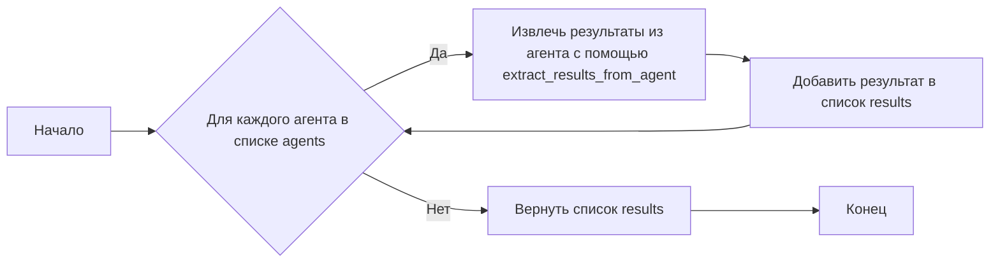
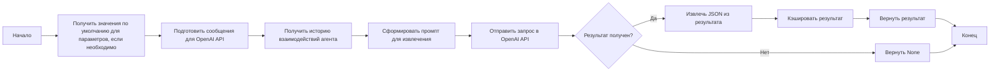
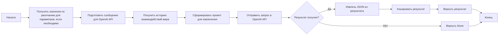
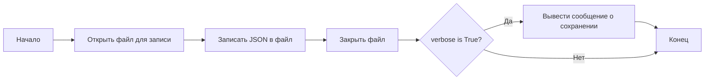
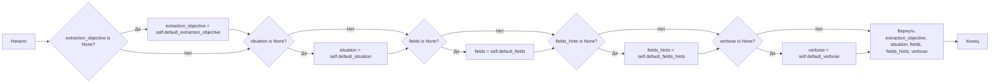

# Модуль извлечения результатов `results_extractor.py`

## Обзор

Модуль `results_extractor.py` предназначен для извлечения ключевой информации из истории взаимодействий агентов в рамках проекта `tinytroupe`. Он предоставляет класс `ResultsExtractor`, который позволяет извлекать результаты как из отдельных агентов (`TinyPerson`), так и из целых виртуальных миров (`TinyWorld`). Модуль использует шаблоны `chevron` для формирования запросов к OpenAI API и преобразует полученные ответы в структурированный формат JSON.

## Подробней

Этот модуль является важной частью системы, поскольку он автоматизирует процесс анализа и обобщения данных, полученных в результате моделирования взаимодействий агентов. Он позволяет исследователям и разработчикам быстро выявлять основные тенденции и закономерности в поведении агентов, а также оценивать эффективность различных стратегий и сценариев.

## Классы

### `ResultsExtractor`

**Описание**: Класс `ResultsExtractor` предназначен для извлечения результатов из истории взаимодействий агентов (`TinyPerson`) или виртуальных миров (`TinyWorld`).

**Принцип работы**:
Класс инициализируется с путем к шаблону промпта для извлечения, а также значениями по умолчанию для различных параметров, таких как цель извлечения, ситуация, поля для извлечения и уровень детализации. Он предоставляет методы для извлечения результатов из агентов и миров, а также для сохранения результатов в формате JSON.

**Аттрибуты**:
- `_extraction_prompt_template_path` (str): Путь к шаблону промпта для извлечения информации.
- `default_extraction_objective` (str): Цель извлечения информации по умолчанию.
- `default_situation` (str): Ситуация по умолчанию, используемая при извлечении информации.
- `default_fields` (List[str] | None): Список полей для извлечения по умолчанию.
- `default_fields_hints` (dict | None): Подсказки для полей извлечения по умолчанию.
- `default_verbose` (bool): Флаг, определяющий, нужно ли выводить отладочные сообщения по умолчанию.
- `agent_extraction` (dict): Кэш для хранения последних результатов извлечения для агентов.
- `world_extraction` (dict): Кэш для хранения последних результатов извлечения для виртуальных миров.

**Методы**:
- `__init__`: Инициализирует объект `ResultsExtractor` с заданными параметрами.
- `extract_results_from_agents`: Извлекает результаты из списка агентов.
- `extract_results_from_agent`: Извлекает результаты из одного агента.
- `extract_results_from_world`: Извлекает результаты из виртуального мира.
- `save_as_json`: Сохраняет извлеченные результаты в файл JSON.
- `_get_default_values_if_necessary`: Возвращает значения по умолчанию для параметров, если они не были заданы.

## Функции

### `__init__`

```python
def __init__(self, 
             extraction_prompt_template_path:str = os.path.join(os.path.dirname(__file__), './prompts/interaction_results_extractor.mustache'),
             extraction_objective:str = "The main points present in the agents' interactions history.",
             situation:str = "",
             fields:List[str] = None,
             fields_hints:dict = None,
             verbose:bool = False):
    """
    Initializes the ResultsExtractor with default parameters.

    Args:
        extraction_prompt_template_path (str): The path to the extraction prompt template.
        extraction_objective (str): The default extraction objective.
        situation (str): The default situation to consider.
        fields (List[str], optional): The default fields to extract. Defaults to None.
        fields_hints (dict, optional): The default hints for the fields to extract. Defaults to None.
        verbose (bool, optional): Whether to print debug messages by default. Defaults to False.
    """
    ...
```

**Назначение**: Инициализация класса `ResultsExtractor` с параметрами по умолчанию.

**Параметры**:
- `extraction_prompt_template_path` (str): Путь к шаблону промпта извлечения. По умолчанию - `./prompts/interaction_results_extractor.mustache`.
- `extraction_objective` (str): Цель извлечения по умолчанию. По умолчанию: "The main points present in the agents' interactions history.".
- `situation` (str): Описание ситуации по умолчанию. По умолчанию пустая строка.
- `fields` (List[str] | None): Список полей для извлечения. По умолчанию `None`.
- `fields_hints` (dict | None): Словарь с подсказками для полей. По умолчанию `None`.
- `verbose` (bool): Флаг для вывода отладочной информации. По умолчанию `False`.

**Как работает функция**:

1.  Сохраняет путь к файлу шаблона промпта извлечения во внутреннюю переменную `self._extraction_prompt_template_path`.
2.  Сохраняет параметры по умолчанию, такие как цель извлечения, ситуацию, поля и подсказки для полей, а также флаг отладки во внутренние переменные экземпляра класса.
3.  Инициализирует кэш `self.agent_extraction` и `self.world_extraction` для хранения извлеченных данных об агентах и мире, соответственно.

**Примеры**:

```python
extractor = ResultsExtractor(verbose=True)
```

```python
extractor = ResultsExtractor(extraction_objective="Find the most important decisions made by the agents.")
```

### `extract_results_from_agents`

```python
def extract_results_from_agents(self,
                                    agents:List[TinyPerson],
                                    extraction_objective:str=None,
                                    situation:str =None,
                                    fields:list=None,
                                    fields_hints:dict=None,
                                    verbose:bool=None):
    """
    Extracts results from a list of TinyPerson instances.

    Args:
        agents (List[TinyPerson]): The list of TinyPerson instances to extract results from.
        extraction_objective (str): The extraction objective.
        situation (str): The situation to consider.
        fields (list, optional): The fields to extract. If None, the extractor will decide what names to use. 
            Defaults to None.
        fields_hints (dict, optional): Hints for the fields to extract. Maps field names to strings with the hints. Defaults to None.
        verbose (bool, optional): Whether to print debug messages. Defaults to False.
    """
    ...
```

**Назначение**: Извлечение результатов из списка объектов `TinyPerson`.

**Параметры**:
- `agents` (List[TinyPerson]): Список экземпляров `TinyPerson`, из которых нужно извлечь результаты.
- `extraction_objective` (str | None): Цель извлечения. Если `None`, используется значение по умолчанию.
- `situation` (str | None): Ситуация для рассмотрения. Если `None`, используется значение по умолчанию.
- `fields` (list | None): Список полей для извлечения. Если `None`, используется значение по умолчанию.
- `fields_hints` (dict | None): Подсказки для полей извлечения. Если `None`, используется значение по умолчанию.
- `verbose` (bool | None): Флаг для вывода отладочной информации. Если `None`, используется значение по умолчанию.

**Возвращает**:
- `results` (list): Список извлеченных результатов, каждый элемент которого соответствует результату извлечения из одного агента.

**Как работает функция**:



1.  Инициализируется пустой список `results` для хранения результатов извлечения.
2.  Функция итерируется по каждому агенту в списке `agents`.
3.  Для каждого агента вызывается метод `extract_results_from_agent` с передачей текущего агента и параметров извлечения.
4.  Результат, возвращенный методом `extract_results_from_agent`, добавляется в список `results`.
5.  После обработки всех агентов, функция возвращает список `results`.

**Примеры**:

```python
agents = [TinyPerson(...), TinyPerson(...)]
results = extractor.extract_results_from_agents(agents, extraction_objective="Find the agent's goals")
```

### `extract_results_from_agent`

```python
def extract_results_from_agent(self, 
                    tinyperson:TinyPerson, 
                    extraction_objective:str="The main points present in the agent's interactions history.", 
                    situation:str = "", 
                    fields:list=None,
                    fields_hints:dict=None,
                    verbose:bool=None):
    """
    Extracts results from a TinyPerson instance.

    Args:
        tinyperson (TinyPerson): The TinyPerson instance to extract results from.
        extraction_objective (str): The extraction objective.
        situation (str): The situation to consider.
        fields (list, optional): The fields to extract. If None, the extractor will decide what names to use. 
            Defaults to None.
        fields_hints (dict, optional): Hints for the fields to extract. Maps field names to strings with the hints. Defaults to None.
        verbose (bool, optional): Whether to print debug messages. Defaults to False.
    """
    ...
```

**Назначение**: Извлечение результатов из экземпляра `TinyPerson`.

**Параметры**:
- `tinyperson` (TinyPerson): Экземпляр `TinyPerson`, из которого нужно извлечь результаты.
- `extraction_objective` (str): Цель извлечения. По умолчанию "The main points present in the agent's interactions history.".
- `situation` (str): Ситуация для рассмотрения. По умолчанию пустая строка.
- `fields` (list | None): Список полей для извлечения. Если `None`, используется значение по умолчанию.
- `fields_hints` (dict | None): Подсказки для полей извлечения. Если `None`, используется значение по умолчанию.
- `verbose` (bool | None): Флаг для вывода отладочной информации. Если `None`, используется значение по умолчанию.

**Возвращает**:
- `result` (dict | None): Извлеченные результаты в формате JSON или `None` в случае ошибки.

**Как работает функция**:



1.  Получает значения по умолчанию для параметров извлечения, таких как `extraction_objective`, `situation`, `fields`, `fields_hints` и `verbose`, если они не были переданы явно.
2.  Подготавливает сообщения для OpenAI API, включая системное сообщение с целью извлечения и подсказками для полей.
3.  Получает историю взаимодействий агента с помощью метода `tinyperson.pretty_current_interactions`.
4.  Формирует промпт для извлечения, включающий цель извлечения, ситуацию и историю взаимодействий агента.
5.  Отправляет запрос в OpenAI API с использованием метода `openai_utils.client().send_message`.
6.  Извлекает JSON из полученного сообщения с помощью функции `utils.extract_json`.
7.  Кэширует результат извлечения в `self.agent_extraction`.
8.  Возвращает извлеченный результат.

**Примеры**:

```python
agent = TinyPerson(...)
result = extractor.extract_results_from_agent(agent, extraction_objective="Find the agent's goals")
```

### `extract_results_from_world`

```python
def extract_results_from_world(self, 
                                   tinyworld:TinyWorld, 
                                   extraction_objective:str="The main points that can be derived from the agents conversations and actions.", 
                                   situation:str="", 
                                   fields:list=None,
                                   fields_hints:dict=None,
                                   verbose:bool=None):
    """
    Extracts results from a TinyWorld instance.

    Args:
        tinyworld (TinyWorld): The TinyWorld instance to extract results from.
        extraction_objective (str): The extraction objective.
        situation (str): The situation to consider.
        fields (list, optional): The fields to extract. If None, the extractor will decide what names to use. 
            Defaults to None.
        verbose (bool, optional): Whether to print debug messages. Defaults to False.
    """
    ...
```

**Назначение**: Извлечение результатов из экземпляра `TinyWorld`.

**Параметры**:
- `tinyworld` (TinyWorld): Экземпляр `TinyWorld`, из которого нужно извлечь результаты.
- `extraction_objective` (str): Цель извлечения. По умолчанию "The main points that can be derived from the agents conversations and actions.".
- `situation` (str): Ситуация для рассмотрения. По умолчанию пустая строка.
- `fields` (list | None): Список полей для извлечения. Если `None`, используется значение по умолчанию.
- `fields_hints` (dict | None): Подсказки для полей извлечения. Если `None`, используется значение по умолчанию.
- `verbose` (bool | None): Флаг для вывода отладочной информации. Если `None`, используется значение по умолчанию.

**Возвращает**:
- `result` (dict | None): Извлеченные результаты в формате JSON или `None` в случае ошибки.

**Как работает функция**:



1.  Получает значения по умолчанию для параметров извлечения, таких как `extraction_objective`, `situation`, `fields`, `fields_hints` и `verbose`, если они не были переданы явно.
2.  Подготавливает сообщения для OpenAI API, включая системное сообщение с целью извлечения и подсказками для полей.
3.  Получает историю взаимодействий мира с помощью метода `tinyworld.pretty_current_interactions`.
4.  Формирует промпт для извлечения, включающий цель извлечения, ситуацию и историю взаимодействий мира.
5.  Отправляет запрос в OpenAI API с использованием метода `openai_utils.client().send_message`.
6.  Извлекает JSON из полученного сообщения с помощью функции `utils.extract_json`.
7.  Кэширует результат извлечения в `self.world_extraction`.
8.  Возвращает извлеченный результат.

**Примеры**:

```python
world = TinyWorld(...)
result = extractor.extract_results_from_world(world, extraction_objective="Find the world's main events")
```

### `save_as_json`

```python
def save_as_json(self, filename:str, verbose:bool=False):
    """
    Saves the last extraction results as JSON.

    Args:
        filename (str): The filename to save the JSON to.
        verbose (bool, optional): Whether to print debug messages. Defaults to False.
    """
    ...
```

**Назначение**: Сохранение последних извлеченных результатов в формате JSON.

**Параметры**:
- `filename` (str): Имя файла для сохранения JSON.
- `verbose` (bool): Флаг для вывода отладочной информации. По умолчанию `False`.

**Как работает функция**:



1.  Открывает файл с именем `filename` для записи.
2.  Записывает словарь, содержащий результаты извлечения агентов (`self.agent_extraction`) и мира (`self.world_extraction`), в файл в формате JSON с отступами для удобочитаемости.
3.  Закрывает файл.
4.  Если `verbose` имеет значение `True`, выводит сообщение о том, что результаты извлечения были сохранены в указанный файл.

**Примеры**:

```python
extractor.save_as_json("results.json", verbose=True)
```

### `_get_default_values_if_necessary`

```python
def _get_default_values_if_necessary(self,
                        extraction_objective:str,
                        situation:str,
                        fields:List[str],
                        fields_hints:dict,
                        verbose:bool):
        
    """
    Gets default values if the provided values are None.
    """

    ...
```

**Назначение**: Возвращает значения по умолчанию для параметров, если переданные значения равны `None`.

**Параметры**:
- `extraction_objective` (str | None): Цель извлечения.
- `situation` (str | None): Ситуация для рассмотрения.
- `fields` (List[str] | None): Список полей для извлечения.
- `fields_hints` (dict | None): Подсказки для полей извлечения.
- `verbose` (bool | None): Флаг для вывода отладочной информации.

**Возвращает**:
- `extraction_objective` (str): Цель извлечения.
- `situation` (str): Ситуация для рассмотрения.
- `fields` (List[str] | None): Список полей для извлечения.
- `fields_hints` (dict | None): Подсказки для полей извлечения.
- `verbose` (bool): Флаг для вывода отладочной информации.

**Как работает функция**:



1.  Проверяет, является ли `extraction_objective` `None`. Если да, присваивает ему значение `self.default_extraction_objective`.
2.  Проверяет, является ли `situation` `None`. Если да, присваивает ему значение `self.default_situation`.
3.  Проверяет, является ли `fields` `None`. Если да, присваивает ему значение `self.default_fields`.
4.  Проверяет, является ли `fields_hints` `None`. Если да, присваивает ему значение `self.default_fields_hints`.
5.  Проверяет, является ли `verbose` `None`. Если да, присваивает ему значение `self.default_verbose`.
6.  Возвращает обновленные значения `extraction_objective`, `situation`, `fields`, `fields_hints` и `verbose`.

**Примеры**:

```python
extraction_objective, situation, fields, fields_hints, verbose = extractor._get_default_values_if_necessary(None, None, None, None, None)