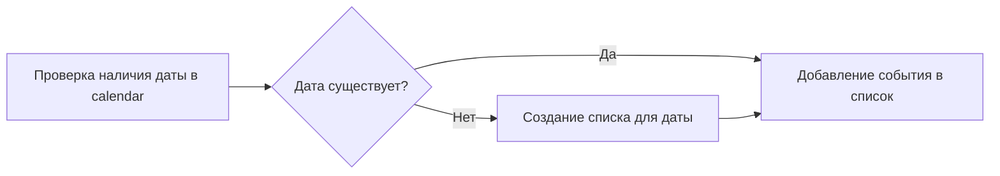
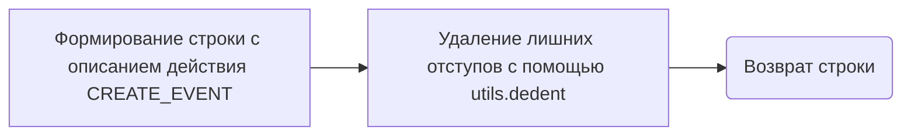

# Модуль `tiny_calendar.py`

## Обзор

Модуль `tiny_calendar.py` предоставляет класс `TinyCalendar`, который является инструментом для управления календарем агентов. Он позволяет агентам отслеживать встречи и события.

## Подробнее

Модуль содержит класс `TinyCalendar`, который наследуется от класса `TinyTool`. Основная задача класса `TinyCalendar` - предоставление функциональности календаря для агентов, позволяя им добавлять события, находить события и управлять ими. Класс использует словарь `calendar` для хранения событий, где ключом является дата, а значением - список событий.

## Классы

### `TinyCalendar`

**Описание**: Класс `TinyCalendar` предоставляет инструмент календаря для агентов, позволяя им отслеживать встречи и события.

**Наследует**:
- `TinyTool`: Класс `TinyCalendar` наследует функциональность от класса `TinyTool`.

**Атрибуты**:
- `calendar` (dict): Словарь, отображающий дату на список событий. Каждое событие представлено словарем с ключами "title", "description", "owner", "mandatory_attendees", "optional_attendees", "start_time", "end_time".

**Методы**:
- `__init__(self, owner=None)`: Конструктор класса, инициализирует инструмент календаря.
- `add_event(self, date, title, description=None, owner=None, mandatory_attendees=None, optional_attendees=None, start_time=None, end_time=None)`: Добавляет новое событие в календарь.
- `find_events(self, year, month, day, hour=None, minute=None)`: Ищет события в календаре по указанным параметрам даты и времени.
- `_process_action(self, agent, action) -> bool`: Обрабатывает действия, связанные с календарем, такие как создание событий.
- `actions_definitions_prompt(self) -> str`: Возвращает текстовое описание доступных действий для агента.
- `actions_constraints_prompt(self) -> str`: Возвращает текстовое описание ограничений на действия агента.

### `__init__`

```python
def __init__(self, owner=None):
    """
    Инициализирует экземпляр класса `TinyCalendar`.

    Args:
        owner (Any, optional): Владелец календаря. По умолчанию `None`.

    """
    ...
```

**Назначение**: Инициализирует объект `TinyCalendar`, вызывая конструктор родительского класса `TinyTool` и инициализируя атрибут `calendar` как пустой словарь.

**Параметры**:
- `owner` (Any, optional): Владелец календаря. По умолчанию `None`.

**Как работает функция**:
1. Вызывает конструктор родительского класса `TinyTool` с передачей имени "calendar", описания, владельца и флага `real_world_side_effects=False`.
2. Инициализирует атрибут `calendar` как пустой словарь, который будет использоваться для хранения событий календаря.

```mermaid
graph LR
    A[Вызов конструктора TinyTool] --> B(Инициализация self.calendar = {})
```

**Примеры**:

```python
calendar = TinyCalendar()
```

### `add_event`

```python
def add_event(self, date, title, description=None, owner=None, mandatory_attendees=None, optional_attendees=None, start_time=None, end_time=None):
    """
    Добавляет новое событие в календарь.

    Args:
        date (Any): Дата события.
        title (Any): Название события.
        description (Any, optional): Описание события. По умолчанию `None`.
        owner (Any, optional): Владелец события. По умолчанию `None`.
        mandatory_attendees (Any, optional): Список обязательных участников. По умолчанию `None`.
        optional_attendees (Any, optional): Список необязательных участников. По умолчанию `None`.
        start_time (Any, optional): Время начала события. По умолчанию `None`.
        end_time (Any, optional): Время окончания события. По умолчанию `None`.
    """
    ...
```

**Назначение**: Добавляет новое событие в календарь для указанной даты.

**Параметры**:
- `date` (Any): Дата события.
- `title` (Any): Название события.
- `description` (Any, optional): Описание события. По умолчанию `None`.
- `owner` (Any, optional): Владелец события. По умолчанию `None`.
- `mandatory_attendees` (Any, optional): Список обязательных участников. По умолчанию `None`.
- `optional_attendees` (Any, optional): Список необязательных участников. По умолчанию `None`.
- `start_time` (Any, optional): Время начала события. По умолчанию `None`.
- `end_time` (Any, optional): Время окончания события. По умолчанию `None`.

**Как работает функция**:
1. Проверяет, существует ли запись для указанной даты в словаре `calendar`. Если нет, создает новую запись (список) для этой даты.
2. Добавляет словарь с информацией о событии (название, описание, владельца, списки участников, время начала и окончания) в список событий для указанной даты.



**Примеры**:

```python
calendar = TinyCalendar()
calendar.add_event("2024-01-01", "New Year", "New Year celebration")
```

### `find_events`

```python
def find_events(self, year, month, day, hour=None, minute=None):
    """
    Ищет события в календаре по указанным параметрам даты и времени.

    Args:
        year (Any): Год.
        month (Any): Месяц.
        day (Any): День.
        hour (Any, optional): Час. По умолчанию `None`.
        minute (Any, optional): Минута. По умолчанию `None`.
    """
    ...
```

**Назначение**: Ищет события в календаре на основе указанных года, месяца и дня.

**Параметры**:
- `year` (Any): Год для поиска событий.
- `month` (Any): Месяц для поиска событий.
- `day` (Any): День для поиска событий.
- `hour` (Any, optional): Час для поиска событий. По умолчанию `None`.
- `minute` (Any, optional): Минута для поиска событий. По умолчанию `None`.

**Как работает функция**:
Функция пока не реализована (`pass`).

### `_process_action`

```python
def _process_action(self, agent, action) -> bool:
    """
    Обрабатывает действия, связанные с календарем, такие как создание событий.

    Args:
        agent (Any): Агент, выполняющий действие.
        action (dict): Словарь, содержащий информацию о действии.

    Returns:
        bool: `True`, если действие было успешно обработано, `False` в противном случае.
    """
    ...
```

**Назначение**: Обрабатывает действия, связанные с календарем, такие как создание событий.

**Параметры**:
- `agent` (Any): Агент, выполняющий действие.
- `action` (dict): Словарь, содержащий информацию о действии.

**Возвращает**:
- `bool`: `True`, если действие было успешно обработано, `False` в противном случае.

**Как работает функция**:
1. Проверяет, что тип действия (`action['type']`) равен "CREATE_EVENT" и что содержимое действия (`action['content']`) не равно `None`.
2. Если условие выполнено, парсит содержимое действия как JSON.
3. Проверяет, что в содержимом JSON нет недопустимых ключей. Допустимые ключи: "title", "description", "mandatory_attendees", "optional_attendees", "start_time", "end_time".
4. Использует полученные данные для создания нового события с помощью метода `add_event`.
5. Возвращает `True`, если действие успешно обработано.
6. Если тип действия не "CREATE_EVENT" или содержимое действия равно `None`, возвращает `False`.

```mermaid
graph LR
    A[Проверка типа действия и содержимого] --> B{Тип = "CREATE_EVENT" и content != None?}
    B -- Да --> C[Парсинг content как JSON]
    C --> D[Проверка допустимых ключей]
    D --> E[Создание нового события с помощью add_event]
    E --> F(Возврат True)
    B -- Нет --> G(Возврат False)
```

**Примеры**:

```python
calendar = TinyCalendar()
action = {'type': 'CREATE_EVENT', 'content': '{"title": "Meeting", "description": "Discuss project progress"}'}
result = calendar._process_action(None, action)
print(result)  # Вывод: True
```

### `actions_definitions_prompt`

```python
def actions_definitions_prompt(self) -> str:
    """
    Возвращает текстовое описание доступных действий для агента.

    Returns:
        str: Текстовое описание доступных действий.
    """
    ...
```

**Назначение**: Возвращает текстовое описание доступных действий, которые агент может выполнить с календарем.

**Возвращает**:
- `str`: Текстовое описание доступных действий.

**Как работает функция**:
1. Формирует строку с описанием действия "CREATE_EVENT", указывая, что агент может создать новое событие в своем календаре.
2. Описывает поля, которые можно использовать в JSON-формате для задания параметров события, такие как "title", "description", "mandatory_attendees", "optional_attendees", "start_time", "end_time".
3. Использует функцию `utils.dedent` для удаления лишних отступов из строки.
4. Возвращает полученную строку.



**Примеры**:

```python
calendar = TinyCalendar()
prompt = calendar.actions_definitions_prompt()
print(prompt)
```

### `actions_constraints_prompt`

```python
def actions_constraints_prompt(self) -> str:
    """
    Возвращает текстовое описание ограничений на действия агента.

    Returns:
        str: Текстовое описание ограничений на действия агента.
    """
    ...
```

**Назначение**: Возвращает текстовое описание ограничений на действия, которые агент может выполнить с календарем.

**Возвращает**:
- `str`: Текстовое описание ограничений на действия агента.

**Как работает функция**:
Функция пока не реализована (`pass`).