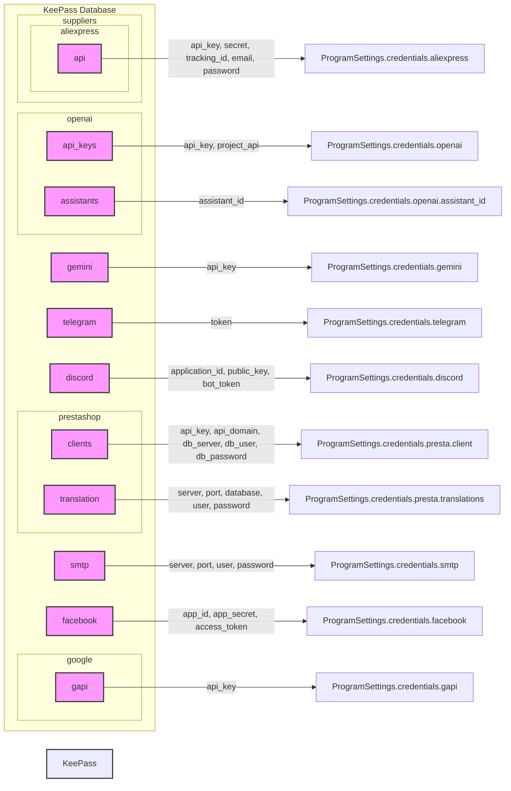

# keepass

**Общая схема работы:**

Код использует `pykeepass` для доступа к файлу `credentials.kdbx`, который хранит зашифрованные учетные данные. Вся логика работы с `pykeepass` сосредоточена в классе `ProgramSettings`. Этот класс является синглтоном, что гарантирует существование единственного экземпляра настроек для всего приложения.

**Основные этапы работы с KeePass:**

1.  **Открытие базы данных:**
    *   Метод `_open_kp` отвечает за открытие файла базы данных KeePass (`credentials.kdbx`).
    *   Он пытается прочитать пароль из файла `password.txt`, если он существует, или запрашивает пароль у пользователя через консоль.
    *   При неудачной попытке открытия, метод повторяет попытку несколько раз.
    *   Если все попытки неудачны, программа завершает работу.
2.  **Загрузка учетных данных:**
    *   После успешного открытия, вызывается метод `_load_credentials`, который вызывает методы загрузки для каждой категории учетных данных.
    *   Эти методы используют `kp.find_groups` для поиска групп и записей в базе данных KeePass.
    *   Далее, из каждой записи извлекаются необходимые данные (например, API ключи, пароли, логины) через `entry.custom_properties` и `entry.password`.

**Структура базы данных KeePass и получаемые данные:**

Посмотрим на конкретные места в коде и какие данные оттуда извлекаются, и какая структура базы данных подразумевается.

1.  **Aliexpress:**
    *   Ищется группа `suppliers/aliexpress/api`.
    *   Извлекаются `api_key`, `secret`, `tracking_id`, `email` из кастомных свойств записи и `password` из пароля записи.
    *   Эти данные сохраняются в `ProgramSettings.credentials.aliexpress` в виде атрибутов `api_key`, `secret`, `tracking_id`, `email` и `password`.

2.  **OpenAI:**
    *   Ищется группа `openai`.
    *   Извлекаются `api_key`, `project_api` из кастомных свойств записи. Имя записи становится именем атрибута `ProgramSettings.credentials.openai`.
    *   Из группы `openai/assistants` извлекаются `assistant_id` из кастомных свойств записи. Имя записи становится именем атрибута `ProgramSettings.credentials.openai.assistant_id`.
   

3.  **Gemini:**
    *   Ищется группа `gemini`.
    *   Извлекается `api_key` из кастомных свойств записи. Имя записи становится именем атрибута `ProgramSettings.credentials.gemini`.

4. **Telegram:**
    * Ищется группа `telegram`.
    * Извлекается `token` из кастомных свойств записи. Имя записи становится именем атрибута `ProgramSettings.credentials.telegram`.

5.  **Discord:**
    *   Ищется группа `discord`.
    *   Извлекаются `application_id`, `public_key` и `bot_token` из кастомных свойств записи.
    *   Эти данные сохраняются в `ProgramSettings.credentials.discord` в виде атрибутов `application_id`, `public_key` и `bot_token`.

6.  **PrestaShop:**
    *   Ищется группа `prestashop/clients`.
    *   Извлекаются `api_key`, `api_domain`, `db_server`, `db_user`, `db_password` из кастомных свойств каждой записи.
    *   Каждый набор данных добавляется как объект `SimpleNamespace` в список `ProgramSettings.credentials.presta.client`.

    *   Ищется группа `prestashop/translation`.
    *    Извлекаются `server`, `port`, `database`, `user`, `password` из кастомных свойств первой записи.
    *    Эти данные сохраняются в `ProgramSettings.credentials.presta.translations`.

7.  **SMTP:**
    *   Ищется группа `smtp`.
    *   Извлекаются `server`, `port`, `user` и `password` из кастомных свойств каждой записи.
    *   Каждый набор данных добавляется как объект `SimpleNamespace` в список `ProgramSettings.credentials.smtp`.

8.  **Facebook:**
    *   Ищется группа `facebook`.
    *   Извлекаются `app_id`, `app_secret` и `access_token` из кастомных свойств каждой записи.
    *    Каждый набор данных добавляется как объект `SimpleNamespace` в список `ProgramSettings.credentials.facebook`.

9. **Google API:**
    *   Ищется группа `google/gapi`.
    *   Извлекается `api_key` из кастомных свойств записи.
    *    Этот данные сохраняются в `ProgramSettings.credentials.gapi` по ключу `api_key`.

**Важные моменты:**

*   **Иерархия:** В базе данных KeePass предполагается иерархическая структура папок и записей. Код использует `kp.find_groups(path=['...'])` для навигации по этой структуре.
*   **Кастомные свойства:** Большинство данных хранятся в кастомных свойствах записей KeePass.
*   **Обработка ошибок:** Код содержит блоки `try-except` для обработки ошибок при открытии базы данных и извлечении данных.
*   **`SimpleNamespace`:** Для хранения настроек и учетных данных используются объекты `SimpleNamespace`, что позволяет обращаться к данным как к атрибутам объекта.

