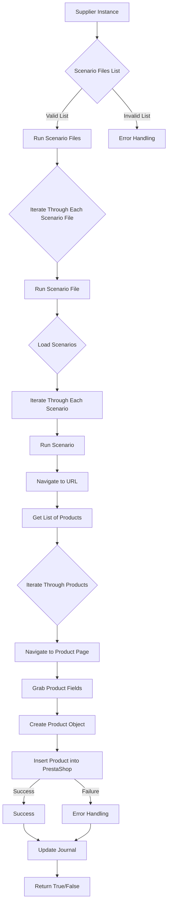

# Модуль `src.scenario`

## Обзор

Модуль `src.scenario` предназначен для автоматизации взаимодействия с поставщиками с использованием сценариев, описанных в JSON-файлах. Он упрощает процесс извлечения и обработки данных о продуктах с веб-сайтов поставщиков и синхронизации этой информации с базой данных (например, PrestaShop). Модуль включает в себя функциональность для чтения сценариев, взаимодействия с веб-сайтами, обработки данных, ведения журналов выполнения и организации всего рабочего процесса.

## Содержание

* [Модуль `src.scenario`](#module-src-scenario)
* [Обзор](#overview)
* [Основные функции модуля](#основные-функции-модуля)
* [Основные компоненты модуля](#основные-компоненты-модуля)
    * [`run_scenario_files(s, scenario_files_list)`](#run_scenario_files-s-scenario_files_list)
    * [`run_scenario_file(s, scenario_file)`](#run_scenario_file-s-scenario_file)
    * [`run_scenario(s, scenario)`](#run_scenario-s-scenario)
    * [`dump_journal(s, journal)`](#dump_journal-s-journal)
    * [`main()`](#main)
* [Пример сценария](#пример-сценария)
* [Принцип работы](#как-это-работает)

## Основные функции модуля

1. **Чтение сценариев**: Загрузка сценариев из JSON-файлов, содержащих информацию о продуктах и URL-адреса на веб-сайте поставщика.
2. **Взаимодействие с веб-сайтами**: Обработка URL-адресов из сценариев для извлечения данных о продуктах.
3. **Обработка данных**: Преобразование извлеченных данных в формат, подходящий для базы данных, и сохранение их.
4. **Ведение журнала выполнения**: Ведение журналов с подробной информацией о выполнении сценариев и результатах для отслеживания прогресса и выявления ошибок.



## Основные компоненты модуля

### `run_scenario_files(s, scenario_files_list)`

**Описание**: Принимает список файлов сценариев и выполняет их последовательно, вызывая функцию `run_scenario_file` для каждого файла.

**Параметры**:
- `s`: Объект настроек (например, для подключения к базе данных).
- `scenario_files_list` (list): Список путей к файлам сценариев.

**Возвращает**:
- `None`

**Вызывает исключения**:
- `FileNotFoundError`: Если файл сценария не найден.
- `JSONDecodeError`: Если файл сценария содержит недопустимый JSON.

Функция `run_scenario_files` предназначена для последовательного запуска файлов сценариев, передавая каждый файл на обработку в функцию `run_scenario_file`. Она обеспечивает возможность пакетной обработки сценариев, что полезно для автоматизации задач, требующих выполнения нескольких сценариев подряд.

**Как работает функция**:

1. Функция принимает список путей к файлам сценариев `scenario_files_list` и объект настроек `s`.
2. Для каждого `scenario_file` в `scenario_files_list` вызывается функция `run_scenario_file(s, scenario_file)`.
3. Если во время выполнения `run_scenario_file` возникает исключение (например, `FileNotFoundError` или `JSONDecodeError`), оно перехватывается и логируется.
4. После обработки всех файлов сценариев функция завершается.

```ascii
Начало
  ↓
Для каждого scenario_file в scenario_files_list:
  → Вызов run_scenario_file(s, scenario_file)
  ↓
  Если возникло исключение:
    → Логирование исключения
  ↓
Конец
```

**Примеры**:

Пример вызова функции:

```python
s = Settings() #  Settings - не существует, необходимо сначала определить класс Settings
scenario_files_list = ['scenario1.json', 'scenario2.json', 'scenario3.json']
run_scenario_files(s, scenario_files_list)
```

### `run_scenario_file(s, scenario_file)`

**Описание**: Загружает сценарии из указанного файла и вызывает `run_scenario` для каждого сценария в файле.

**Параметры**:
- `s`: Объект настроек.
- `scenario_file` (str): Путь к файлу сценариев.

**Возвращает**:
- `None`

**Вызывает исключения**:
- `FileNotFoundError`: Если файл сценария не найден.
- `JSONDecodeError`: Если файл сценария содержит недопустимый JSON.
- `Exception`: Для любых других проблем во время выполнения сценария.

Функция `run_scenario_file` отвечает за чтение сценариев из файла и их последующий запуск. Она является промежуточным звеном между списком файлов сценариев и выполнением отдельных сценариев.

**Как работает функция**:

1. Функция принимает объект настроек `s` и путь к файлу сценариев `scenario_file`.
2. Пытается открыть и загрузить JSON-содержимое из `scenario_file`.
3. Если загрузка прошла успешно, для каждого сценария в загруженном JSON (предположительно, в ключе `'scenarios'`) вызывается функция `run_scenario(s, scenario)`.
4. Если во время выполнения возникают исключения (например, файл не найден, JSON недействителен или произошла ошибка во время выполнения сценария), они перехватываются и логируются.
5. После обработки всех сценариев функция завершается.

```ascii
Начало
  ↓
Открыть и загрузить JSON из scenario_file
  ↓
  Если загрузка успешна:
    → Для каждого scenario в загруженном JSON:
      → Вызов run_scenario(s, scenario)
      ↓
      Если возникло исключение:
        → Логирование исключения
      ↓
Конец
```

**Примеры**:

Пример вызова функции:

```python
s = Settings()  #  Settings - не существует, необходимо сначала определить класс Settings
scenario_file = 'scenario.json'
run_scenario_file(s, scenario_file)
```

### `run_scenario(s, scenario)`

**Описание**: Обрабатывает отдельный сценарий, переходя по URL-адресу, извлекая данные о продукте и сохраняя их в базу данных.

**Параметры**:
- `s`: Объект настроек.
- `scenario` (dict): Словарь, содержащий сценарий (например, с URL-адресом и категориями).

**Возвращает**:
- `None`

**Вызывает исключения**:
- `requests.exceptions.RequestException`: Если возникают проблемы с запросом к веб-сайту.
- `Exception`: Для любых других проблем во время обработки сценария.

Функция `run_scenario` является основной функцией обработки сценариев. Она отвечает за навигацию по URL, извлечение данных о продуктах и сохранение их в базу данных.

**Как работает функция**:

1. Функция принимает объект настроек `s` и словарь `scenario`, содержащий информацию о сценарии.
2. Извлекает URL из сценария.
3. Переходит по URL-адресу, используя `requests.get`.
4. Извлекает данные о продуктах со страницы.
5. Преобразует извлеченные данные в формат, подходящий для базы данных.
6. Сохраняет данные в базу данных (например, PrestaShop).
7. В случае возникновения исключений во время выполнения (например, проблемы с запросом к веб-сайту, ошибки при извлечении данных или проблемы с базой данных), они перехватываются и логируются.
8. Обновляет журнал выполнения.
9. Функция завершается.

```ascii
Начало
  ↓
Извлечь URL из scenario
  ↓
Перейти по URL
  ↓
Извлечь данные о продуктах
  ↓
Преобразовать данные в формат БД
  ↓
Сохранить данные в БД
  ↓
Если возникло исключение:
  → Логирование исключения
  ↓
Обновить журнал выполнения
  ↓
Конец
```

**Примеры**:

Пример вызова функции:

```python
s = Settings()   #  Settings - не существует, необходимо сначала определить класс Settings
scenario = {
    'url': 'https://example.com/product/123',
    'name': 'Example Product',
    'presta_categories': {'default_category': 1, 'additional_categories': [2, 3]}
}
run_scenario(s, scenario)
```

### `dump_journal(s, journal)`

**Описание**: Сохраняет журнал выполнения в файл для последующего анализа.

**Параметры**:
- `s`: Объект настроек.
- `journal` (list): Список записей журнала выполнения.

**Возвращает**:
- `None`

**Вызывает исключения**:
- `Exception`: Если возникают проблемы при записи в файл.

Функция `dump_journal` отвечает за сохранение журнала выполнения в файл. Это позволяет анализировать результаты выполнения сценариев и выявлять проблемы.

**Как работает функция**:

1. Функция принимает объект настроек `s` и список `journal`, содержащий записи журнала выполнения.
2. Открывает файл для записи (путь к файлу берется из настроек `s`).
3. Записывает журнал в файл в формате JSON.
4. В случае возникновения исключений во время записи в файл, они перехватываются и логируются.
5. Функция завершается.

```ascii
Начало
  ↓
Открыть файл для записи (из настроек s)
  ↓
Записать журнал в файл в формате JSON
  ↓
Если возникло исключение:
  → Логирование исключения
  ↓
Конец
```

**Примеры**:

Пример вызова функции:

```python
s = Settings()    #  Settings - не существует, необходимо сначала определить класс Settings
journal = [{'scenario': 'scenario1', 'status': 'success'}, {'scenario': 'scenario2', 'status': 'failure'}]
dump_journal(s, journal)
```

### `main()`

**Описание**: Главная функция для запуска модуля.

**Параметры**:
- `None`

**Возвращает**:
- `None`

**Вызывает исключения**:
- `Exception`: Для любых критических ошибок во время выполнения.

Функция `main` является точкой входа в модуль. Она отвечает за инициализацию настроек, запуск обработки сценариев и обработку ошибок.

**Как работает функция**:

1. Функция инициализирует объект настроек `s`.
2. Получает список файлов сценариев (например, из аргументов командной строки или из файла конфигурации).
3. Вызывает функцию `run_scenario_files` для обработки файлов сценариев.
4. В случае возникновения исключений во время выполнения, они перехватываются и логируются.
5. Функция завершается.

```ascii
Начало
  ↓
Инициализация настроек
  ↓
Получить список файлов сценариев
  ↓
Вызов run_scenario_files
  ↓
Если возникло исключение:
  → Логирование исключения
  ↓
Конец
```

**Примеры**:

Пример вызова функции:

```python
main()
```

## Пример сценария

Пример JSON-сценария описывает взаимодействие с категориями продуктов на веб-сайте. Он включает URL-адрес, название категории и идентификаторы категорий в базе данных PrestaShop.

```json
{
    "scenarios": {
        "mineral+creams": {
            "url": "https://example.com/category/mineral-creams/",
            "name": "mineral+creams",
            "presta_categories": {
                "default_category": 12345,
                "additional_categories": [12346, 12347]
            }
        }
    }
}
```

## Как это работает

Модуль `src.scenario` автоматизирует взаимодействие с веб-сайтами поставщиков для извлечения данных о продуктах и их синхронизации с базой данных PrestaShop. Он использует JSON-сценарии для описания шагов взаимодействия, таких как переходы по URL-адресам, извлечение данных и сохранение их в базе данных. Модуль также предоставляет функции для ведения журналов выполнения и обработки ошибок, что упрощает отслеживание прогресса и выявление проблем.