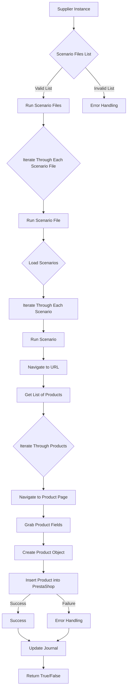

# Модуль `src.scenario`

## Обзор

Модуль `src.scenario` предназначен для автоматизации взаимодействия с поставщиками, используя сценарии, описанные в JSON-файлах. Он адаптирует процесс извлечения и обработки данных о продуктах с веб-сайтов поставщиков и синхронизирует эту информацию с базой данных (например, PrestaShop).  Модуль включает чтение сценариев, взаимодействие с веб-сайтами, обработку данных, запись журнала выполнения и организацию всего процесса.

## Подорбней

Модуль автоматизирует процесс сбора и обработки информации о продуктах с веб-сайтов поставщиков для последующей синхронизации с базой данных PrestaShop. Он позволяет стандартизировать и ускорить обновление данных о товарах, минимизируя ручной труд и повышая точность информации. Модуль читает сценарии из JSON-файлов, взаимодействует с веб-сайтами поставщиков, извлекает данные о продуктах, преобразует их в нужный формат и сохраняет в базе данных. Ведение журнала выполнения позволяет отслеживать процесс и выявлять возможные ошибки.

## Оглавление

* [Модуль `src.scenario`](#модуль-srcscenario)
* [Обзор](#обзор)
* [Основные функции модуля](#основные-функции-модуля)
* [Основные компоненты модуля](#основные-компоненты-модуля)
    * [`run_scenario_files(s, scenario_files_list)`](#run_scenario_files-s-scenario_files_list)
    * [`run_scenario_file(s, scenario_file)`](#run_scenario_file-s-scenario_file)
    * [`run_scenario(s, scenario)`](#run_scenario-s-scenario)
    * [`dump_journal(s, journal)`](#dump_journal-s-journal)
    * [`main()`](#main)
* [Пример сценария](#пример-сценария)
* [Как это работает](#как-это-работает)

## Основные функции модуля

1. **Чтение сценариев**: Загрузка сценариев из JSON-файлов, содержащих информацию о продуктах и их URL на сайте поставщика.
2. **Взаимодействие с веб-сайтами**:  Обработка URL-адресов из сценариев для извлечения данных о продуктах.
3. **Обработка данных**: Преобразование извлечённых данных в формат, подходящий для базы данных, и сохранение в неё.
4. **Запись журнала выполнения**: Ведение журнала с деталями выполнения сценариев и результатами работы для отслеживания процесса и выявления ошибок.



## Функции

### `run_scenario_files(s, scenario_files_list)`

**Описание**: Принимает список файлов сценариев и выполняет их по очереди, вызывая функцию `run_scenario_file` для каждого файла. Функция `run_scenario_files` является отправной точкой для обработки множества файлов сценариев. Она получает список файлов и последовательно обрабатывает каждый из них, передавая управление функции `run_scenario_file`.

**Параметры**:
- `s`: Объект настроек, содержащий параметры, необходимые для работы модуля, такие как настройки подключения к базе данных.
- `scenario_files_list` (list): Список путей к файлам сценариев, которые необходимо выполнить.

**Возвращает**:
- None

**Вызывает исключения**:
- `FileNotFoundError`: Если файл сценария не найден.
- `JSONDecodeError`: Если файл сценария содержит невалидный JSON.

**Как работает функция**:

1. Функция принимает список файлов сценариев (`scenario_files_list`).
2. Для каждого файла в списке вызывается функция `run_scenario_file`, которой передается объект настроек `s` и путь к файлу.

```ascii
Начало --> Проверка списка файлов сценариев
Проверка списка файлов сценариев -- Список валидный --> Итерация по файлам
Итерация по файлам --> Вызов функции run_scenario_file для каждого файла
Вызов функции run_scenario_file для каждого файла --> Конец
```

**Примеры**:

Предположим, у нас есть список файлов сценариев:

```python
scenario_files = ['scenario1.json', 'scenario2.json', 'scenario3.json']
```

Вызов функции будет выглядеть следующим образом:

```python
run_scenario_files(settings_object, scenario_files)
```

### `run_scenario_file(s, scenario_file)`

**Описание**: Загружает сценарии из указанного файла и вызывает `run_scenario` для каждого сценария в файле. Функция `run_scenario_file` отвечает за чтение содержимого файла сценариев и запуск каждого сценария, найденного в файле.

**Параметры**:
- `s`: Объект настроек.
- `scenario_file` (str): Путь к файлу сценария.

**Возвращает**:
- None

**Вызывает исключения**:
- `FileNotFoundError`: Если файл сценария не найден.
- `JSONDecodeError`: Если файл сценария содержит невалидный JSON.
- `Exception`: При любых других проблемах при работе со сценариями.

**Как работает функция**:

1. Функция принимает путь к файлу сценария (`scenario_file`).
2. Загружает содержимое файла, предполагая, что это JSON.
3. Для каждого сценария в загруженном JSON вызывается функция `run_scenario`, которой передается объект настроек `s` и сам сценарий.

```ascii
Начало --> Загрузка содержимого файла сценария
Загрузка содержимого файла сценария -- Файл найден и JSON валиден --> Итерация по сценариям
Итерация по сценариям --> Вызов функции run_scenario для каждого сценария
Вызов функции run_scenario для каждого сценария --> Конец
Загрузка содержимого файла сценария -- Ошибка при загрузке/JSON не валиден --> Обработка ошибок
```

**Примеры**:

Предположим, у нас есть файл сценария `scenario.json`:

```python
run_scenario_file(settings_object, 'scenario.json')
```

### `run_scenario(s, scenario)`

**Описание**: Обрабатывает отдельный сценарий. Переходит по URL, извлекает данные о продуктах и сохраняет их в базе данных. Функция `run_scenario` является ключевой функцией модуля, которая выполняет основные действия, необходимые для обработки сценария, включая навигацию по URL, извлечение данных о продуктах и сохранение их в базе данных.

**Параметры**:
- `s`: Объект настроек.
- `scenario` (dict): Словарь, содержащий сценарий (например, с URL, категориями).

**Возвращает**:
- None

**Вызывает исключения**:
- `requests.exceptions.RequestException`: Если есть проблемы с запросом к веб-сайту.
- `Exception`: При любых других проблемах в процессе обработки сценария.

**Как работает функция**:

1. Функция принимает словарь, содержащий детали сценария (`scenario`).
2. Извлекает URL из сценария и переходит по этому URL, используя, например, библиотеку `requests`.
3. Извлекает данные о продуктах со страницы.
4. Преобразует данные в нужный формат и сохраняет их в базе данных, используя объект настроек `s`.

```ascii
Начало --> Извлечение URL из сценария
Извлечение URL из сценария --> Переход по URL
Переход по URL --> Извлечение данных о продуктах
Извлечение данных о продуктах --> Преобразование данных
Преобразование данных --> Сохранение данных в базе данных
Сохранение данных в базе данных --> Конец
Переход по URL -- Ошибка при переходе --> Обработка ошибок
Извлечение данных о продуктах -- Ошибка при извлечении --> Обработка ошибок
Сохранение данных в базе данных -- Ошибка при сохранении --> Обработка ошибок
```

**Примеры**:

Предположим, у нас есть словарь сценария:

```python
scenario = {
    "url": "https://example.com/products",
    "category": "Кремы"
}
```

Вызов функции будет выглядеть следующим образом:

```python
run_scenario(settings_object, scenario)
```

### `dump_journal(s, journal)`

**Описание**: Сохраняет журнал выполнения сценариев в файл для последующего анализа. Функция `dump_journal` предназначена для сохранения журнала выполнения сценариев в файл, что позволяет анализировать результаты выполнения, выявлять ошибки и отслеживать ход процесса.

**Параметры**:
- `s`: Объект настроек.
- `journal` (list): Список записей журнала выполнения.

**Возвращает**:
- None

**Вызывает исключения**:
- `Exception`: При проблемах с записью в файл.

**Как работает функция**:

1. Функция принимает список записей журнала (`journal`).
2. Записывает журнал в файл, используя объект настроек `s` для определения пути к файлу и формата записи.

```ascii
Начало --> Запись журнала в файл
Запись журнала в файл -- Успешная запись --> Конец
Запись журнала в файл -- Ошибка при записи --> Обработка ошибок
```

**Примеры**:

Предположим, у нас есть список записей журнала:

```python
journal_entries = [
    {"scenario": "scenario1", "status": "success"},
    {"scenario": "scenario2", "status": "failure"}
]
```

Вызов функции будет выглядеть следующим образом:

```python
dump_journal(settings_object, journal_entries)
```

### `main()`

**Описание**: Основная функция для запуска модуля. Функция `main` является точкой входа в модуль и отвечает за запуск всего процесса обработки сценариев.

**Параметры**:
- None

**Возвращает**:
- None

**Вызывает исключения**:
- `Exception`: При любых критических ошибках во время выполнения.

**Как работает функция**:

1. Функция инициализирует объект настроек `s`.
2. Формирует список файлов сценариев, которые необходимо обработать.
3. Вызывает функцию `run_scenario_files` для обработки файлов сценариев.
4. Вызывает функцию `dump_journal` для сохранения журнала выполнения.

```ascii
Начало --> Инициализация объекта настроек
Инициализация объекта настроек --> Формирование списка файлов сценариев
Формирование списка файлов сценариев --> Вызов функции run_scenario_files
Вызов функции run_scenario_files --> Вызов функции dump_journal
Вызов функции dump_journal --> Конец
```

**Примеры**:

Запуск модуля:

```python
main()
```

## Пример сценария

Пример сценария JSON описывает взаимодействие с категориями продуктов на веб-сайте. Он содержит URL, имя категории и идентификаторы категорий в базе данных PrestaShop.

```json
{
    "scenarios": {
        "минеральные+кремы": {
            "url": "https://example.com/category/mineral-creams/",
            "name": "минеральные+кремы",
            "presta_categories": {
                "default_category": 12345,
                "additional_categories": [12346, 12347]
            }
        }
    }
}
```

## Как это работает

Модуль загружает сценарии, извлекает данные с веб-сайтов, обрабатывает их и сохраняет в базе данных.  Он ведёт журнал выполнения для отслеживания процесса и выявления ошибок.  В целом, модуль автоматизирует взаимодействие с поставщиками, улучшая эффективность и надежность процесса.