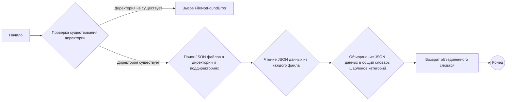

# Модуль для тестирования создания шаблонов категорий

## Обзор

Модуль `test_categories_from_template.py` содержит класс `TestBuildtemplates`, который используется для тестирования функциональности создания шаблонов категорий на основе JSON-файлов, расположенных в указанной директории. Тесты включают проверку чтения шаблонов из существующей директории и обработку случая, когда директория не существует.

## Подробней

Этот модуль предназначен для автоматизированного тестирования процесса построения шаблонов категорий на основе JSON-данных. Он использует библиотеку `unittest` для определения тестовых случаев и временные директории для изоляции тестов. Основная цель - убедиться, что функция `buid_templates` корректно обрабатывает JSON-файлы и возвращает ожидаемый результат, а также правильно обрабатывает ситуации, когда директория с шаблонами не существует.

## Классы

### `TestBuildtemplates`

**Описание**: Класс `TestBuildtemplates` наследует `unittest.TestCase` и содержит методы для тестирования функции `buid_templates`.

**Принцип работы**:
Класс содержит два тестовых метода:
- `test_build_templates_with_existing_directory`: Проверяет, что функция `buid_templates` корректно считывает и объединяет шаблоны из JSON-файлов в указанной директории. Создается временная директория, в которой размещаются JSON-файлы. Затем вызывается функция `buid_templates` с путем к этой директории, и результат сравнивается с ожидаемым.
- `test_build_templates_with_non_existing_directory`: Проверяет, что функция `buid_templates` вызывает исключение `FileNotFoundError`, если указанная директория не существует.

**Методы**:
- `test_build_templates_with_existing_directory`: Тестирует функцию `buid_templates` с существующей директорией.
- `test_build_templates_with_non_existing_directory`: Тестирует функцию `buid_templates` с несуществующей директорией.

#### `test_build_templates_with_existing_directory`

```python
def test_build_templates_with_existing_directory(self):
    """Тестирует функцию `buid_templates` с существующей директорией."""
    ...
```

**Параметры**:
- `self`: Экземпляр класса `TestBuildtemplates`.

**Как работает функция**:

1.  Создается временная директория `tmpdir` с использованием `tempfile.TemporaryDirectory()`.
2.  Внутри этой директории создаются два JSON-файла: `file1.json` в корне временной директории и `file2.json` во вложенной поддиректории `subdir`.
3.  JSON-данные записываются в оба файла.
4.  Вызывается функция `buid_templates` с путем к временной директории `tmpdir`.
5.  Результат работы функции сравнивается с ожидаемым значением `expected_output` с использованием метода `self.assertEqual`.

```mermaid
graph LR
    A[Создание временной директории tmpdir] --> B(Создание JSON файлов: file1.json, file2.json);
    B --> C{Запись JSON данных в файлы};
    C --> D[Вызов buid_templates(tmpdir)];
    D --> E{Сравнение результата с expected_output};
    E --> F((Конец));
```

#### `test_build_templates_with_non_existing_directory`

```python
def test_build_templates_with_non_existing_directory(self):
    """Тестирует функцию `buid_templates` с несуществующей директорией."""
    ...
```

**Параметры**:
- `self`: Экземпляр класса `TestBuildtemplates`.

**Как работает функция**:

1.  Вызывается функция `buid_templates` с путем к несуществующей директории (`/non/existing/path/`).
2.  Проверяется, что при вызове функции возникает исключение `FileNotFoundError` с использованием `self.assertRaises`.

```mermaid
graph LR
    A[Вызов buid_templates('/non/existing/path/')];
    A --> B{Проверка на возникновение FileNotFoundError};
    B --> C((Конец));
```

## Функции

### `buid_templates`

```python
def buid_templates(path: str) -> dict:
    """Функция выполняет построение шаблонов категорий на основе JSON-файлов, расположенных в указанной директории.
    Args:
        path (str): Путь к директории с JSON-файлами.

    Returns:
        dict: Словарь, содержащий объединенные шаблоны категорий.

    Raises:
        FileNotFoundError: Если указанная директория не существует.
    """
    ...
```

**Назначение**: Функция `buid_templates` строит шаблоны категорий на основе JSON-файлов, расположенных в указанной директории.

**Параметры**:
- `path` (str): Путь к директории с JSON-файлами.

**Возвращает**:
- `dict`: Словарь, содержащий объединенные шаблоны категорий.

**Вызывает исключения**:
- `FileNotFoundError`: Если указанная директория не существует.

**Как работает функция**:

1.  Проверяет существование указанной директории. Если директория не существует, вызывает исключение `FileNotFoundError`.
2.  Если директория существует, проходит по всем JSON-файлам в директории и ее поддиректориях.
3.  Считывает JSON-данные из каждого файла и объединяет их в общий словарь шаблонов категорий.
4.  Возвращает объединенный словарь шаблонов категорий.



**Примеры**:

```python
# Пример вызова функции с существующей директорией
# (Предполагается, что такая функция существует и возвращает словарь)
# templates = buid_templates('/path/to/existing/directory')

# Пример вызова функции с несуществующей директорией
# try:
#     templates = buid_templates('/path/to/non/existing/directory')
# except FileNotFoundError as ex:
#     print(f"Ошибка: {ex}")
#     # logger.error('Ошибка', ex, exc_info=True)