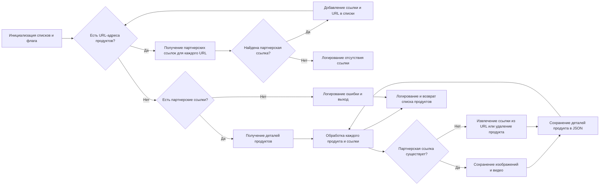
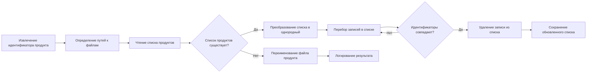

# Модуль `affiliated_products_generator.py`

## Обзор

Модуль `affiliated_products_generator.py` содержит класс `AliAffiliatedProducts`, который отвечает за сбор полных данных о товарах из Aliexpress Affiliate API. Он расширяет класс `AliApi` для обработки URL-адресов или идентификаторов продуктов и получения подробной информации об аффилированных продуктах, включая сохранение изображений, видео и данных JSON.

## Подробней

Этот код является частью проекта `hypotez` и используется для автоматизации сбора данных о товарах с партнерскими ссылками из AliExpress. Он позволяет упростить процесс создания рекламных кампаний и подготовки контента для них.

## Содержание

1. [Классы](#Классы)
    - [AliAffiliatedProducts](#AliAffiliatedProducts)
        - [Атрибуты](#Атрибуты)
        - [Методы](#Методы)
            - [process_affiliate_products](#process_affiliate_products)
            - [delete_product](#delete_product)

## Классы

### `AliAffiliatedProducts`

**Описание**: Класс для сбора полных данных о продуктах по URL-адресам или идентификаторам продуктов, используя Aliexpress Affiliate API.

**Принцип работы**:
Класс `AliAffiliatedProducts` наследуется от класса `AliApi` и предназначен для получения информации о продуктах AliExpress через Affiliate API. Он инициализируется с именем рекламной кампании, категорией, языком и валютой. Основной метод `process_affiliate_products` принимает список URL-адресов продуктов или их идентификаторов, получает партнерские ссылки, извлекает детали продукта, сохраняет изображения и видео, а также сохраняет всю информацию в формате JSON. Класс также включает метод `delete_product` для удаления продуктов, у которых нет партнерских ссылок.

#### Атрибуты:

- `campaign_name` (str): Название рекламной кампании.
- `campaign_category` (Optional[str]): Категория кампании (по умолчанию `None`).
- `campaign_path` (Path): Путь к каталогу, где хранятся материалы кампании.
- `language` (str): Язык для кампании (по умолчанию `'EN'`).
- `currency` (str): Валюта для кампании (по умолчанию `'USD'`).

#### Методы:

- `__init__(self, campaign_name: str, campaign_category: Optional[str] = None, language: str = 'EN', currency: str = 'USD', *args, **kwargs)`: Конструктор класса.
- `process_affiliate_products(self, prod_urls: List[str]) -> List[SimpleNamespace]`: Обрабатывает список URL-адресов и возвращает список продуктов с партнерскими ссылками и сохраненными изображениями.
- `delete_product(self, product_id: str, exc_info: bool = False)`: Удаляет продукт, у которого нет партнерской ссылки.

### `__init__`

```python
def __init__(self,
             campaign_name: str,
             campaign_category: Optional[str] = None,
             language: str = 'EN',
             currency: str = 'USD',
             *args, **kwargs):
    """
    @param campaign_name `str`: Name of the advertising campaign. The directory with the prepared material is taken by name.
    @param campaign_category `Optional[str]`: Category for the campaign (default None).
    @param language `str`: Language for the campaign (default 'EN').
    @param currency `str`: Currency for the campaign (default 'USD').
    @param tracking_id `str`: Tracking ID for Aliexpress API.
    """
```

**Назначение**: Инициализирует экземпляр класса `AliAffiliatedProducts`.

**Параметры**:

- `campaign_name` (str): Название рекламной кампании. Каталог с подготовленным материалом берется по имени.
- `campaign_category` (Optional[str]): Категория для кампании (по умолчанию `None`).
- `language` (str): Язык для кампании (по умолчанию `'EN'`).
- `currency` (str): Валюта для кампании (по умолчанию `'USD'`).
- `*args`: Произвольные позиционные аргументы.
- `**kwargs`: Произвольные именованные аргументы.

**Как работает функция**:

1. Вызывает конструктор родительского класса `AliApi` с указанием языка и валюты.
2. Устанавливает значения атрибутов экземпляра на основе переданных параметров.
3. Формирует локаль (например, `"EN_USD"`) на основе языка и валюты.
4. Определяет путь к каталогу кампании на Google Drive, используя название кампании и категорию.

**Примеры**:

```python
parser = AliAffiliatedProducts(
    campaign_name="my_campaign",
    campaign_category="electronics",
    language="RU",
    currency="RUB"
)
```

### `process_affiliate_products`

```python
def process_affiliate_products(self, prod_urls: List[str]) -> List[SimpleNamespace]:
    """
    Processes a list of URLs and returns a list of products with affiliate links and saved images.

    :param prod_urls: List of product URLs or IDs.
    :return: List of processed products.
    """
```

**Назначение**: Обрабатывает список URL-адресов продуктов или их идентификаторов, чтобы получить партнерские ссылки, сохранить изображения и видео, а также сохранить детали продуктов.

**Параметры**:

- `prod_urls` (List[str]): Список URL-адресов или идентификаторов продуктов.

**Возвращает**:

- `List[SimpleNamespace]`: Список объектов `SimpleNamespace`, представляющих обработанные продукты.

**Как работает функция**:

1.  **Инициализация**:
    *   Инициализирует два пустых списка: `_promotion_links` для хранения партнерских ссылок и `_prod_urls` для хранения URL-адресов продуктов.
    *   Преобразует URL-адреса продуктов в HTTPS, используя функцию `ensure_https`.
    *   Устанавливает флаг `print_flag` в `'new_line'` для форматирования вывода.

2.  **Получение партнерских ссылок**:

    *   Перебирает URL-адреса продуктов в цикле `for`.
    *   Для каждого URL-адреса вызывает метод `get_affiliate_links` родительского класса (`AliApi`) для получения партнерской ссылки.
    *   Если ссылка найдена, добавляет ее в список `_promotion_links` и URL-адрес продукта в список `_prod_urls`.

3.  **Проверка наличия партнерских ссылок**:

    *   Если список `_promotion_links` пуст, функция регистрирует ошибку и возвращает `None`.

4.  **Получение деталей продуктов**:

    *   Вызывает метод `retrieve_product_details` для получения детальной информации о продуктах, используя список `_prod_urls`.

5.  **Обработка данных продуктов**:

    *   Перебирает продукты и соответствующие партнерские ссылки в цикле `for`.
    *   Если партнерская ссылка отсутствует, пытается извлечь ее из URL-адреса продукта.
    *   Если извлечь не удается, удаляет продукт, используя метод `delete_product`.
    *   Сохраняет изображения продукта, используя функцию `save_png_from_url`, и видео, используя функцию `save_video_from_url`.
    *   Сохраняет детали продукта в формате JSON, используя функцию `j_dumps`.

6.  **Завершение**:

    *   Регистрирует общее количество обработанных продуктов.
    *   Возвращает список обработанных продуктов (`_affiliate_products`).



**Примеры**:

```python
# Пример использования:
prod_urls = ['https://www.aliexpress.com/item/123.html', '456']
parser = AliAffiliatedProducts(
    campaign_name="my_campaign",
    campaign_category="electronics",
    language="RU",
    currency="RUB"
)
products = parser.process_affiliate_products(prod_urls)
```

### `delete_product`

```python
def delete_product(self, product_id: str, exc_info: bool = False):
    """ Delete a product that does not have an affiliate link"""
```

**Назначение**: Удаляет продукт, у которого нет партнерской ссылки.

**Параметры**:

- `product_id` (str): Идентификатор продукта для удаления.
- `exc_info` (bool): Флаг, указывающий, нужно ли логировать информацию об исключении (по умолчанию `False`).

**Как работает функция**:

1.  **Извлечение идентификатора продукта**:

    *   Использует функцию `extract_prod_ids` для извлечения идентификатора продукта из входного `product_id`.

2.  **Определение путей к файлам**:

    *   Определяет пути к файлам `sources.txt` и `_sources.txt`, которые содержат список идентификаторов продуктов.

3.  **Чтение списка продуктов**:

    *   Читает содержимое файла `sources.txt` с использованием функции `read_text_file`.

4.  **Обработка списка продуктов**:

    *   Если список продуктов существует, преобразует его в однородный список.
    *   Перебирает записи в списке продуктов.
    *   Для каждой записи извлекает идентификатор продукта и сравнивает его с `product_id`.
    *   Если идентификаторы совпадают, удаляет запись из списка и сохраняет обновленный список в файл `_sources.txt`.
    *   Если список продуктов не существует, пытается переименовать файл продукта, добавив суффикс `_.html`.
    *   Логирует успех или ошибку переименования файла.



**Примеры**:

```python
# Пример использования:
parser = AliAffiliatedProducts(
    campaign_name="my_campaign",
    campaign_category="electronics",
    language="RU",
    currency="RUB"
)
parser.delete_product(product_id="123456789")