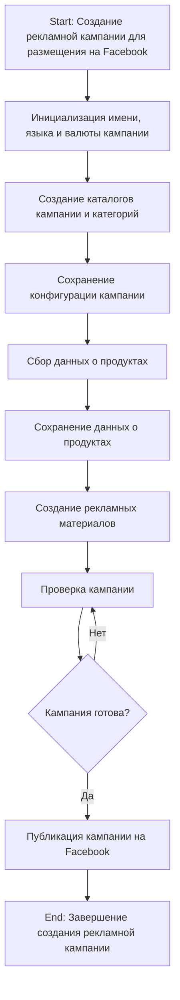
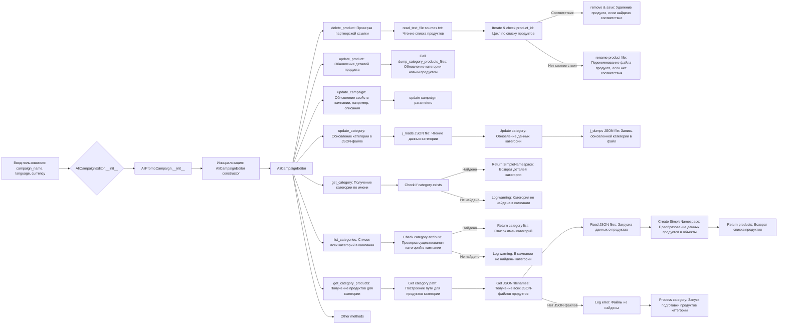

# Модуль `campaign`

## Обзор

Модуль `campaign` предназначен для управления процессом создания и публикации рекламных кампаний на Facebook. Он включает в себя функциональность для инициализации параметров кампании (имя, язык, валюта), создания структуры каталогов, сохранения конфигураций для новой кампании, сбора и сохранения данных о продуктах через `ali` или `html`, генерации рекламных материалов, проверки кампании и публикации ее на Facebook.

## Подробней

Модуль `campaign` используется для автоматизации процесса создания рекламных кампаний на Facebook. Он предоставляет инструменты для управления всеми этапами кампании, от инициализации до публикации.

## Функциональность

### Создание рекламной кампании



**Как работает процесс создания кампании:**

1.  **Шаг 1**: Старт - Начало процесса.

2.  **Шаг 2**: Инициализация деталей кампании - Определяются имя, язык и валюта кампании. Пример: Имя кампании: "Летняя распродажа", Язык: "Русский", Валюта: "RUB"

3.  **Шаг 3**: Создание каталогов кампании и категорий - Создаются необходимые каталоги или файлы для кампании. Пример: Создается структура папок в файловой системе для хранения активов кампании.

4.  **Шаг 4**: Сохранение конфигурации кампании - Сохраненные детали инициализированной кампании. Пример: Данные записываются в базу данных или конфигурационный файл.

5.  **Шаг 5**: Сбор данных о продуктах - Собираются данные, относящиеся к продуктам, которые будут продвигаться в рамках кампании. Пример: ID продуктов, описания, изображения и цены извлекаются из системы инвентаризации.

6.  **Шаг 6**: Сохранение данных о продуктах - Собранные данные о продуктах сохраняются. Пример: Данные записываются в таблицу базы данных, предназначенную для продуктов кампании.

7.  **Шаг 7**: Создание рекламных материалов - Создаются или выбираются графика, баннеры и другие рекламные активы. Пример: Изображения и описания адаптируются для привлечения клиентов.

8.  **Шаг 8**: Проверка кампании - Процесс проверки подтверждает, что компоненты кампании готовы. Пример: Человек или система оценивает качество и полноту всех компонентов кампании.

9.  **Шаг 9**: Кампания готова? - Проверка для определения, завершена ли кампания и готова ли к публикации. Пример: Логический флаг сигнализирует "Да", если все на месте, в противном случае "Нет", инициируя возврат к предыдущему шагу для внесения исправлений.

10. **Шаг 10**: Публикация кампании - Кампания становится активной на платформе и готова к маркетинговым усилиям. Пример: Выполняются вызовы API для публикации кампании на соответствующей платформе.

11. **Шаг 11**: Конец - Процесс создания кампании завершен.

### Редактирование кампании



### Подготовка кампании

```mermaid
flowchart TD
    A[Start] --> B{Обработать все кампании?}
    B -->|Да| C[Обработать все кампании]
    B -->|Нет| D[Обработать конкретную кампанию]

    C --> E{Предоставлены язык и валюта?}
    E -->|Да| F[Обработать каждую кампанию с предоставленным языком и валютой]
    E -->|Нет| G[Обработать все локали для каждой кампании]

    D --> H{Указаны категории?}
    H -->|Да| I[Обработать конкретные категории для кампании]
    H -->|Нет| J[Обработать всю кампанию]

    F --> K[Обработать категорию кампании]
    G --> L[Обработать кампанию для всех локалей]
    I --> K
    J --> L

    K --> M[Return]
    L --> M