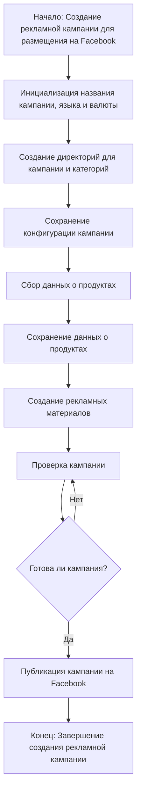

# Модуль `campaign`

## Обзор

Модуль `campaign` предназначен для управления процессом создания и публикации рекламных кампаний на Facebook. Он включает в себя функции для инициализации параметров кампании, создания структуры директорий, сохранения конфигураций, сбора и сохранения данных о продуктах, генерации рекламных материалов, проверки кампании и ее публикации.

## Подробней

Этот модуль является ключевым компонентом для автоматизации процесса создания и управления рекламными кампаниями на платформе Facebook. Он позволяет унифицировать и упростить шаги, необходимые для запуска рекламной кампании, начиная от начальной настройки и заканчивая публикацией. Используется в проекте `hypotez` для организации рекламных кампаний.

## Классы

В данном фрагменте кода классы отсутствуют.

## Функции

В данном фрагменте кода функции отсутствуют.

## Как работает модуль `campaign`:

1.  **Инициализация кампании**:
    -   Начинается с инициализации основных параметров рекламной кампании, таких как название, язык и валюта. Это позволяет задать общие настройки для всей кампании.

2.  **Создание структуры директорий**:
    -   Создаются необходимые директории для хранения данных кампании и категорий товаров. Это помогает организовать файлы и упростить доступ к ним.

3.  **Сохранение конфигурации кампании**:
    -   Параметры конфигурации кампании сохраняются, чтобы обеспечить возможность повторного использования и воспроизводимости настроек кампании.

4.  **Сбор данных о продуктах**:
    -   Данные о продуктах собираются с использованием `ali` или `html`. Эти данные включают информацию о продуктах, которые будут рекламироваться в кампании.

5.  **Сохранение данных о продуктах**:
    -   Собранные данные о продуктах сохраняются для последующего использования при создании рекламных материалов.

6.  **Создание рекламных материалов**:
    -   На основе собранных данных генерируются рекламные материалы. Это может включать создание рекламных объявлений, изображений и текста для продвижения продуктов.

7.  **Проверка кампании**:
    -   Проводится проверка кампании для удостоверения в том, что все элементы настроены правильно и соответствуют требованиям Facebook.

8.  **Публикация кампании на Facebook**:
    -   После успешной проверки кампания публикуется на платформе Facebook. Это делает рекламные объявления доступными для целевой аудитории.

## Flowchart работы модуля `campaign`:

## Примеры

Примеры работы с модулем отсутствуют в предоставленном фрагменте кода.