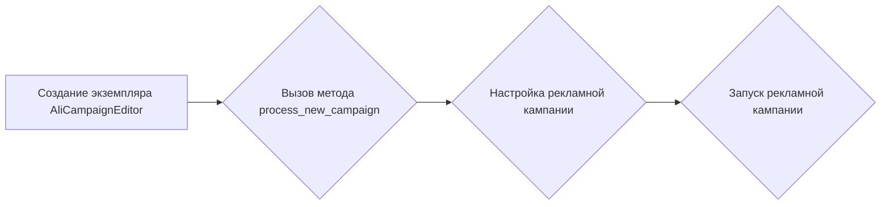

# Модуль подготовки новой рекламной кампании

## Обзор

Модуль `prepare_new_campaign.py` предназначен для автоматизации процесса подготовки и запуска новых рекламных кампаний на платформе AliExpress. Он использует функциональность класса `AliCampaignEditor` для выполнения основных этапов создания кампании.

## Подробней

Этот код является частью более крупной системы, автоматизирующей процессы управления рекламными кампаниями на AliExpress.  Он упрощает и ускоряет процесс создания и настройки рекламных кампаний, что позволяет более эффективно управлять рекламными бюджетами и достигать поставленных целей.  Он инициализирует объект `AliCampaignEditor` с именем кампании и запускает процесс создания новой кампании.

## Функции

### `process_new_campaign`

```python
def process_new_campaign(campaign_name: str) -> None:
    """  Функция выполняет подготовку и запуск новой рекламной кампании.

    Args:
        campaign_name (str): Имя новой рекламной кампании.

    Returns:
        None: Функция ничего не возвращает.

    Raises:
        Exception: Если происходит ошибка при обработке новой рекламной кампании.

    Example:
        >>> campaign_name = 'new_ali_campaign'
        >>> process_new_campaign(campaign_name)
    """
```

**Назначение**: Функция `process_new_campaign` отвечает за автоматическое создание и настройку новой рекламной кампании.

**Параметры**:

-   `campaign_name` (str): Имя кампании, которое будет использоваться при создании новой рекламной кампании.

**Возвращает**:

-   None: Функция ничего не возвращает.

**Вызывает исключения**:

-   `Exception`: Функция вызывает исключение в случае возникновения ошибки.

**Как работает функция**:

1.  **Инициализация:** Создается экземпляр класса `AliCampaignEditor` с заданным именем кампании.
2.  **Запуск процесса новой кампании:** Вызывается метод `process_new_campaign` у экземпляра `AliCampaignEditor`, который выполняет все необходимые шаги для создания и запуска новой рекламной кампании.



**Примеры**:

```python
campaign_name = 'summer_sale_campaign'
process_new_campaign(campaign_name)

campaign_name = 'clearance_campaign'
process_new_campaign(campaign_name)