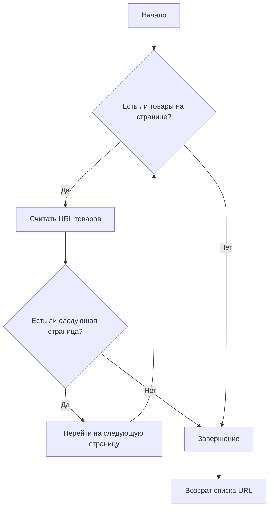
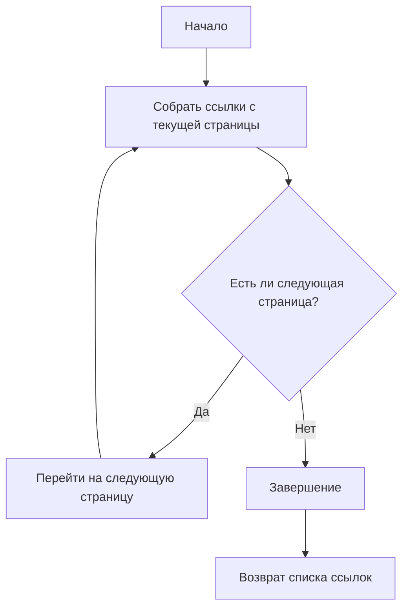
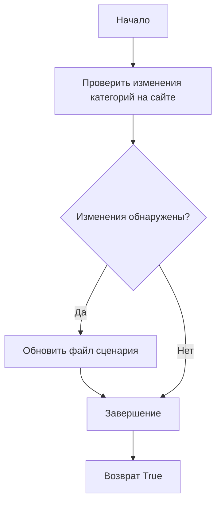
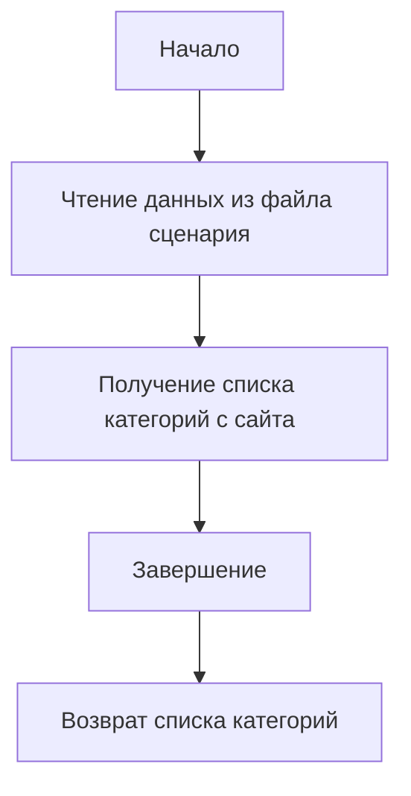

# Модуль управления категориями Aliexpress

## Обзор

Модуль предназначен для управления категориями товаров на платформе Aliexpress. Он предоставляет функциональность для получения списка товаров в категории, обновления категорий на основе данных с сайта и операций с базой данных.

## Подробней

Этот модуль является ключевым компонентом системы для работы с данными Aliexpress. Он автоматизирует процесс получения информации о категориях товаров, их обновления и сохранения в базе данных.

## Функции модуля

### `get_list_products_in_category(s)`

**Назначение**: Считывает URL товаров со страницы категории. Если есть несколько страниц с товарами, функция будет перелистывать все страницы.

**Параметры**:
- `s` (Supplier): Экземпляр поставщика.

**Возвращает**:
- Список URL продуктов в категории.

**Как работает функция**:

1.  Функция принимает экземпляр поставщика (`Supplier`) в качестве аргумента.
2.  Использует методы поставщика для получения URL товаров со страницы категории.
3.  Если на странице категории есть несколько страниц, функция автоматически перелистывает их и собирает URL товаров со всех страниц.



**Примеры**:

```python
# Пример использования функции get_list_products_in_category
products = get_list_products_in_category(supplier)
```

### `get_prod_urls_from_pagination(s)`

**Назначение**: Собирает ссылки на товары с страницы категории с перелистыванием страниц.

**Параметры**:
- `s` (Supplier): Экземпляр поставщика.

**Возвращает**:
- Список ссылок на товары.

**Как работает функция**:

1.  Функция принимает экземпляр поставщика (`Supplier`) в качестве аргумента.
2.  Собирает ссылки на товары с текущей страницы категории.
3.  Перелистывает страницы, если они есть, и продолжает собирать ссылки.



**Примеры**:

```python
# Пример использования функции get_prod_urls_from_pagination
product_urls = get_prod_urls_from_pagination(supplier)
```

### `update_categories_in_scenario_file(s, scenario_filename)`

**Назначение**: Проверяет изменения категорий на сайте и обновляет файл сценария.

**Параметры**:
- `s` (Supplier): Экземпляр поставщика.
- `scenario_filename` (str): Имя файла сценария для обновления.

**Возвращает**:
- `True`, если обновление прошло успешно.

**Как работает функция**:

1.  Функция принимает экземпляр поставщика (`Supplier`) и имя файла сценария (`scenario_filename`) в качестве аргументов.
2.  Проверяет изменения категорий на сайте.
3.  Обновляет файл сценария, если изменения обнаружены.



**Примеры**:

```python
# Пример использования функции update_categories_in_scenario_file
updated = update_categories_in_scenario_file(supplier, "scenario_file.json")
```

### `get_list_categories_from_site(s, scenario_file, brand='')`

**Назначение**: Получает список категорий с сайта на основе файла сценария.

**Параметры**:
- `s` (Supplier): Экземпляр поставщика.
- `scenario_file` (str): Имя файла сценария.
- `brand` (str, optional): Опциональное имя бренда.

**Возвращает**:
- Список категорий.

**Как работает функция**:

1.  Функция принимает экземпляр поставщика (`Supplier`), имя файла сценария (`scenario_file`) и опциональное имя бренда (`brand`) в качестве аргументов.
2.  Использует данные из файла сценария для получения списка категорий с сайта.



**Примеры**:

```python
# Пример использования функции get_list_categories_from_site
categories = get_list_categories_from_site(supplier, "scenario_file.json", brand="SomeBrand")
```

## Классы

### `DBAdaptor`

**Описание**: Предоставляет методы для выполнения операций с базой данных, таких как `SELECT`, `INSERT`, `UPDATE` и `DELETE`.

**Методы**:
- `select(cat_id, parent_id, project_cat_id)`: Выбирает записи из базы данных.
- `insert()`: Вставляет новые записи в базу данных.
- `update()`: Обновляет записи в базе данных.
- `delete()`: Удаляет записи из базы данных.

**Принцип работы**:

Класс `DBAdaptor` предоставляет интерфейс для взаимодействия с базой данных. Он содержит методы для выполнения основных операций CRUD (Create, Read, Update, Delete). Для работы с базой данных требуется настроить соединение через `gs.db_translations_credentials`.

**Примеры**:

```python
# Пример использования DBAdaptor для операций с базой данных
db = DBAdaptor()
db.select(cat_id=123)
db.insert()
db.update()
db.delete()
```

## Установка

Для работы с модулем необходимо установить зависимые пакеты, такие как `requests`, а также настроить соединение с базой данных через `gs.db_translations_credentials`.

### Зависимости:
- `requests`
- `src.utils.jjson`
- `src.db.manager_categories.suppliers_categories`

## Логирование

В модуле используется логирование через `src.logger`, которое помогает отслеживать ошибки и события в процессе выполнения.