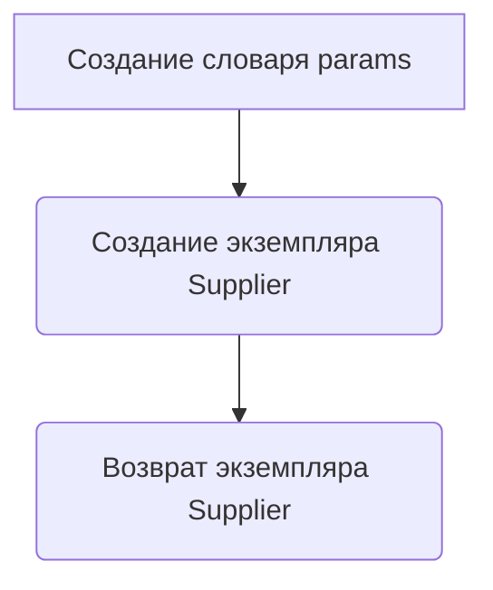

# Модуль `notebook_header.py`

## Обзор

Модуль содержит общие импорты и инициализацию для экспериментов с поставщиком `kualastyle`. Он добавляет корневую директорию проекта в `sys.path`, импортирует необходимые библиотеки и модули, а также определяет функцию для запуска поставщика.

## Подробней

Этот модуль предназначен для использования в Jupyter Notebook или других интерактивных средах разработки для экспериментов с поставщиком `kualastyle`. Он обеспечивает необходимую среду для работы с кодом поставщика, включая импорт модулей, добавление корневой директории в `sys.path` и функцию для запуска поставщика.

## Функции

### `start_supplier`

```python
def start_supplier(supplier_prefix: str = 'kualastyle'):
    """Старт поставщика (kualastyle)

    Args:
        supplier_prefix (str, optional): Префикс поставщика. По умолчанию 'kualastyle'.

    Returns:
        Supplier: Объект поставщика.
    """
    ...
```

**Назначение**: Запускает поставщика с указанным префиксом.

**Параметры**:

-   `supplier_prefix` (str, optional): Префикс поставщика. Используется для определения конфигурации и других параметров поставщика. По умолчанию имеет значение `'kualastyle'`.

**Возвращает**:

-   `Supplier`: Объект поставщика, созданный с использованием переданных параметров.

**Как работает функция**:

1.  Создается словарь `params` с ключом `'supplier_prefix'` и значением, переданным в функцию.
2.  Создается и возвращается экземпляр класса `Supplier` с использованием словаря `params` в качестве аргументов.



**Примеры**:

```python
supplier = start_supplier()
print(supplier)

supplier = start_supplier(supplier_prefix='another_supplier')
print(supplier)