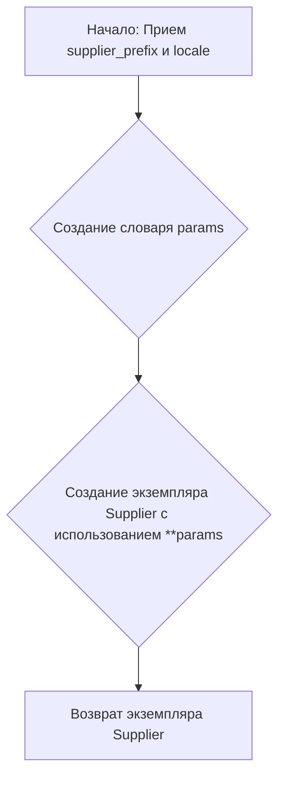

# Модуль _experiments (JUPYTER_header.py)

## Обзор

Модуль содержит набор экспериментов, связанных с поставщиком `morlevi`. Он включает в себя импорты различных модулей и классов, необходимых для работы с поставщиками, продуктами, категориями, веб-драйверами и другими утилитами. Также содержит функцию `start_supplier`, предназначенную для запуска поставщика с заданными параметрами.

## Подробней

Этот модуль, судя по названию `_experiments`, предназначен для проведения различных экспериментов, связанных с поставщиком `morlevi`. В частности, он может использоваться для тестирования новых функций, отладки проблем или оценки производительности. Файл содержит импорты различных модулей и классов, необходимых для работы с поставщиками, продуктами, категориями, веб-драйверами и другими утилитами. Также здесь определена функция `start_supplier`, предназначенная для запуска поставщика с заданными параметрами. Расположение файла `hypotez/src/suppliers/morlevi/_experiments/JUPYTER_header.py` указывает на то, что он является частью подмодуля `morlevi` внутри пакета `suppliers`.

## Функции

### `start_supplier`

```python
def start_supplier(supplier_prefix: str = 'aliexpress', locale: str = 'en') -> Supplier:
    """ Старт поставщика """
    params: dict = {
        'supplier_prefix': supplier_prefix,
        'locale': locale
    }
    
    return Supplier(**params)
```

**Назначение**: Функция `start_supplier` предназначена для запуска поставщика с заданными параметрами. Она создает словарь `params` с информацией о префиксе поставщика и локали, а затем передает этот словарь в конструктор класса `Supplier` для создания и возвращения экземпляра поставщика.

**Параметры**:
- `supplier_prefix` (str, optional): Префикс поставщика. По умолчанию `'aliexpress'`.
- `locale` (str, optional): Локаль поставщика. По умолчанию `'en'`.

**Возвращает**:
- `Supplier`: Экземпляр класса `Supplier`, созданный с заданными параметрами.

**Как работает функция**:

1. Функция принимает два параметра: `supplier_prefix` (префикс поставщика) и `locale` (локаль поставщика).
2. Создается словарь `params`, содержащий значения `supplier_prefix` и `locale`.
3. Создается и возвращается экземпляр класса `Supplier` с использованием оператора распаковки словаря `**params`.



**Примеры**:

```python
from src.suppliers import Supplier  # Предполагается, что Supplier определен в этом модуле

# Пример 1: Запуск поставщика с параметрами по умолчанию
supplier = start_supplier()
print(type(supplier))  # Выведет <class 'src.suppliers.Supplier'> (или что-то подобное)

# Пример 2: Запуск поставщика с указанным префиксом и локалью
supplier = start_supplier(supplier_prefix='amazon', locale='de')
print(supplier.locale) # Выведет 'de'
print(supplier.supplier_prefix) # Выведет 'amazon'