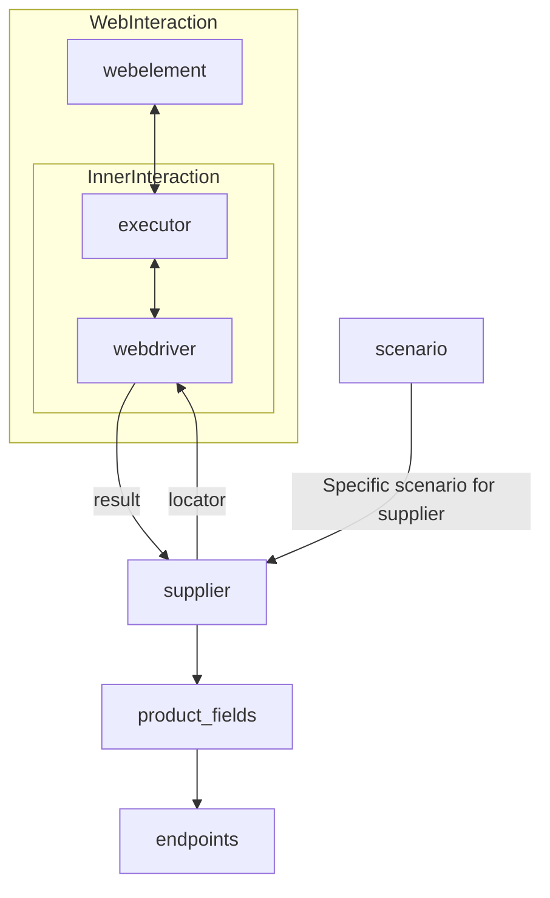

# ИНСТРУКЦИЯ

Предоставленный ниже код - часть проекта `hypotez`. Задача: создать документацию для разработчика в формате `Markdown` для каждого входного Python-файла.
Документация должна соответствовать следующим требованиям:

1. **Формат документации**:
   - Используй стандарт `Markdown (.md)`.
   - Каждый файл должен начинаться с заголовка и краткого описания его содержимого.

   Примеры документации: Пример загаоловка файла модуля:

        """
        Модуль для работы с ассистентом программиста
        =================================================

        Модуль содержит класс :class:`CodeAssistant`, который используется для взаимодействия с различными AI-моделями
        (например, Google Gemini и OpenAI) и выполнения задач обработки кода.

        Пример использования
        ----------------------

        >>>assistant = CodeAssistant(role='code_checker', lang='ru', model=['gemini'])
        >>>assistant.process_files()
        """

   - Для всех классов и функций используйте следующий формат комментариев:
     ```python
     class MyClass:
         """Описание назначения класса
         Inherits:
            Если класс наследует другой - дай описание наследования

         Attributes:
            param1 (str): Описание параметров (атрибуты) класса

         Methods:
            function_1(): Описание назаначения функций/методов класса
        """

         def function(param: str, param1: Optional[str | dict | str] = None) -> dict | None:
             """ Функция выполняет некоторое действия... <Тут Ты пишешь что именно делает функция>
             Args:
                 param (str): Описание параметра `param`.
                 param1 (Optional[str | dict | str], optional): Описание параметра `param1`. По умолчанию `None`.

             Returns:
                 dict | None: Описание возвращаемого значения. Возвращает словарь или `None`.

             Raises:
                 SomeError: Описание ситуации, в которой возникает исключение `SomeError`.
                ...
                <Выводить тело функции НЕ НАДО. Только docstring>
             """
             def inner_function():
                """ Внутрняя функция Функция выполняет некоторое действия... <Тут Ты пишешь что именно делает функция>
                    Args:
                        param (str): Описание параметра `param`.
                        param1 (Optional[str | dict | str], optional): Описание параметра `param1`. По умолчанию `None`.

                    Returns:
                        dict | None: Описание возвращаемого значения. Возвращает словарь или `None`.

                    Raises:
                        SomeError: Описание ситуации, в которой возникает исключение `SomeError`.

                    ...

                      НЕ ВЫВОДИ КОД ФУНКЦИИ. ТОЛЬКО DOCSTR

                    """
         ```
     - Все комментарии в фунцкии и docstring должны быть на русском языке в формате UTF-8

   - Используй `ex` вместо `e` в блоках обработки исключений.
   - Для логгирования используй `logger` из моего модуля `src.logger`. Например:
     ```python
     from src.logger import logger
     logger.info('Some information message')
     ...
     except SomeError as ex:
         logger.error('Some error message', ex, exc_info = True), где ошибка передается вторым аргументом. exc_info определает надо ли выводить служебную информацию.
    ```


    _ Если в коде используется вебдрайвер, знай как его использовать
    наследуй Driver, Chrome, Firexox, Playwright
    Далее определи так
    # Создание инстанса драйвера (пример с Chrome)
    driver = Drivewr(Chrome)
    В модулях Driver И Chrome, Firexox, Playwright уже содержатся все настройки selenium.
    Основная комада, которая используется в коде: `driver.execute_locator(l:dict)`
    Она возвращает аначение вебэелемента по локатору.


   - Все комментарии и docstring должны быть на русском языке в формате UTF-8. Если в коде docsting на английском - сделай перевеод на русский

2. **Содержание (TOC)**:
   - В начале каждого файла документации добавь раздел с оглавлением и ссылками на функции и методы внутри кода
   - Структура оглавления должна включать ссылки на все основные разделы документации модуля.

3. **Форматирование документации**:
   - Используй синтаксис Markdown для всех заголовков, списков и ссылок.
   - Для документирования классов, функций и методов включай структурированные разделы с описаниями, деталями параметров, возвращаемых значений и вызываемых исключений. Пример:

    ## Классы

    ### `class_name`
    Описание назначения класса
        **Наследует**
            Если класс наследует другой - дай описание наследования

         **Аттрибуты**:
            param1 (str): Описание параметров (атрибуты) класса

         **Методы**:
            function_1(): Описание назаначения функций/методов класса


     ## Функции

     ### `function_name`

     **Назначение**: Назначение функции.


     **Параметры**:
     - `param` (str): Описание параметра `param`.
     - `param1` (Optional[str | dict | str], optional): Описание параметра `param1`. По умолчанию `None`.

     **Возвращает**:
     - `dict | None`: Описание возвращаемого значения.

     **Вызывает исключения**:
     - `SomeError`: Описание ситуации, в которой возникает исключение `SomeError`.

     Если внутри функции есть внутренние фуйнкции - рассмотри их по отдельности каждую
     **Внутренние функции**: Если есть


     **Как работает функция**:
     1. <Подробно объясни назначиение функции. Сдеалай подробное описание того, какие действия преобразования происходит в теле функции>


     2. Построй ASCII flowchart функции и покажи как происхоят следующие действия и преобразования
     Например:
     A
     |
     -- C
     |
     D - E
     |
     F

     Где `A,B,C,D,E,F` внутренние логические блоки функции. Не используй аббревиатур A,B,C,... давай логичные имена блокам

     **Примеры**:
     - Создай несколько примеров вызова функции с разными параметрами, которые передающтся в функцию


4. **Заголовки разделов**:
   - Используйте заголовки первого уровня (`#`), второго уровня (`##`), третьего уровня (`###`) и четвёртого уровня (`####`) последовательно на протяжении всего файла.

5. **Пример файла**:

   # Название модуля

   ## Обзор

   Краткое описание назначения модуля.

   ## Подорбней

   Более подробное описание. Объясни как и зачем используется данный код в проекте.
   Анализируй предоставленный тебе ранее код

   ## Классы

   ### `ClassName`

   **Описание**: Описание класса.

    **Принцип работы**:
        Объясни  работу класса. Если класс сложный сдеалай подорбный разбор кода

   Сделай документацию для КАЖДОЙ функции или метода. Объясни назначение каждой переменной.
   - Все комментарии и docstring должны быть на русском языке в формате UTF-8. Если в оригинальном коде текст написан на английском - переводи его на русский

   **Методы**: # если есть методы
   - `method_name`: Краткое описание метода.
   - `method_name`: Краткое описание метода.
   **Параметры**: # если есть параметры
   - `param` (str): Описание параметра `param`.
   - `param1` (Optional[str | dict | str], optional): Описание параметра `param1`. По умолчанию `None`.
   **Примеры**
   - Примеры определения класса и работы с классом


   ## Функции

   ### `function_name`

   ```python
   def my_func(param1:str, param2:Optional[int] = 0) -> bool:
       """ Функция выполняет некоторое действия... <Тут Ты пишешь что именно делает функция>
       Args:
           param1 (str): Описание параметра `param1`.
           param2 (Optional[int], optional): Описание параметра `param2`. По умолчанию 0.
       Returns:
           bool: Описание возвращаемого значения. Возвращает `True` или `False`.

        Raises:
             Ошибка выполнение

        Example:
            Примеры вызовов со всем спектром параметров. которы можно передать в функцию

       """
       - Не отдавай код функции. Только документацию и примеры вызова функции;
       - Все комментарии и docstring должны быть на русском языке в формате UTF-8
   ```

   **Методы**: # если есть методы
   - `method_name`: Более подробное описание метода.
   - `method_name`: Более подробное описание метода.****

   **Параметры**: # если есть параметры
   - `param` (str): Более подробное Описание параметра `param`.
   - `param1` (Optional[str | dict | str], optional): Более подробное Описание параметра `param1`. По умолчанию `None`.

   **Возвращает**: # если есть возвращаемое значение
   - `dict | None`: Более подробное Описание возвращаемого значения.

   **Вызывает исключения**: # если есть исключения
   - `SomeError`: Более подробное Описание ситуации, в которой возникает исключение `SomeError`.

   **Как работает функция**:
    - 1. <Подробно объясни назначиение функции. Сдеалай подробное описание того, какие действия преобразования происходит в теле функции>


    - 2. Создай ASII flowchart, который поясняет, какие Внутри функции происхоят следующие действия и преобразования
    Например:
     A
     ↓
     → C
     ↓
     D ↔ E
     ↓    ↓
     F

     Где `A,B,C,D,E,F` внутренние логические блоки функции. Не используй аббревиатур A,B,C,... давай логичные имена блокам


   **Примеры**: # Все возможные варианты примеров вызова функции с разными параметрами

   -------------------------------------------------------------------------------------


## Твое поведение при анализе кода:
- внутри кода ты можешь встретить выражение между `<` `>`. Например: <инструкция для модели gemini:Загрузка описаний продуктов в PrestaShop.>, <далее, если есть>. Это заготовки, куда ты вставляешь релевантное значение
- всегда смотри системную инструкцию для обработки кода проекта `hypotez`;
- анализируй расположение файла в проекте. Это поможет понять его назначение и взаимосвязь с другими файлами. Расположение файла ты найдешь в самой превой строке кода, начинающейся с `## \file /...`;
- запоминай предоставленный код и анализируй его связь с другими частями проекта;
- В этой инструкции не надо предлагать улучшение кода. Четко следуй пункту 5. **Пример файла** при составлении ответа

# КОНЕЦ ИНСТРУКЦИИ
```

# Документация модуля `suppliers`

## Обзор

Этот документ предоставляет обзор и описание модуля `suppliers` в проекте `hypotez`. Модуль предназначен для унификации работы с различными поставщиками данных и информации, такими как производители товаров, данных или информации, чьи источники могут быть веб-страницами, документами, базами данных или таблицами.

## Подробнее

Модуль `suppliers` предоставляет базовый класс `Supplier`, который служит основой для управления взаимодействиями с различными поставщиками. Класс выполняет инициализацию, настройку, аутентификацию и запуск сценариев для различных источников данных, таких как `amazon.com`, `walmart.com`, `mouser.com` и `digikey.com`. Клиент может определять дополнительные поставщики.

## Классы

### `Supplier`

**Описание**: Базовый класс для всех поставщиков информации в проекте `hypotez`. Поставщиком может быть производитель какого-либо товара, данных или информации. Источники поставщика могут быть целевыми страницами сайтов, документами, базами данных или таблицами. Класс сводит разных поставщиков к единому алгоритму действий внутри класса. У каждого поставщика есть свой уникальный префикс (подробно о префиксах см. [prefixes.md](prefixes.md)).

**Принцип работы**:

1.  **Инициализация**: Класс `Supplier` инициализируется с необходимыми параметрами для взаимодействия с поставщиком.
2.  **Настройка**: Производится настройка соединения и аутентификация, если это необходимо.
3.  **Запуск сценариев**: Запускаются определенные сценарии для извлечения данных из источника поставщика.
4.  **Управление данными**: Полученные данные преобразуются и унифицируются для дальнейшей обработки.

## Список реализованных поставщиков:

-   [aliexpress](aliexpress/README.RU.MD) - Реализован в двух вариантах сценариев: `webdriver` и `api`
-   [amazon](amazon/README.RU.MD) - `webdriver`
-   [bangood](bangood/README.RU.MD) - `webdriver`
-   [cdata](cdata/README.RU.MD) - `webdriver`
-   [chat_gpt](chat_gpt/README.RU.MD) - Работа с чатом chatgpt (НЕ С МОДЕЛЬЮ!)
-   [ebay](ebay/README.RU.MD) - `webdriver`
-   [etzmaleh](etzmaleh/README.RU.MD) - `webdriver`
-   [gearbest](gearbest/README.RU.MD) - `webdriver`
-   [grandadvance](grandadvance/README.RU.MD) - `webdriver`
-   [hb](hb/README.RU.MD) - `webdriver`
-   [ivory](ivory/README.RU.MD) - `webdriver`
-   [ksp](ksp/README.RU.MD) - `webdriver`
-   [kualastyle](kualastyle/README.RU.MD) - `webdriver`
-   [morlevi](morlevi/README.RU.MD) - `webdriver`
-   [visualdg](visualdg/README.RU.MD) - `webdriver`
-   [wallashop](wallashop/README.RU.MD) - `webdriver`
-   [wallmart](wallmart/README.RU.MD) - `webdriver`

## Взаимодействие компонентов



**Описание схемы**:

-   `WebInteraction`: Подграф, описывающий взаимодействие веб-элементов с исполнителем (executor).
-   `InnerInteraction`: Подграф, описывающий взаимодействие исполнителя с веб-драйвером (webdriver).
-   `webdriver`: Веб-драйвер, который возвращает результат поставщику (`supplier`).
-   `supplier`: Поставщик, который использует локаторы (`locator`) для взаимодействия с веб-драйвером.
-   `product_fields`: Поля продукта, связанные с конечными точками (`endpoints`).
-   `scenario`: Сценарий, специфичный для поставщика, определяющий логику взаимодействия.

## Ссылки

-   [Подробно о веб-драйвере class `Driver`](https://github.com/hypo69/hypo/blob/master/docs/ru/src/webdriver/driver.py.md)
-   [Подробно о сценариях class `Scenario`](https://github.com/hypo69/hypo/blob/master/docs/ru/src/scenario/executor.py.md)
-   [Подробно о локаторах](https://github.com/hypo69/hypo/blob/master/docs/ru/src/suppliers/locator.ru.md)