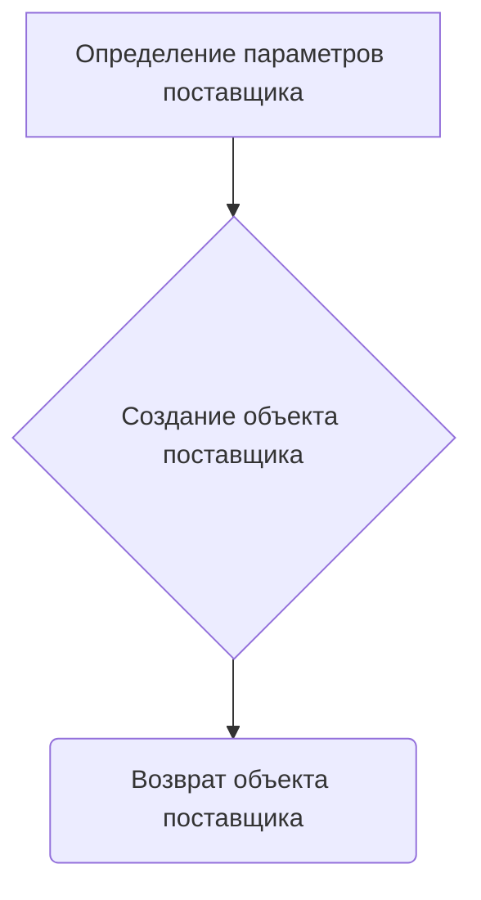

# Модуль экспериментов Wallmart

## Обзор

Этот модуль содержит эксперименты, связанные с поставщиком Wallmart. Включает в себя различные импорты, настройки путей и функцию для запуска поставщика.

## Подробней

Модуль предназначен для экспериментов с поставщиком Wallmart, включая определение путей к директориям, импорт необходимых модулей и запуск поставщика с заданными параметрами. Он используется для тестирования и разработки функциональности, связанной с Wallmart, в рамках проекта `hypotez`.

## Функции

### `start_supplier`

```python
def start_supplier(supplier_prefix: str = 'aliexpress', locale: str = 'en') -> Supplier:
    """ Старт поставщика """
    params: dict = {
        'supplier_prefix': supplier_prefix,
        'locale': locale
    }

    return Supplier(**params)
```

**Назначение**: Запускает поставщика с заданными параметрами.

**Параметры**:
- `supplier_prefix` (str, optional): Префикс поставщика. По умолчанию 'aliexpress'.
- `locale` (str, optional): Локаль поставщика. По умолчанию 'en'.

**Возвращает**:
- `Supplier`: Объект поставщика, созданный с заданными параметрами.

**Как работает функция**:
1.  Определяет параметры поставщика в виде словаря.
2.  Создает объект поставщика (`Supplier`) с использованием переданных параметров.
3.  Возвращает созданный объект поставщика.



**Примеры**:

```python
# Пример запуска поставщика с префиксом 'wallmart' и локалью 'ru'
supplier = start_supplier(supplier_prefix='wallmart', locale='ru')

# Пример запуска поставщика с параметрами по умолчанию
supplier = start_supplier()
```
```python
#Импортируем класс Supplier из модуля suppliers
from src.suppliers import Supplier

#Подаем параметры supplier_prefix='wallmart', locale='ru' в функцию
supplier = start_supplier(supplier_prefix='wallmart', locale='ru')

#Запускается создание объекта Supplier, которому передаются параметры supplier_prefix='wallmart', locale='ru'

#Присваиваем возвращенный объект Supplier  переменной supplier
print(supplier)