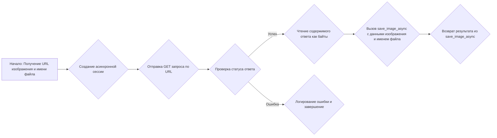
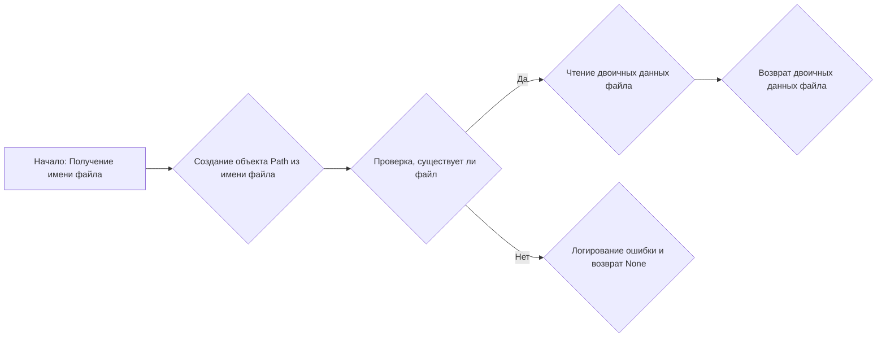
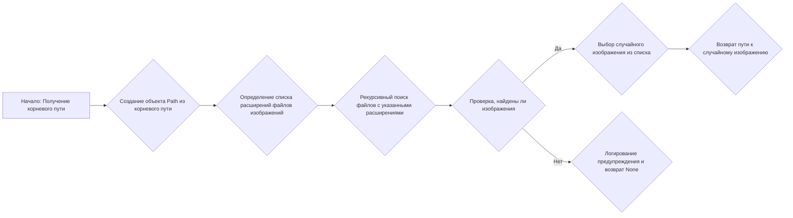
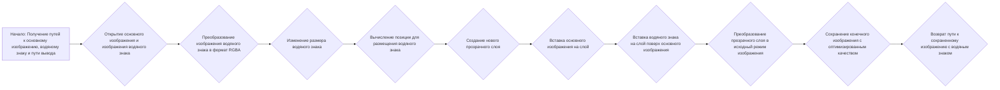
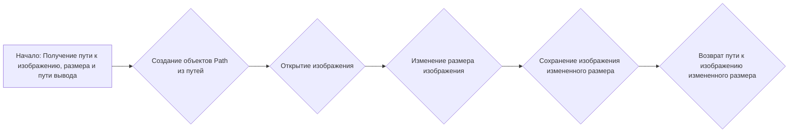
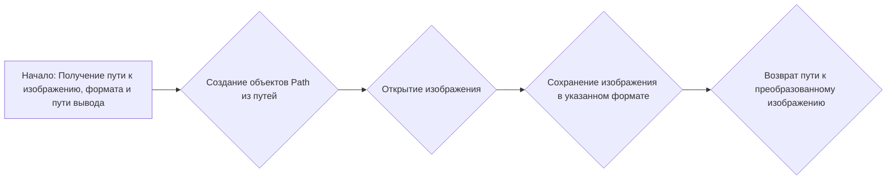

# Модуль `src.utils.image`

## Обзор

Модуль предоставляет асинхронные функции для загрузки, сохранения и обработки изображений.
Он включает в себя такие функции, как сохранение изображений по URL, сохранение данных изображения в файлы,
извлечение данных изображения, поиск случайных изображений в каталогах, добавление водяных знаков, изменение размера
и преобразование форматов изображений.

## Подробнее

Этот модуль предоставляет набор утилит для работы с изображениями, включая асинхронную загрузку и сохранение, а также основные операции редактирования, такие как добавление водяных знаков, изменение размера и преобразование форматов. Он предназначен для упрощения задач обработки изображений в асинхронных приложениях.

## Классы

### `ImageError`

**Описание**: Пользовательское исключение для ошибок, связанных с изображениями.

**Принцип работы**: Этот класс используется для создания пользовательских исключений, специфичных для операций с изображениями, что позволяет более четко обрабатывать ошибки в функциях модуля.

## Функции

### `save_image_from_url_async`

```python
async def save_image_from_url_async(image_url: str, filename: Union[str, Path]) -> Optional[str]:
    """
    Downloads an image from a URL and saves it locally asynchronously.

    Args:
        image_url (str): The URL to download the image from.
        filename (Union[str, Path]): The name of the file to save the image to.

    Returns:
        Optional[str]: The path to the saved file, or None if the operation failed.

    Raises:
        ImageError: If the image download or save operation fails.
    """
    ...
```

**Назначение**: Асинхронно загружает изображение по URL-адресу и сохраняет его локально.

**Параметры**:
- `image_url` (str): URL-адрес изображения для загрузки.
- `filename` (Union[str, Path]): Имя файла для сохранения изображения.

**Возвращает**:
- `Optional[str]`: Путь к сохраненному файлу или `None`, если операция не удалась.

**Вызывает исключения**:
- `ImageError`: Если загрузка или сохранение изображения не удались.

**Как работает функция**:
1. Функция начинает асинхронную сессию с помощью `aiohttp.ClientSession`.
2. Отправляет GET-запрос по указанному `image_url`.
3. Проверяет статус ответа. Если статус указывает на ошибку (4xx или 5xx), вызывается исключение `HTTPError`.
4. Считывает содержимое ответа как байты.
5. Передает полученные байты и имя файла в функцию `save_image_async` для сохранения.
6. Возвращает результат, полученный от функции `save_image_async`.



**Примеры**:

```python
import asyncio
from pathlib import Path
async def main():
    image_url = "https://www.easygifanimator.net/images/samples/video-to-gif-sample.gif"
    filename = "example.gif"
    result = await save_image_from_url_async(image_url, filename)
    if result:
        print(f"Изображение успешно сохранено в: {result}")
    else:
        print("Не удалось сохранить изображение.")

if __name__ == "__main__":
    asyncio.run(main())
```

### `save_image`

```python
def save_image(image_data: bytes, file_name: str | Path, format: str = 'PNG') -> Optional[str]:
    """
    Saves image data to a file in the specified format.

    Args:
        image_data (bytes): The binary image data.
        file_name (Union[str, Path]): The name of the file to save the image to.
        format (str): The format to save the image in, default is PNG.

    Returns:
        Optional[str]: The path to the saved file, or None if the operation failed.

    Raises:
        ImageError: If the file cannot be created, saved, or if the saved file is empty.
    """
    ...
```

**Назначение**: Сохраняет данные изображения в файл в указанном формате.

**Параметры**:
- `image_data` (bytes): Двоичные данные изображения.
- `file_name` (Union[str, Path]): Имя файла для сохранения изображения.
- `format` (str): Формат для сохранения изображения, по умолчанию PNG.

**Возвращает**:
- `Optional[str]`: Путь к сохраненному файлу или `None`, если операция не удалась.

**Вызывает исключения**:
- `ImageError`: Если файл не может быть создан, сохранен или если сохраненный файл пуст.

**Как работает функция**:
1.  Создает объект `Path` из `file_name`.
2.  Создает родительские каталоги, если они не существуют.
3.  Использует `BytesIO` для работы с данными изображения в памяти.
4.  Открывает изображение с помощью `PIL.Image.open()`.
5.  Сохраняет изображение в буфер `BytesIO` в указанном формате.
6.  Записывает данные из буфера `BytesIO` в файл.
7.  Проверяет, был ли создан файл и не является ли он пустым.
8.  Возвращает путь к сохраненному файлу.

```mermaid
graph LR
A[Начало: Получение данных изображения, имени файла и формата] --> B{Создание объекта Path из имени файла};
B --> C{Создание родительских каталогов (если не существуют)};
C --> D{Использование BytesIO для работы с данными в памяти};
D --> E{Открытие изображения с помощью PIL.Image.open()};
E --> F{Сохранение изображения в BytesIO в указанном формате};
F --> G{Запись данных из BytesIO в файл};
G --> H{Проверка, был ли создан файл и не пустой ли он};
H -- Да --> I{Возврат пути к сохраненному файлу};
H -- Нет --> J{Логирование ошибки и завершение};
```

**Примеры**:

```python
from pathlib import Path

# Пример использования:
image_data = b"\\x89PNG\\r\\n\\x1A\\n\\x00\\x00\\x00\\rIHDR\\x00\\x00\\x00\\x01\\x00\\x00\\x00\\x01\\x08\\x06\\x00\\x00\\x00\\x1F\
\\x15\\xC4\\x89\\x00\\x00\\x00\\nIDATx\\x9CC\\x00\\x01\\x00\\x00\\x00\\xC2\\xA0\\xF7Om\\x00\\x00\\x00\\x00IEND\\xAEB`\\x82"  # фиктивные данные PNG изображения
file_name = "example.png"
result = save_image(image_data, file_name)
if result:
    print(f"Изображение успешно сохранено в: {result}")
else:
    print("Не удалось сохранить изображение.")
```

### `save_image_async`

```python
async def save_image_async(image_data: bytes, file_name: str | Path, format: str = 'PNG') -> Optional[str]:
    """
    Saves image data to a file in the specified format asynchronously.

    Args:
        image_data (bytes): The binary image data.
        file_name (Union[str, Path]): The name of the file to save the image to.
        format (str): The format to save the image in, default is PNG.

    Returns:
        Optional[str]: The path to the saved file, or None if the operation failed.

    Raises:
        ImageError: If the file cannot be created, saved, or if the saved file is empty.
    """
    ...
```

**Назначение**: Асинхронно сохраняет данные изображения в файл в указанном формате.

**Параметры**:
- `image_data` (bytes): Двоичные данные изображения.
- `file_name` (Union[str, Path]): Имя файла для сохранения изображения.
- `format` (str): Формат для сохранения изображения, по умолчанию PNG.

**Возвращает**:
- `Optional[str]`: Путь к сохраненному файлу или `None`, если операция не удалась.

**Вызывает исключения**:
- `ImageError`: Если файл не может быть создан, сохранен или если сохраненный файл пуст.

**Как работает функция**:

1.  Создает объект `Path` из `file_name`.
2.  Асинхронно создает родительские каталоги, если они не существуют.
3.  Использует `aiofiles` для асинхронной записи данных изображения в файл.
4.  Возвращает путь к сохраненному файлу.

```mermaid
graph LR
A[Начало: Получение данных изображения, имени файла и формата] --> B{Создание объекта Path из имени файла};
B --> C{Асинхронное создание родительских каталогов (если не существуют)};
C --> D{Асинхронная запись данных изображения в файл с использованием aiofiles};
D --> E{Возврат пути к сохраненному файлу};
```

**Примеры**:

```python
import asyncio
from pathlib import Path

async def main():
    image_data = b"\\x89PNG\\r\\n\\x1A\\n\\x00\\x00\\x00\\rIHDR\\x00\\x00\\x00\\x01\\x00\\x00\\x00\\x01\\x08\\x06\\x00\\x00\\x00\\x1F\
\\x15\\xC4\\x89\\x00\\x00\\x00\\nIDATx\\x9CC\\x00\\x01\\x00\\x00\\x00\\xC2\\xA0\\xF7Om\\x00\\x00\\x00\\x00IEND\\xAEB`\\x82"  # фиктивные данные PNG изображения
    file_name = "example.png"
    result = await save_image_async(image_data, file_name)
    if result:
        print(f"Изображение успешно сохранено в: {result}")
    else:
        print("Не удалось сохранить изображение.")

if __name__ == "__main__":
    asyncio.run(main())
```

### `get_image_bytes`

```python
def get_image_bytes(image_path: Path, raw: bool = True) -> Optional[BytesIO | bytes]:
    """
    Reads an image using Pillow and returns its bytes in JPEG format.

    Args:
        image_path (Path): The path to the image file.
        raw (bool): If True, returns a BytesIO object; otherwise, returns bytes. Defaults to True.

    Returns:
        Optional[Union[BytesIO, bytes]]: The bytes of the image in JPEG format, or None if an error occurs.
    """
    ...
```

**Назначение**: Читает изображение с использованием Pillow и возвращает его байты в формате JPEG.

**Параметры**:
- `image_path` (Path): Путь к файлу изображения.
- `raw` (bool): Если `True`, возвращает объект `BytesIO`; в противном случае возвращает байты. По умолчанию `True`.

**Возвращает**:
- `Optional[BytesIO | bytes]`: Байты изображения в формате JPEG или `None`, если произошла ошибка.

**Как работает функция**:

1.  Открывает изображение по указанному пути с помощью `PIL.Image.open()`.
2.  Создает объект `BytesIO` для хранения байтов изображения.
3.  Сохраняет изображение в формате JPEG в объект `BytesIO`.
4.  Возвращает объект `BytesIO` или байты изображения в зависимости от значения параметра `raw`.

```mermaid
graph LR
A[Начало: Получение пути к изображению и флага raw] --> B{Открытие изображения с помощью PIL.Image.open()};
B --> C{Создание объекта BytesIO};
C --> D{Сохранение изображения в формате JPEG в BytesIO};
D --> E{Возврат BytesIO объекта или байтов изображения в зависимости от флага raw};
```

**Примеры**:

```python
from pathlib import Path

# Пример использования:
image_path = Path("example.png")  # Замените на путь к существующему изображению
result = get_image_bytes(image_path)
if result:
    print(f"Байты изображения получены. Тип: {type(result)}")
else:
    print("Не удалось получить байты изображения.")
```

### `get_raw_image_data`

```python
def get_raw_image_data(file_name: Union[str, Path]) -> Optional[bytes]:
    """
    Retrieves the raw binary data of a file if it exists.

    Args:
        file_name (Union[str, Path]): The name or path of the file to read.

    Returns:
        Optional[bytes]: The binary data of the file, or None if the file does not exist or an error occurs.
    """
    ...
```

**Назначение**: Извлекает необработанные двоичные данные файла, если он существует.

**Параметры**:
- `file_name` (Union[str, Path]): Имя или путь к файлу для чтения.

**Возвращает**:
- `Optional[bytes]`: Двоичные данные файла или `None`, если файл не существует или произошла ошибка.

**Как работает функция**:

1.  Создает объект `Path` из `file_name`.
2.  Проверяет, существует ли файл по указанному пути.
3.  Если файл существует, считывает его двоичные данные с помощью `file_path.read_bytes()`.
4.  Возвращает двоичные данные файла.



**Примеры**:

```python
from pathlib import Path

# Пример использования:
file_name = "example.txt"  # Замените на путь к существующему файлу
file_path = Path(file_name)
file_path.write_text("Пример текста для файла") # Создаем текстовый файл для примера

result = get_raw_image_data(file_name)
if result:
    print(f"Двоичные данные файла получены. Длина: {len(result)} байт.")
else:
    print("Не удалось получить двоичные данные файла.")
```

### `random_image`

```python
def random_image(root_path: Union[str, Path]) -> Optional[str]:
    """
    Recursively searches for a random image in the specified directory.

    Args:
        root_path (Union[str, Path]): The directory to search for images.

    Returns:
        Optional[str]: The path to a random image, or None if no images are found.
    """
    ...
```

**Назначение**: Рекурсивно ищет случайное изображение в указанном каталоге.

**Параметры**:
- `root_path` (Union[str, Path]): Каталог для поиска изображений.

**Возвращает**:
- `Optional[str]`: Путь к случайному изображению или `None`, если изображения не найдены.

**Как работает функция**:

1.  Создает объект `Path` из `root_path`.
2.  Определяет список расширений файлов изображений для поиска.
3.  Рекурсивно ищет файлы с указанными расширениями в каталоге.
4.  Если изображения найдены, выбирает случайное изображение из списка.
5.  Возвращает путь к случайному изображению.



**Примеры**:

```python
from pathlib import Path

# Пример использования:
root_path = "images"  # Замените на путь к каталогу с изображениями
root_dir = Path(root_path)
root_dir.mkdir(parents=True, exist_ok=True)

file_path = root_dir / 'example.png'
file_path.write_text("some data")

result = random_image(root_path)
if result:
    print(f"Случайное изображение найдено: {result}")
else:
    print("Изображения не найдены.")
```

### `add_text_watermark`

```python
def add_text_watermark(image_path: str | Path, watermark_text: str, output_path: Optional[str | Path] = None) -> Optional[str]:
    """
    Adds a text watermark to an image.

    Args:
        image_path (Union[str, Path]): Path to the image file.
        watermark_text (str): Text to use as the watermark.
        output_path (Optional[Union[str, Path]]): Path to save the watermarked image.
            Defaults to overwriting the original image.

    Returns:
        Optional[str]: Path to the watermarked image, or None on failure.
    """
    ...
```

**Назначение**: Добавляет текстовый водяной знак на изображение.

**Параметры**:
- `image_path` (Union[str, Path]): Путь к файлу изображения.
- `watermark_text` (str): Текст для использования в качестве водяного знака.
- `output_path` (Optional[Union[str, Path]]): Путь для сохранения изображения с водяным знаком. По умолчанию перезаписывает исходное изображение.

**Возвращает**:
- `Optional[str]`: Путь к изображению с водяным знаком или `None` в случае неудачи.

**Как работает функция**:

1.  Создает объекты `Path` из `image_path` и `output_path`. Если `output_path` не указан, он устанавливается равным `image_path`, чтобы перезаписать исходное изображение.
2.  Открывает изображение с помощью `PIL.Image.open()` и преобразует его в формат RGBA.
3.  Создает прозрачный слой для водяного знака.
4.  Инициализирует объект `ImageDraw` для рисования на прозрачном слое.
5.  Определяет размер шрифта на основе размера изображения.
6.  Пытается загрузить шрифт "arial.ttf". Если шрифт не найден, использует шрифт по умолчанию.
7.  Определяет размеры текста водяного знака.
8.  Вычисляет координаты для размещения текста по центру изображения.
9.  Рисует текст на прозрачном слое.
10. Объединяет изображение и слой водяного знака с помощью `Image.alpha_composite()`.
11. Сохраняет изображение с водяным знаком по указанному пути.
12. Возвращает путь к изображению с водяным знаком.

```mermaid
graph LR
A[Начало: Получение пути к изображению, текста водяного знака и пути вывода] --> B{Создание объектов Path из путей};
B --> C{Открытие изображения и преобразование в формат RGBA};
C --> D{Создание прозрачного слоя для водяного знака};
D --> E{Инициализация объекта ImageDraw для рисования};
E --> F{Определение размера шрифта на основе размера изображения};
F --> G{Загрузка шрифта Arial или использование шрифта по умолчанию};
G --> H{Определение размеров текста водяного знака};
H --> I{Вычисление координат для размещения текста по центру};
I --> J{Рисование текста на прозрачном слое};
J --> K{Объединение изображения и слоя водяного знака};
K --> L{Сохранение изображения с водяным знаком};
L --> M{Возврат пути к изображению с водяным знаком};
```



**Примеры**:

```python
from pathlib import Path

# Пример использования:
image_path = "example.png"  # Замените на путь к существующему изображению
image_file = Path(image_path)
image_file.write_text("some data")

watermark_text = "Водяной знак"
output_path = "watermarked.png"
result = add_text_watermark(image_path, watermark_text, output_path)
if result:
    print(f"Водяной знак успешно добавлен. Изображение сохранено в: {result}")
else:
    print("Не удалось добавить водяной знак.")
```

### `add_image_watermark`

```python
def add_image_watermark(input_image_path: Path, watermark_image_path: Path, output_image_path: Optional[Path] = None) -> Optional[Path]:
    """
    Adds a watermark to an image and saves the result to the specified output path.

    Args:
        input_image_path (Path): Path to the input image.
        watermark_image_path (Path): Path to the watermark image.
        output_image_path (Optional[Path]): Path to save the watermarked image.
            If not provided, the image will be saved in an "output" directory.

    Returns:
        Optional[Path]: Path to the saved watermarked image, or None if the operation failed.
    """
    ...
```

**Назначение**: Добавляет изображение водяного знака на изображение и сохраняет результат по указанному пути.

**Параметры**:
- `input_image_path` (Path): Путь к исходному изображению.
- `watermark_image_path` (Path): Путь к изображению водяного знака.
- `output_image_path` (Optional[Path]): Путь для сохранения изображения с водяным знаком. Если не указан, изображение будет сохранено в каталоге "output".

**Возвращает**:
- `Optional[Path]`: Путь к сохраненному изображению с водяным знаком или `None`, если операция не удалась.

**Как работает функция**:

1.  Открывает основное изображение и изображение водяного знака с помощью `PIL.Image.open()`. Изображение водяного знака преобразуется в формат RGBA.
2.  Изменяет размер водяного знака до 8% от ширины основного изображения.
3.  Вычисляет позицию для размещения водяного знака в правом нижнем углу с отступом в 20 пикселей.
4.  Создает новый прозрачный слой для объединения изображений.
5.  Вставляет основное изображение на новый слой.
6.  Вставляет водяной знак поверх основного изображения на прозрачный слой.
7.  Проверяет режим изображения и преобразует прозрачный слой в исходный режим.
8.  Сохраняет конечное изображение по указанному пути с оптимизированным качеством. Если `output_image_path` не указан, изображение сохраняется в каталоге "output".
9.  Возвращает путь к сохраненному изображению с водяным знаком.



**Примеры**:

```python
from pathlib import Path

# Пример использования:
input_image_path = "example.png"  # Замените на путь к существующему изображению
watermark_image_path = "watermark.png"  # Замените на путь к изображению водяного знака

# создаем пустые файлы
input_file = Path(input_image_path)
input_file.write_text("input file")

watermark_file = Path(watermark_image_path)
watermark_file.write_text("watermark file")

output_image_path = "output/watermarked.png"
result = add_image_watermark(Path(input_image_path), Path(watermark_image_path), Path(output_image_path))
if result:
    print(f"Водяной знак успешно добавлен. Изображение сохранено в: {result}")
else:
    print("Не удалось добавить водяной знак.")
```

### `resize_image`

```python
def resize_image(image_path: Union[str, Path], size: Tuple[int, int], output_path: Optional[Union[str, Path]] = None) -> Optional[str]:
    """
    Resizes an image to the specified dimensions.

    Args:
        image_path (Union[str, Path]): Path to the image file.
        size (Tuple[int, int]): A tuple containing the desired width and height of the image.
        output_path (Optional[Union[str, Path]]): Path to save the resized image.
            Defaults to overwriting the original image.

    Returns:
        Optional[str]: Path to the resized image, or None on failure.
    """
    ...
```

**Назначение**: Изменяет размер изображения до указанных размеров.

**Параметры**:
- `image_path` (Union[str, Path]): Путь к файлу изображения.
- `size` (Tuple[int, int]): Кортеж, содержащий желаемую ширину и высоту изображения.
- `output_path` (Optional[Union[str, Path]]): Путь для сохранения изображения измененного размера. По умолчанию перезаписывает исходное изображение.

**Возвращает**:
- `Optional[str]`: Путь к изображению измененного размера или `None` в случае неудачи.

**Как работает функция**:

1.  Создает объекты `Path` из `image_path` и `output_path`. Если `output_path` не указан, он устанавливается равным `image_path`, чтобы перезаписать исходное изображение.
2.  Открывает изображение с помощью `PIL.Image.open()`.
3.  Изменяет размер изображения до указанных размеров с помощью `img.resize(size)`.
4.  Сохраняет изображение измененного размера по указанному пути.
5.  Возвращает путь к изображению измененного размера.



**Примеры**:

```python
from pathlib import Path

# Пример использования:
image_path = "example.png"  # Замените на путь к существующему изображению
image_file = Path(image_path)
image_file.write_text("input file")
size = (100, 100)  # Желаемая ширина и высота
output_path = "resized.png"
result = resize_image(image_path, size, output_path)
if result:
    print(f"Размер изображения успешно изменен. Изображение сохранено в: {result}")
else:
    print("Не удалось изменить размер изображения.")
```

### `convert_image`

```python
def convert_image(image_path: Union[str, Path], format: str, output_path: Optional[Union[str, Path]] = None) -> Optional[str]:
    """
    Converts an image to the specified format.

    Args:
        image_path (Union[str, Path]): Path to the image file.
        format (str): Format to convert image to (e.g., "JPEG", "PNG").
        output_path (Optional[Union[str, Path]]): Path to save the converted image.
            Defaults to overwriting the original image.

    Returns:
        Optional[str]: Path to the converted image or None on failure.
    """
    ...
```

**Назначение**: Преобразует изображение в указанный формат.

**Параметры**:
- `image_path` (Union[str, Path]): Путь к файлу изображения.
- `format` (str): Формат для преобразования изображения (например, "JPEG", "PNG").
- `output_path` (Optional[Union[str, Path]]): Путь для сохранения преобразованного изображения. По умолчанию перезаписывает исходное изображение.

**Возвращает**:
- `Optional[str]`: Путь к преобразованному изображению или `None` в случае неудачи.

**Как работает функция**:

1.  Создает объекты `Path` из `image_path` и `output_path`. Если `output_path` не указан, он устанавливается равным `image_path`, чтобы перезаписать исходное изображение.
2.  Открывает изображение с помощью `PIL.Image.open()`.
3.  Сохраняет изображение в указанном формате по указанному пути.
4.  Возвращает путь к преобразованному изображению.



**Примеры**:

```python
from pathlib import Path

# Пример использования:
image_path = "example.png"  # Замените на путь к существующему изображению
image_file = Path(image_path)
image_file.write_text("input file")
format = "JPEG"  # Формат для преобразования
output_path = "converted.jpg"
result = convert_image(image_path, format, output_path)
if result:
    print(f"Изображение успешно преобразовано. Изображение сохранено в: {result}")
else:
    print("Не удалось преобразовать изображение.")
```

### `process_images_with_watermark`

```python
def process_images_with_watermark(folder_path: Path, watermark_path: Path) -> None:
    """
    Processes all images in the specified folder by adding a watermark and saving them in an "output" directory.

    Args:
        folder_path (Path): Path to the folder containing images.
        watermark_path (Path): Path to the watermark image.
    """
    ...
```

**Назначение**: Обрабатывает все изображения в указанной папке, добавляя водяной знак и сохраняя их в каталоге "output".

**Параметры**:
- `folder_path` (Path): Путь к папке, содержащей изображения.
- `watermark_path` (Path): Путь к изображению водяного знака.

**Как работает функция**:

1.  Проверяет, существует ли указанная папка. Если папка не существует, функция завершается.
2.  Создает каталог "output" в указанной папке, если он не существует.
3.  Перебирает все файлы в указанной папке.
4.  Для каждого файла проверяет, является ли он файлом изображения (с расширениями .png, .jpg, .jpeg).
5.  Если файл является изображением, создает путь для сохранения обработанного изображения в каталоге "output".
6.  Вызывает функцию `add_image_watermark` для добавления водяного знака на изображение и сохранения его в каталоге "output".

```mermaid
graph LR
A[Начало: Получение пути к папке и пути к водяному знаку] --> B{Проверка, существует ли папка};
B -- Нет --> C{Логирование ошибки и завершение};
B -- Да --> D{Создание каталога "output", если он не существует};
D --> E{Перебор всех файлов в папке};
E --> F{Проверка, является ли файл изображением};
F -- Да --> G{Создание пути для сохранения обработанного изображения в каталоге "output"};
G --> H{Вызов add_image_watermark для добавления водяного знака};
F -- Нет --> E;
```

**Примеры**:

```python
from pathlib import Path

# Пример использования:
folder_path = "images"  # Замените на путь к папке с изображениями
watermark_path = "watermark.png"  # Замените на путь к изображению водяного знака

folder = Path(folder_path)
folder.mkdir(parents=True, exist_ok=True)

file_path = folder / 'example.png'
file_path.write_text("some data")

watermark_file = Path(watermark_path)
watermark_file.write_text("watermark file")


process_images_with_watermark(Path(folder_path), Path(watermark_path))