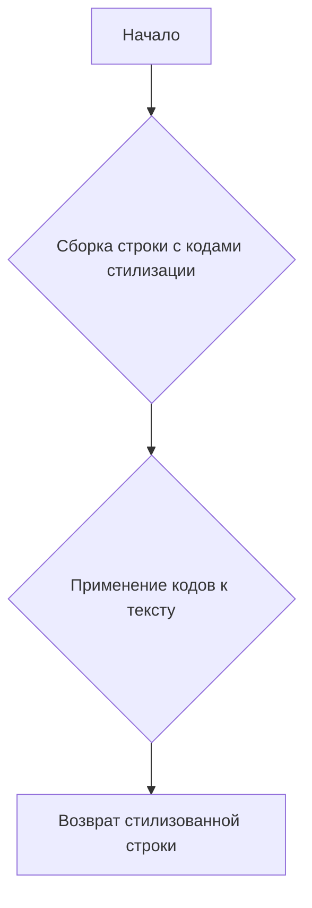
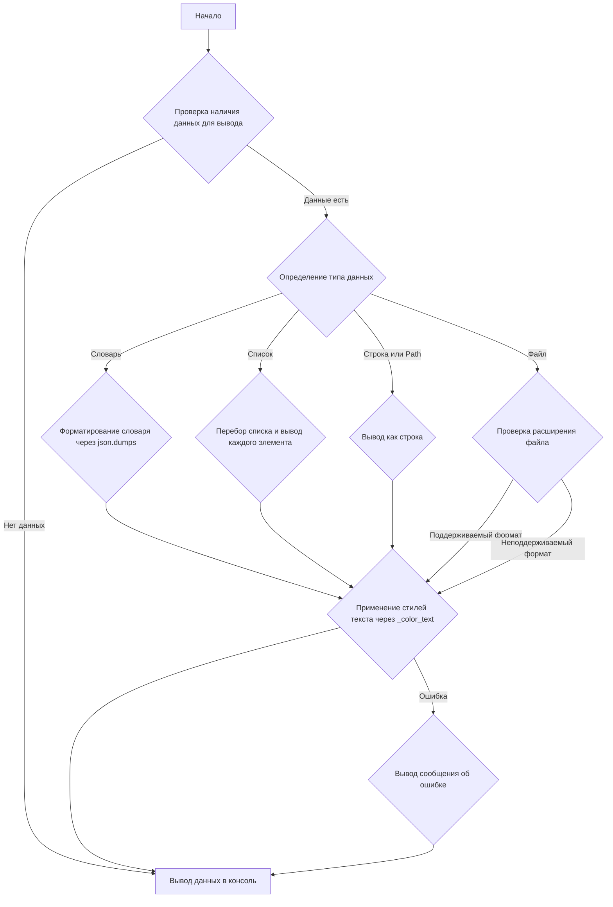

# Модуль `src.utils.printer`

## Обзор

Модуль `src.utils.printer` предоставляет утилиты для форматированного вывода текста в консоль, включая стилизацию текста с использованием цветов, фонов и шрифтов.

## Подробней

Модуль содержит функции для удобной печати данных различных типов (словарей, списков, строк) с возможностью настройки цветовой схемы и стилей текста.  ANSI escape codes используются для стилизации текста. Это позволяет сделать вывод информации более читаемым и наглядным.

## Константы

### `RESET`

```python
RESET = "\\033[0m"
```

Сброс всех стилей текста ANSI escape code.

### `TEXT_COLORS`

```python
TEXT_COLORS = {
    "red": "\\033[31m",
    "green": "\\033[32m",
    "blue": "\\033[34m",
    "yellow": "\\033[33m",
    "white": "\\033[37m",
    "cyan": "\\033[36m",
    "magenta": "\\033[35m",
    "light_gray": "\\033[37m",
    "dark_gray": "\\033[90m",
    "light_red": "\\033[91m",
    "light_green": "\\033[92m",
    "light_blue": "\\033[94m",
    "light_yellow": "\\033[93m",
}
```

Словарь, содержащий коды ANSI escape для различных цветов текста.

### `BG_COLORS`

```python
BG_COLORS = {
    "bg_red": "\\033[41m",
    "bg_green": "\\033[42m",
    "bg_blue": "\\033[44m",
    "bg_yellow": "\\033[43m",
    "bg_white": "\\033[47m",
    "bg_cyan": "\\033[46m",
    "bg_magenta": "\\033[45m",
    "bg_light_gray": "\\033[47m",
    "bg_dark_gray": "\\033[100m",
    "bg_light_red": "\\033[101m",
    "bg_light_green": "\\033[102m",
    "bg_light_blue": "\\033[104m",
    "bg_light_yellow": "\\033[103m",
}
```

Словарь, содержащий коды ANSI escape для различных цветов фона.

### `FONT_STYLES`

```python
FONT_STYLES = {
    "bold": "\\033[1m",
    "underline": "\\033[4m",
}
```

Словарь, содержащий коды ANSI escape для различных стилей шрифта (например, жирный, подчеркнутый).

## Функции

### `_color_text`

```python
def _color_text(text: str, text_color: str = "", bg_color: str = "", font_style: str = "") -> str:
    """Apply color, background, and font styling to the text.

    This helper function applies the provided color and font styles to the given text using ANSI escape codes.

    :param text: The text to be styled.
    :param text_color: The color to apply to the text. Default is an empty string, meaning no color.
    :param bg_color: The background color to apply. Default is an empty string, meaning no background color.
    :param font_style: The font style to apply to the text. Default is an empty string, meaning no font style.
    :return: The styled text as a string.

    :example:
        >>> _color_text("Hello, World!", text_color="green", font_style="bold")
        \'\\033[1m\\033[32mHello, World!\\033[0m\'
    """
    ...
```

**Назначение**: Применяет стили текста (цвет, фон, шрифт) к заданной строке, используя ANSI escape-последовательности.

**Параметры**:

-   `text` (str): Текст, к которому необходимо применить стили.
-   `text_color` (str, optional): Цвет текста. По умолчанию "".
-   `bg_color` (str, optional): Цвет фона. По умолчанию "".
-   `font_style` (str, optional): Стиль шрифта. По умолчанию "".

**Возвращает**:

-   `str`: Строка с примененными стилями ANSI escape-последовательностями.

**Как работает функция**:

1.  Функция принимает текст и параметры стилизации (цвет текста, цвет фона, стиль шрифта).
2.  Формирует строку, содержащую ANSI escape-последовательности для указанных стилей, обрамляющие входной текст.
3.  Возвращает стилизованную строку.



**Примеры**:

```python
_color_text("Hello, World!", text_color="green", font_style="bold")
# Результат: '\033[1m\033[32mHello, World!\033[0m'
```

### `pprint`

```python
def pprint(print_data: Any = None, text_color: str = "white", bg_color: str = "", font_style: str = "") -> None:
    """Pretty prints the given data with optional color, background, and font style.

    This function formats the input data based on its type and prints it to the console. The data is printed with optional 
    text color, background color, and font style based on the specified parameters. The function can handle dictionaries, 
    lists, strings, and file paths.

    :param print_data: The data to be printed. Can be of type ``None``, ``dict``, ``list``, ``str``, or ``Path``.\n
    :param text_color: The color to apply to the text. Default is \'white\'. See :ref:`TEXT_COLORS`.\n
    :param bg_color: The background color to apply to the text. Default is \'\' (no background color). See :ref:`BG_COLORS`.\n
    :param font_style: The font style to apply to the text. Default is \'\' (no font style). See :ref:`FONT_STYLES`.\n
    :return: None\n

    :raises: Exception if the data type is unsupported or an error occurs during printing.\n

    :example:\n
        >>> pprint({"name": "Alice", "age": 30}, text_color="green")\n
        \\033[32m{\n
            "name": "Alice",\n
            "age": 30\n
        }\\033[0m\n

        >>> pprint(["apple", "banana", "cherry"], text_color="blue", font_style="bold")\n
        \\033[34m\\033[1mapple\\033[0m\n
        \\033[34m\\033[1mbanana\\033[0m\n
        \\033[34m\\033[1mcherry\\033[0m\n

        >>> pprint("text example", text_color="yellow", bg_color="bg_red", font_style="underline")\n
        \\033[4m\\033[33m\\033[41mtext example\\033[0m\n
    """
    ...
```

**Назначение**: Выводит данные в консоль с применением указанных стилей текста (цвет, фон, шрифт).

**Параметры**:

-   `print_data` (Any, optional): Данные для вывода. Может быть `None`, `dict`, `list`, `str` или `Path`. По умолчанию `None`.
-   `text_color` (str, optional): Цвет текста. По умолчанию "white".
-   `bg_color` (str, optional): Цвет фона. По умолчанию "".
-   `font_style` (str, optional): Стиль шрифта. По умолчанию "".

**Возвращает**:

-   `None`

**Как работает функция**:

1.  Функция принимает данные для вывода и параметры стилизации.
2.  Проверяет тип данных и применяет соответствующее форматирование:
    -   Для словарей использует `json.dumps` с отступом 4 для красивого вывода.
    -   Для списков выводит каждый элемент списка на отдельной строке.
    -   Для строк и объектов `Path` выводит данные как строку.
    -   Если `print_data` является путем к файлу, проверяет расширение файла и выводит сообщение о поддержке только для `.csv` и `.xls` файлов.
3.  Применяет стилизацию текста с помощью функции `_color_text`.
4.  Выводит отформатированные и стилизованные данные в консоль.
5.  В случае ошибки выводит сообщение об ошибке красным цветом.



**Примеры**:

```python
pprint({"name": "Alice", "age": 30}, text_color="green")
# Результат: (в консоли)
# \033[32m{
#     "name": "Alice",
#     "age": 30
# }\033[0m

pprint(["apple", "banana", "cherry"], text_color="blue", font_style="bold")
# Результат: (в консоли)
# \033[34m\033[1mapple\033[0m
# \033[34m\033[1mbanana\033[0m
# \033[34m\033[1mcherry\033[0m

pprint("text example", text_color="yellow", bg_color="bg_red", font_style="underline")
# Результат: (в консоли)
# \033[4m\033[33m\033[41mtext example\033[0m