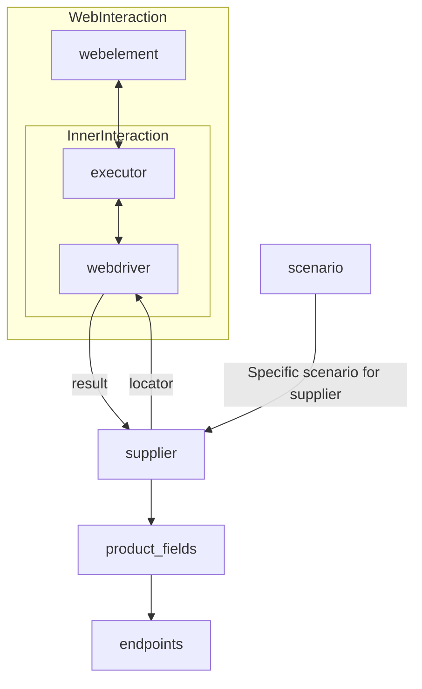

[Русский](https://github.com/hypo69/hypo/blob/master/README.RU.MD)
# **Class** `Supplier`
### **Base class for all suppliers**
*In the context of the code, `Supplier` represents an information provider.  
A supplier can be a producer of goods, data, or information.  
The supplier's sources include a website's landing page, a document, a database, or a table.  
This class unifies different suppliers under a standardized set of operations.  
Each supplier has a unique prefix. ([Details on prefixes](prefixes.md))*  

The `Supplier` class serves as the foundation for managing interactions with suppliers.  
It handles initialization, configuration, authentication, and execution of workflows for various data sources, such as `amazon.com`, `walmart.com`, `mouser.com`, and `digikey.com`. Clients can also define additional suppliers.  

---

## List of implemented suppliers:

[aliexpress](aliexpress)  - Implemented with two workflows: `webdriver` and `api`  

[amazon](amazon) - `webdriver`  

[bangood](bangood)  - `webdriver`  

[cdata](cdata)  - `webdriver`  

[chat_gpt](chat_gpt)  - Interacts with the ChatGPT interface (NOT THE MODEL!)  

[ebay](ebay)  - `webdriver`  

[etzmaleh](etzmaleh)  - `webdriver`  

[gearbest](gearbest)  - `webdriver`  

[grandadvance](grandadvance)  - `webdriver`  

[hb](hb)  - `webdriver`  

[ivory](ivory) - `webdriver`  

[ksp](ksp) - `webdriver`  

[kualastyle](kualastyle) `webdriver`  

[morlevi](morlevi) `webdriver`  

[visualdg](visualdg) `webdriver`  

[wallashop](wallashop) `webdriver`  

[wallmart](wallmart) `webdriver`  

[Details on WebDriver :class: `Driver`](../webdriver)  
[Details on workflows :class: `Scenario`](../scenarios)

---

